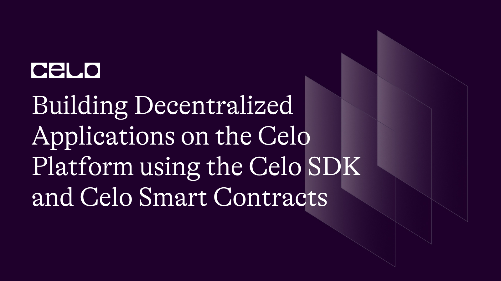
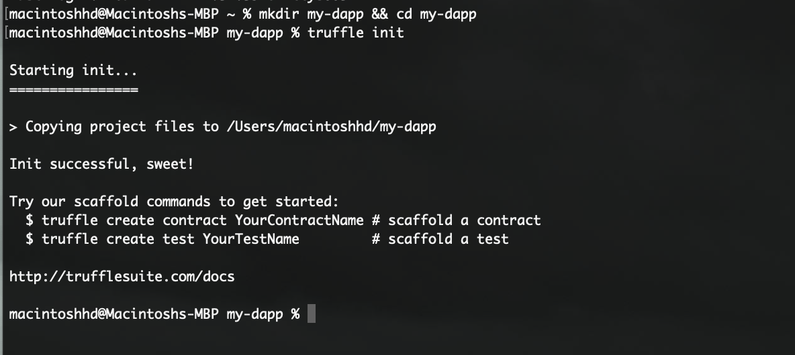
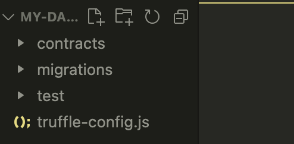
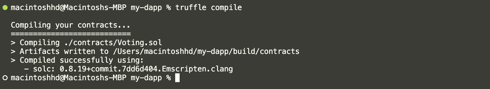
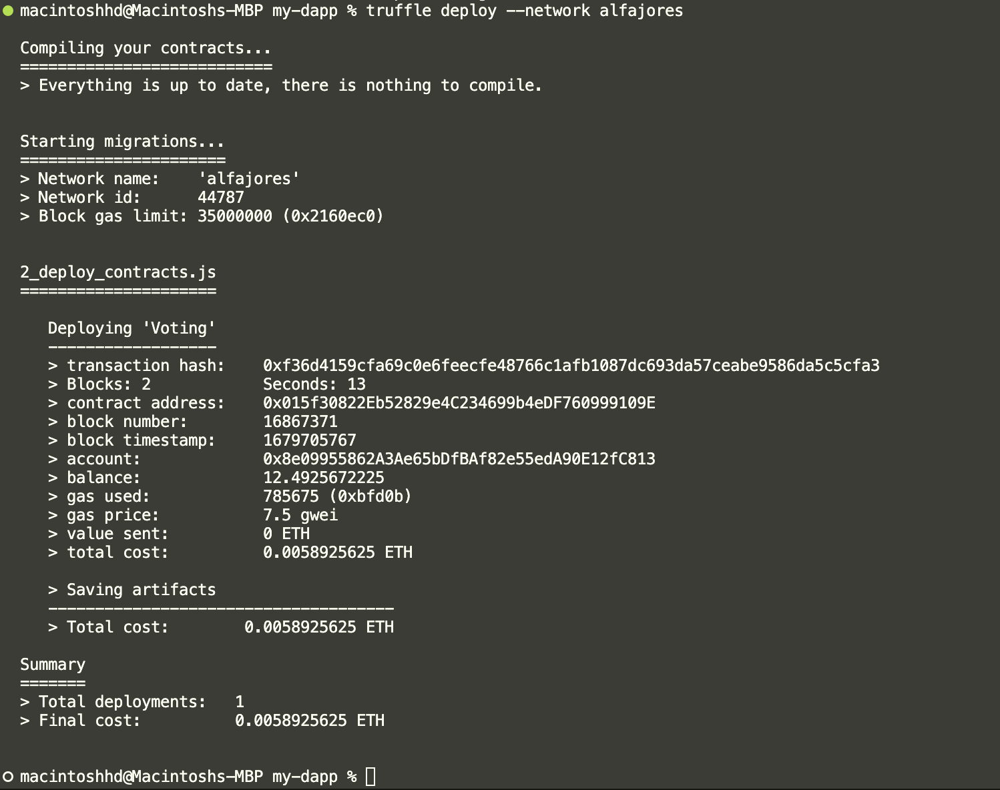

## Introduction

In this tutorial, we'll learn how to build decentralized applications (dApps) on the Celo platform using the Celo SDK and Celo smart contracts. Celo is a mobile-first blockchain platform that aims to make cryptocurrency user-friendly and accessible to anyone with a mobile phone number. It offers fast and cheap transactions, smart contract functionality, and compatibility with Ethereum. This tutorial will guide you through the process of building a simple dApp on the Celo platform using Truffle, a popular development framework for Ethereum-based applications. By the end of this tutorial, you'll have a basic understanding of the Celo platform and how to build and deploy your dApps on it.

## Prerequisites​

Before proceeding with this tutorial, you should have a basic understanding of blockchain technology, smart contracts, and knowledge of a programming language such as JavaScript, Solidity, or TypeScript. It is also recommended that you have some familiarity with using the command line interface

## Requirements​

For this tutorial, you would need to have the following tools installed on your computer:

- Node.js and NPM: To install, follow the instructions at [Node.js](https://nodejs.org/en/).
- Truffle: This is a popular development framework for building Ethereum-based applications. It allows you to deploy, test, and deploy on celo. You can install it using npm by running `npm install -g truffle`.
- Celo SDK: This is a set of tools for building and deploying smart contracts on the Celo network. You can install it using npm by running `npm install -g @celo/celocli`.

## Getting Started

First, let's create a new project directory and initialize truffle in it. Run the following command in your terminal:

```bash
mkdir my-dapp && cd my-dapp
truffle init
```

The command above would create a new truffle project. The output should be something of this form:



Next, let's install [truffle/hdwallet-provider](https://github.com/trufflesuite/truffle/blob/develop/packages/hdwallet-provider/README.md#:~:text=HD%20Wallet%2Denabled%20Web3%20provider,12%20or%2024%20word%20mnemonic.). This allows you to sign transactions for addresses derived from a mnemonic. You’ll use this to connect to Celo in your truffle configuration file.
Run the command below in your terminal.

```bash
npm install @truffle/hdwallet-provider --save
```

Ensure you run the command above in the root directory of your project.

Open your project in [Visual Studio code](https://code.visualstudio.com/) or your preferred IDE. It should have the following directories/files in it:



## Setting Up a Celo Wallet

To interact with a Celo network, we’ll need to create and configure a Celo wallet using Metamask. Follow these steps to create a new Celo wallet:

1. Install the Metamask browser extension and create a new wallet.
2. Click on the network dropdown in the Metamask window and select “Add network”.
3. Click on “Add network manually” at the bottom of your screen
4. Enter the following details for the Celo testnet:
   - Network Name: Celo Alfajores Testnet
   - New RPC URL: [https://alfajores-forno.celo-testnet.org](https://alfajores-forno.celo-testnet.org)
   - Chain ID: 44787
   - Symbol: cUSD
   - Block Explorer URL: [https://alfajores-blockscout.celo-testnet.org/](https://alfajores-blockscout.celo-testnet.org/)
5. Click “Save” to add the Celo testnet to your Metamask network list.

Make sure to fund your account with some testnet CELO and cUSD tokens from the [Celo Testnet Faucet](https://celo.org/developers/faucet).

## Writing a Smart Contract

Now, let's write our smart contract using Solidity. In this tutorial, we will create a simple voting contract. The contract will have a list of candidates, and each candidate will have a name and a vote count. The voters can cast their votes for the candidates, and the contract will keep track of the vote counts.
First, let's create a new file named `Voting.sol` in the contracts directory.

```solidity
//SPDX-License-Identifier: MIT
pragma solidity ^0.8.0;

contract Voting {
   struct Candidate {
       string name;
       uint256 voteCount;
   }

   Candidate[] public candidates;

   mapping(address => bool) public voters;

   function addCandidate(string memory name) public {
       candidates.push(Candidate(name, 0));
   }

   function vote(uint256 candidateIndex) public {
       require(candidateIndex >= 0 && candidateIndex < candidates.length, "Invalid candidate index");
       require(!voters[msg.sender], "The sender has already voted");

       candidates[candidateIndex].voteCount += 1;
       voters[msg.sender] = true;
   }

   function getCandidateCount() public view returns (uint256) {
       return candidates.length;
   }

   function getCandidate(uint256 candidateIndex) public view returns (string memory name, uint256 voteCount) {
       require(candidateIndex >= 0 && candidateIndex < candidates.length, "Invalid candidate index");

       Candidate storage candidate = candidates[candidateIndex];
       return (candidate.name, candidate.voteCount);
   }
}
```

Here, we define a `Candidate` struct with a name and a vote count. We store the candidates in an array, and we keep track of who has voted using a mapping. The `addCandidate` function is used to add a new candidate to the list. The `vote` function is used to cast a vote for a candidate, and we increment the vote count of the candidate. The `getCandidateCount` and `getCandidate` functions are used to retrieve the list of candidates and their vote counts.

Create a file named `2_deploy_contracts.js` in the migrations folder and populate it with the code below.

```javascript
var Voting = artifacts.require("Voting");

module.exports = function (deployer) {
  deployer.deploy(Voting);
};
```

The code defines a deployment script for the Voting contract, using the Truffle framework's deployer function. The script specifies that the Voting contract will be deployed, and then calls the deploy function with Voting as its argument to actually deploy the contract.

## Deploying the Smart Contract

To deploy the smart contract, we need to compile it first. In your terminal, run the following command in the root directory of the project:

```bash
truffle compile
```

This will compile the smart contract and generate the artifacts in the /build/contracts directory. You should get an output similar to this:



Next, let's configure Truffle to deploy the smart contract to the Celo network. In the truffle-config.js file, add the following code:

```javascript
const HDWalletProvider = require("@truffle/hdwallet-provider");
const mnemonic = "client great south good cement bucket rank free legend green"; // replace with your MNEMONIC

module.exports = {
  networks: {
    local: {
      host: "127.0.0.1",
      port: 7545,
      network_id: "*",
    },
    alfajores: {
      provider: function () {
        return new HDWalletProvider(
          mnemonic,
          "https://alfajores-forno.celo-testnet.org"
        );
      },
      network_id: 44787,
      gas: 20000000,
      deployTimeout: 300000,
      networkCheckTimeout: 300000,
    },
    mainnet: {
      provider: function () {
        return new HDWalletProvider(mnemonic, "https://forno.celo.org");
      },
      network_id: 42220,
      gas: 4000000,
      deployTimeout: 300000,
      networkCheckTimeout: 300000,
    },
  },
  // Configure your compilers
  compilers: {
    solc: {
      version: "0.8.19", // Fetch exact version from solc-bin (default: truffle's version)
    },
  },
};
```

Replace the mnemonic in the code above with your own Celo account's mnemonic. You can find your mnemonic in your Celo account's settings.

Finally, run the following command in your terminal to deploy the smart contract to the Alfajores celo network:

```bash
truffle deploy --network alfajores
```

This will deploy your smart contract to the Celo network and output the contract address once the deployment is complete. The terminal output should be similar to this:



Congratulations! You have successfully deployed a smart contract to the Celo Alfajores network using the Celo SDK and Truffle.
Note the contract address for the deployed contract. This will be needed to interact with the contract on the Celo network.
With the contract deployed, we can build a React application to interact with our Voting app.

### View your deployed contract

Now that you have deployed your contract, you can view it in the Celo block explorer. Copy your contract address from the terminal and navigate to the [block explorer](https://alfajores-blockscout.celo-testnet.org/) to search for your deployed contract.

## Conclusion​

In this tutorial, we have learnt how to build and deploy a simple smart contract on the Celo network using the Celo SDK. We started by setting up the development environment by installing the required tools and packages. Then, we created a new Celo project and implemented a simple smart contract for our decentralized voting application.
We learnt how to deploy our smart contract to the Celo network using Truffle and verify its deployment on the Celo blockchain explorer.
By following this tutorial, you now have a basic understanding of how to build and deploy decentralized applications on the Celo platform. You can further explore the capabilities of the Celo SDK and smart contracts and develop more complex decentralized applications.

## Next Steps​

To continue your learning and exploration of the Celo platform, you can:

- Explore the Celo documentation and learn more about the Celo SDK, smart contracts, and other tools available for developers.
- Join the Celo Discord community to connect with other developers and ask questions.
- Experiment with building your own dApps on the Celo platform using the skills you learned in this tutorial.

## About the Author​

Qudus Olanrewaju is a developer and technical writer who has a strong interest in blockchain technology and web3. He enjoys building web3 projects and leveraging his distinctive viewpoint to create engaging and insightful content.

## References​

- [Source Code](https://github.com/Qtech11/building-decentralized-applications-on-the-celo-platform)
- [Deploy on Celo using Truffle](https://docs.celo.org/developer/deploy/truffle)
- [Truffle | Overview - Truffle Suite](https://trufflesuite.com/docs/truffle/)
- [Celo Docs](https://docs.celo.org/)
- [Celo faucet](https://faucet.celo.org/)
