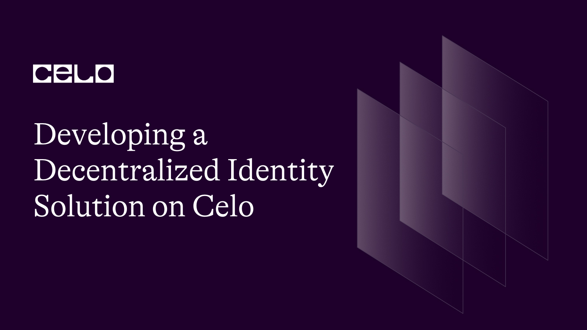

## Introduction

Decentralized identity solutions are essential to ensuring privacy, security, and trust in the digital world. By empowering individuals to control their data and how it is used, we can eliminate reliance on centralized data repositories that are vulnerable to attacks and misuse. In this tutorial, we will guide developers through the process of creating a decentralized identity solution using the Celo blockchain. We will explore concepts such as decentralized identifiers (DIDs), verifiable credentials, and identity management, and demonstrate how to implement these features in a Celo-based application.

## Prerequisites

Before starting this tutorial, you should have a basic understanding of blockchain technology, smart contracts, and the Celo platform. Familiarity with Solidity, Remix, Truffle, Celo SDK, JavaScript, and Web3.js is also recommended. If you need to brush up on these topics, consider reviewing the following resources:

- [Celo Developer Documentation](https://docs.celo.org/)
- [Solidity Documentation](https://docs.soliditylang.org/en/latest/)
- [Truffle Suite Documentation](https://trufflesuite.com/docs/)
- [Web3.js Documentation](https://web3js.readthedocs.io/en/v1.3.4/)

Additionally, you will need a Celo account and some testnet CELO tokens to interact with the Celo network. Create one [here](https://docs.celo.org/developer/setup/wallet).

## Requirements

Before diving into the tutorial, ensure you have the following software installed on your computer:

- Node.js (version 12.x or higher)
- Truffle (version 5.x or higher)
- Celo CLI (version 0.0.60 or higher)
- A modern web browser with MetaMask extension installed
- A code editor, such as Visual Studio Code, Atom, or Sublime Text.

With these tools in place, we can begin developing our decentralized identity solution on the Celo platform. Note the installation of these tools will not be covered in this tutorial.

## Creating a DID Registry Smart Contract

### Initializing the Project

Start by creating a new directory for your project and navigate to it using the terminal:

```bash
    mkdir celo-did
    cd celo-did
```

Next, initialize a new Truffle project and install the necessary dependencies:

```bash
    truffle init
    npm init -y
    npm install --save @celo/contractkit web3
```


This will create a new Truffle project with the following directory structure:

    celo-did/
    ├── contracts/
    ├── migrations/
    ├── test/
    └── truffle-config.js

## Writing the Smart Contract

Create a new file named `DIDRegistry.sol` in the `contracts` directory of your project. Then, implement the DID Registry smart contract using Solidity:

```solidity
    //SPDX-License-Identifier: MIT
    pragma solidity ^0.8.0;

    contract DIDRegistry {
        event DIDAttributeChanged(
            address indexed identity,
            bytes32 indexed name,
            bytes value,
            uint256 validTo,
            uint256 previousChange
        );

        mapping(address => mapping(bytes32 => DIDAttribute)) private data;

        struct DIDAttribute {
            bytes value;
            uint256 validTo;
            uint256 previousChange;
        }

        function setAttribute(
            bytes32 _name,
            bytes memory _value,
            uint256 _validTo
        ) public {
            DIDAttribute storage attr = data[msg.sender][_name];
            attr.value = _value;
            attr.validTo = _validTo;
            attr.previousChange = block.number;
            emit DIDAttributeChanged(msg.sender, _name, _value, _validTo, block.number);
        }

        function getAttribute(address _identity, bytes32 _name)
            public
            view
            returns (
                bytes memory value,
                uint256 validTo,
                uint256 previousChange
            )
        {
            DIDAttribute storage attr = data[_identity][_name];
            value = attr.value;
            validTo = attr.validTo;
            previousChange = attr.previousChange;
        }
    }
```

This contract defines a DID (Decentralized Identifier) registry. It allows users to set and get attributes associated with their identity. The `setAttribute` function sets a new attribute value for the caller's identity. The `getAttribute` function retrieves the value, validity period, and previous change block number of an attribute associated with a given identity and attribute name. The contract emits an event `DIDAttributeChanged` whenever an attribute is set.

## Compiling and Deploying the Contract

In the `migrations` directory, create a new file named `2_deploy_did_registry.js` and add the following code to deploy the `DIDRegistry` contract:

```js
const DIDRegistry = artifacts.require("DIDRegistry");

module.exports = function (deployer) {
  deployer.deploy(DIDRegistry);
};
```

Update the `truffle-config.js` file to include the Celo network configuration:

```js
const ContractKit = require("@celo/contractkit");
const Web3 = require("web3");

const web3 = new Web3("https://alfajores-forno.celo-testnet.org");
const kit = ContractKit.newKitFromWeb3(web3);

// Add your private key and MetaMask account address
const privateKey = "your_private_key";
const accountAddress = "your_metamask_account_address";

kit.addAccount(privateKey);

module.exports = {
  networks: {
    development: { host: "127.0.0.1", port: 7545, network_id: "*" },
    celo: {
      provider: kit.connection.web3.currentProvider,
      network_id: 44787,
      from: accountAddress,
      gas: 6721975,
      gasPrice: 20000000000,
    },
  },
  compilers: {
    solc: {
      version: "0.8.0",
    },
  },
};
```

Replace `your_private_key` and `your_metamask_account_address` with your own private key and MetaMask account address, respectively.

Now, compile the smart contract and deploy it to the Celo Alfajores test network:

```bash
  truffle compile
  truffle migrate --network celo
```

You should see something like this:


The warning we received is regarding the SPDX license identifier not being provided in the source file. SPDX is a standard format for communicating licenses and copyrights associated with an open-source software package.
To address this warning, you should add a comment to the top of the `DIDRegistry.sol` file that includes an SPDX license identifier. The comment should contain the following line: `// SPDX-License-Identifier: <SPDX-License-Identifier>`
In my case, I am using the MIT license, my updated contract reflects that.

Take note of the deployed contract address for later use.

## Building the Decentralized Identity Application

### Setting up the Frontend

Create a new directory named `client` in your project's root directory and navigate to it:

```bash
  mkdir client
  cd client
```

Initialize a new React application using `create-react-app`:

```bash
  npx create-react-app .
```

Install the required dependencies:

```bash
  npm install @celo/contractkit web3 @material-ui/core @material-ui/icons
```

You might run into this error:


The error indicates there is a conflict in the dependencies. Specifically, `@material-ui/core` requires a version of React that is different from the version you have installed (`react@18.2.0`).
We can try running `npm install` with the `--force` flag or `--legacy-peer-deps` flag to override the dependency conflict and install the packages, but this could potentially result in broken dependencies.
A better solution would be to update our React version to match the required version (`^16.8.0 || ^17.0.0`). We can do this by modifying our `package.json` file to use the correct version of React, and then running `npm install` again.

### Implementing the Application

In the `src` directory, create a new file named `CeloDID.js`. This file will contain the main application logic. Begin by importing the necessary dependencies and the `DIDRegistry` ABI:

```js
import React, { useState, useEffect } from "react";
import { ContractKit, newKit } from "@celo/contractkit";
import Web3 from "web3";
import DIDRegistryABI from "../build/contracts/DIDRegistry.json";
import {
  Button,
  Container,
  TextField,
  Typography,
  Grid,
  CircularProgress,
} from "@material-ui/core";
import { Alert } from "@material-ui/lab";
import { CheckCircle, Error } from "@material-ui/icons";
const CeloDID = () => {
  // State variables and hooks
  // Main logic and event handlers
  // Render components
};
export default CeloDID;
```

Next, implement the state variables and hooks to manage the connection to the Celo network, user accounts, contract instances, and user input:

```js
// State variables and hooks
const [web3, setWeb3] = useState(null);
const [account, setAccount] = useState(null);
const [contract, setContract] = useState(null);
const [loading, setLoading] = useState(true);
const [message, setMessage] = useState(null);
const [name, setName] = useState("");
const [value, setValue] = useState("");
const [validTo, setValidTo] = useState(0);
```

Then, implement the main logic and event handlers for connecting to Celo, setting attributes, and getting attributes:

```js
// Main logic and event handlers
useEffect(() => {
  const connectCelo = async () => {
    if (window.celo) {
      try {
        const kit = newKit("https://alfajores-forno.celo-testnet.org");
        const web3 = kit.web3;
        setWeb3(web3);

        // Request account access
        await window.celo.enable();

        const accounts = await web3.eth.getAccounts();
        setAccount(accounts[0]);

        const networkId = await web3.eth.net.getId();
        const deployedNetwork = DIDRegistryABI.networks[networkId];
        const instance = new web3.eth.Contract(
          DIDRegistryABI.abi,
          deployedNetwork && deployedNetwork.address
        );
        setContract(instance);
        setLoading(false);
      } catch (error) {
        console.error("Error connecting to Celo:", error);
        setLoading(false);
      }
    } else {
      alert("Celo extension not found!");
      setLoading(false);
    }
  };
  connectCelo();
}, []);

const handleSetAttribute = async () => {
  setLoading(true);
  try {
    const tx = await contract.methods
      .setAttribute(
        Web3.utils.stringToHex(name),
        Web3.utils.stringToHex(value),
        validTo
      )
      .send({ from: account });
    setMessage({
      type: "success",
      text: `Attribute set! Transaction hash: ${tx.transactionHash}`,
    });
  } catch (error) {
    setMessage({
      type: "error",
      text: `Error setting attribute: ${error.message}`,
    });
  }
  setLoading(false);
};

const handleGetAttribute = async () => {
  setLoading(true);
  try {
    const result = await contract.methods
      .getAttribute(account, Web3.utils.stringToHex(name))
      .call();
    const hexValue = Web3.utils.hexToUtf8(result.value);
    setMessage({
      type: "success",
      text: `Attribute: ${name}, Value: ${hexValue}, ValidTo: ${result.validTo}`,
    });
  } catch (error) {
    setMessage({
      type: "error",
      text: `Error getting attribute: ${error.message}`,
    });
  }
  setLoading(false);
};
```

Finally, render the components for the user interface, including form fields, buttons, and messages:

```js
// Render components
return (
  <Container>
    <Typography variant="h4">Celo Decentralized Identity</Typography>
    {loading ? (
      <CircularProgress />
    ) : (
      <>
        <Grid container spacing={3}>
          <Grid item xs={12} sm={6}>
            <TextField
              label="Attribute Name"
              value={name}
              onChange={(e) => setName(e.target.value)}
              fullWidth
            />
          </Grid>
          <Grid item xs={12} sm={6}>
            <TextField
              label="Attribute Value"
              value={value}
              onChange={(e) => setValue(e.target.value)}
              fullWidth
            />
          </Grid>
          <Grid item xs={12}>
            <TextField
              label="Valid To (Block Number)"
              type="number"
              value={validTo}
              onChange={(e) => setValidTo(e.target.value)}
              fullWidth
            />
          </Grid>
          <Grid item xs={6}>
            <Button
              variant="contained"
              color="primary"
              onClick={handleSetAttribute}
            >
              Set Attribute
            </Button>
          </Grid>
          <Grid item xs={6}>
            <Button
              variant="contained"
              color="secondary"
              onClick={handleGetAttribute}
            >
              Get Attribute
            </Button>
          </Grid>
        </Grid>
        {message && (
          <Alert
            severity={message.type}
            icon={message.type === "success" ? <CheckCircle /> : <Error />}
            style={{ marginTop: "1rem" }}
          >
            {message.text}
          </Alert>
        )}
      </>
    )}
  </Container>
);
```

Now, update the `src/App.js` file to include the `CeloDID` component:

```js
import "./App.css";
import CeloDID from "./CeloDID";

function App() {
  return (
    <div className="App">
      <CeloDID />
    </div>
  );
}

export default App;
```

To launch the app created from this tutorial, follow these steps:

- Navigate to the root directory of your project in the terminal.

- Run the command npm start to start the React application.

- The app should open automatically in your default browser. If not, you can access it at http://localhost:3000.

- Ensure that MetaMask / Celo Extension Wallet is installed and connected to the Celo test network.


- In the app, fill in the form fields to set and get attributes associated with your decentralized identity.

Note: Before setting attributes, ensure that you have deployed the DIDRegistry smart contract to the Celo test network and updated the DIDRegistry.json file in the build/contracts directory with the deployed contract address. Also, ensure that you have updated the `privateKey` and `accountAddress` variables in the `truffle-config.js` file with your own private key and MetaMask account address, respectively.

## Conclusion

In this tutorial, we have explored how to create a decentralized identity solution using the Celo blockchain. We have covered concepts such as decentralized identifiers (DIDs), verifiable credentials, and identity management, and demonstrated how to implement these features in a Celo-based application. We have also learned how to deploy a DID registry smart contract to the Celo network and build a simple web application to interact with the contract.

Decentralized identity is an important use case for blockchain technology, and Celo offers a secure and accessible platform for developing such solutions. By leveraging the power of DIDs and verifiable credentials, developers can build applications that empower users to take control of their digital identities and protect their personal data.

## Next Steps

Decentralized identity is an important use case for blockchain technology, and Celo offers a secure and accessible platform for developing such solutions. To further explore decentralized identity on Celo, consider these follow-up resources:

Explore the [Celo Developer Documentation](https://docs.celo.org/) to learn more about the platform and its features.
Check out the [Decentralized Identifiers (DIDs) Specification](<https://www.w3.org/TR/did-core/#:~:text=Decentralized%20identifiers%20(DIDs)%20are%20a,the%20controller%20of%20the%20DID.>) and the [W3C Verifiable Credentials Data Model](https://www.w3.org/TR/vc-data-model/) to gain a deeper understanding of these concepts.
Experiment with different types of identity attributes and explore ways to use them in your applications.
Join the Celo community on [Discord](http://chat.celo.org/) and collaborate with other developers to build innovative decentralized identity solutions.

## About The Author

Oluwalana is a blockchain developer and technical writer with expertise in building decentralized applications on various platforms, including Ethereum and Celo. With a passion for sharing knowledge, Oluwalana has written numerous technical tutorials and articles on blockchain and other emerging technologies.

As an analog-by-birth and digital-by-nature individual, Oluwalana leverages a unique perspective to craft compelling stories and thought-provoking content that engages readers and inspires action. When not coding or writing, Oluwalana enjoys playing video games and exploring new technologies.

Follow Oluwalana on [Twitter](https://twitter.com/lanacreates) for more insights and updates on the latest in blockchain and emerging technologies.

## References

Here are some helpful resources and references used in creating this tutorial:

- [Source Code](https://github.com/lanacreates/Developing-a-Decentralized-Identity-Solution-on-Celo)
- [Celo Developer Documentation](https://docs.celo.org/)
- [Decentralized Identifiers (DIDs) Specification](https://www.w3.org/TR/did-core/)
- [W3C Verifiable Credentials Data Model](https://www.w3.org/TR/vc-data-model/)
- [Solidity](https://solidity.readthedocs.io/)
- [Remix](https://remix.ethereum.org/)
- [Truffle](https://www.trufflesuite.com/)
- [Celo SDK](https://github.com/celo-org/celo-monorepo/tree/master/packages/sdk)
- [JavaScript](https://developer.mozilla.org/en-US/docs/Web/JavaScript)
- [Web3.js](https://web3js.readthedocs.io/)
- [Material-UI](https://material-ui.com/)
