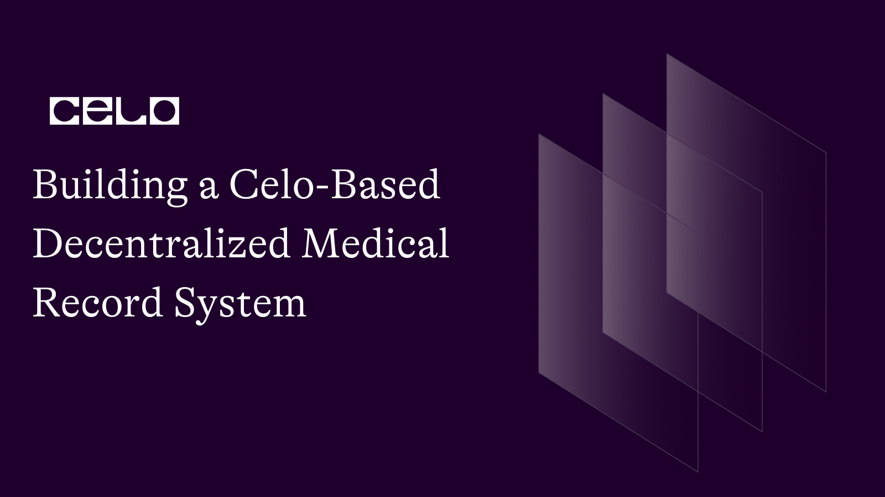

## Introduction

Medical records are essential for providing patients with accurate and timely healthcare. However, traditional systems can be inefficient and insecure. In this tutorial, you will learn how to create a decentralized medical record system on the Celo platform. We will cover the process of securely storing patient data, managing access control, and issuing verifiable credentials using smart contracts. Additionally, you will learn how to create a user interface for patients, doctors, and other medical professionals to interact with the medical record system. We will use Solidity, JavaScript, React, the Celo SDK, and medical record concepts to build our system.

Building a decentralized medical record system on the blockchain has several advantages compared to traditional centralized systems:

1. Security and Immutability: Blockchain technology ensures the data stored is secure and tamper-proof. Once a record is added to the blockchain, it cannot be altered, ensuring the integrity of the medical records. In traditional systems, a centralized database could be more susceptible to data breaches or unauthorized access.
2. Privacy and Control: A decentralized medical record system built on a blockchain can give patients more control over their medical data. They can decide who has access to their records and revoke access at anytime. In traditional systems, the control of data typically lies with the service provider or a central authority.
3. Transparency and Trust: Blockchain-based systems are transparent by design. All transactions and data changes are recorded on the blockchain and can be audited, increasing trust among patients, doctors, and other stakeholders in the medical ecosystem.
4. Interoperability and Data Sharing: Blockchain technology can improve interoperability among different healthcare providers, allowing them to share patient records securely and efficiently. This can lead to better collaboration, faster diagnoses, and improved treatment outcomes.
5. Reduced Costs and Administration: Decentralized systems can eliminate intermediaries and central authorities, reducing administrative overhead and costs. Smart contracts can automate processes such as access control and record updates, leading to more efficient and cost-effective operations.

While there are clear benefits to using blockchain technology for a decentralized medical record system, it's essential to carefully consider the specific use case, the regulatory environment, and the potential challenges (such as scalability and data storage) before deciding to build on the blockchain.

## Prerequisites

Before diving into this tutorial, you should have:

- Basic understanding of blockchain and Celo.
- Familiarity with Solidity, JavaScript, and React.
- Experience with Celo SDK.

## Requirements

1. Install Node.js (version 12.0.1 or higher) from here.
2. Install the Celo Extension Wallet for your browser.
3. A Celo Faucet Account for accessing the Celo network.

To get a Celo test account, you can follow these steps:

- Visit the Celo [Faucet](https://celo.org/developers/faucet).
- Click on "Connect Celo Extension Wallet" and follow the prompts to connect your Celo Extension Wallet.
- After connecting your wallet, you will see your account address.
- Click "Request Funds" to receive test tokens (cGLD and cUSD) on the Alfajores testnet. The faucet will send test tokens to your account.
- Make sure your Celo Extension Wallet is set to the Alfajores Testnet.
- Now you can use this test account in the tutorial. Ensure that you're interacting with the Alfajores Testnet when working on your project.

## Getting Started

We will start by creating the smart contract for our medical record system. The contract will store patient data, manage access control, and issue verifiable credentials.

1. Setting up the project
   Create a new directory for the project and navigate to it:

```bash
mkdir celo-medical-record
cd celo-medical-record
```

2. Initialize a new Truffle project:

```bash
truffle init
```

3. Install dependencies
   Install the OpenZeppelin Contracts library:

```bash
npm install @openzeppelin/contracts
```

## Writing the Smart Contract

1. In your project directory, create a new file in the contracts folder called `MedicalRecord.sol`
2. Open the `MedicalRecord.sol` file in your code editor and write the following Solidity code:

```solidity
// SPDX-License-Identifier: MIT
pragma solidity ^0.8.1;

import "@openzeppelin/contracts/token/ERC721/extensions/ERC721Enumerable.sol";
import "@openzeppelin/contracts/access/AccessControl.sol";

contract MedicalRecord is ERC721Enumerable, AccessControl {
    bytes32 public constant DOCTOR_ROLE = keccak256("DOCTOR_ROLE");

    struct Record {
        string name;
        string birthdate;
        string medicalData;
    }

    mapping(uint256 => Record) private _records;

    event RecordCreated(uint256 tokenId, string name, string birthdate);

    constructor() ERC721("MedicalRecord", "MREC") {
        _setupRole(DEFAULT_ADMIN_ROLE, msg.sender);
    }

    function supportsInterface(bytes4 interfaceId) public view virtual override(ERC721Enumerable, AccessControl) returns (bool) {
        return super.supportsInterface(interfaceId);
    }

    function createRecord(
        address to,
        string memory name,
        string memory birthdate,
        string memory medicalData
    ) public onlyRole(DOCTOR_ROLE) returns (uint256) {
        uint256 tokenId = totalSupply() + 1;
        _safeMint(to, tokenId);
        _records[tokenId] = Record(name, birthdate, medicalData);
        emit RecordCreated(tokenId, name, birthdate);
        return tokenId;
    }

    function viewRecord(uint256 tokenId) public view returns (Record memory) {
        require(_exists(tokenId), "Record does not exist");
        return _records[tokenId];
    }

    function updateRecord(
        uint256 tokenId,
        string memory newMedicalData
    ) public onlyRole(DOCTOR_ROLE) {
        require(_exists(tokenId), "Record does not exist");
        _records[tokenId].medicalData = newMedicalData;
    }

    function grantDoctorRole(address doctor) public onlyRole(DEFAULT_ADMIN_ROLE) {
        grantRole(DOCTOR_ROLE, doctor);
    }

    function revokeDoctorRole(address doctor) public onlyRole(DEFAULT_ADMIN_ROLE) {
        revokeRole(DOCTOR_ROLE, doctor);
    }
}
```

The `MedicalRecord` smart contract inherits from `ERC721` and `AccessControl`. It defines a struct `Record` that contains the patient's name, birth date, and medical data. The contract uses a mapping to store records, and it emits an event `RecordCreated` when a new record is created.

The contract has the following functions:

- `createRecord`: Creates a new medical record, assigns it a unique token ID, and mints an ERC721 token representing the record. This function can only be called by users with the `DOCTOR_ROLE`.
- `viewRecord`: Retrieves the medical record associated with a given token ID.
- `updateRecord`: Updates the medical data of an existing record. This function can only be called by users with the `DOCTOR_ROLE`.
- `grantDoctorRole`: Grants the `DOCTOR_ROLE` to a specified address. This function can only be called by users with the `DEFAULT_ADMIN_ROLE`.
- `revokeDoctorRole`: Revokes the `DOCTOR_ROL`E from a specified address. This function can only be called by users with the `DEFAULT_ADMIN_ROLE`.

## Compiling and Deploying the Smart Contract to the Celo Test Network

1. Create a new file `migrations/2_deploy_medical_record.js` and add the following code:

```javascript
const MedicalRecord = artifacts.require("MedicalRecord");

module.exports = function (deployer) {
  deployer.deploy(MedicalRecord);
};
```

2. Update the `truffle-config.js file` to include the Celo-Alfajores network configuration:

```javascript
const ContractKit = require("@celo/contractkit");
const Web3 = require("web3");

const web3 = new Web3("https://alfajores-forno.celo-testnet.org");
const kit = ContractKit.newKitFromWeb3(web3);

// Add your private key and account address
const privateKey = "your_private_key";
const accountAddress = "your_account_address";

kit.addAccount(privateKey);

module.exports = {
  networks: {
    development: { host: "127.0.0.1", port: 7545, network_id: "*" },
    alfajores: {
      provider: kit.connection.web3.currentProvider,
      network_id: 44787,
      from: accountAddress,
      gas: 6721975,
      gasPrice: 20000000000,
    },
  },
  compilers: {
    solc: {
      version: "0.8.0",
    },
  },
};
```

3. Compile the smart contract
   Run the following command to compile the smart contract:

```bash
truffle compile
```

4. Deploy the smart contract to the Celo network
   Run the following command to deploy the MedicalRecord smart contract to the Celo network:

```bash
truffle migrate --network alfajores
```

After the deployment is successful, you will see the smart contract address in the console output.


Take note of the deployed contract address for future use.

## Building the Front-end

1. Create a new directory for the frontend and navigate to it:

```bash
mkdir frontend
cd frontend
```

2. Initialize a new React project:

```bash
npx create-react-app .
```

3. Install the required dependencies:

```bash
npm install @celo/contractkit @celo-tools/use-contractkit web3 @openzeppelin/contracts
```

You might run into this error:


The error you might encounter is due to a conflict between the version of React you have installed (18.2.0) and the version of React that @celo-tools/use-contractkit is expecting (React 17.0.2). To fix this issue, you have to downgrade React to version 17.0.2.
You can downgrade your React and React DOM versions in your `package.json` file to match the peer dependency required by @celo-tools/use-contractkit. Modify your package.json to have the following dependencies:

```json
"dependencies": {
  "react": "^17.0.2",
  "react-dom": "^17.0.2",
},
```

Now you should be able to install the dependencies successfully.

4. Next, let's create the frontend components and connect them to interact with our smart contract. In the src directory, create a new file `src/MedicalRecord.js` and add the following code:

```javascript
import React, { useState, useEffect } from "react";
import { useContractKit } from "@celo-tools/use-contractkit";
import MedicalRecordContract from "../build/contracts/MedicalRecord.json";
import Web3 from "web3";

const MedicalRecord = () => {
  const { address, network, kit } = useContractKit();
  const [contract, setContract] = useState(null);
  const [records, setRecords] = useState([]);

  // Initialize the smart contract instance
  useEffect(() => {
    if (kit) {
      const web3 = new Web3(kit.connection.web3.currentProvider);
      const instance = new web3.eth.Contract(
        MedicalRecordContract.abi,
        MedicalRecordContract.networks[network.chainId].address
      );
      setContract(instance);
    }
  }, [kit, network]);

  // Fetch records associated with the current address
  useEffect(() => {
    const fetchRecords = async () => {
      if (contract) {
        const totalSupply = await contract.methods.totalSupply().call();
        const recordPromises = [];
        for (let tokenId = 1; tokenId <= totalSupply; tokenId++) {
          if ((await contract.methods.ownerOf(tokenId).call()) === address) {
            recordPromises.push(contract.methods.viewRecord(tokenId).call());
          }
        }
        const fetchedRecords = await Promise.all(recordPromises);
        setRecords(fetchedRecords);
      }
    };
    fetchRecords();
  }, [contract, address]);

  // Render the fetched records
  return (
    <div>
      <h1>My Medical Records</h1>
      <ul>
        {records.map((record, index) => (
          <li key={index}>
            {record.name} - {record.birthdate}
          </li>
        ))}
      </ul>
    </div>
  );
};

export default MedicalRecord;
```

In the code above, we import the necessary dependencies and create a `MedicalRecord` functional component. We use the `useContractKit` hook to get the current user's address, network, and Celo contract kit instance. We then create state variables for the smart contract instance and fetched records.
In the first `useEffect`, we initialize the smart contract instance using the contract ABI and address.
In the second `useEffect`, we fetch the records associated with the current address. We loop through all token IDs and check if the current user is the owner of the record. If so, we fetch the record data using the `viewRecord` contract method.
Finally, we render the fetched records in a list.

5. Now, update the src/App.js file to use the MedicalRecord component:

```javascript
import React from "react";
import { ContractKitProvider } from "@celo-tools/use-contractkit";
import { Buffer } from "buffer";
import MedicalRecord from "./MedicalRecord";
import "./App.css";
window.Buffer = Buffer; // This line should be placed after importing Buffer
function App() {
  return (
    <ContractKitProvider
      dapp={{
        name: "Celo Medical Record",
        icon: "/MEDICAL.png",
      }}
      network={{
        name: "Alfajores",
        chainId: 44787,
        rpcUrl: "https://alfajores-forno.celo-testnet.org",
      }}
    >
      <div className="App">
        <MedicalRecord />
      </div>
    </ContractKitProvider>
  );
}
export default App;
```

With the frontend components in place, you can now run the React development server to test the application:

```bash
npm start
```

This will open a browser window with the application. Make sure you have the Celo Extension Wallet installed and configured with a Celo account that has some funds.


## Interacting with the smart contract

To interact with the smart contract, we will need to create a form to add new medical records and update existing ones. Let's add this functionality to our `src/MedicalRecord.js` component:

1. First, add the required state variables for the form fields:

```javascript
const [name, setName] = useState("");
const [birthdate, setBirthdate] = useState("");
const [medicalData, setMedicalData] = useState("");
const [selectedRecordId, setSelectedRecordId] = useState(null);
```

2. Next, create a function to handle form submissions for creating new records:

```javascript
const createNewRecord = async (e) => {
  e.preventDefault();
  const receipt = await contract.methods
    .createRecord(address, name, birthdate, medicalData)
    .send({ from: address });
  if (receipt.status) {
    const tokenId = receipt.events.RecordCreated.returnValues.tokenId;
    const newRecord = await contract.methods.viewRecord(tokenId).call();
    setRecords([...records, newRecord]);
    setName("");
    setBirthdate("");
    setMedicalData("");
  }
};
```

3. Then, create a function to handle form submissions for updating existing records:

```javascript
const updateExistingRecord = async (e) => {
  e.preventDefault();
  const tokenId = parseInt(selectedRecordId);
  await contract.methods
    .updateRecord(tokenId, medicalData)
    .send({ from: address });
  const updatedRecords = records.map((record, index) =>
    index + 1 === tokenId ? { ...record, medicalData } : record
  );
  setRecords(updatedRecords);
  setMedicalData("");
  setSelectedRecordId(null);
};
```

4. Finally, add the form components to the JSX:

```jsx
<form onSubmit={selectedRecordId ? updateExistingRecord : createNewRecord}>
  <div>
    <label>
      Name:
      <input
        type="text"
        value={name}
        onChange={(e) => setName(e.target.value)}
        disabled={!!selectedRecordId}
      />
    </label>
  </div>
  <div>
    <label>
      Birthdate:
      <input
        type="date"
        value={birthdate}
        onChange={(e) => setBirthdate(e.target.value)}
        disabled={!!selectedRecordId}
      />
    </label>
  </div>
  <div>
    <label>
      Medical Data:
      <textarea
        value={medicalData}
        onChange={(e) => setMedicalData(e.target.value)}
      />
    </label>
  </div>
  {selectedRecordId ? (
    <div>
      <button type="submit">Update Record</button>
      <button type="button" onClick={() => setSelectedRecordId(null)}>
        Cancel
      </button>
    </div>
  ) : (
    <button type="submit">Create Record</button>
  )}
</form>
```

With these changes, users can create and update medical records using the front end. Doctors can grant and revoke the `DOCTOR_ROLE` to other users through the smart contract methods `grantDoctorRole` and `revokeDoctorRole`. This can be done using tools like Remix or by creating additional front-end components which we will do in the next section.

## Displaying Medical Records

Now that we can create and update medical records, let's create a component that will display these records in a list.

- Add the following code to the `src/MedicalRecord.js` component:

```javascript
const MedicalRecordList = ({ records, onSelect }) => {
  return (
    <ul>
      {records.map((record, index) => (
        <li key={index} onClick={() => onSelect(index + 1)}>
          {record.name} - {record.birthdate}
        </li>
      ))}
    </ul>
  );
};
```

- Next, update the component's JSX to include the MedicalRecordList component:

```jsx
<div>
  <h2>Your Medical Records</h2>
  <MedicalRecordList records={records} onSelect={setSelectedRecordId} />
</div>
```

Now, when a user clicks on a medical record in the list, the form will be populated with the data of the selected record, allowing the user to update the medical data.

## Error Handling and Loading Indicators

To improve the user experience, we should add error handling and loading indicators to our application.

- First, let's add the necessary state variables to the `src/MedicalRecord.js` component:

```javascript
const [isLoading, setIsLoading] = useState(false);
const [error, setError] = useState(null);
```

- Next, update the `fetchRecords`, `createNewRecord`, and `updateExistingRecord` functions to handle errors and set the loading state:

```javascript
// Add error handling and loading indicator to fetchRecords
const fetchRecords = async () => {
  setIsLoading(true);
  setError(null);
  try {
    // Fetch records code here
  } catch (error) {
    setError(error.message);
  } finally {
    setIsLoading(false);
  }
};

// Add error handling and loading indicator to createNewRecord
const createNewRecord = async (e) => {
  e.preventDefault();
  setIsLoading(true);
  setError(null);
  try {
    // Create new record code here
  } catch (error) {
    setError(error.message);
  } finally {
    setIsLoading(false);
  }
};

// Add error handling and loading indicator to updateExistingRecord
const updateExistingRecord = async (e) => {
  e.preventDefault();
  setIsLoading(true);
  setError(null);
  try {
    // Update existing record code here
  } catch (error) {
    setError(error.message);
  } finally {
    setIsLoading(false);
  }
};
```

- Finally, update the component's JSX to display the error message and loading indicator:

```jsx
{
  error && <p>Error: {error}</p>;
}
{
  isLoading && <p>Loading...</p>;
}
```

## Testing the Application

To test the application, run the following command in your terminal:

```bash
npm start
```

This will open a browser window with the application. Make sure you have the Celo Extension Wallet installed and configured with a Celo account that has some funds.
Now, you should be able to create, view, and update medical records using the front-end application. You should also see error messages and loading indicators when appropriate.

However, on running the command `npm start` and filling out the form, you might see this error:


It appears there is a problem with the address value being passed to the smart contract function. The error indicates that the address is `null`. Ensure that a valid address is provided before invoking the `createRecord` function. The address should be automatically retrieved from the Celo Extension Wallet when the user is connected.

To resolve this issue, you can implement a check to confirm the user is connected before attempting to create or update a record. In your `MedicalRecord` component, introduce a new state variable for the connection status and a function to connect the wallet:

```javascript
const { address, network, kit, connect } = useContractKit();
const [isConnected, setIsConnected] = useState(false);

const handleConnect = async () => {
  try {
    await connect();
    setIsConnected(true);
  } catch (error) {
    console.error('Error connecting to wallet:', error.message);
  }
};

Then, add a "Connect Wallet" button that calls the handleConnect function when clicked. Place this button at the beginning of your form component:
javascript
return (
  <div>
    {!isConnected && (
      <button onClick={handleConnect}>Connect Wallet</button>
    )}
    {isConnected && (
      //... The rest of your form and components
    )}
  </div>
);
```

Now, when the user loads the page, they will see a "Connect Wallet" button. They should click this button to connect their wallet before interacting with the form. Once connected, the form will be displayed, and the address should no longer be `null`.

This is what your final `MedicalRecord.js` should look like:

```javascript
import React, { useState, useEffect } from "react";
import { useContractKit } from "@celo-tools/use-contractkit";
import MedicalRecordContract from "/home/lanacreates/celo-medical-record/client/src/build/contracts/MedicalRecord.json";
import Web3 from "web3";
const MedicalRecord = () => {
  const { address, network, kit, connect } = useContractKit();
  const [isConnected, setIsConnected] = useState(false);
  const [contract, setContract] = useState(null);
  const [records, setRecords] = useState([]);
  const [name, setName] = useState("");
  const [birthdate, setBirthdate] = useState("");
  const [medicalData, setMedicalData] = useState("");
  const [selectedRecordId, setSelectedRecordId] = useState(null);
  const [isLoading, setIsLoading] = useState(false);
  const [error, setError] = useState(null);
  // Initialize the smart contract instance
  useEffect(() => {
    if (kit) {
      const web3 = new Web3(kit.connection.web3.currentProvider);
      const instance = new web3.eth.Contract(
        MedicalRecordContract.abi,
        MedicalRecordContract.networks[network.chainId].address
      );
      setContract(instance);
    }
  }, [kit, network]);
  // Fetch records associated with the current address
  useEffect(() => {
    const fetchRecords = async () => {
      setIsLoading(true);
      setError(null);
      if (contract) {
        const totalSupply = await contract.methods.totalSupply().call();
        const recordPromises = [];
        for (let tokenId = 1; tokenId <= totalSupply; tokenId++) {
          if ((await contract.methods.ownerOf(tokenId).call()) === address) {
            recordPromises.push(contract.methods.viewRecord(tokenId).call());
          }
        }
        try {
          const fetchedRecords = await Promise.all(recordPromises);
          setRecords(fetchedRecords);
        } catch (error) {
          setError(error.message);
        } finally {
          setIsLoading(false);
        }
      }
    };
    fetchRecords();
  }, [contract, address]);
  const handleConnect = async () => {
    try {
      await connect();
      setIsConnected(true);
      // Grant DOCTOR_ROLE to the connected address
      await contract.methods.grantDoctorRole(address).send({ from: address });
    } catch (error) {
      console.error("Error connecting to wallet:", error.message);
    }
  };
  const createNewRecord = async (e) => {
    e.preventDefault();
    setIsLoading(true);
    setError(null);
    console.log("Address:", address);
    console.log("Name:", name);
    console.log("Birthdate:", birthdate);
    console.log("Medical Data:", medicalData);
    try {
      const receipt = await contract.methods
        .createRecord(address, name, birthdate, medicalData)
        .send({ from: address });
      if (receipt.status) {
        const tokenId = receipt.events.RecordCreated.returnValues.tokenId;
        const newRecord = await contract.methods.viewRecord(tokenId).call();
        setRecords([...records, newRecord]);
        setName("");
        setBirthdate("");
        setMedicalData("");
      }
    } catch (error) {
      setError(error.message);
    } finally {
      setIsLoading(false);
    }
  };
  const updateExistingRecord = async (e) => {
    e.preventDefault();
    const tokenId = parseInt(selectedRecordId);
    setIsLoading(true);
    setError(null);
    try {
      await contract.methods
        .updateRecord(tokenId, medicalData)
        .send({ from: address });
      const updatedRecords = records.map((record, index) =>
        index + 1 === tokenId ? { ...record, medicalData } : record
      );
      setRecords(updatedRecords);
      setMedicalData("");
      setSelectedRecordId(null);
    } catch (error) {
      setError(error.message);
    } finally {
      setIsLoading(false);
    }
  };
  const MedicalRecordList = ({ records, onSelect }) => {
    return (
      <ul>
        {records.map((record, index) => (
          <li key={index} onClick={() => onSelect(index + 1)}>
            {record.name} - {record.birthdate}
          </li>
        ))}
      </ul>
    );
  };
  return (
    <div>
      {!isConnected && <button onClick={handleConnect}>Connect Wallet</button>}
      {isConnected && (
        <>
          <h1>My Medical Records</h1>
          <form
            onSubmit={selectedRecordId ? updateExistingRecord : createNewRecord}
          >
            <div>
              <label>
                Name:
                <input
                  type="text"
                  value={name}
                  onChange={(e) => setName(e.target.value)}
                  disabled={!!selectedRecordId}
                />
              </label>
            </div>
            <div>
              <label>
                Birthdate:
                <input
                  type="date"
                  value={birthdate}
                  onChange={(e) => setBirthdate(e.target.value)}
                  disabled={!!selectedRecordId}
                />
              </label>
            </div>
            <div>
              <label>
                Medical Data:
                <textarea
                  value={medicalData}
                  onChange={(e) => setMedicalData(e.target.value)}
                />
              </label>
            </div>
            {selectedRecordId ? (
              <div>
                <button type="submit">Update Record</button>
                <button type="button" onClick={() => setSelectedRecordId(null)}>
                  Cancel
                </button>
              </div>
            ) : (
              <button type="submit">Create Record</button>
            )}
          </form>
          <div>
            <h2>Your Medical Records</h2>
            <MedicalRecordList
              records={records}
              onSelect={setSelectedRecordId}
            />
          </div>
          {error && <p>Error: {error}</p>}
          {isLoading && <p>Loading...</p>}
        </>
      )}
    </div>
  );
};
export default MedicalRecord;
```

On running the command again:

```bash
npm start
```

You should see this browser window with the application.

- Click on connect wallet.
  

* Select the Metamask Wallet to connect to your Alfajores Account.
  

- Click on Confirm when your wallet loads up.
  

- Fill in the form and click on Create Record.
  

* Confirm this action in the metamask window pop-out.
  

* Your record is now created and saved to the blockchain.
  

- You can view the details of the transaction on the Celo Explorer. Your Medical Records details will now be saved to the blockchain and can only be updated by an address with the `DOCTOR_ROLE`.

## Conclusion

Congratulations! You have built a decentralized medical record system on the Celo network using smart contracts, React, and the Celo Extension Wallet. This system allows doctors to create, view, and update patients' medical records securely, while patients can view their records. The application provides a user-friendly interface for interacting with the smart contract and is a good starting point for building more complex decentralized applications on the Celo platform.

## What's Next?

You have now built a basic decentralized medical record system on the Celo network. Here are some ideas to further improve and expand the application:

- Implement a more advanced user interface, including search and filtering options for the medical records list.
- Integrate with a decentralized storage solution like IPFS to store medical data more securely and efficiently.
- Add support for more data types, such as images, videos, and other files, to store more comprehensive medical information.-
- Develop a mobile application using React Native or another mobile development framework to make the system more accessible for users on the go.

## About the Author

Oluwalana is a blockchain developer and technical writer, experienced in creating decentralized applications on Ethereum and Celo platforms. With a passion for knowledge-sharing, Oluwalana has authored various tutorials and articles on blockchain and other emerging technologies.
Follow me on [Twitter](https://twitter.com/lanacreates) for insights on blockchain and emerging tech. For professional inquiries, kindly connect witth me on [LinkedIn](https://www.linkedin.com/in/oluwalana-ajayi/) and explore my work on [GitHub](https://github.com/lanacreates).

## References

- [Tutorial Github Repo](https://github.com/lanacreates/Building-a-Celo-Based-Decentralized-Medical-Record-System)
- [Celo platform documentation](https://docs.celo.org/)
- [OpenZeppelin contracts](https://github.com/OpenZeppelin/openzeppelin-contracts)
- [Celo Extension Wallet](https://chrome.google.com/webstore/detail/celo-extension-wallet/kkilomkmpmkbdnfelcpgckmpcaemjcdh)
- [Truffle Suite](https://www.trufflesuite.com/)
- [React](https://reactjs.org/)
- [IPFS](https://ipfs.io/)
