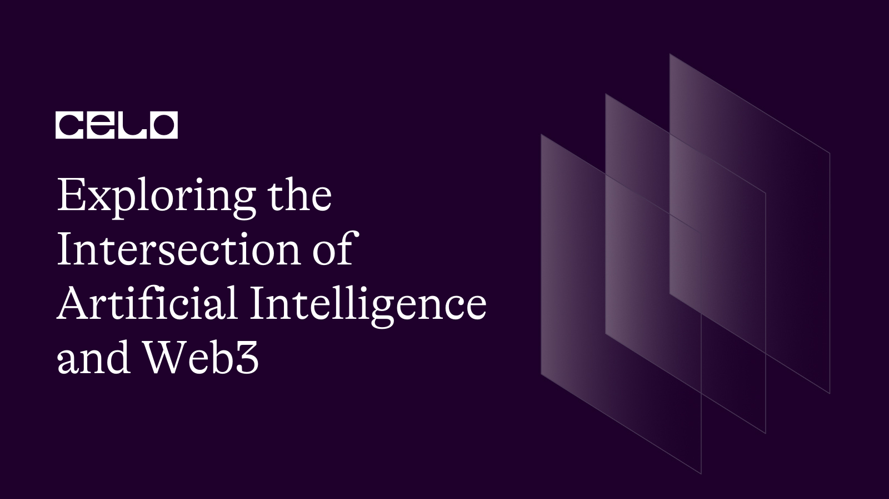

## Introduction

I am sure that you must have heard the term ChatGPT till now, or if you have not I am not sure under which rock you guys are living But don’t worry if you are not aware of that, This article will be helping you know ChatGPT and how it can help you in web3 domain, for developing smart contracts and dApps, getting ideas and many other things.

## What is ChatGPT?

ChatGPT is like a magical internet superstar which has read everything on the internet till the year 2021, and from that knowledge, he can answer our questions.

### Let’s Jump to explore this mystical world

So, I asked ChatGPT only, can you help in the web3 domain and it answered yes, So I dived into it and started researching more about it, and Now I am writing an article so that, You can also utilize the power of ChatGPT in a most useful manner

### Let’s understand web3 first

Web3 is like the next generation of the web which is currently being widely used all over the world it is more secure, more transparent and it uses blockchain technology, I have already written a whole article on this, you can go on and read that article first and then can continue reading this one [blog-basics of blockchain](https://docs.celo.org/blog/tutorials/blockchain-basics-an-introduction-to-web3-terms-and-concepts-with-celo)

## Let’s understand ChatGPT

It is a large language model by OpenAI, if you have used the NLTK library in python, you would be able to understand this more clearly, it is just a very advanced version of such libraries, It uses deep learning to generate human-like responses, it is able to answer simple questions or any high-level questions and can also write the code.

I have been in the discussion and news just after it was open to use by the public, there are many topics they are discussing but the major question arises was “WILL AI TAKE YOUR JOBS??”, and let me tell you if I wrote about this in this article it will take hours of your reading time, but the simple answer, for now, is NO (according to me), but one thing is assured that it has the capability of doing wonders, and instead of focusing on the question, I will here help you with this article that how it can improve your contribution to the web3 world.

Now we are familiar with the domains with which we are working so now we are ready for getting to know that both of the domains can be integrated in a way, in which we can work in a better way, and can bring the best use of our skills and technological advancements

First I would like to give you guys a disclaimer before starting the piece, I am writing this piece after my research and my knowledge, so I can’t assure you that our thoughts are always coinciding

So I asked ChatGPT in which ways you expect to help the Web3 Builders
And it answered these domains

- Natural Language Processing
- Smart Contract Development
- Content Creation
- ChatBots
- Sentiment Analysis

Now from this, I am not sure How I would be using NLP and Sentiment Analysis in near future in Web3 Domain, but if you would like more to know about that, ask ChatGPT wink,

### For smart contract development,

I have created several smart contracts while building a project or in my learning phase, or in hackathons, and what problems as developers we face when we hit a block, we are not sure what is causing errors, or how can I write a certain function, how should I write a certain method so that it can pass and all other things, many times we face a problem of getting tired, and also getting frustrated, which sometimes can make us not to find the optimal solution as soon as we can, so at such times, rather than going on stack overflow and trying to get the understanding of the code and doing hit and miss method, we can take help of ChatGPT which can save us a time, but you can argue, that Stackoverflow or the answers on the internet explains it, so rest assure ChatGPT will also explain that what went wrong, and how you can rectify and what it had tried to rectify the error. But yeah for arguing you can say that human who writes answers on the internet knows much better than it that what can be done, what would have happened, what can happen.
For time-saving and less frustration ChatGPT can be your savior.

### Content Creation

I think this os one of the best way it can be used , because for Web3 domain I would like to have a mass user base, because it is beneficial to all of you, but we all know to get the general public it is little bit of difficult, as for a first step we have to educate them that what is a Web3 , why it is necessary and how it can be beneficial, and what are the security measures which one should take to make themselves theft proof, because maintaining a private key, and a ledger is still new and difficult for the general public out there, after that we have to also educate the developers who want to start in Blockchain, or lets say who to have a transition form web2 to web3 _(PSST: A secret Celo is doing that all , check this out - docs.celo.org)_,and we have to do that in a way that people enjoys while learning and lets digest the fact that one person can’t do that all in a comfortable manner, a one who can write a good script won’t be sure to have developer knowledge or delivery skills, and camera skills, and same goes for other things and vice-a-versa, so here comes the ChatGPT as a Saviour, it can give you ideas that how a content piece can be created, it can write you a script, there AI voice tools, which can give you a voice over,There are AI animation tools also in the market which can help you with that, So with the integration of AI in this domain, I think we can reach our goal of mass adoption quickly and hassle free. _(Fun fact- The idea of writing a blog on this topic was given by ChatGPT)_

### ChatBots

In our dApps, chatbots are one of the features which most of the devs would like to add, as it adds the touch of interaction with the end user. And ChatGPT provides great API support.

As a human, we tend to have some silly mistakes some factual errors, and it can cause fatigue and frustration to us, which can directly affect our productivity. And at such times this can be used to our aid.

Now as we all know that every coin has two sides, one good and one bad, and we should always consider both sides.

Now let’s discuss the limitations and challenges of the AI tools and specifically ChatGPT.

### Security

As you know that DEfi is a big part of web3 and their security plays an important part, To improve security, the technology of AI will be utilized greatly.

### AI with NFT

As we are seeing the emergence of NFT in the market, now just think that creators can use AI to be more creative to get more ideas and stuff, and not every artist knows what an NFT is, and what is the mechanism behind it, so AI tools like ChatGPT can be helpful for such artists.

## Limitations

- ChatGPT does not have consciousness, it does not know whether the solution or the answer it provides is correct or not.
- You cannot rely on ChatGPT, because it is not always exactly as we want, and if you are not aware of that topic you cannot be sure about the truthfulness and also how much reliable it is.
- It does not have current information with it, because it is trained with the data on the internet till 2021.
- It can hinder your creativity and it makes you lazy too, but I think this one is general with the evolution in technology this has increased.
- You cannot always use it for production purposes of an App or a dApp because it can sometimes be wrong or not work in an expected manner, so you have to go an extra step ahead for checking the code and testing it and also see its performance after merging it into your code base. Whereas if you have written that code, such things are not always required.

I asked one last critical question to ChatGPT

## What is the Future of AI integration with Web3?

And, this is what it answered
The integration of AI and web3 is expected to have a significant impact on the future of technology and society. Here are some potential developments that we might see:
Improved security: AI can be used to enhance the security of web3 applications and networks by detecting and preventing fraudulent activities, such as hacking and phishing attacks.
Greater personalization: AI can be used to personalize web3 applications and services for individual users, improving their experience and engagement with the platform.
Enhanced data privacy: AI can be used to provide greater privacy and data protection for users of web3 applications by leveraging advanced encryption and anonymization techniques.
Automation of complex tasks: AI can be used to automate complex tasks in web3 applications, such as market analysis, investment decisions, and contract generation.
Natural language processing: AI can be used to enable natural language processing capabilities for web3 applications, making them more accessible and user-friendly for non-technical users.
Overall, the integration of AI and web3 is expected to drive innovation and improve the user experience of decentralized applications. It has the potential to transform the way we interact with technology and to create a more secure, transparent, and equitable digital world.

I have written this article after doing thorough research, and I think I have added all the things which can get you started with your exciting journey into the web3 world with the power of AI.

## Conclusion

AI has just begun its journey, it would be beneficial if you learn to accommodate it, rather than being adamant about it, think of it as a tool, it can improve productivity on a greater scale. And as I said, to make Web3 a big success, you will need masses to get into it, and AI can play an important part in doing that.

## About the author

I am Ishan Pathak, I am a Frontend Developer, I am a UI/UX designer, I am still in college and also maintaining a community of my own to help all the students around me, also a Celo-Sage Moderator

GitHub - [https://github.com/Ishanpathak1](https://github.com/Ishanpathak1)
Linkedln - [https://www.linkedin.com/in/ishan-pathak-96852a1b7/](https://www.linkedin.com/in/ishan-pathak-96852a1b7/)
