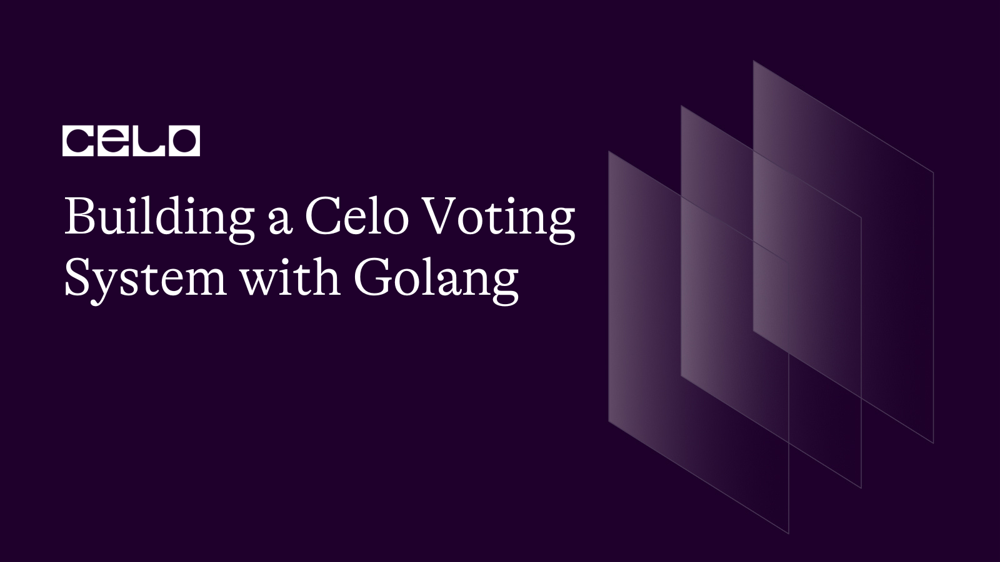

## Introduction

Voting Systems are so important in carrying out democratic rights, and they must be carried out in such a way that’s secure and transparent to ensure that election processes are plain. Blockchain technology can play an integral role in Voting systems by moving them from a less traditionally insecure way to a decentralized system that is more secure and transparent.

In this article, we will look at how to create a voting system with Golang and the Celo blockchain.

## Prerequisites

In this tutorial, we're going to build a decentralized Voting system on Celo with Golang, so before we begin, you should have some familiarity with the following technologies:

- Go programming language
- Solidity programming language
- Celo blockchain

## Requirements

Before we get started, make sure you have the following installed:

- [Go programming language](https://go.dev/doc/) (version 1.13 or higher)
- [Node.js](https://nodejs.org/en/docs) (version 10 or higher)
- [Git](https://git-scm.com/downloads)
- Text editor (e.g. Visual Studio Code)
- [Go Ethereum](https://github.com/ethereum/go-ethereum)

### Step 1: Set up the project

On your terminal, create a new directory for this project:

```bash
mkdir voting-app
cd voting-app
```

Initialize a new Go module:

```bash
go mod init voting-app
```

Install the Celo blockchain package:

```bash
go get -u github.com/ethereum/go-ethereum
```

Note: This Go Ethereum package created by Celo is a fork of the main Go Ethereum package. If you are having any import errors, just go to your terminal and run:

```bash
go mod tidy
```

### Step 2: Smart contract development

Next, we have to build a smart contract for the decentralized voting system. Go into your project directory and create a folder called contracts and put a file called “Voting.sol” in it:

```solidity
// SPDX-License-Identifier: MIT

pragma solidity ^0.8.0;

contract Voting {

    struct Candidate {
        uint256 id;
        string name;
        uint256 voteCount;
    }

    mapping(address => bool) public hasVoted;
    mapping(uint256 => Candidate) public candidates;
    uint256 public candidatesCount;

    event Voted(uint256 indexed candidateId, address indexed voter);

    constructor(string[] memory _candidateNames) {
        for (uint256 i = 0; i < _candidateNames.length; i++) {
            addCandidate(_candidateNames[i]);
        }
    }

    function addCandidate(string memory _name) private {
        candidatesCount++;
        candidates[candidatesCount] = Candidate(candidatesCount, _name, 0);
    }

    function vote(uint256 _candidateId) public {
        require(_candidateId > 0 && _candidateId <= candidatesCount, "Invalid candidate ID.");
        require(!hasVoted[msg.sender], "You have already voted.");
        candidates[_candidateId].voteCount++;
        hasVoted[msg.sender] = true;
        emit Voted(_candidateId, msg.sender);
    }

    function getCandidate(uint256 _candidateId) public view returns (uint256, string memory, uint256) {
        require(_candidateId > 0 && _candidateId <= candidatesCount, "Invalid candidate ID.");
        Candidate memory candidate = candidates[_candidateId];
        return (candidate.id, candidate.name, candidate.voteCount);
    }

    function getCandidatesCount() public view returns (uint256) {
        return candidatesCount;
    }
}
```

Now let’s go through the code above to understand what’s going on.

```solidity
contract Voting {

    struct Candidate {
        uint256 id;
        string name;
        uint256 voteCount;
    }

    mapping(address => bool) public hasVoted;
    mapping(uint256 => Candidate) public candidates;
    uint256 public candidatesCount;

    event Voted(uint256 indexed candidateId, address indexed voter);
```

From the code above, a Voting contract is created, and a Candidate struct contains details about each voting candidate such as a candidate ID, name, and vote count. The contract also defines two mappings, “hasVoted” which keeps track of addresses that have voted or not, and “candidates” which attaches candidates to a specific ID. The “candidatesCount” variable keeps track of the total votes count. Finally, the “Voted” event is emitted when a candidate casts a vote.

```solidity
constructor(string[] memory _candidateNames) {
        for (uint256 i = 0; i < _candidateNames.length; i++) {
            addCandidate(_candidateNames[i]);
        }
    }

    function addCandidate(string memory _name) private {
        candidatesCount++;
        candidates[candidatesCount] = Candidate(candidatesCount, _name, 0);
    }

    function vote(uint256 _candidateId) public {
        require(_candidateId > 0 && _candidateId <= candidatesCount, "Invalid candidate ID.");
        require(!hasVoted[msg.sender], "You have already voted.");
        candidates[_candidateId].voteCount++;
        hasVoted[msg.sender] = true;
        emit Voted(_candidateId, msg.sender);
    }
```

- The “constructor” function is called when the contract is deployed and it takes an array of candidate's names and loops through them and calls the “addCandidate” function to them to the “candidates” mapping.
- The “addCandidate” function is private and takes the name of a candidate and adds it to the “candidates” mapping, increases the “candidatesCount” variable, and initializes the candidate's vote count to zero.
- The 'vote' function allows a user to vote for a candidate by entering their candidate ID. The function first validates the candidate ID and ensures that the user has not already voted. If both checks are successful, the candidate's vote count is increased, the user's address is added to the 'hasVoted' mapping, and the 'Voted' event is fired.

```solidity
function getCandidate(uint256 _candidateId) public view returns (uint256, string memory, uint256) {
        require(_candidateId > 0 && _candidateId <= candidatesCount, "Invalid candidate ID.");
        Candidate memory candidate = candidates[_candidateId];
        return (candidate.id, candidate.name, candidate.voteCount);
    }

    function getCandidatesCount() public view returns (uint256) {
        return candidatesCount;
    }
```

- The 'getCandidate' function takes a candidate ID and returns the ID, name, and vote count for that candidate. The function 'getCandidatesCount' returns the total number of candidates.

### Step 3: Compile and deploy the smart contract

Next, we need to compile the smart contract to generate the ABI and Bytecodes of the smart contract. Before we do that, let’s install the solidity compiler which compiles our solidity code.

```bash
npm init -y
npm install solc@0.8.0
```

Create a file called “compile.js” and paste the following code:

compile.js

```jsx
const fs = require("fs");
const solc = require("solc");

const input = fs.readFileSync("Voting.sol", "utf8");

const output = solc.compile(
  JSON.stringify({
    language: "Solidity",
    sources: {
      "Voting.sol": {
        content: input,
      },
    },
    settings: {
      outputSelection: {
        "*": {
          "*": ["*"],
        },
      },
    },
  })
);

const { Voting } = JSON.parse(output).contracts["Voting.sol"];
fs.writeFileSync("Voting.abi", JSON.stringify(Voting.abi));
fs.writeFileSync("Voting.bin", Voting.evm.bytecode.object);
```

The code above compiles our smart contract and creates two files; “Exchange.abi” and “Exchange.bin”

Run the following command on your terminal to compile the code:

```bash
node compile.js
```

To deploy the contract, go to your root directory and create a new file called “deploy.go”

deploy.go

```go
package main

import (
	"context"
	"crypto/ecdsa"
	"fmt"
	"io/ioutil"
	"log"
	"math/big"

	"github.com/ethereum/go-ethereum/accounts/abi/bind"
	"github.com/ethereum/go-ethereum/common"
	"github.com/ethereum/go-ethereum/core/types"
	"github.com/ethereum/go-ethereum/crypto"
	"github.com/ethereum/go-ethereum/ethclient"
)

// Replace this with your own private key and Celo node URL
const privateKey = "your-private-key"
const nodeURL = "https://alfajores-forno.celo-testnet.org"

func main() {
	// Connect to the Celo network
	client, err := ethclient.Dial(nodeURL)
	if err != nil {
		log.Fatalf("Failed to connect to the Celo network: %v", err)
	}
	defer client.Close()

	// Load the private key
	key, err := crypto.HexToECDSA(privateKey)
	if err != nil {
		log.Fatalf("Failed to load the private key: %v", err)
	}

	// Load the contract ABI
	abiBytes, err := ioutil.ReadFile("Voting.abi")
	if err != nil {
		log.Fatalf("Failed to read the contract ABI: %v", err)
	}
	fmt.Println(abiBytes)

	// Load the contract bytecode
	bytecode, err := ioutil.ReadFile("Voting.bin")
	if err != nil {
		log.Fatalf("Failed to read the contract bytecode: %v", err)
	}

	// Get the public address associated with the private key
	publicKey := key.Public().(*ecdsa.PublicKey)
	address := crypto.PubkeyToAddress(*publicKey)

	// Get the nonce associated with the address
	nonce, err := client.PendingNonceAt(context.Background(), address)
	if err != nil {
		log.Fatalf("Failed to get the nonce: %v", err)
	}

	// Get the gas price
	gasPrice, err := client.SuggestGasPrice(context.Background())
	if err != nil {
		log.Fatalf("Failed to get the gas price: %v", err)
	}

	// Create a new transaction
	tx := types.NewContractCreation(nonce, big.NewInt(0), 3000000, gasPrice, common.FromHex(string(bytecode)))

	// Sign the transaction
	signedTx, err := types.SignTx(tx, types.NewEIP155Signer(big.NewInt(44787)), key)
	if err != nil {
		log.Fatalf("Failed to sign the transaction: %v", err)
	}

	// Broadcast the transaction
	err = client.SendTransaction(context.Background(), signedTx)
	if err != nil {
		log.Fatalf("Failed to broadcast the transaction: %v", err)
	}

	// Wait for the transaction receipt
	receipt, err := bind.WaitMined(context.Background(), client, signedTx)
	if err != nil {
		log.Fatalf("Failed to get the transaction receipt: %v", err)
	}

	// Print the contract address
	fmt.Printf("Smart contract deployed at address: %s\n", receipt.ContractAddress.Hex())
}
```

Let’s go through the code step by step.

```go
package main

import (
	"context"
	"crypto/ecdsa"
	"fmt"
	"io/ioutil"
	"log"
	"math/big"

	"github.com/ethereum/go-ethereum/accounts/abi/bind"
	"github.com/ethereum/go-ethereum/common"
	"github.com/ethereum/go-ethereum/core/types"
	"github.com/ethereum/go-ethereum/crypto"
	"github.com/ethereum/go-ethereum/ethclient"
)
```

The “package main” initializes this file as our main Go package and the “import” command is used to import all the package dependencies.

```go
const privateKey = "your-private-key"
const nodeURL = "https://alfajores-forno.celo-testnet.org"
```

Replace the string with your Celo wallet private key and the node URL is the Celo Alfrajores or Testnet URL.

```go
// Connect to the Celo network
client, err := ethclient.Dial(nodeURL)
	if err != nil {
		log.Fatalf("Failed to connect to the Celo network: %v", err)
	}
	defer client.Close()

	// Load the private key
	key, err := crypto.HexToECDSA(privateKey)
	if err != nil {
		log.Fatalf("Failed to load the private key: %v", err)
	}

	// Load the contract ABI
	abiBytes, err := ioutil.ReadFile("Exchange.abi")
	if err != nil {
		log.Fatalf("Failed to read the contract ABI: %v", err)
	}
	fmt.Println(abiBytes)

	// Load the contract bytecode
	bytecode, err := ioutil.ReadFile("Exchange.bin")
	if err != nil {
		log.Fatalf("Failed to read the contract bytecode: %v", err)
	}
```

The code above allows us to connect to the Celo blockchain, load our private key, and load our contract ABI and byte codes which were generated when our contract was compiled.

```go
// Get the public address associated with the private key
	publicKey := key.Public().(*ecdsa.PublicKey)
	address := crypto.PubkeyToAddress(*publicKey)

	// Get the nonce associated with the address
	nonce, err := client.PendingNonceAt(context.Background(), address)
	if err != nil {
		log.Fatalf("Failed to get the nonce: %v", err)
	}

	// Get the gas price
	gasPrice, err := client.SuggestGasPrice(context.Background())
	if err != nil {
		log.Fatalf("Failed to get the gas price: %v", err)
	}
```

From the code above, our contract address and public key are gotten from the crypto package. The nonce and “gasPrice” are needed for a transaction to occur on the blockchain.

```go
// Create a new transaction
	tx := types.NewContractCreation(nonce, big.NewInt(0), 3000000, gasPrice, common.FromHex(string(bytecode)))

	// Sign the transaction
	signedTx, err := types.SignTx(tx, types.NewEIP155Signer(big.NewInt(44787)), key)
	if err != nil {
		log.Fatalf("Failed to sign the transaction: %v", err)
	}

	// Broadcast the transaction
	err = client.SendTransaction(context.Background(), signedTx)
	if err != nil {
		log.Fatalf("Failed to broadcast the transaction: %v", err)
	}

	// Wait for the transaction receipt
	receipt, err := bind.WaitMined(context.Background(), client, signedTx)
	if err != nil {
		log.Fatalf("Failed to get the transaction receipt: %v", err)
	}

	// Print the contract address
	fmt.Printf("Smart contract deployed at address: %s\n", receipt.ContractAddress.Hex())
}
```

A new transaction is created and signed and a receipt is generated to validate that the smart contract is actually deployed and has a particular contract address attached to it.

On your terminal, run the following command:

```bash
go run deploy.go
```

You should see something like this on your terminal:


## Conclusion

In this tutorial, we have seen how developing a decentralized voting system using Golang and the Celo blockchain can provide numerous advantages over traditional voting systems. Transparency, security, and efficiency are among the advantages. While this article provides a basic framework for developing a voting system, much more work remains to be done to ensure the system's robustness and scalability. Nonetheless, the potential for decentralized voting systems based on blockchain technology is enormous, and we are excited to see how this technology will transform voting in the future.

## Next Steps

There are numerous ways to improve the voting system described in this article. One approach is to investigate various methods of identity verification to ensure that only eligible voters can vote in the election. Another approach is to use more advanced security features to prevent tampering and fraud, such as encryption and multi-factor authentication.

## About the Author

I am a Software engineer with an interest in Blockchain technology. I love picking up new technologies and sharing my knowledge as I learn as a way of giving back to the tech community. You can find one on [GitHub](https://github.com/Divine572) and [Twitter](https://twitter.com/divine_finix).

## References

1. [Celo Developer Documentation](https://docs.celo.org/)
2. [Go Programming Language Documentation](https://golang.org/doc/)
3. [Solidity Documentation](https://solidity.readthedocs.io/)
4. [Github repo](https://github.com/Divine572/voting-app)
