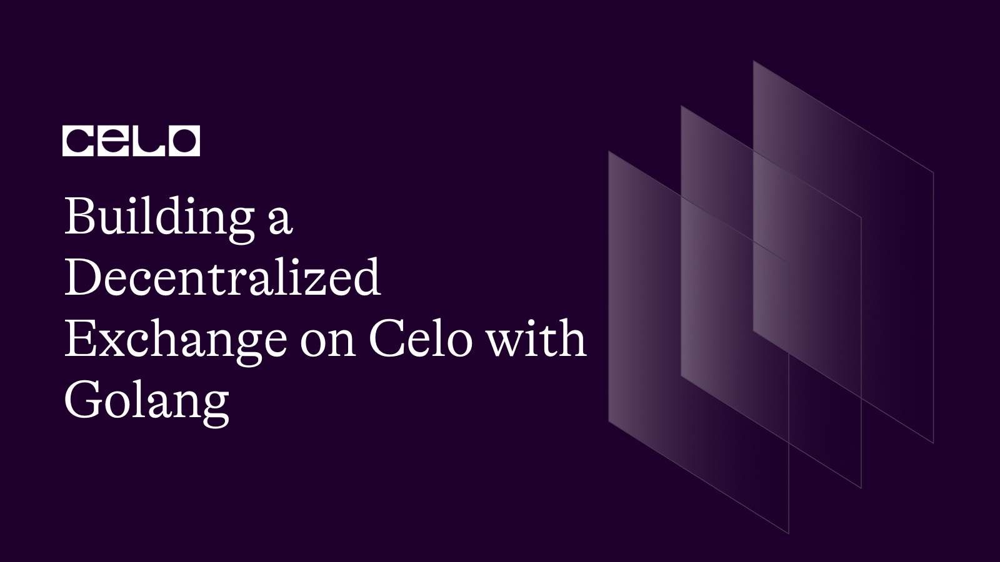

## Introduction

Decentralized exchanges (DEXs) are a crucial component of the decentralized finance (DeFi) ecosystem. They allow for peer-to-peer trading of cryptocurrencies and other digital assets without the need for a centralized authority.

Celo is a blockchain platform that is designed to send, receive, and store digital assets securely on a mobile phone. The Celo blockchain is built using the Solidity programming language and is fully compatible with Ethereum. The Celo Golang package provides developers with a set of tools and libraries to interact with the Celo blockchain using the Go programming language.

In this tutorial, we will walk you through the process of building a simple decentralized exchange on Celo using Golang.

## Prerequisites

In this tutorial, we're going to build a Decentralized Exchange on Celo with Golang, so before we begin, you should have some familiarity with the following technologies:

- Go programming language
- Solidity programming language
- Celo blockchain

## Requirements

Before we get started, make sure you have the following installed:

- [Go programming language](https://go.dev/doc/) (version 1.13 or higher)
- [Node.js](https://nodejs.org/en/docs) (version 10 or higher)
- [Git](https://git-scm.com/downloads)
- Text editor (e.g. Visual Studio Code)
- [Go Ethereum](https://github.com/ethereum/go-ethereum)

### Step 1: Set up the project

On your terminal, create a new directory for this project:

```bash
mkdir my-dex
cd my-dex
```

Initialize a new Go module:

```bash
go mod init my-dex
```

Install the Celo blockchain package:

```bash
go get -u github.com/ethereum/go-ethereum
```

Note: This Go Ethereum package created by Celo is a fork of the main Go Ethereum package. If you are having any import errors, just go to your terminal and run:

```bash
go mod tidy
```

### Step 2: Smart contract development

Next, we have to build a smart contract for the decentralized exchange. Go into your project directory and create a file called “Exchange.sol”:

```solidity
// SPDX-License-Identifier: MIT

pragma solidity ^0.8.0;

contract Exchange {

    // Define variables
    address payable public owner;
    uint public orderCount = 0;
    mapping(uint => Order) public orders;
    mapping(address => uint) public balances;

    // Define struct for order
    struct Order {
        uint id;
        address payable seller;
        address payable buyer;
        uint price;
        bool completed;
    }

    // Define events for when an order is created and when an order is completed
    event OrderCreated(uint id, address payable seller, address payable buyer, uint price, bool completed);
    event OrderCompleted(uint id, address payable seller, address payable buyer, uint price, bool completed);

    // Constructor function
    constructor() {
        owner = payable(msg.sender);
    }

    // Sell function - create a new order
    function sell(uint _price) public {
        // Increment order count
        orderCount++;

        // Create new order
        orders[orderCount] = Order(orderCount, payable(msg.sender), payable(address(0)), _price, false);

        // Emit event
        emit OrderCreated(orderCount, payable(msg.sender), payable(address(0)), _price, false);
    }

    // Buy function - complete an existing order
    function buy(uint _id) public payable {
        // Get order from mapping
        Order memory _order = orders[_id];

        // Make sure order exists and is not completed
        require(_order.id > 0 && _order.completed == false, "Order does not exist or is already completed.");

        // Make sure buyer has enough ether to purchase order
        require(msg.value >= _order.price, "Not enough ether sent to purchase order.");

        // Transfer ether to seller
        _order.seller.transfer(msg.value);

        // Update order to completed
        _order.buyer = payable(msg.sender);
        _order.completed = true;
        orders[_id] = _order;

        // Emit event
        emit OrderCompleted(_id, _order.seller, payable(msg.sender), _order.price, true);
    }

    // Deposit function - add ether to user's balance
    function deposit() public payable {
        // Add ether to user's balance
        balances[msg.sender] += msg.value;
    }

    // Withdraw function - withdraw ether from user's balance
    function withdraw(uint _amount) public {
        // Make sure user has enough ether in their balance
        require(balances[msg.sender] >= _amount, "Not enough ether in balance to withdraw.");

        // Subtract ether from user's balance and transfer to user
        balances[msg.sender] -= _amount;
        payable(msg.sender).transfer(_amount);
    }

    // Order function - get order details
    function getOrder(uint _id) public view returns (uint, address, address, uint, bool) {
        // Get order from mapping and return details
        Order memory _order = orders[_id];
        return (_order.id, _order.seller, _order.buyer, _order.price, _order.completed);
    }
}
```

The smart contract above has 5 basic functionalities that every decentralized exchange should have and I’ll highlight each of them.

- The sell function: This function enables users to create a sell order and provide the price they want to sell for and then a new order is created and added to the mapping of the order which is the order IDs mapped to order structs. It then emits an event to let the smart contract know when a new order is placed by a user.
- The buy function: This function allows a user to finish an existing order by providing the order ID and sending enough ether to cover the item's price. The function verifies that the order exists and has not already been completed, as well as that the user has sent an adequate amount of ether. If all checks are successful, the function sends the ether to the seller and updates the order to indicate that it has been completed. In addition, the function emits an event to notify the rest of the world that the order has been completed.
- The deposit function: A user can deposit ether into their account balance using this function. The function adds the ether sent to the user's balance.
- The withdraw function: A user can use this function to withdraw ether from their account balance. The function determines whether the user has enough ether in their balance to withdraw the requested amount, then subtracts it from their balance and transfers it to their address.
- The getOrder function: This function allows a user to obtain order details by inputting the order ID. The order is retrieved from the orders mapping and its ID, seller address, buyer address, price, and completion status are returned.

### Step 3: Compile and deploy the smart contract

Next, we need to compile the smart contract to generate the ABI and Bytecodes of the smart contract. Before we do that, let’s install the solidity compiler which compiles our solidity code.

```bash
npm init -y
npm install solc@0.8.0
```

Create a file called “compile.js” and paste the following code:

compile.js

```jsx
const fs = require("fs");
const solc = require("solc");

const input = fs.readFileSync("Exchange.sol", "utf8");

const output = solc.compile(
  JSON.stringify({
    language: "Solidity",
    sources: {
      "Exchange.sol": {
        content: input,
      },
    },
    settings: {
      outputSelection: {
        "*": {
          "*": ["*"],
        },
      },
    },
  })
);

const { Exchange } = JSON.parse(output).contracts["Exchange.sol"];
fs.writeFileSync("Exchange.abi", JSON.stringify(Exchange.abi));
fs.writeFileSync("Exchange.bin", Exchange.evm.bytecode.object);
```

The code above compiles our smart contract and creates two files; “Exchange.abi” and “Exchange.bin”

Run the following command on your terminal to compile the code:

```bash
node compile.js
```

To deploy the contract, go to your root directory and create a new file called “deploy.go”

deploy.go

```go
package main

import (
	"context"
	"crypto/ecdsa"
	"fmt"
	"io/ioutil"
	"log"
	"math/big"

	"github.com/ethereum/go-ethereum/accounts/abi/bind"
	"github.com/ethereum/go-ethereum/common"
	"github.com/ethereum/go-ethereum/core/types"
	"github.com/ethereum/go-ethereum/crypto"
	"github.com/ethereum/go-ethereum/ethclient"
)

// Replace this with your own private key and Celo node URL
const privateKey = "your-private-key"
const nodeURL = "https://alfajores-forno.celo-testnet.org"

func main() {
	// Connect to the Celo network
	client, err := ethclient.Dial(nodeURL)
	if err != nil {
		log.Fatalf("Failed to connect to the Celo network: %v", err)
	}
	defer client.Close()

	// Load the private key
	key, err := crypto.HexToECDSA(privateKey)
	if err != nil {
		log.Fatalf("Failed to load the private key: %v", err)
	}

	// Load the contract ABI
	abiBytes, err := ioutil.ReadFile("Exchange.abi")
	if err != nil {
		log.Fatalf("Failed to read the contract ABI: %v", err)
	}
	fmt.Println(abiBytes)

	// Load the contract bytecode
	bytecode, err := ioutil.ReadFile("Exchange.bin")
	if err != nil {
		log.Fatalf("Failed to read the contract bytecode: %v", err)
	}

	// Get the public address associated with the private key
	publicKey := key.Public().(*ecdsa.PublicKey)
	address := crypto.PubkeyToAddress(*publicKey)

	// Get the nonce associated with the address
	nonce, err := client.PendingNonceAt(context.Background(), address)
	if err != nil {
		log.Fatalf("Failed to get the nonce: %v", err)
	}

	// Get the gas price
	gasPrice, err := client.SuggestGasPrice(context.Background())
	if err != nil {
		log.Fatalf("Failed to get the gas price: %v", err)
	}

	// Create a new transaction
	tx := types.NewContractCreation(nonce, big.NewInt(0), 3000000, gasPrice, common.FromHex(string(bytecode)))

	// Sign the transaction
	signedTx, err := types.SignTx(tx, types.NewEIP155Signer(big.NewInt(44787)), key)
	if err != nil {
		log.Fatalf("Failed to sign the transaction: %v", err)
	}

	// Broadcast the transaction
	err = client.SendTransaction(context.Background(), signedTx)
	if err != nil {
		log.Fatalf("Failed to broadcast the transaction: %v", err)
	}

	// Wait for the transaction receipt
	receipt, err := bind.WaitMined(context.Background(), client, signedTx)
	if err != nil {
		log.Fatalf("Failed to get the transaction receipt: %v", err)
	}

	// Print the contract address
	fmt.Printf("Smart contract deployed at address: %s\n", receipt.ContractAddress.Hex())
}
```

Let’s go through the code step by step.

```go
package main

import (
	"context"
	"crypto/ecdsa"
	"fmt"
	"io/ioutil"
	"log"
	"math/big"

	"github.com/ethereum/go-ethereum/accounts/abi/bind"
	"github.com/ethereum/go-ethereum/common"
	"github.com/ethereum/go-ethereum/core/types"
	"github.com/ethereum/go-ethereum/crypto"
	"github.com/ethereum/go-ethereum/ethclient"
)
```

The “package main” initializes this file as our main Go package and the “import” command is used to import all the package dependencies.

```go
const privateKey = "your-private-key"
const nodeURL = "https://alfajores-forno.celo-testnet.org"
```

Replace the string with your Celo wallet private key and the node URL is the Celo Alfrajores or Testnet URL.

```go
// Connect to the Celo network
client, err := ethclient.Dial(nodeURL)
	if err != nil {
		log.Fatalf("Failed to connect to the Celo network: %v", err)
	}
	defer client.Close()

	// Load the private key
	key, err := crypto.HexToECDSA(privateKey)
	if err != nil {
		log.Fatalf("Failed to load the private key: %v", err)
	}

	// Load the contract ABI
	abiBytes, err := ioutil.ReadFile("Exchange.abi")
	if err != nil {
		log.Fatalf("Failed to read the contract ABI: %v", err)
	}
	fmt.Println(abiBytes)

	// Load the contract bytecode
	bytecode, err := ioutil.ReadFile("Exchange.bin")
	if err != nil {
		log.Fatalf("Failed to read the contract bytecode: %v", err)
	}
```

The code above allows us to connect to the Celo blockchain, load our private key, and load our contract ABI and byte codes which were generated when our contract was compiled.

```go
// Get the public address associated with the private key
	publicKey := key.Public().(*ecdsa.PublicKey)
	address := crypto.PubkeyToAddress(*publicKey)

	// Get the nonce associated with the address
	nonce, err := client.PendingNonceAt(context.Background(), address)
	if err != nil {
		log.Fatalf("Failed to get the nonce: %v", err)
	}

	// Get the gas price
	gasPrice, err := client.SuggestGasPrice(context.Background())
	if err != nil {
		log.Fatalf("Failed to get the gas price: %v", err)
	}
```

From the code above, our contract address and public key are gotten from the crypto package. The nonce and “gasPrice” are needed for a transaction to occur on the blockchain.

```go
// Create a new transaction
	tx := types.NewContractCreation(nonce, big.NewInt(0), 3000000, gasPrice, common.FromHex(string(bytecode)))

	// Sign the transaction
	signedTx, err := types.SignTx(tx, types.NewEIP155Signer(big.NewInt(44787)), key)
	if err != nil {
		log.Fatalf("Failed to sign the transaction: %v", err)
	}

	// Broadcast the transaction
	err = client.SendTransaction(context.Background(), signedTx)
	if err != nil {
		log.Fatalf("Failed to broadcast the transaction: %v", err)
	}

	// Wait for the transaction receipt
	receipt, err := bind.WaitMined(context.Background(), client, signedTx)
	if err != nil {
		log.Fatalf("Failed to get the transaction receipt: %v", err)
	}

	// Print the contract address
	fmt.Printf("Smart contract deployed at address: %s\n", receipt.ContractAddress.Hex())
}
```

A new transaction is created and signed and a receipt is generated to validate that the smart contract is actually deployed and has a particular contract address attached to it.

On your terminal, run the following command:

```bash
go run deploy.go
```

You should see something like this on your terminal:


## Conclusion

In this tutorial, we have learned how to implement a decentralized exchange on Celo using Golang. We explored topics such as setting up a development environment, creating a smart contract, and finally compiling and deploying the contract on Celo Testnet or Afrajores with Golang.

## Next Steps

After building a decentralized exchange on Celo using Golang, you can improve the smart contract by adding other features such as an order book, market orders, limit orders, etc. You could also integrate with other Defi protocols on the Celo blockchain.

## About the Author

I am a Software engineer with an interest in Blockchain technology. I love picking up new technologies and sharing my knowledge as I learn as a way of giving back to the tech community. You can find one on [GitHub](https://github.com/Divine572) and [Twitter](https://twitter.com/divine_finix).

## References

1. [Celo Developer Documentation](https://docs.celo.org/)
2. [Go Programming Language Documentation](https://golang.org/doc/)
3. [Solidity Documentation](https://solidity.readthedocs.io/)
4. [Github repo](https://github.com/Divine572/golang-dex)
