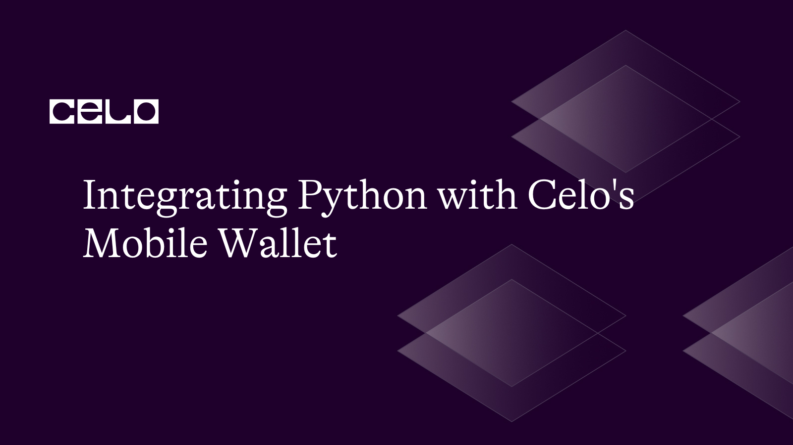

## Introduction

With the help of the open-source blockchain platform Celo, everyone with a smartphone will be able to use financial tools. Its mobile wallet provides an easy-to-use platform for managing, sending, and receiving virtual currency. In this article, we'll look at how to integrate Python with Celo's mobile wallet, talk about the difficulties and benefits of doing so, and build a straightforward Python script that communicates with the wallet using web3.py.

## Prerequisites

To follow along with this tutorial, you should have a fundamental knowledge of:

- Blockchain technology
- Programming with Python
- Ecosystem of Celo

## Requirements

- Python version 3.7 or higher
- web3.py library
- An account with Celo wallet

### Step 1: Setting up the environment

First, we need to set up an environment that we would use to interact with Celo’s mobile wallet.

On your terminal, use the following commands to create a new folder for your project:

```bash
mkdir celo-mobile-wallet
cd celo-mobile-wallet
```

In your new directory, Let's now establish and activate a virtual Python environment.

```bash
python3 -m venv venv
source venv/bin/activate
```

Next, Install the following libraries using pip, the Python package manager:

```bash
pip install python-dotenv web3
```

### Step 2: Connecting to Celo Network

We require a Celo wallet account in order to connect to the Celo network. One can be made using a web service like MetaMask or the official Celo wallet app. The private key and the account address should be saved because we will need them later in the script.

After that, write a Python script to connect to the Celo network. Create a new file called `main.py`

and paste the following code:

main.py

```python
import os
from web3 import Web3

CELO_RPC_URL = os.environ.get("CELO_PROVIDER_URL")
CELO_PRIVATE_KEY = os.environ.get("CELO_DEPLOYER_PRIVATE_KEY")

w3 = Web3(Web3.HTTPProvider(CELO_RPC_URL))
w3.eth.default_account = w3.eth.account.from_key(CELO_PRIVATE_KEY).address

print(f"Connected to Celo network. Address: {w3.eth.default_account}")
```

Your `CELO_RPC_URL` and `CELO_PRIVATE_KEY` should be stored in a `.env` file in the root directory of your project.

### Step 3: Interacting with Celo Wallet

After connecting, let's construct three functions: one to check the wallet balance, another to transfer money to another account, and the last to get transaction history.

main.py

```python
from web3 import exceptions
import os
from web3 import Web3
from web3.exceptions import ExtraDataLengthError
from dotenv import load_dotenv
from tqdm import tqdm

load_dotenv()

CELO_RPC_URL = os.environ.get("CELO_PROVIDER_URL")
CELO_PRIVATE_KEY = os.environ.get("CELO_DEPLOYER_PRIVATE_KEY")

# Connect to the Celo Alfajores testnet
w3 = Web3(Web3.HTTPProvider(CELO_RPC_URL))

# initialize account
deployer = w3.eth.account.from_key(CELO_PRIVATE_KEY)

print(f"Connected to Celo network. Address: {deployer.address}")

# Celo USD ABI
cUSD_ABI = [
    {
        "constant": True,
        "inputs": [],
        "name": "totalSupply",
        "outputs": [{"name": "", "type": "uint256"}],
        "payable": False,
        "stateMutability": "view",
        "type": "function"
    },
    {
        "constant": True,
        "inputs": [{"name": "owner", "type": "address"}],
        "name": "balanceOf",
        "outputs": [{"name": "", "type": "uint256"}],
        "payable": False,
        "stateMutability": "view",
        "type": "function"
    },
    {
        "constant": False,
        "inputs": [
            {"name": "to", "type": "address"},
            {"name": "value", "type": "uint256"}
        ],
        "name": "transfer",
        "outputs": [{"name": "", "type": "bool"}],
        "payable": False,
        "stateMutability": "nonpayable",
        "type": "function"
    },
    {
        "constant": True,
        "inputs": [
            {"name": "owner", "type": "address"},
            {"name": "spender", "type": "address"}
        ],
        "name": "allowance",
        "outputs": [{"name": "", "type": "uint256"}],
        "payable": False,
        "stateMutability": "view",
        "type": "function"
    },
    {
        "constant": False,
        "inputs": [
            {"name": "spender", "type": "address"},
            {"name": "value", "type": "uint256"}
        ],
        "name": "approve",
        "outputs": [{"name": "", "type": "bool"}],
        "payable": False,
        "stateMutability": "nonpayable",
        "type": "function"
    },
    {
        "constant": False,
        "inputs": [
            {"name": "from", "type": "address"},
            {"name": "to", "type": "address"},
            {"name": "value", "type": "uint256"}
        ],
        "name": "transferFrom",
        "outputs": [{"name": "", "type": "bool"}],
        "payable": False,
        "stateMutability": "nonpayable",
        "type": "function"
    }
]

def get_balance(account_address, contract_address, token="CELO"):
    # Get cUSD contract
    cusd_contract = w3.eth.contract(address=contract_address, abi=cUSD_ABI)

    if token == "CELO":
        return w3.from_wei(w3.eth.get_balance(account_address), 'ether')
    elif token == "cUSD":
        amount = cusd_contract.functions.balanceOf(account_address).call()
        balance = w3.from_wei(amount, 'ether')
        return balance
    else:
        raise ValueError("Invalid token type")

def send_funds(account, to, amount, contract_address, token="CELO"):
    # Get cUSD contract
    cusd_contract = w3.eth.contract(address=contract_address, abi=cUSD_ABI)

    # Estimate gas required
    gas_estimate = cusd_contract.functions.transfer(to, w3.to_wei(amount, "ether")).estimate_gas(
        {"from": account.address}
    )

    if token == "CELO":
        transaction = {
            'to': to,
            'value': w3.to_wei(amount, 'ether'),
            'gas': gas_estimate,
            'gasPrice': w3.eth.gas_price,
            "nonce": w3.eth.get_transaction_count(account.address),
        }
        signed_tx = account.sign_transaction(transaction)
        tx_hash = w3.eth.send_raw_transaction(signed_tx.rawTransaction)
    elif token == "cUSD":
        transaction = cusd_contract.functions.transfer(to, w3.to_wei(amount, 'ether')).build_transaction({
            "from": account.address,
            "gas": gas_estimate,
            "gasPrice": w3.eth.gas_price,
            "nonce": w3.eth.get_transaction_count(account.address),
        })
        # Sign and send the transaction
        signed_transaction = account.sign_transaction(transaction)
        tx_hash = w3.eth.send_raw_transaction(
            signed_transaction.rawTransaction)
    else:
        raise ValueError("Invalid token type")

    # Wait for the transaction to be mined
    try:
        w3.eth.wait_for_transaction_receipt(tx_hash, timeout=180)
    except exceptions.TimeExhausted:
        print(
            f"Transaction with hash {tx_hash.hex()} was not mined within the given timeout.")

    return tx_hash

def get_transaction_history(address):
    transactions = []
    for i in tqdm(range(w3.eth.block_number, max(-1, w3.eth.block_number - 50), -1)):
        try:
            block = w3.eth.get_block(i, full_transactions=True)
        except ExtraDataLengthError:
            continue

        for tx in block.transactions:
            if tx['from'] == address or tx['to'] == address:
                transactions.append(tx)
    return transactions

# Example usage:
receiver_address = "0xcdd1151b2bC256103FA2565475e686346CeFd813"
amount_celo = 0.01
amount_cusd = 0.01
CUSD_ALFAJORES_CONTRACT_ADDRESS = "0x874069Fa1Eb16D44d622F2e0Ca25eeA172369bC1"

# Check CELO and cUSD balances
balance_celo = get_balance(deployer.address, CUSD_ALFAJORES_CONTRACT_ADDRESS, token="CELO")
balance_cusd = get_balance(deployer.address, CUSD_ALFAJORES_CONTRACT_ADDRESS, token="cUSD")
print(f"CELO balance: {balance_celo} CELO")
print(f"cUSD balance: {balance_cusd} cUSD")

# Send CELO and cUSD to the receiver
tx_hash_celo = send_funds(deployer, receiver_address, amount_celo, CUSD_ALFAJORES_CONTRACT_ADDRESS, token="CELO")
tx_hash_cusd = send_funds(deployer, receiver_address, amount_cusd,
                          CUSD_ALFAJORES_CONTRACT_ADDRESS, token="cUSD")
print(f"Sent {amount_celo} CELO to {receiver_address}. Transaction hash: {tx_hash_celo.hex()}")
print(f"Sent {amount_cusd} cUSD to {receiver_address}. Transaction hash: {tx_hash_cusd.hex()}")

# Fetch transaction history
transaction_history = get_transaction_history(deployer.address)
print("Transaction history:")
for tx in transaction_history:
    print(tx)

# Wait for the CELO and cUSD transactions to be mined
transaction_receipt_celo = w3.eth.wait_for_transaction_receipt(tx_hash_celo)
transaction_receipt_cusd = w3.eth.wait_for_transaction_receipt(tx_hash_cusd)
print("CELO transaction mined. Block number:",
      transaction_receipt_celo['blockNumber'])
print("cUSD transaction mined. Block number:",
      transaction_receipt_cusd['blockNumber'])

# Check updated CELO and cUSD balances
balance_celo_updated = get_balance(
    deployer.address, CUSD_ALFAJORES_CONTRACT_ADDRESS, token="CELO")
balance_cusd_updated = get_balance(
    deployer.address, CUSD_ALFAJORES_CONTRACT_ADDRESS, token="cUSD")
print(f"Updated CELO balance: {balance_celo_updated} CELO")
print(f"Updated cUSD balance: {balance_cusd_updated} cUSD")
```

Now let’s go through the code step by step:

- Imports and setup: Load environment variables, import the required libraries, then use Web3.py to establish a connection to the Celo Alfajores Testnet.

```python

import os
from web3 import Web3
from dotenv import load_dotenv

load_dotenv()

CELO_RPC_URL = os.environ.get("CELO_PROVIDER_URL")
CELO_PRIVATE_KEY = os.environ.get("CELO_DEPLOYER_PRIVATE_KEY")

# Connect to the Celo Alfajores testnet
w3 = Web3(Web3.HTTPProvider(CELO_RPC_URL))

# initialize account
deployer = w3.eth.account.from_key(CELO_PRIVATE_KEY)

print(f"Connected to Celo network. Address: {deployer.address}")
```

- cUSD_ABI: The functions and events of a smart contract are represented in JSON by an ABI (Application Binary Interface). The ABI for the cUSD stablecoin contract is currently stored in the cUSD_ABI variable.
  ```python
  # Celo USD ABI
  cUSD_ABI = [
      {
          "constant": True,
          "inputs": [],
          "name": "totalSupply",
          "outputs": [{"name": "", "type": "uint256"}],
          "payable": False,
          "stateMutability": "view",
          "type": "function"
      },
      {
          "constant": True,
          "inputs": [{"name": "owner", "type": "address"}],
          "name": "balanceOf",
          "outputs": [{"name": "", "type": "uint256"}],
          "payable": False,
          "stateMutability": "view",
          "type": "function"
      },
      {
          "constant": False,
          "inputs": [
              {"name": "to", "type": "address"},
              {"name": "value", "type": "uint256"}
          ],
          "name": "transfer",
          "outputs": [{"name": "", "type": "bool"}],
          "payable": False,
          "stateMutability": "nonpayable",
          "type": "function"
      },
      {
          "constant": True,
          "inputs": [
              {"name": "owner", "type": "address"},
              {"name": "spender", "type": "address"}
          ],
          "name": "allowance",
          "outputs": [{"name": "", "type": "uint256"}],
          "payable": False,
          "stateMutability": "view",
          "type": "function"
      },
      {
          "constant": False,
          "inputs": [
              {"name": "spender", "type": "address"},
              {"name": "value", "type": "uint256"}
          ],
          "name": "approve",
          "outputs": [{"name": "", "type": "bool"}],
          "payable": False,
          "stateMutability": "nonpayable",
          "type": "function"
      },
      {
          "constant": False,
          "inputs": [
              {"name": "from", "type": "address"},
              {"name": "to", "type": "address"},
              {"name": "value", "type": "uint256"}
          ],
          "name": "transferFrom",
          "outputs": [{"name": "", "type": "bool"}],
          "payable": False,
          "stateMutability": "nonpayable",
          "type": "function"
      }
  ]
  ```

* get_balance is a function that returns an account's balance in either CELO or cUSD. Account address, contract address, and token type (the default is CELO) are all necessary.

```python
def get_balance(account_address, contract_address, token="CELO"):
    # Get cUSD contract
    cusd_contract = w3.eth.contract(address=contract_address, abi=cUSD_ABI)

    if token == "CELO":
        return w3.from_wei(w3.eth.get_balance(account_address), 'ether')
    elif token == "cUSD":
        amount = cusd_contract.functions.balanceOf(account_address).call()
        balance = w3.from_wei(amount, 'ether')
        return balance
    else:
        raise ValueError("Invalid token type")
```

- Using the send_funds function, money can be transferred from an account to a recipient in either CELO or cUSD. It needs the recipient address, contract address, sender account, amount to be sent, and token type (the default is CELO). The send_raw_transaction method is used by the function to create and sign the transaction, estimate the gas, and send it.

```python
def send_funds(account, to, amount, contract_address, token="CELO"):
    # Get cUSD contract
    cusd_contract = w3.eth.contract(address=contract_address, abi=cUSD_ABI)

    # Estimate gas required
    gas_estimate = cusd_contract.functions.transfer(to, w3.to_wei(amount, "ether")).estimate_gas(
        {"from": account.address}
    )

    if token == "CELO":
        transaction = {
            'to': to,
            'value': w3.to_wei(amount, 'ether'),
            'gas': gas_estimate,
            'gasPrice': w3.eth.gas_price,
            "nonce": w3.eth.get_transaction_count(account.address),
        }
        signed_tx = account.sign_transaction(transaction)
        tx_hash = w3.eth.send_raw_transaction(signed_tx.rawTransaction)
    elif token == "cUSD":
        transaction = cusd_contract.functions.transfer(to, w3.to_wei(amount, 'ether')).build_transaction({
            "from": account.address,
            "gas": gas_estimate,
            "gasPrice": w3.eth.gas_price,
            "nonce": w3.eth.get_transaction_count(account.address),
        })
        # Sign and send the transaction
        signed_transaction = account.sign_transaction(transaction)
        tx_hash = w3.eth.send_raw_transaction(
            signed_transaction.rawTransaction)
    else:
        raise ValueError("Invalid token type")

    # Wait for the transaction to be mined
    try:
        w3.eth.wait_for_transaction_receipt(tx_hash, timeout=180)
    except exceptions.TimeExhausted:
        print(
            f"Transaction with hash {tx_hash.hex()} was not mined within the given timeout.")

    return tx_hash
```

- Get the transaction history of an address using the get_transaction_history function. It cycles through the previous 50 blocks, retrieves each block's transactions, and determines whether the transaction is coming from or going to the supplied address. The transaction is added to the list of transactions if this is the case.
  ```python
  def get_transaction_history(address):
      transactions = []
      for i in tqdm(range(w3.eth.block_number, max(-1, w3.eth.block_number - 50), -1)):
          try:
              block = w3.eth.get_block(i, full_transactions=True)
          except ExtraDataLengthError:
              continue

          for tx in block.transactions:
              if tx['from'] == address or tx['to'] == address:
                  transactions.append(tx)
      return transactions
  ```
- Example usage: Shows how to send transactions, retrieve transaction history, and check balances using the aforementioned functions. It waits for the transactions to be mined before sending CELO and cUSD from a deployer account to a receiver address. The revised balances are printed out at the end.

```python
# Example usage:
receiver_address = "0xcdd1151b2bC256103FA2565475e686346CeFd813"
amount_celo = 0.01
amount_cusd = 0.01
CUSD_ALFAJORES_CONTRACT_ADDRESS = "0x874069Fa1Eb16D44d622F2e0Ca25eeA172369bC1"

# Check CELO and cUSD balances
balance_celo = get_balance(deployer.address, CUSD_ALFAJORES_CONTRACT_ADDRESS, token="CELO")
balance_cusd = get_balance(deployer.address, CUSD_ALFAJORES_CONTRACT_ADDRESS, token="cUSD")
print(f"CELO balance: {balance_celo} CELO")
print(f"cUSD balance: {balance_cusd} cUSD")

# Send CELO and cUSD to the receiver
tx_hash_celo = send_funds(deployer, receiver_address, amount_celo, CUSD_ALFAJORES_CONTRACT_ADDRESS, token="CELO")
tx_hash_cusd = send_funds(deployer, receiver_address, amount_cusd,
                          CUSD_ALFAJORES_CONTRACT_ADDRESS, token="cUSD")
print(f"Sent {amount_celo} CELO to {receiver_address}. Transaction hash: {tx_hash_celo.hex()}")
print(f"Sent {amount_cusd} cUSD to {receiver_address}. Transaction hash: {tx_hash_cusd.hex()}")

# Fetch transaction history
transaction_history = get_transaction_history(deployer.address)
print("Transaction history:")
for tx in transaction_history:
    print(tx)

# Wait for the CELO and cUSD transactions to be mined
transaction_receipt_celo = w3.eth.wait_for_transaction_receipt(tx_hash_celo)
transaction_receipt_cusd = w3.eth.wait_for_transaction_receipt(tx_hash_cusd)
print("CELO transaction mined. Block number:",
      transaction_receipt_celo['blockNumber'])
print("cUSD transaction mined. Block number:",
      transaction_receipt_cusd['blockNumber'])

# Check updated CELO and cUSD balances
balance_celo_updated = get_balance(
    deployer.address, CUSD_ALFAJORES_CONTRACT_ADDRESS, token="CELO")
balance_cusd_updated = get_balance(
    deployer.address, CUSD_ALFAJORES_CONTRACT_ADDRESS, token="cUSD")
print(f"Updated CELO balance: {balance_celo_updated} CELO")
print(f"Updated cUSD balance: {balance_cusd_updated} cUSD")
```

Finally, run the following command on your terminal to see the output of our script:

```bash
python main.py
```


## Conclusion

In this lesson, we looked at how to use web3.py to integrate Python with Celo's mobile wallet. We spoke about the difficulties and possibilities brought on by this integration and developed a straightforward Python script that communicates with the wallet.

Opportunities for seamless, safe, and user-friendly financial apps that make use of blockchain technology are made possible by integrating Python with Celo's mobile wallet. By fostering innovation in the fields of mobile banking and digital currencies, these applications can make it simpler for people all over the world to access financial resources.

## Next Steps

Consider the following suggestions to improve your proficiency with Python and Celo:

- Investigating further Celo platform functionality, such as managing and developing smart contracts.
- Developing more sophisticated applications that use stablecoins from Celo, such as cUSD or cEUR.

## About the Author

I am a React frontend developer with over 3 years of experience building for the web, a web3 developer, and a technical writer. Visit my [GitHub profile](https://github.com/J0shcodes) to see some of the projects I have worked on and currently working on.

## References

1. [Celo's official website](https://celo.org/)
2. [web3.py documentation](https://web3py.readthedocs.io/en/stable/index.html)
3. [Github repo](https://github.com/Divine572/celo-mobile-wallet)
