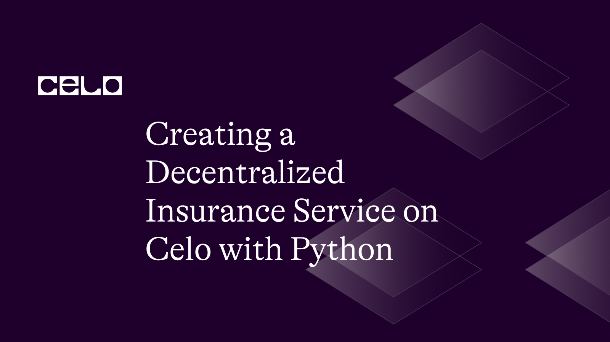

## Introduction

Decentralized insurance is a new application of blockchain technology that provides a transparent and unreliable risk management method. With an emphasis on allowing decentralized finance (DeFi) applications, Celo is a blockchain platform created to promote financial inclusion for everyone. In this tutorial, we'll look at how to use Python and the web3.py module to build a decentralized insurance service on Celo.

## Prerequisites

You need to have a fundamental understanding of Python programming and be conversant with the ideas of blockchain technology and smart contracts in order to continue this lesson. Additionally, you have to have a Celo wallet and some Testnet CELO coins available.

## Requirements

You'll need the following for this tutorial:

- Your system must have Python 3.7 or higher installed.
- The web3.py library was set up (using pip, type pip install web3).
- Some testnet CELO tokens in a Celo wallet, such as Valora or the Celo Extension Wallet.
- Access to a node in the Alfajores testnet, a Celo testnet

### Step 1: Setting up a development environment

First, we need to set up a development environment for our decentralized Insurance service.

On your terminal, use the following commands to create a new folder for your project:

```bash
mkdir decentralized-insurance
cd decentralized-insurance
```

In your new directory, Let's now establish and activate a virtual Python environment.

```bash
python3 -m venv env
source env/bin/activate
```

Next, Install the following libraries using pip, the Python package manager:

```bash
pip install python-dotenv web3 py-solc-x
```

### Step 2: Create the Smart Contract

Next, let’s create a new file called `Insurance.sol` in the root directory of our project which would contain the smart contract logic of the Insurance service, and paste the following code:

Insurance.sol

```solidity
// SPDX-License-Identifier: MIT

pragma solidity ^0.8.0;

contract Insurance {
    address payable public insurer;
    address payable public policyholder;
    uint public premium;
    uint public coverage;
    uint public expiration;
    bool public isExpired;
    bool public isClaimed;

    constructor(
        address payable _insurer,
        address payable _policyholder,
        uint _premium,
        uint _coverage,
        uint _expiration
    ) {
        insurer = _insurer;
        policyholder = _policyholder;
        premium = _premium;
        coverage = _coverage;
        expiration = _expiration;
    }

    function payPremium() public payable {
        require(msg.value == premium, "Incorrect premium amount");
    }

    function expirePolicy() public {
        require(msg.sender == insurer, "Only insurer can expire the policy");
        isExpired = true;
    }

    function claim() public {
        require(msg.sender == policyholder, "Only policyholder can claim");
        require(!isExpired, "Policy has expired");
        require(!isClaimed, "Claim has already been made");
        isClaimed = true;
        policyholder.transfer(coverage);
    }
}
```

This smart contract illustrates a fundamental insurance plan that a policyholder could get from an insurer. The policy includes a premium, a dollar amount of coverage, and an expiration date. If the policy is still in effect and hasn't previously been used, the policyholder may claim the coverage amount. The insurance may be terminated by the insurer before its expiration date.

### Step 3: Compile and deploy the Smart Contract

Next, let’s create a script that we can use to compile and deploy the Insurance smart contract. Create a new file called `[deploy.py](http://deploy.py)` and paste the following code:

deploy.py

```python
import json
import os
from web3 import Web3
from dotenv import load_dotenv
from solcx import compile_standard, install_solc

load_dotenv()

# Install specific Solidity compiler version
install_solc("0.8.0")

# Set up web3 connection
provider_url = os.environ.get("CELO_PROVIDER_URL")
w3 = Web3(Web3.HTTPProvider(provider_url))
assert w3.is_connected(), "Not connected to a Celo node"

# Set deployer account and private key
deployer = os.environ.get("CELO_DEPLOYER_ADDRESS")
private_key = os.environ.get("INSURER_PRIVATE_KEY")

with open("Insurance.sol", "r") as file:
    contract_source_code = file.read()

# Compile the contract
compiled_sol = compile_standard({
    "language": "Solidity",
    "sources": {
        "Insurance.sol": {
            "content": contract_source_code
        }
    },
    "settings": {
        "outputSelection": {
            "*": {
                "*": ["metadata", "evm.bytecode", "evm.sourceMap"]
            }
        }
    }
})

# Extract the contract data
contract_data = compiled_sol['contracts']['Insurance.sol']['Insurance']
bytecode = contract_data['evm']['bytecode']['object']
abi = json.loads(contract_data['metadata'])['output']['abi']

# Deploy the contract
nonce = w3.eth.get_transaction_count(deployer)
transaction = {
    'nonce': nonce,
    'gas': 2000000,
    'gasPrice': w3.eth.gas_price,
    'data': bytecode,
}
signed_txn = w3.eth.account.sign_transaction(transaction, private_key)
transaction_hash = w3.eth.send_raw_transaction(signed_txn.rawTransaction)
transaction_receipt = w3.eth.wait_for_transaction_receipt(transaction_hash)

# Get the contract address
contract_address = transaction_receipt['contractAddress']
print(f"Contract deployed at address: {contract_address}")
```

The sample explains how to use Python and the web3.py package to deploy a smart contract on the Celo blockchain. The code's primary steps are:

- The `os`, `json`, `Web3`, and `solcx` Python modules are required to be imported.
- Utilize `load_dotenv()` to load the environment variables from a `.env` file.
- With the help of the Web3 class from the web3.py library, establish a connection to a Celo node.
- Utilize `install_solc()` to install the Solidity compiler version 0.8.0.
- Read the source code for the smart contract from the file, then put it in a variable.
- Extract the contract data, including the bytecode and ABI, by compiling the smart contract using the compile_standard() function from the Solcx library.
- Set up the contract's bytecode, nonce, gas, and gas Price as well as the transaction data.
- Using the Web3 library's `sign_transaction()` method, sign the transaction using the deployer account's private key, and then use `send_raw_transaction()` to send it to the Celo network.
- Utilize the Web3 library's `wait_for_transaction_receipt()` function to wait for the transaction to be mined before retrieving the transaction receipt.
- Take the transaction receipt that contains the contract address and print it on the console.

Overall, the code serves as a starting point for creating more complicated apps on the Celo platform and offers a simple example of how to deploy a smart contract on the Celo blockchain using Python and the web3.py module.

On your terminal, run the following command to execute the code:

```bash
python deploy.py
```


### Step 3: Interact with the Insurance smart contract

Next, create a new file called `[client.py](http://client.py)` which would contain logic that interacts with our insurance smart contract.

First, let’s make sure we are connected to a Celo Testnet RPC node:

client.py

```python
import os
from web3 import Web3
from web3.middleware import geth_poa_middleware
from dotenv import load_dotenv
import deploy

load_dotenv()

CELO_RPC_URL = os.environ.get("CELO_PROVIDER_URL")
INSURER_PRIVATE_KEY = os.environ.get("INSURER_PRIVATE_KEY")
POLICYHOLDER_PRIVATE_KEY = os.environ.get("POLICYHOLDER_PRIVATE_KEY")
deployer_address = os.getenv("CELO_DEPLOYER_ADDRESS")

# Connect to the Celo Alfajores testnet
w3 = Web3(Web3.HTTPProvider(CELO_RPC_URL))
w3.middleware_onion.inject(geth_poa_middleware, layer=0)

# initialize account
insurer_account = w3.eth.account.from_key(INSURER_PRIVATE_KEY)
policyholder_account = w3.eth.account.from_key(POLICYHOLDER_PRIVATE_KEY)

print(f"Connected to Celo network. Insurer Address: {insurer_account.address}")
print(
    f"Connected to Celo network. Policyholder Address: {policyholder_account.address}")

contract_address = deploy.contract_address
abi = deploy.abi
bytecode = deploy.bytecode

# Get contract instance
insurance_contract = w3.eth.contract(
    bytecode=bytecode, abi=abi, address=contract_address)
```

Your CELO_RPC_URL, INSURER_PRIVATE_KEY, CELO_DEPLOYER_ADDRESS, and POLICYHOLDER_PRIVATE_KEY should be stored in a `.env` file in the root directory of your project.

Next, let’s add a script that allows us to create a new insurance policy, pay a premium, expire the policy, and file a claim.

client.py

```python
import os
from web3 import Web3
from web3.middleware import geth_poa_middleware
from dotenv import load_dotenv
import deploy

load_dotenv()

CELO_RPC_URL = os.environ.get("CELO_PROVIDER_URL")
INSURER_PRIVATE_KEY = os.environ.get("INSURER_PRIVATE_KEY")
POLICYHOLDER_PRIVATE_KEY = os.environ.get("POLICYHOLDER_PRIVATE_KEY")
deployer_address = os.getenv("CELO_DEPLOYER_ADDRESS")

# Connect to the Celo Alfajores testnet
w3 = Web3(Web3.HTTPProvider(CELO_RPC_URL))
w3.middleware_onion.inject(geth_poa_middleware, layer=0)

# initialize account
insurer_account = w3.eth.account.from_key(INSURER_PRIVATE_KEY)
policyholder_account = w3.eth.account.from_key(POLICYHOLDER_PRIVATE_KEY)

print(f"Connected to Celo network. Insurer Address: {insurer_account.address}")
print(
    f"Connected to Celo network. Policyholder Address: {policyholder_account.address}")

contract_address = deploy.contract_address
abi = deploy.abi
bytecode = deploy.bytecode

# Get contract instance
insurance_contract = w3.eth.contract(
    bytecode=bytecode, abi=abi, address=contract_address)

def purchase_insurance():
    tx_hash = insurance_contract.constructor(
        insurer_account.address,
        policyholder_account.address,
        w3.to_wei(0.002, "ether"),  # premium amount (0.002 CELO)
        w3.to_wei(0.001, "ether"),  # coverage amount (0.001 CELO)
        # expiration date (30 days from now)
        w3.eth.get_block("latest")["timestamp"] + 60 * 60 * 24 * 30
    ).build_transaction({
        "from": insurer_account.address,
        "gas": 3000000,
        "gasPrice": w3.to_wei("10", "gwei"),
        "nonce": w3.eth.get_transaction_count(deployer_address),
    })

    signed_tx = w3.eth.account.sign_transaction(
        tx_hash, private_key=insurer_account.key)

    tx_receipt = w3.eth.send_raw_transaction(signed_tx.rawTransaction)

    tx_hash = w3.to_hex(tx_receipt)
    tx_receipt = w3.eth.wait_for_transaction_receipt(tx_hash)

    insurance_address = tx_receipt["contractAddress"]
    insurance = w3.eth.contract(address=insurance_address, abi=abi)

    return insurance

def pay_premium(insurance):
    gas_estimate = insurance.functions.payPremium().estimate_gas(
        {"from": policyholder_account.address,
            "value": w3.to_wei(0.002, "ether")}
    )
    txn = insurance.functions.payPremium().build_transaction({
        "from": policyholder_account.address,
        "value": w3.to_wei(0.002, "ether"),
        "gas": gas_estimate * 2,
        "gasPrice": w3.to_wei("20", "gwei"),
        "nonce": w3.eth.get_transaction_count(policyholder_account.address, 'pending')
    })
    # Sign and send the transaction
    signed_transaction = w3.eth.account.sign_transaction(
        txn, private_key=policyholder_account.key)
    tx_hash = w3.eth.send_raw_transaction(
        signed_transaction.rawTransaction)

    print(f"Policyholder paid premium for policy {insurance.address}")

    return tx_hash

def expire_policy(insurance):

    txn = insurance.functions.expirePolicy().build_transaction({
        "from": insurer_account.address,
        "gas": 3000000,
        "gasPrice": w3.to_wei("10", "gwei"),
        "nonce": w3.eth.get_transaction_count(insurer_account.address)
    })
    # Sign and send the transaction
    signed_transaction = w3.eth.account.sign_transaction(
        txn, private_key=insurer_account.key)
    tx_hash = w3.eth.send_raw_transaction(
        signed_transaction.rawTransaction)

    print(f"Policy expired for contract at address {insurance.address}")

    return tx_hash

def file_claim(insurance):

    txn = insurance.functions.claim().build_transaction({
        "from": policyholder_account.address,
        "gas": 3000000,
        "gasPrice": w3.to_wei("10", "gwei"),
        "nonce": w3.eth.get_transaction_count(policyholder_account.address),
        "value": 0  # set transaction value to 0
    })
    # Sign and send the transaction
    signed_transaction = w3.eth.account.sign_transaction(
        txn, private_key=policyholder_account.key)
    tx_hash = w3.eth.send_raw_transaction(
        signed_transaction.rawTransaction)

    print(f"File claim for contract at address {insurance.address}")

    return tx_hash

def main():
    insurance = purchase_insurance()
    pay_premium(insurance)
    expire_policy(insurance)
    file_claim(insurance)

if __name__ == '__main__':
    main()
```

This code implements a decentralized insurance smart contract application that enables a policyholder to buy insurance, pay the premium, and, if necessary, submit a claim. The Web3.py library is utilized by the application to communicate with the Celo blockchain network.

The code first connects to the Celo Alfajores Testnet and loads environment variables. The next step is to initialize the accounts for the insurer and policyholder. After that, it reads the deploy.py file to get the contract address, ABI, and bytecode.

An instance of the insurance contract is returned by the `purchase_insurance()` function, which also deploys the insurance contract to the network. It generates a transaction that refers to the contract's constructor and includes the policyholder's address, the insurer's address, the premium amount, and the coverage amount. It then submits the transaction to the network, signs it using the insurer's private key, and watches for the transaction receipt. Once the transaction has been successfully completed, it fetches the contract address and returns a contract instance.

The policyholder can pay the premium for the bought insurance by using the `pay_premium()` function. It generates a transaction that calls the `payPremium()` function of the insurance contract with the policyholder's address and premium amount. It also calculates the amount of gas needed for the transaction. It submits the transaction to the network, signs it using the policyholder's private key, and then waits for the transaction receipt. It prints a confirmation message and returns the transaction hash once the transaction has been approved.

By executing the `expirePolicy()` method of the insurance contract, the `expire_policy()` function enables the insurer to terminate the policy. The insurer's private key is used to sign a transaction that is created with their address as the address. After waiting for the transaction receipt and printing a confirmation message, it transfers the transaction to the network and returns the transaction hash.

By contacting the `claim()` method of the insurance contract, the `file_claim()` function enables the policyholder to submit a claim. It generates a transaction using the address of the policyholder and signs it using their private key. To show that there is no ether being sent, it changes the transaction value to 0. After waiting for the transaction receipt and printing a confirmation message, it transfers the transaction to the network and returns the transaction hash.

The `purchase_insurance()`, `pay_premium()`, `expire_policy()`, and `file_claim()` procedures are sequentially executed by the main() function to complete the insurance process.

Finally, run the following command on your terminal to see the output of our code:

```bash
python clienty.py
```


## Conclusion

In this lesson, we looked at how to use Python and the web3.py module to build a decentralized insurance service on Celo. After building and deploying a straightforward insurance policy smart contract to the blockchain, we showed how to communicate with it using Python and a Celo Testnet node. For programmers wishing to create decentralized insurance apps using the Celo platform, this tutorial serves as a starting point.

## Next Steps

- Examine more complex capabilities of the web3.py library with the Celo blockchain, like event logging and filtering.
- Include extra features in the smart contract, such as a claims procedure or a return policy.
- Create a user interface for the decentralized insurance service so that people may communicate with it.
- Test the program on the Mainnet of the Celo blockchain or another one.

## About the Author

I am a Software engineer with an interest in Blockchain technology. I love picking up new technologies and sharing my knowledge as I learn as a way of giving back to the tech community. You can find one on [GitHub](https://github.com/Divine572) and [Twitter](https://twitter.com/divine_finix).

## References

- [Celo Developer Documentation](https://docs.celo.org/developer-guide/)
- [web3.py Documentation](https://web3py.readthedocs.io/)
- [Solidity Documentation](https://docs.soliditylang.org/en/v0.8.9/)
- [Github repo](https://github.com/Divine572/decentralized-insurance)
