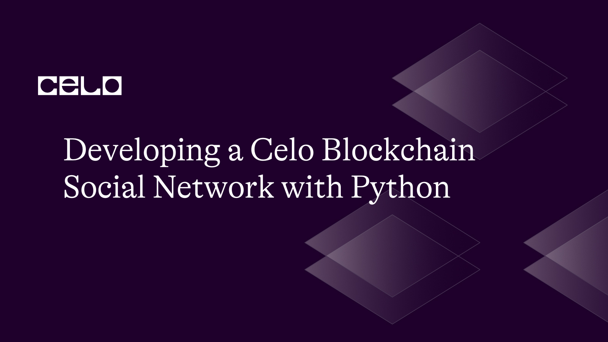

## Introduction

A blockchain technology called Celo makes quick, safe, and inexpensive transactions possible. Decentralized apps (dApps) can be developed using its built-in smart contract language, Solidity, and deployed on the Celo blockchain. In this tutorial, we'll use the Python programming language and the Celo blockchain to create a social network application.

## Prerequisites

We need to set up a few things before we start writing code.

- You need a Celo wallet in order to interact with the Celo blockchain. A mobile wallet like Valora or the official Celo web wallet can be used to build one.
- You will require a Testnet account because we will be installing our social network on the Celo Testnet. With the official Celo Testnet faucet, you can make one.
- Basic programming skills in Python
- Familiarity with smart contracts and the Celo blockchain

## Requirements

You'll need the following before you can begin this tutorial:

- Python 3.6 and above.
- Installed library for [Web3.py.](https://web3py.readthedocs.io/en/stable/#)
- A Testnet wallet for the cryptocurrency Celo (you can get them from the [Celo Faucet](https://faucet.celo.org/alfajores)).
- Solidity: A programming language for writing smart contracts that run on the Celo blockchain

### Step 1: Setting up the environment

First, we need to set up an environment to build our social network and we can do this by creating a virtual environment.

On your terminal, use the following commands to create a new folder for your project:

```bash
mkdir social-network
cd social-network
```

In your new directory, create a Python virtual environment and activate it with the following commands:

```bash
python3 -m venv venv
source venv/bin/activate
```

Next, Install the following libraries using pip, the Python package manager:

```bash
pip install web3 py-solc-x python-dotenv
```

### Step 2: Creating the smart contract

Next, we need to create the smart contract for our decentralized social network dApp. Create a new file called `SocialNetwork.sol` in the root directory of your project and paste the following code:

SocialNetwork.sol

```solidity
// SPDX-License-Identifier: MIT

pragma solidity ^0.8.0;

contract SocialNetwork {
    struct Post {
        address author;
        string content;
        uint timestamp;
    }
    
    mapping(address => string) public users;
    Post[] public posts;
    
    function createUser(string memory username) public {
        users[msg.sender] = username;
    }
    
    function createPost(string memory content) public {
        require(bytes(users[msg.sender]).length != 0, 'User does not exist');
        Post memory post = Post(msg.sender, content, block.timestamp);
        posts.push(post);
    }
    
    function getPost(uint index) public view returns (address, string memory, uint) {
        require(index < posts.length, 'Invalid post index');
        Post memory post = posts[index];
        return (post.author, post.content, post.timestamp);
    }
    
    function getPostCount() public view returns (uint) {
        return posts.length;
    }
}
```

A SocialNetwork contract that stores users and their postings is defined by this smart contract. Each post includes the timestamp, author address, and text. The contract includes functions to add a new user, add a new post, get the overall number of posts, and retrieve a post by index.

### Step 3: Compiling and deploying the smart contract

Next, we need to compile and deploy the smart contract and this can be done using the `py-solc-x` library. Create a new file called `[deploy.py](http://deploy.py)` and paste the following code:

deploy.py

```solidity
import json
import os
from web3 import Web3
from dotenv import load_dotenv
from solcx import compile_standard, install_solc

load_dotenv()

# Install specific Solidity compiler version
install_solc("0.8.0")

# Set up web3 connection
provider_url = os.environ.get("CELO_PROVIDER_URL")
w3 = Web3(Web3.HTTPProvider(provider_url))
assert w3.is_connected(), "Not connected to a Celo node"

# Set deployer account and private key
deployer = os.environ.get("CELO_DEPLOYER_ADDRESS")
private_key = os.environ.get("CELO_DEPLOYER_PRIVATE_KEY")

with open("SocialNetwork.sol", "r") as file:
    contract_source_code = file.read()

# Compile the contract
compiled_sol = compile_standard({
    "language": "Solidity",
    "sources": {
        "SocialNetwork.sol": {
            "content": contract_source_code
        }
    },
    "settings": {
        "outputSelection": {
            "*": {
                "*": ["metadata", "evm.bytecode", "evm.sourceMap"]
            }
        }
    }
})

# Extract the contract data
contract_data = compiled_sol['contracts']['SocialNetwork.sol']['SocialNetwork']
bytecode = contract_data['evm']['bytecode']['object']
abi = json.loads(contract_data['metadata'])['output']['abi']

# Deploy the contract
nonce = w3.eth.get_transaction_count(deployer)
transaction = {
    'nonce': nonce,
    'gas': 2000000,
    'gasPrice': w3.eth.gas_price,
    'data': bytecode,
}
signed_txn = w3.eth.account.sign_transaction(transaction, private_key)
transaction_hash = w3.eth.send_raw_transaction(signed_txn.rawTransaction)
transaction_receipt = w3.eth.wait_for_transaction_receipt(transaction_hash)

# Get the contract address
contract_address = transaction_receipt['contractAddress']
print(f"Contract deployed at address: {contract_address}")
```

Using the web3.py module, this Python script builds and publishes a Solidity smart contract on the Celo blockchain. It takes a file containing the Solidity code, builds it using `solcx`, then uses web3.py to deploy it to the Celo blockchain before returning the contract address. In order to prevent sensitive data from entering the code, such as the provider URL, deployer address, and private key, the script also loads environment variables using `dotenv`. Overall, this script automates the process of deploying a Solidity smart contract to the Celo blockchain and gives users of the Celo platform an easy way to deploy and interact with decentralized applications.

Run the following command on your terminal to compile and deploy the smart contract to the Celo blockchain:

```bash
python deploy.py
```


### Step 4: Interacting with the smart contract

Next, let’s write a script that interacts with the deployed contract. Create a new file called `[client.py](http://client.py)` and paste the following code:

client.py

```python
import os
from web3 import Web3, HTTPProvider
from web3.middleware import geth_poa_middleware
from dotenv import load_dotenv

import deploy

# Load environment variables
load_dotenv()

# Set up web3 connection
provider_url = os.getenv("CELO_PROVIDER_URL")
w3 = Web3(HTTPProvider(provider_url))
assert w3.is_connected(), "Not connected to a Celo node"

# Add PoA middleware to web3.py instance
w3.middleware_onion.inject(geth_poa_middleware, layer=0)

# Get contract ABI and address
abi = deploy.abi
contract_address = deploy.contract_address

# Initialize account
deployer_address = os.getenv("CELO_DEPLOYER_ADDRESS")
private_key = os.getenv("CELO_DEPLOYER_PRIVATE_KEY")
# account = w3.eth.account.from_key(private_key)

# Set default gas price and gas limit
default_gas_limit = 2000000

# Get contract instance
contract = w3.eth.contract(address=contract_address, abi=abi)

def create_user(username):
    # Estimate gas required for the transaction
    gas_estimate = contract.functions.createUser(
        username).estimate_gas({"from": deployer_address})

    # Set gas price and limit
    gas_price = w3.eth.gas_price
    gas_limit = min(gas_estimate * 2, default_gas_limit)

    # Build transaction object
    txn = contract.functions.createUser(username).build_transaction({
        "from": deployer_address,
        "nonce": w3.eth.get_transaction_count(deployer_address),
        "gasPrice": gas_price,
        "gas": gas_limit
    })

    # Sign and send transaction
    signed_txn = w3.eth.account.sign_transaction(txn, private_key=private_key)
    tx_hash = w3.eth.send_raw_transaction(signed_txn.rawTransaction)

    # Wait for transaction confirmation and return receipt
    receipt = w3.eth.wait_for_transaction_receipt(tx_hash)
    return receipt

def create_post(content):
    # Estimate gas required for the transaction
    gas_estimate = contract.functions.createPost(
        content).estimate_gas({"from": deployer_address})

    # Set gas price and limit
    gas_price = w3.eth.gas_price
    gas_limit = min(gas_estimate * 2, default_gas_limit)

    # Build transaction object
    txn = contract.functions.createPost(content).build_transaction({
        "from": deployer_address,
        "nonce": w3.eth.get_transaction_count(deployer_address),
        "gasPrice": gas_price,
        "gas": gas_limit
    })

    # Sign and send transaction
    signed_txn = w3.eth.account.sign_transaction(txn, private_key=private_key)
    tx_hash = w3.eth.send_raw_transaction(signed_txn.rawTransaction)

    # Wait for transaction confirmation and return receipt
    receipt = w3.eth.wait_for_transaction_receipt(tx_hash)
    return receipt

def get_post(index):
    try:
        post = contract.functions.getPost(index).call()
        return post
    except Exception as e:
        print(f"Error retrieving post: {e}")
        return None

def get_post_count():
    try:
        post_count = contract.functions.getPostCount().call()
        return post_count
    except Exception as e:
        print(f"Error retrieving post count: {e}")
        return None

# Test functions
def main():
    try:
        # Test create_user and create_post functions
        create_user("Gloria")
        create_user("John")
        create_post("Hello, world!")
        create_post("This is my first post.")
        # Test get_post and get_post_count functions
        post_count = get_post_count()
        if post_count is not None:
            print("Total number of posts:", post_count)

            for i in range(post_count):
                post = get_post(i)
                if post is not None:
                    print("Post", i + 1)
                    print("Author:", post[0])
                    print("Content:", post[1])
                    print("Timestamp:", post[2])

    except Exception as e:
        print(f"Error: {e}")

if __name__ == '__main__':
    main()
```

This script communicates with a deployed smart contract on the network, adds Proof of Authority (PoA) middleware, and establishes a connection to a Celo node using a web3.py instance. Sensitive data including the provider URL, contract ABI, contract address, and deployer account information are stored using environment variables.

The `create_user()` and `create_post()` procedures produce a transaction object, signs it with the deployer's private key, and transmit it to the network. They also establish the gas price and limit for their respective transactions. After the transaction has been verified, they return the receipt.

The `get_post()` and `get_post_count()` functions return to the user the post data and post count that have been retrieved from the contract, respectively.

To verify the operation of the smart contract, the `main()` method invokes the `create_user()`, `create_post()`, `get_post()`, and `get_post_count()` functions.

If an exception happens, the script is built to handle it and send helpful messages to the console. It sets the gas price to the current average network gas price or higher, whichever is lower, and utilizes a default gas limit of 2,000,000. This script communicates with a deployed smart contract on the network, adds Proof of Authority (PoA) middleware, and establishes a connection to a Celo node using a web3.py instance. Sensitive data including the provider URL, contract ABI, contract address, and deployer account information are stored using environment variables.

On your terminal, run the following command to see the output of the script:


## Conclusion

In this lesson, we used the Python programming language and the Celo blockchain to create a social network application. To communicate with the Celo blockchain, we used web3.py, and Solidity was used to create the smart contract that governs the dApp. We can build decentralized applications that operate on the Celo blockchain and offer quick, secure, and affordable transactions by using these tools and frameworks.

## Next Steps

This guide is merely the first step toward creating a decentralized social network. Here are some ideas for subsequent actions:

- Provide new features, such as the ability to follow other users, comment on posts, and favorite postings.
- To make the software more interesting, build a [user interface](https://docs.celo.org/blog/tutorials/designing-a-user-friendly-celo-dapp-a-beginners-guide-to-uiux).
- Further security elements should be included, such as [user data encryption and two-factor authentication](https://docs.celo.org/blog/tutorials/implementing-multi-factor-authentication-on-celos-blockchain-using-smart-contracts).
- Install the application on the [Celo Mainnet](https://docs.celo.org/developer/deploy) to make it widely available.

## About the Author
I am a React frontend developer with over 3 years of experience building for the web, a web3 developer, and a technical writer. Visit my [GitHub profile](https://github.com/J0shcodes) to see some of the projects I have worked on and currently working on.

## References

1. Celo Documentation - **[https://docs.celo.org/](https://docs.celo.org/)**
2. web3.py Documentation - **[https://web3py.readthedocs.io/en/stable/](https://web3py.readthedocs.io/en/stable/)**
3. Solidity Documentation - **[https://docs.soliditylang.org/en/v0.8.9/](https://docs.soliditylang.org/en/v0.8.9/)**
4. [Github repo](https://github.com/Divine572/social-network)
