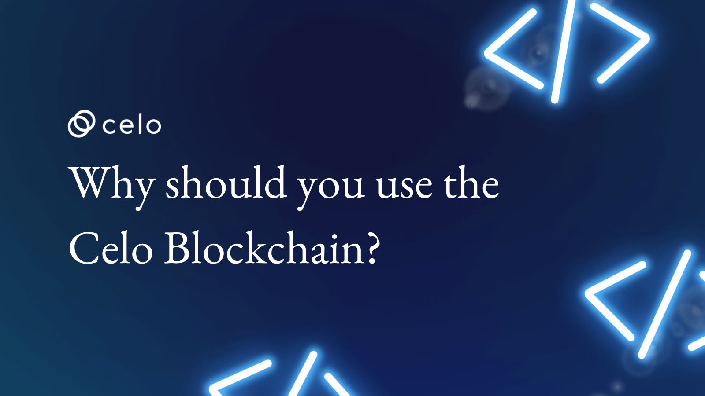

Despite claims of causing long-awaited changes in the financial system, several blockchain projects have failed to attain global mainstream adoption.

To bring blockchain technology to the masses, the [Celo protocol](https://celo.org/) has taken a WhatsApp-style approach, making it possible for anyone with a phone number to join this ground-breaking network.

It's fine if you've only recently heard of **Celo**. This article dives into what Celo is and why you should start using it immediately.

## What is Celo?

Let's begin by taking a look at what **Celo** is.

**Celo** is a blockchain platform that allows people worldwide to conduct simple cryptocurrency transactions using their mobile phones. This opens up a whole new world of financial products that can be accessed via mobile devices. The protocol also lets you pay transaction/gas fees in any currency, which are then split evenly among the 100 validators on the network.

You may not understand the full value of what Celo intends to achieve until you discover that Blockchain alone consumes more than 1% of America's electrical production. Blockchain's general acceptance as a payment method has been limited by its high energy demand and technological difficulties for the average individual. But with Celo, only a phone number is needed as a public key for cryptocurrency transactions.

The Celo Platform, like other DeFi chains, facilitates the development of smart contracts and can host DApps. This has marked it as a mobile-based Web 3 hub for many.

CELO, its native token, and the stablecoins cUSD, cEUR, and cREAL are its primary tokens.

Its native token, the **CELO**, was initially called CGLD after its first deployment. Even though the name has changed, there may still be references to Celo Gold in the code base. The token is the platform's native asset and the driving force behind the growth of the CELO ecosystem and the blockchain. As a CELO holder, you can vote in governance polls, stake with validators, and earn incentive tokens.

## How Does Celo Work?

How does the **CELO network**, which uses the same blockchain technology as others, allow PayPal-like Web3 transactions through mobile phones while using so little power?

Well, this is because the Celo platform is driven by three primary systems:

The light clients, full nodes, and validator nodes

### Light Clients

These main programs, such as Celo's mobile wallet, run on users' mobile phones and serve as transaction initiators.

### Full Nodes

These act as intermediaries between validator nodes and light clients. They take in incoming transactions and relay them to validator nodes for verification. A portion of the fees goes to the full nodes servicing the light client.

### Validator Nodes

These are the network's backbone, responsible for creating new blocks and verifying transactions or staking. At any given time, there are 100 validators, and the only requirement to join their ranks and earn voting rights is to stake 10,000 CELO. Each validator is given a slice of the block reward for every successful transaction and block creation.

## What is Special About Celo?

Celo is, of course, a layer one chain, but with layer one and two chains appearing faster than we can blink, we have to wonder what makes Celo unique.

Which begs the question of why anyone would construct a smart contract on it. Why should I invest in it or use it to facilitate my transactions?

You will find six reasons below, describing why this is the next big thing.

### First Network for the Smartphone Users

This is Celo's main feature and the reason for its popularity. Imagine a world where you can send money to a friend's phone number even if they haven't set up a wallet. By the time they do, they’ll meet it there.

That's because it employs a lightweight identification protocol that works even on mobile, letting users process validations and payments on their phones. Customers' phone numbers also serve as the transaction public keys.

On top of that, it has a mobile wallet (Valora) that syncs with the peer-to-peer network using the ultra-fast light client protocol.

### Multiple Stablecoins

Any network that wants to compete in the blockchain industry on any level needs stablecoins that DeFi developers and potential investors can use on the platform.

The Celo development team planned for this and built it into the system from the beginning. After launching with cUSD as its primary stablecoin, Celo has since added cEUR and cREAL to the mix.

[The three stablecoins are backed by Ethereum](https://messari.io/asset/celo-dollar/profile), the CELO token, and other coins such as BTC and USDT. Through a hybrid of the crypto collateralization model and seigniorage shares, Celo has created decentralized stablecoins that are easily corrected for any price fluctuations away from the peg.

The three stablecoins are compatible with both centralized and decentralized apps, with transaction times as fast as 5 seconds. To top it all off, the total gas fees for all transactions come to less than one cent. With stablecoins, you can easily avoid volatility. And because we consider stable tokens as a hybrid kind of algorithmic and collateralized , they are easier to keep pegged.

### Gas Payment in Multiple Currencies

Like in every chain, gas fees are an integral part of the transaction and validation process. But unlike Ethereum, where gas fees must be paid in ether, Celo's gas fees can be paid in various cryptocurrencies in addition to the network's native CELO coin. You can pay using cUSD or one of several whitelisted ERC 20 tokens.

Customers can provide the address of the currency they want to use to pay for gas in the feeCurrency field of a transaction request. If you leave this field blank, the native CELO will be used automatically.

### Intuitive Customer Interface

Celo adopted address-based encryption instead of regular cryptographic address payments.
When you use Celo, all you need is a phone number, which is converted into a secure address, allowing you to send money to anyone on your contact list.

Anyone who can easily interact with Web2 Fintech company interfaces would have an easy time using the Celo Platform.

The Celo Platform also functions as an escrow where funds can be held until they are claimed. To illustrate, if you want to send money to someone who hasn't yet signed up for the service, you can send it to their phone number; once they've signed up, they'll be able to access the funds.

### Easy to Scale

If you're a developer looking to avoid the same load problems you've encountered multiple times, there's no point in sticking to other chains. This is because Celo enables rapid block processing and validation, reducing transaction time and maintaining a strong network of validators.

To do this, it uses a pBFT-based PoS consensus protocol that can process transactions in a record five (5) seconds at high TPS rates and without the possibility of transaction reversal. Yet, the high TPS rates come without the baggage of a longer sync time and going through a series of chain sizes.

The robust security around the network prevents chain forks. Armed with this, your users will easily trust your project.

### An Ecosystem for All

Celo is not just another blockchain. The network was designed to operate its applications and tokens, as well as host dApps and DeFi options powered by the CELO token.

But much more than that is its compatibility with the Ethereum Application Layer, which is responsible for many of its achievements.

This EVM compatibility ensures that working on CELO projects as a developer will be an Ethereum offshoot. Being a true layer 1 chain, your tools and signature schedule work perfectly well here.

Using its lightweight client, you can quickly move assets from other chains to Celo.

### How Does Celo Keep Spammers From Harvesting Users' Contact Information?

This is a common question that people ask a lot about Celo. Celo knows that phone numbers are used as public keys, which puts its users at risk of being hacked by harvesters. As a result, Celo uses a one-way hash of the address instead of the address itself as a workaround, which they [outline in their whitepaper](https://celo.org/papers/whitepaper). Adding pepper to a text before it is hashed to increase its entropy works like a charm and makes it more difficult to reverse the hash.

## Conclusion

The Celo protocol is the social payment platform of the future for mobile phone users. With the built-in address-based encryption protocol, all a user needs is their phone number, which doubles as the protocol's public key.

Considering its social impact, ultra-lightweight transaction system, and low and multicurrency gas fees, it is no surprise that adoption will increase at all levels.

## About the Author

Adefolalu Adegboyega is a freelance content writer specializing in creating blogs and articles about blockchain, DeFi, NFTs, and cryptocurrencies for the emerging Web3 sector.

# References

Celo Whitepapers

- [https://twitter.com/marek_/status/1524109003403366400](https://twitter.com/marek_/status/1524109003403366400)
- [Celo docs](https://docs.celo.org/learn/why-celo)
- [Ledger](https://www.ledger.com/academy/what-is-celo-blockchain)
- [Marek | Celo Blog](https://link.medium.com/yu6l63Jmxvb)
- [Celo Developers](https://celo.org/developers)
- [CrytoTicker](https://cryptoticker.io/en/celo-blockchain-10x-investors/)
