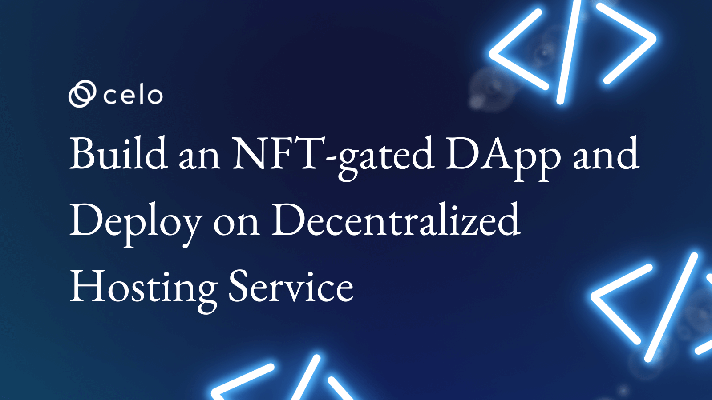
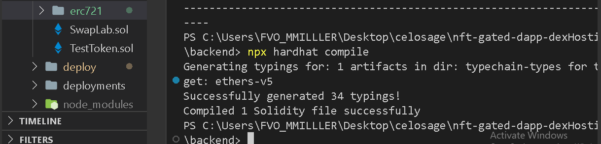
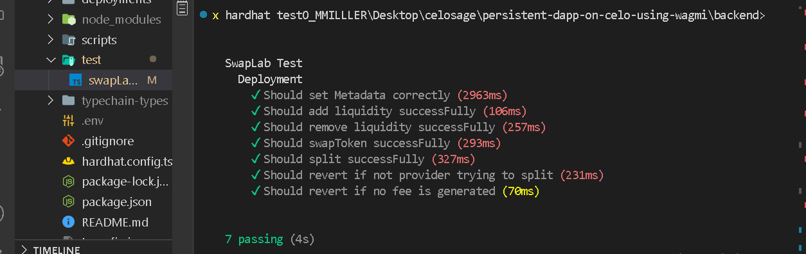
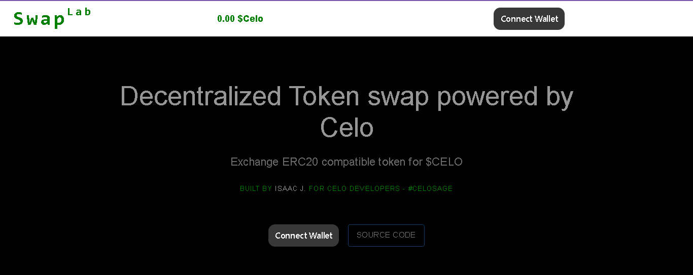
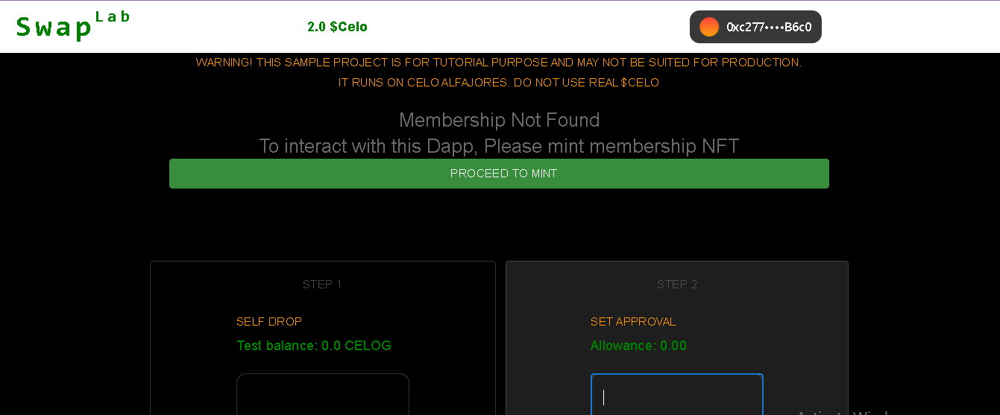
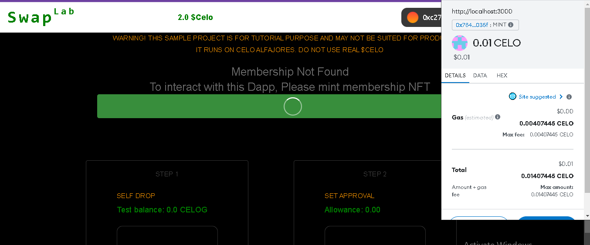
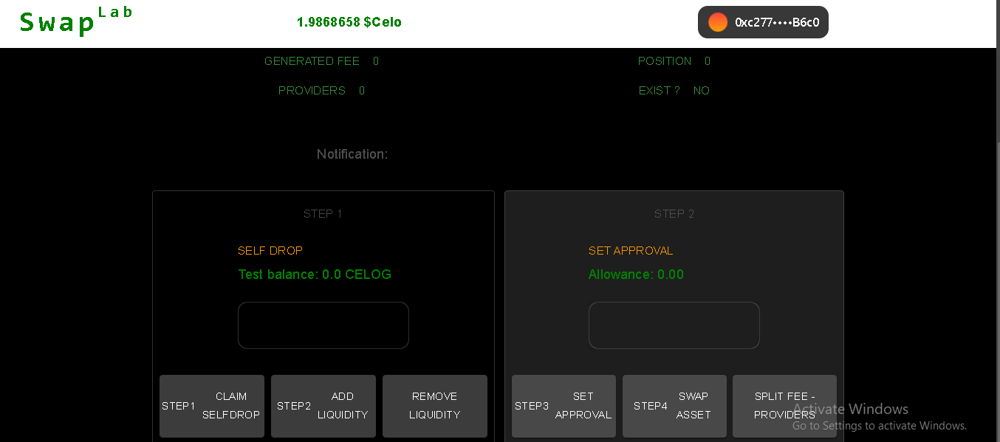

## Introduction

In the past years, Non-Fungible Token category have gained popularity through myriad of use cases and inventions infuenced by virtual machines. The NFT industry witnesses liquidity counting to billions of dollars, and this is only made possible through people's creativity and sustainable blockchain networks such as Celo. As a web3 developer, as important as your role is, so you need to understand NFT use cases to build a disruptive Dapp.

## Prerequisites​

As an extenstion of the previous tutorial on **[how to build a persistent Dapp on Celo using wagmi](https://docs.celo.org/blog/tutorials/build-a-feature-rich-persistent-dapp-on-celo-using-wagmi)**, I have prepared this tutorial to depict one of the many NFT use cases which we will deploy to Celo's testnet - _Alfajores_. We will also build a user interface using Nextjs, react and materialUi to interact with the Dapp. The frontend will be deployed on Fauna - _a decentralized hosting service_. This is an advance tutorial, and it reqiures that you have a sound background in the following areas.

- Smart contract development using solidity.
- You should know Javascript and considerable knowledge of typescript.
- For how to use hardhat for smart contract development, please refer to **[this](https://docs.celo.org/blog/tutorials/getting-started-on-celo-with-hardhat)** and **[this](https://docs.celo.org/blog/tutorials/advance-hardhat-configuration-on-celo-using-plugins)**.

## Requirements​

Before you proceed, please install the following tools:

- An editor. VSCode recommended.
- NodeJs version >=14.0.0. I use version 18.12.1
- [Setup and configure hardhat](https://docs.celo.org/blog/tutorials/advance-hardhat-configuration-on-celo-using-plugins).

**What we are building**

We will build a decentralized application for swapping ERC20 tokens to $Celo. Detail can be found in the **[readme](https://github.com/bobeu/nft-gated-dapp-dexHosting/README.md)**.

The dApp will be in two parts. The first part is the smart contract that houses the Dapp's logic while the other manages the user interface. 

**Smart contracts**

- Clone project or use it as a template, then clone to your machine.

```bash
git clone https://github.com/bobeu/persistent-dapp-on-celo-using-wagmi.git
```
- Navigate to the root folder

```bash
cd persistent-dapp-on-celo-using-wagmi/backend
```

- Install dependencies

```bash
yarn install
```
All files in the contract folder remain intact as we extend its functionalities by adding a non-fungible asset using the Openzeppelin library. 

## contracts

- `SwapLab.sol` contains the main contract functions for adding and removing liquidity, and swapping Celo's ERC20 token for $Celo coin.

- `TestToken.sol` has the asset code we will use for testing the swap contract.

- Add a new folder named `erc721` under the contract folder.
  - The OZ's ERC721 contract module with path `@openzeppelin/contracts/interfaces/IERC721.sol` is a standard interface for interacting with a non-fungible tokens on the blockchain. But we need to extend its reach so we can mint a membership token with ability to cancel it. On the frontend, we'll require that users own a membership nft before they can interact with the Dapp.

  - `contracts/interfaces/IERC721Extended.sol`

  ```js
  // SPDX-License-Identifier: MIT
  pragma solidity  0.8.17;

  import "@openzeppelin/contracts/interfaces/IERC721.sol";
  import "@openzeppelin/contracts/interfaces/IERC721Receiver.sol";
  import "@openzeppelin/contracts/interfaces/IERC721Metadata.sol";

  interface IERC721Extended is IERC721, IERC721Receiver, IERC721Metadata {
    function burn(uint256 tokenId) external returns(bool);
    function mint() external payable returns(bool);
  }
  ```

  - You would notice I included separately `ERC721.sol` and `ERC721Pausable.sol`. Sometimes, this is my way of doing things. You don't have to do it my way. We can simply import the circuit-breaker extended `ERC721Pausable.sol` in the final token deployable file.

  - `Membership.sol`
    - Import and inherit `Pausable.sol` and `Ownable.sol` from the openzeppelin modules.

    - Previously, we declared two addtional function interfaces. It then becomes imperative that we implement these functions in the current file. Here, we implement the `mint` and `burn` functions.

    - The `notZeroAddress` modifier ensures that the target addresses is not empty.

    - NFTs are unique properties or elements of a collection. They could share similar parent i.e be part of a collection but are never thesame in property. To introduce uniqueness, we generate a new NFT by increasing `tokenId`. 

    - Users addresses that have minted the membership nft are kept in `isMember` storage for reference purpose. This method ensures that no address can mint twice.

    - To encourage users to mint our membership nft, we have lowered the swapping fee. But they need to pay a tiny amount in order to have their membership minted. This method have introduced a vulnerability that we need to guard against. A user could mint and trasnfer or resell to other users. We do not want this to happen. To prevent the occurrence of such event, we will intercept to place a barrier in the internal function by overriding `_transfer()` so that no one is able to transfer membership. The right to do this is given to the owner.

    - We effcted the circuit breaker by implementing the `pause` and `unpause` functions.
    

  ```js
  // SPDX-License-Identifier: Unlicense

  pragma solidity  0.8.17;

  import "./ERC721Pausable.sol";
  import "@openzeppelin/contracts/access/Ownable.sol";

  contract Membership is Ownable, ERC721Pausable {
    error ZeroAddress(address);

    uint public tokenId;
    mapping (address => bool) public isMember;

    /**
      @dev Enforces that @param target - must not be empty
            address.
    */
    modifier notZeroAddress(address target) {
      if(target == address(0)) revert ZeroAddress(target);
      _;
    }

    //Initialize state vars
    constructor () ERC721("SwapLab User", "SLU") {
    }

    receive() external payable {
      revert();
    }

    /**
      @notice Mint Membership NFT
            Owner's privilege.
              o 'TokenId' must not have been minted before now.
                o No user can have more than one membership NFT.
    */
    function mint() public payable returns(bool) {
      require(msg.value >= 1e16 wei, "Insufficient value");
      require(!isMember[_msgSender()], "Already a user");
      isMember[_msgSender()] = true;
      tokenId ++;
      uint tk = tokenId;
      (bool sent,) = owner().call{value: msg.value}('');
      require(sent, "Failed");
      _safeMint(_msgSender(), tk);
      _approve(_msgSender(), tk);

      return true;
    }

    ///@dev Burns 'tokenId' Note - Owner's privilege
    function burn(uint _tokenId) external onlyOwner returns(bool) {
      _burn(_tokenId);

      return true;
    } 

    /** See ERC721 _transfer. Membership is not transferable*/
    function _transfer(address from, address to, uint256 _tokenId ) internal override
    {
      require(paused() || _msgSender() == owner(), "Tansfer not alloowed");
      super._transfer(from, to, _tokenId);
    }

    /** @dev Halts contract execution */
    function pause() public onlyOwner 
    {
      _pause();
    }

    /** @dev Continues contract execution */
    function unpause() public onlyOwner 
    {
      _unpause();
    }

    function onERC721Received(
        address operator,
        address from,
        uint256 _tokenId,
        bytes calldata data
    ) external override returns (bytes4) {}
  }
  ```

- Compile

```bash
npx hardhat compile
```


- Testing

I have modifies the test file to ensure that no function runs unless the nft balance of the calling account is greater than zero.

```bash
npx hardhat test
```



- Deploy

The hardhat config file already has the right configuration to enable us deploy to the Celo testnet.

```bash
yarn deploy
```

Deployment artifacts is saved in `deployments` folder.

## Frontend

This project is NFT-gated hence users will be denied access to the Dapp interactive page unless they already owned our nft. We will build an intelligence that automatically detects if users own membership nft otherwise we'll ask them to mint first before granting them access.


Exit the current directory into the root folder and install the dependencies: 

```bash
cd ..
cd frontend
yarn install
```

The project uses wagmi to manage the Dapp. To know how to set up wagmi project, please refer to the **[previous tutorial](https://docs.celo.org/blog/tutorials/build-a-feature-rich-persistent-dapp-on-celo-using-wagmi)**.

We are going to modify the `components/App` directory. There are only two files in this folder - `CardComponent.tsx` and `index.tsx`. Both the landing and interactive pages are contained in the index file. We need to separate them so users can be routed to the landing page if their wallet is not activated otherwise they're shown the interactive view but will be disbled if no membership is detected. Let's separate the file as follows:

- `components/App/Home/index.tsx`

We will transfer the content of the landing page into this file.

```ts
import React from 'react'
import Button from '@mui/material/Button';
import Stack from '@mui/material/Stack';
import Box from '@mui/material/Box';
import Typography from '@mui/material/Typography';
import Container from '@mui/material/Container';
import Link from '@mui/material/Link';
import { ConnectKitButton } from 'connectkit';

export function Home () {
  return (
    <main >
      <Box sx={{ bgcolor: '', pt: 16, pb: 6, }}>
        <Container maxWidth="md">
          <Typography
            component="h1"
            variant="h3"
            align="center"
            color="rgb(150, 150, 150)"
            gutterBottom
            mt={2}
          >
            Decentralized Token swap powered by Celo
          </Typography>
          <Typography variant="h6" align="center" color="rgba(150, 150, 150, 0.7)" paragraph>
            Exchange ERC20 compatible token for $CELO
          </Typography>
          <Typography variant="overline" align="center" color="green" paragraph>
            Built by <span style={{color: 'rgba(170, 170, 170, 0.9)'}}><a href="https://github.com/bobeu/">Isaac J.</a></span> for Celo developers - #celosage
          </Typography>
          <Stack sx={{ pt: 4 }} direction="row" spacing={2} justifyContent="center">
          <ConnectKitButton />
          <Button variant="outlined">
            <Link color="rgba(150, 150, 150, 0.8)" sx={{
              '&:hover': {
                border: 'rgba(100, 100, 100, 0.5)'
              }
            }} href="https://github.com/bobeu/feature-rich-persistent-dapp-on-celo-using-wagmi" underline='none'>Source code</Link> 
          </Button>
        </Stack>
        
      </Container>
    </Box>
  </main>
  )
}
```
- `components/App/Mint/index.tsx`

In this file, we mint new membership nft for new users. In the useEffect function, we watch for user's balance and compare if greater than zero to authenticate them.

The component renders a button that calls `handleMint` when clicked. It the operation is successful, it will be hidden and the Dapp component is rendered. 

```ts
import Stack from '@mui/material/Stack';
import Button from '@mui/material/Button';
import Typography from '@mui/material//Typography';
import Container from '@mui/material//Container';
import React from 'react';
import { useAccount } from 'wagmi';
import runContractFunc from '../../apis';
import { SignUprops } from '../../../interfaces';
import { Spinner } from '../../Spinner';
import green from '@mui/material/colors/green';

const FUNC_NAME = 'mint';

export function Mint (props: SignUprops) {
  const [ loading, setLoading ] = React.useState<boolean>(false);
  const { handleClick, setauth, isUser } = props;
  const { address, isConnected, connector } = useAccount();

  React.useEffect(() => {
    const endtask = new AbortController();
    const refetchData = async() => {
      if(connector) {
        const provider = await connector?.getProvider();
        if(isConnected) {
          if(provider) {
            const bal = await runContractFunc({
              account: address,
              providerOrSigner: provider,
              functionName: 'nftBalance'
            });
            if(bal.balanceOrAllowance.toString() > '0') {
              setauth();
            }
          }
        }
      }
    }
    refetchData();
    return () => endtask.abort();
  }, [isConnected]);

  const handleMint = async() => {
    setLoading(true);
    await handleClick(FUNC_NAME);
    setLoading(false);
  }

  return (
    <Container maxWidth={isUser ? 'xs' : 'md'}>
      <Stack>
        <Typography component='button' variant='h5' color='rgba(150, 150, 150, 0.7)'>Membership Not Found</Typography>
        <Typography component='button' variant='h5' color='rgba(150, 150, 150, 0.7)'>To interact with this Dapp, Please mint membership NFT</Typography>
        <Button
          fullWidth
          variant='contained'
          endIcon={loading? <Spinner color={'white'} /> : 'Proceed to mint'}
          onClick={handleMint}
          sx={{
            background:green[700],
            color: 'whitesmoke',
            '&:hover': {
              background: 'rgba(150, 150, 150, 0.3)',
            }
          }}
        />
      </Stack>
    </Container>
  )
}
```

- `components/App/AppProtected/index.tsx`

  Move the content of the previous `App/index.tsx` into this file and make the following changes.

  - import the `Mint` component. By default, if user does not own the $SLU nft, the button components are disabled until otherwise proven true. 

  ```ts
  import getContractData from '../../apis/contractdata';
  import { Mint } from '../Mint';
  ```

  - We dynamically hide some components based on the outcome of the `Mint` component using `getOpacity` function. Every child components in the `Stack` component are blurred out when `getOpacity` returned 0 vice versa. 

  ```ts
    const getOpacity = () => {
      return isUser? 1 : 0
    }
  ```

  - Add additional case block to the switch statement in `afterTrx` function that watches for 'mint' to be true. The nft balance from the resulting operation from `handleClik` is extracted and passed to `afterTrx`. Then in the `mint` case, we set the pass by calling `setauth` if the balance is greater than zero. In your Dapp, you'd want to handle it in a manner that allows your Dapp read from a collection of nfts, and you can filter out the current user.

  ```ts
    const afterTrx = (x:string, result: Result) => {
    switch (x) {
      case 'swap':
        setData(result.data);
        setAllowance(result.balanceOrAllowance);
        break;
      case 'approve':
        setAllowance(result.balanceOrAllowance);
        break;
      case 'clearAllowance':
        setAllowance(result.balanceOrAllowance);
        break;
      case 'addLiquidity':
        setData(result.data);
        break;
      case 'removeLiquidity':
        setData(result.data);
        break;
      case 'mint':
        if(result.balanceOrAllowance.toString() > '0') setauth();
        break;
      default:
        setData(result.data);
        break;
    }      
  }
  ```

- Since we reduced the swap fee in the SwapLab contract, we will effect it on the frontend. A place to do that is in the `handleClick` function. 

Reset the conditional statement that checks if functionName equals `'swap'`, then set swap fee in variable `value` to 1e14 wei equavalent to 0.0001 Celo.

Set additional statement to check for `'mint'` function, then set `value` to 1e16 wei. For the first time that the mint function is executed for the current user, if no error is thrown, then a membership nft is minted for the user. We can then set the pass to true.  

```ts
    const handleClick = async(functionName: string, flag?:boolean) => {
    if(flag && functionName !== 'approve' && amount === 0) return alert('Please enter amount');
    if(functionName === 'addLiquidity') {
      if(value === '0') return alert('Please set value');
    }
    setLoading(true);
    const provider = await connector?.getProvider();
    
    try {
      const amt = BigNumber(amount);
      let val = ethers.utils.parseEther(value);
      if(functionName === 'swap') val = ethers.utils.parseEther('0.0001');
      if(functionName === 'mint') val = ethers.utils.parseEther('0.01');
      console.log("Val", val.toString())
      const result = await runContractFunc({
        functionName: functionName,
        providerOrSigner: provider,
        amount: ethers.utils.hexValue(ethers.utils.parseUnits(amt.toString())),
        cancelLoading: () => setLoading(false),
        account: address,
        value: val
      });
      if(functionName === 'mint') setAuth(true);
      afterTrx(functionName, result);
   
    } catch (error: any) {
      if(error) {
        const result = await runContractFunc({
          functionName: 'getData',
          providerOrSigner: provider,
        })
        afterTrx('getData', result);
        setError(error?.reason || error?.data.message || error?.message);
        setLoading(false);
        console.log("Error1", error?.reason|| error?.message || error?.data.message);
      }
    }
  }
```

Now, let's run the program. In the frontend directory, run

```bash yarn
yarn run dev
```

```bash npm
npm run dev
```

If everything work correctly, you should have the view as follows.

- Landing page



- Page after provider is activated but membership nft not yet minted, and the buttons are disabled.



- Transaction is being broadcasted.



- After nft is minted.




## Deploying to decentralized hosting service


The complete code for this tutorial can be found **[here](https://github.com/bobeu/feature-rich-persistent-dapp-on-celo-using-wagmi)**.

Visit to interact with this dapp [here](https://persistent-dapp-on-celo-using-wagmi.vercel.app/).

## Conclusion​

What we have learned so far:

- Writing, compiling, testing, and deploying smart contracts using hardhat.
- How to install, set up, and use wagmi.
- How to build a simple frontend and connect the backend.
- Manage your dApp using wagmi.

## What next?
​
Are you a developer? thinking of launching your own project on Celo blockchain? We have dozens of materials and tutorials to help you get started. Pay a visit to **[Celo documentation](https://docs.celo.org/tutorials)**

## About the Author​

**Isaac Jesse** , aka _Bobelr_ is a smart contract/Web3 developer. He has been in the field since 2018, worked as an ambassador with several projects like Algorand and so on as a content producer. He has also contributed to Web3 projects as a developer.

## References​

- [Celo developers resources](https://docs.celo.org/developer/)
- [Source code](https://github.com/bobeu/feature-rich-persistent-dapp-on-celo-using-wagmi)
- [Wagmi doc](https://wagmi.sh/)

