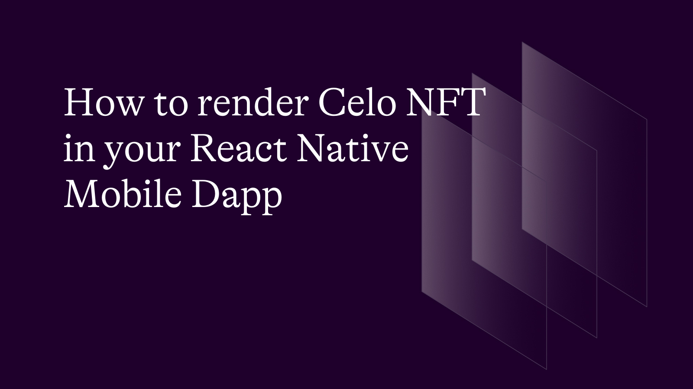

## Introduction

This article is a step-by-step guide on how to render Celo NFT metadata on React Native (Expo) mobile dapps using center-multichain API, Expo(cli) and wallet connect SDK, wallet connect sdk will help connect with wallets containing celo NFT's on our mobile phone. wallets such as Metamask, Valora, TrustWallet, rainbow wallet etc.

## Prerequisites

- [React Native(Expo cli)](https://reactnative.dev/docs/environment-setup?guide=quickstart&package-manager=npm) Expo is an open-source platform for making universal native apps for Android, iOS, and the web with JavaScript and React.
  Center provides the NFT metadata endpoints [Center NFT API's](https://center.app/signup/) and WalletConnect is an open source protocol for connecting decentralised applications to mobile wallets [wallet connect SDK ](https://docs.walletconnect.com/1.0/quick-start/dapps/react-native).

- Set up your mobile development environment

- N.B you should have installed andriod studio and Xcode on your machine ( for Mac OS users only)

1. Install Node.js and NPM (Node Package Manager) on your machine.

2. Install the Expo cli on your machine.

3. Install any wallet of your choice on your mobile device or on your iOS/Android simulator

Complete Code here on Github link [Celo Mobile NFT](https://github.com/Victorvikson1996/celo-mobile-Nft)

## Creating your project using React Native(Expo cli)

Make sure you have `Expo cli` installed globally in your machine [Here](https://docs.expo.dev/archive/expo-cli/)

We are making use of React and Javascript in our project

In your project directory terminal run the following command.

`npx create-expo-app celoNft` you can also chose the project name of your choice.

## Installing Wallet Connect SDK

After creating your React Native(Expo) project go ahead and install wallet Connect SDK. Kindly follow the instructions provided in the official docs. [Here](https://docs.walletconnect.com/1.0/quick-start/dapps/react-native)


## Setting up Center NFT API dashboard to get API Key

Login to the center using the URL [Here](https://center.app/api/account/`)

1. Create a new project, give it a name and generate your API key `XXXX-1234-XXXX`
2. Head over to the documentation dashboard, scroll down to the `getNFTs` endpoint using the url [Here](https://docs.center.dev/reference/alchemy-getnfts)

3. Switch the network to `celo-mainnet` and withMetadata to `true`


## Setting up Wallet connect SDK

Inside your `App.js` file import `WalletConnectProvider` and `AsyncStorage` this way. make sure they are installed in your projects.

```javascript
import { WalletConnectProvider } from "@walletconnect/react-native-dapp/dist/providers";
import AsyncStorage from "@react-native-async-storage/async-storage";
```

The rest of the file will look like this:

```javascript
const SCHEME_FROM_APP_JSON = "connectDapp";

export default function App() {
  return (
    <WalletConnectProvider
      redirectUrl={
        Platform.OS === "web"
          ? window.location.origin
          : `${SCHEME_FROM_APP_JSON}://`
      }
      storageOptions={{
        asyncStorage: AsyncStorage,
      }}
    >
      <Navigation />
    </WalletConnectProvider>
  );
}
```

## Building your mobile Dapp

Lets Start building our mobile Dapp

Go over to your `utils` or `API` folder inside the project directory in `fetchNFT.js` write a function to fetch NFTs with the metadata, the function looks this way.

```javascript
function replaceUri(uri) {
  if (uri.startsWith("ipfs")) {
    return uri.replace("ipfs://", "https://ipfs.io/ipfs/");
  }

  return uri;
}

async function fetchImageUri(uri) {
  if (!uri) {
    return "";
  }
  if (!uri.startsWith("ar")) {
    const replacedUri = await replaceUri(uri);

    return replacedUri;
  } else {
    return "";
  }
}

async function fetchCeloNft(account) {
  const apiKey = "XXX-145-XXX";

  const apiUrl = `https://api.center.dev/experimental/alchemy/celo-mainnet/nft/v2/${apiKey}/getNFTs?owner=${account}&withMetadata=true`;

  const response = await fetch(apiUrl);
  const data = await response.json();
  console.log(data?.ownedNfts);
  const nftList = await data?.ownedNfts?.map(async (nft) => {
    const imageUrl = await fetchImageUri(nft.metadata.image);
    const title = nft.title;

    const nftNewFormat = {
      imageUrl: imageUrl || "",
      title: nft.title,
      desc: nft.description,
      tokenId: nft.id.tokenId,
      contractAddress: nft.contract.address,
    };

    return nftNewFormat;
  });
  return Promise.all(nftList);
}

export async function FetchNft(account) {
  const nftList = [];

  const celoNfts = await fetchCeloNft(account);
  nftList.push(...celoNfts);

  return nftList;
}
```

Inside the components folder create Button component and call it `Button.js` go ahead and import React and other components from React-Native

```javascript
import React from "react";
import {
  View,
  Text,
  StyleSheet,
  TouchableOpacity,
  Pressable,
} from "react-native";
```

---

The Button Components and props with look this way

```javascript
const Button = ({ title, onPress }) => {
  return (
    <TouchableOpacity
      onPress={onPress}
      activeOpacity={0.9}
      style={{
        height: 55,
        width: "50%",
        backgroundColor: COLORS.green,
        marginVertical: 20,
        justifyContent: "center",
        alignItems: "center",
        borderRadius: 10,
      }}
      testID="button"
    >
      <Text style={{ color: COLORS.white, fontWeight: "bold", fontSize: 18 }}>
        {title}
      </Text>
    </TouchableOpacity>
  );
};
```

Inside the your screens folder create `ConnectButtonScreen`

```javascript
import { View, StyleSheet } from "react-native";
import React from "react";
import Button from "../components/Button/Button";
import { useNavigation } from "@react-navigation/native";
```

```javascript
const ConnectButtonScreen = () => {
  const navigation = useNavigation();

  const connectWallet = () => {
    navigation.navigate("NFT");
  };

  return (
    <View style={styles.container}>
      <Button onPress={connectWallet} title="Connect" />
    </View>
  );
};

const styles = StyleSheet.create({
  container: {
    flex: 1,
    backgroundColor: "#fff",
    alignItems: "center",
    justifyContent: "center",
  },
});
```

The ConnectButton Screen will look like this


## Building NFT Screen

Inside NftScreen.js we need to create a component to render our NFT metadata which is `GalleryItem`

```javascript
const GalleryItem = ({ item }) => {
  return (
    <Pressable style={styles.galleryItem_container}>
      <View style={styles.img_container}>
        <Image source={{ uri: item.imageUrl }} style={styles.nftImg} />
      </View>
      <View style={styles.txt_container}>
        <Text style={styles.txt1}>{item?.title}</Text>
        <Text style={styles.txt2}>{item?.desc}</Text>
      </View>
    </Pressable>
  );
};
```

The rest of the code will look something like this:

```javascript
import {
  View,
  Text,
  StyleSheet,
  FlatList,
  Dimensions,
  Alert,
  ActivityIndicator,
  Pressable,
  Image,
  TouchableOpacity,
  SafeAreaView,
  Button,
} from "react-native";

import React, { useState, useEffect } from "react";
import { useNavigation } from "@react-navigation/native";
import { useWalletConnect } from "@walletconnect/react-native-dapp";
import { FetchNft } from "../../utils/fetchNft";
```

```javascript
const galleryItemWidth = Dimensions.get("screen").width / 3;

const shortenAddress = (address) => {
  return `${address.slice(0, 6)}...${address.slice(
    address.length - 4,
    address.length
  )}`;
};

const renderGalleryItem = ({ item }) => <GalleryItem item={item} />;

const NftScreen = () => {
  const [accounts, setAccounts] = useState([]);
  const [message, setMessage] = useState("");
  const [nfts, setNfts] = useState([]);
  const [loading, setLoading] = useState(true);

  const nav = useNavigation();

  let addr = accounts.length ? shortenAddress(accounts?.[0]) : "Wallet Id";

  // connec

  const connector = useWalletConnect();

  const onErr = () => {
    Alert.alert("Error", "You cancelled the connection request", [
      { text: "OK", onPress: () => nav.goBack() },
    ]);
  };

  const connectWallet = async () => {
    setLoading(true);
    connector
      .connect()
      .then((res) => {
        let acnts = res.accounts;
        if (acnts.length) {
          setAccounts(acnts);
          getNfts(acnts[0]);
        }
      })
      .catch((err) => {
        setLoading(false);
        console.log("nftGallery.js > connectWallet > err: ", err);
        onErr();
      });
  };

  useEffect(() => {
    connectWallet();
  }, []);

  const getNfts = async (acnt) => {
    try {
      const theNfts = await FetchNft(acnt);
      setNfts(theNfts);
      setLoading(false);
    } catch (err) {
      setLoading(false);
      console.log("nftGallery.js > getNfts > err: ", err);
    }
  };

  const _disconnectWalletAlert = () => {
    Alert.alert(
      "Are you sure you want to disconnect your wallet?",
      "you can always reconnect later.",
      [
        {
          text: "Cancel",
          onPress: () => console.log("Cancel Pressed"),
          style: "cancel",
        },
        { text: "OK", onPress: () => _disconnectWallet() },
      ]
    );
  };

  return (
    <SafeAreaView style={styles.container}>
      <TouchableOpacity style={{ flexDirection: "row" }}>
        <Text>{"My Gallery"} </Text>
      </TouchableOpacity>
      <View style={styles.outer_wallet_container}>
        <View style={styles.wallet_container} level={"2"}>
          <Text style={styles.wallet_id}>💎 {addr}</Text>
        </View>
      </View>
      {loading ? (
        <ActivityIndicator color="black" size={40} />
      ) : (
        <FlatList
          data={nfts || []}
          renderItem={renderGalleryItem}
          keyExtractor={(item, idx) => idx.toString()}
          numColumns={3}
          style={{ paddingHorizontal: 10 }}
          ListFooterComponent={
            <Button
              title="Disconnect"
              onPress={() => connector.killSession() && nav.goBack()}
            />
          }
        />
      )}
    </SafeAreaView>
  );
};

const styles = StyleSheet.create({
  container: {
    flex: 1,
    paddingTop: 61,
  },
  outer_wallet_container: {
    alignSelf: "stretch",
    alignItems: "center",
    marginTop: 40,
    marginBottom: 10,
  },
  wallet_container: {
    backgroundColor: "rgba(255, 255, 255, 0.2)",
    borderRadius: 30,
    paddingHorizontal: 15,
    paddingVertical: 7,
  },
  wallet_id: {
    fontSize: 12,
  },
  galleryItem_container: {
    flex: 1,
    maxWidth: "33.3%",
    padding: 3,
  },
  img_container: {
    backgroundColor: "#7980A4",
    flex: 1,
    height: galleryItemWidth - 12,
  },
  nftImg: {
    flex: 1,
    height: galleryItemWidth - 12,
  },
  txt_container: {
    paddingTop: 8,
    paddingBottom: 15,
  },
  txt1: {
    fontSize: 13,
    color: COLORS.black,
    fontWeight: "700",
  },
  txt2: {
    fontSize: 7,
    color: COLORS.black,
  },
});

export default NftScreen;
```

### Running your Mobile Dapp

1. Go ahead and run `expo  start`,
2. On your terminal open your iOS or Android simulator or `Expo GO` you can install [Here](https://apps.apple.com/app/apple-store/id982107779)
3. Open your Dapp and connect to any wallet of your choice containing celo NFT.

4. The wallet connect sdk will allow you choose any wallet of your choice and it will redner NFT's on Celo-Mainnet. make sure you're connected to wallet having NFT's on Celo-mainnet


Go ahead and console the nft.metadata the response you look like this:

```json
Array [
  Object {
    "contract": Object {
      "address": "0x376f5039Df4e9E9c864185d8FaBad4f04A7E394A",
    },
    "contractMetadata": Object {
      "name": "Celo Domain Name",
      "symbol": "CDN",
      "tokenType": "ERC721",
      "totalSupply": "317610",
    },
    "description": "This is a soul name!",
    "id": Object {
      "tokenId": "0x0000000000000000000000000000000000000000000000000000000000035203",
      "tokenMetadata": Object {
        "tokenType": "ERC721",
      },
    },
    "media": Object {
      "gateway": "https://arweave.net/K4hWyCSHNX4VdzGZUhvDYzmcFaYfvGJ2ozgWUUbFptg",
      "raw": "https://arweave.net/K4hWyCSHNX4VdzGZUhvDYzmcFaYfvGJ2ozgWUUbFptg",
    },
    "metadata": Object {
      "attributes": Array [
        Object {
          "trait_type": "Character Set",
          "value": "Letters",
        },
        Object {
          "trait_type": "Category",
          "value": "Quintuple",
        },
        Object {
          "trait_type": "Rarity",
          "value": "Community",
        },
      ],
      "description": "This is a soul name!",
      "external_url": "https://arweave.net/K4hWyCSHNX4VdzGZUhvDYzmcFaYfvGJ2ozgWUUbFptg",
      "image": "https://arweave.net/K4hWyCSHNX4VdzGZUhvDYzmcFaYfvGJ2ozgWUUbFptg",
      "name": "AkuChukwuDebelu.celo",
    },
    "timeLastUpdated": "2023-03-28T19:58:27Z",
    "title": "AkuChukwuDebelu.celo",
    "tokenUri": Object {
      "gateway": "https://arweave.net/DyF58sEaxWMm0EN-rdEMxTSUuS9nHONsh-pPA0ywOGw",
      "raw": "https://arweave.net/DyF58sEaxWMm0EN-rdEMxTSUuS9nHONsh-pPA0ywOGw",
    },
  },
]
AkuChukwuDebelu.celo
```

### NFT Rendered in Our Dapp

- The NFT Rendered in our Dapp will look something like this


Nice job! You just created a mobile Dapp that renders celo NFT

## Conclusion

In this article, you learnt use center NFT API, React-Native(Expo cli) and Wallet Connect Sdk to render Celo NFT in your mobile Dapp for both iOS and Android.

## Reference

[Expo cli](https://reactnative.dev/docs/environment-setup?guide=quickstart&package-manager=npm)

[Wallet Connect](https://docs.walletconnect.com/1.0/quick-start/dapps/react-native)

[celo-NFT](https://github.com/Victorvikson1996/celo-mobile-Nft)

## About the Author

Ezea Victor is a React Native Mobile Engineer and a technical writer passionate about building mobile Dapps.

[Linkedin](https://www.linkedin.com/in/ezea-victor-abbb19173/) | [Twitter](https://twitter.com/victorebukaezea) | [Hashnode](https://ezeavictor.hashnode.dev/) | [DEV](https://dev.to/victorezea)
