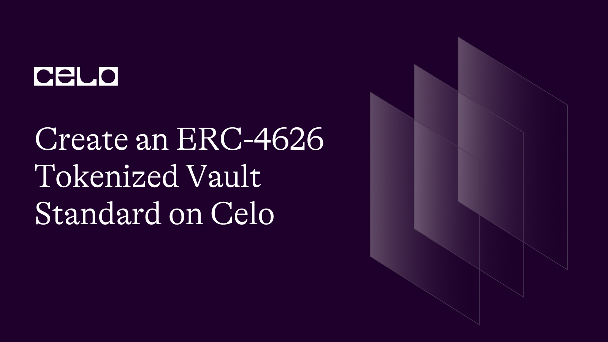

## Introduction​

The ERC-4626 is a standard protocol for tokenized vaults that represents shares of yield-bearing tokens and builds on the ERC-20 token standard. It provides a standard API for tokenized yield-bearing vaults representing shares of a single underlying ERC-20 token. ERC-4626 also outlines an optional extension for tokenized vaults utilizing ERC-20, offering basic functionality for depositing and withdrawing tokens and reading balances1.

In this article, you will write the smart contract code for the ERC-4626 tokenized vault standard and deploy it on the Celo network. Finally, you will also test the functionality of our ERC-4626 tokenized vault1.

## Prerequisites​

To write an ERC-4626 Tokenized Vault Standard on Celo, you need to have the following requirements:

Remix: Remix is a web-based integrated development environment (IDE) for writing, testing, and deploying smart contracts. You can use it to write the ERC-4626 Tokenized Vault Standard code. You can access Remix by visiting the [Remix](https://remix.ethereum.org/#optimize=false&runs=200&evmVersion=null&version=soljson-v0.8.7+commit.e28d00a7.js) website.

Solidity: Solidity is a contract-oriented programming language for writing smart contracts. It is used to write the code for the ERC-4626 Tokenized Vault Standard. You can learn more about Solidity on the Solidity documentation website.

## The ERC-4626 Token Standard

The ERC-4626 Tokenized Vault Standard is a new Ethereum token standard that could solve a long-standing problem in the DeFi world: the mishmash of design types for tokens that print money. The ERC-4626 will provide a new pattern for projects like Aave or Yearn to develop assets incentivizing users. ERC-4626 is the tokenized vault standard.

ERC-4626 in yield-bearing vaults will lower the integration effort and unlock access to yield in various applications with little specialized effort from developers by creating more consistent and robust implementation patterns.

The main benefit of ERC-4626 is that it standardizes tokenized vaults to make protocol integration easier and less prone to error. Since there is a common standard that you can integrate, there is no actual need to build separate adapters any longer. In a nutshell, it quickens development, with composability is at its peak.

## Using the ERC4626 Token contract

- ERC-4626 allows users to withdraw more than their initial payment over time based on the amount of profits the vault has generated. As an extension of ERC-20, ERC-4626 implements the following: Deposits and withdrawals, Vault balances, Interfaces, Events, and History of ERC-46262.

- ERC-4626 is a new Ethereum token standard that could solve a long-standing problem in the DeFi world: the mishmash of design types for tokens that print money. The ERC-4626 will provide a new pattern for projects like Aave or Yearn to develop assets incentivizing users. ERC-4626 is the tokenized vault standard.

- ERC4626 in yield-bearing vaults will lower the integration effort and unlock access to yield in various applications with little specialized effort from developers by creating more consistent and robust implementation patterns.

- Deposits and withdrawals: ERC-4626 allows users to deposit and withdraw funds from the tokenized vaults.

- Vault balances: ERC-4626 provides a way to check the balance of the tokenized vaults.

- Interfaces: ERC-4626 provides a standard interface for interacting with tokenized vaults.

- Events: ERC-4626 provides a way to track events that occur within the tokenized vaults.

- History of ERC-4626: ERC-4626 provides a way to track the history of the tokenized vaults.

- Lowering the integration effort: ERC-4626 in yield-bearing vaults will lower the integration effort and unlock access to yield in various applications with little specialized effort from developers by creating more consistent and robust implementation patterns.

- Unlocking access to yield in various applications with little specialized effort from developers by creating more consistent and robust implementation patterns: ERC-4626 provides a way to unlock access to yield in various applications with little specialized effort from developers by creating more consistent and robust implementation patterns.

## Writing the ERC-4626 Token Contract

1. Head over to the Remix solidity compiler using this link-[Remix IDE](https://remix.ethereum.org/)
2. Go to the contract folder, a new folder, `MyToken.sol`
3. Copy and paste the smart contract code below inside the `MyToken.sol` file.

```solidity
//SPDX-License-Identifier: MIT
pragma solidity ^0.8.7;


interface IERC4626 {
    function totalAssets() external view returns (uint256);
}
import "@openzeppelin/contracts/token/ERC20/ERC20.sol";


// create your contract and inherit the your imports
contract MyToken is IERC4626, ERC20 {
    // create an event that will the withdraw and deposit function
    event Deposit(address caller, uint256 amt);
    event Withdraw(
        address caller,
        address receiver,
        uint256 amt,
        uint256 shares
    );


    // create your variables and immutables
    ERC20 public immutable asset;


    // a mapping that checks if a user has deposited
    mapping(address => uint256) shareHolder;


    constructor(
        ERC20 _underlying,
        string memory _name,
        string memory _symbol
    ) ERC20(_name, _symbol) {
        asset = _underlying;
    }


    // a deposit function that receives assets from users
    function deposit(uint256 assets) public {
        // checks that the deposit is higher than 0
        require(assets > 0, "Deposit less than Zero");


        asset.transferFrom(msg.sender, address(this), assets);
        // checks the value of assets the holder has
        shareHolder[msg.sender] += assets;
        // mints the reciept(shares)
        _mint(msg.sender, assets);


        emit Deposit(msg.sender, assets);
    }


    // returns total number of assets
    function totalAssets() public view override returns (uint256) {
        return asset.balanceOf(address(this));
    }


    // users to return shares and get thier token back before they can withdraw, and requiers that the user has a deposit
    function redeem(
        uint256 shares,
        address receiver
    ) internal returns (uint256 assets) {
        require(shareHolder[msg.sender] > 0, "Not a share holder");
        shareHolder[msg.sender] -= shares;


        uint256 per = (10 * shares) / 100;


        _burn(msg.sender, shares);


        assets = shares + per;


        emit Withdraw(msg.sender, receiver, assets, per);
        return assets;
    }


    // allow msg.sender to withdraw his deposit plus interest


    function withdraw(uint256 shares, address receiver) public {
        uint256 payout = redeem(shares, receiver);
        asset.transfer(receiver, payout);
    }
}
```

## Conclusion​

ERC4626 token contracts allow developers to create asset-backed tokens that provide holders with transparency and security. By implementing the IERC4626 interface and adding necessary functions and events, developers can tokenize assets and create new investment opportunities that were previously only available to institutional investors.

Asset-backed tokens have various use cases, including fractional ownership of assets, providing liquidity for illiquid assets, and facilitating cross-border payments. As blockchain technology continues to gain mainstream adoption, ERC4626 token contracts become increasingly popular, and the decentralized nature of the Ethereum blockchain provides developers with an efficient and secure way to tokenize assets. Overall, ERC4626 token contracts provide an innovative solution that benefits investors and asset owners, opening up access to assets that were previously only available to a select few.

## Next Steps​

Here are some other NFT-related tutorial articles you might be interested in:

- [How to Build an NFT Collection on Celo](https://www.celosage.com/how-to-quickly-build-an-nft-collection-on-celo/)
- [How to deploy an ERC721 smart contract using the Tatum API](https://www.celosage.com/how-to-deploy-an-erc721-smart-contract-using-the-tatum-api/)
- [How to mint your ERC1155 token on celo](https://www.celosage.com/how-to-deploy-an-erc721-smart-contract-using-the-tatum-api/)
- [How to redeploy your Ethereum Dapp on celo with hardhat](https://www.celosage.com/how-to-re-deploy-your-ethereum-dapp-to-celo-with-hardhat/)

## About the Author​

Mayowa Julius Ogungbola

Software Engineer and Technical writer always open to working on new ideas. I enjoy working on [GitHub](https://github.com/Julius170/), and you can also find out what I tweet about and connect with me on [LinkedIn](https://www.linkedin.com/in/julius-ogungbola-a71810229/).

## References​

Here Is a link to sample projects for the ERC4626 token contract. You can decide to look into or make contributions to:

- [ERC4626 token contract (Source Code)](https://github.com/Julius170/ERC4626_token_contract)
- [ERC4626 token](https://github.com/Julius170/ERC4626_Token)
- [Openzeppelin’s ERC4626 token contract](https://github.com/OpenZeppelin/openzeppelin-contracts/blob/master/contracts/token/ERC20/extensions/ERC4626.sol)
