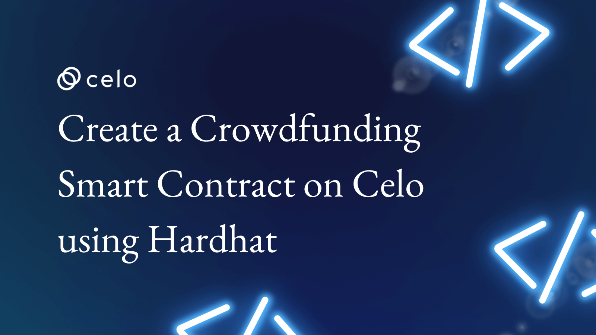

## Introduction

The reality is that a single individual or small group of people may not have the financial strength to fund a particular goal or agenda. This is where collective power becomes more effective as they invite more people to contribute towards the goal.

This process is known as crowdfunding. Reports have it that while the crowdfunding industry is valued at around [\$1 billion in 2022](https://www.statista.com/outlook/dmo/fintech/digital-capital-raising/crowdfunding/worldwide#:~:text=Transaction%20value%20in%20the%20Crowdfunding,US%241.13bn%20in%202022.), it will hit almost [\$5 billion in 2025](https://www.statista.com/outlook/dmo/fintech/digital-capital-raising/crowdfunding/worldwide#:~:text=Transaction%20value%20in%20the%20Crowdfunding,US%241.13bn%20in%202022.).

The most exciting fact is that more crowdfunding campaigns are run on the blockchain with the advent of blockchain technology and its innovations.

Thus, as a competent contract developer, you should know how to build, test, and deploy secure crowdfunding contracts. By the time you finish this article, you would have built your crowdfunding contract and deployed it on Celo.

Let’s jump into it.

## Prerequisites​

These are the prerequisites you will need for this tutorial:

- A fair understanding of Solidity and Javascript
- An adequate understanding of the Celo blockchain and Hardhat framework

## Requirements​

- Have a [Metamask extension](https://metamask.io/)
- [Configure](https://docs.celo.org/blog/tutorials/3-simple-steps-to-connect-your-metamask-wallet-to-celo) your Metamask to Celo
- [Fund your Celo account](https://faucet.celo.org) on Metamask

### A Brief Overview of Celo

It is a good practice in blockchain in blockchain engineering to have a fair understanding of an ecosystem as a developer before attempting to build smart contracts or DApps on it.

Thus, we shall examine Celo briefly:

First of all, Celo is a self-sufficient layer-1 blockchain protocol that uses a battle-tested proof-of-stake consensus mechanism and is compatible with the Ethereum Virtual Machine. That means developers can use the same languages and frameworks used to build on Ethereum to build on Celo. The main thing that will change is switching the configuration when it is time to deploy.

But while they are both interoperable, Celo is distinct in terms of its architecture, ecological friendliness, economic model, and transaction processing technicalities.

One of the most distinguishing qualities of Celo is that it is a DeFi-focused blockchain with a unique identity system that can point a regular phone number to a wallet address.

Thus, Celo is one of the leading blockchains with the best user experience and is on track to banking those who are unbanked.

Having laid this brief foundation, let us roll our sleeves and proceed to write our contract.

# Writing a Crowdfunding Contract with Solidity

The general idea behind the contract we are about to write is that people should be able to donate ERC-20 tokens to the campaign. If the benefactors can donate up to the target, the beneficiary can withdraw the funds.

But if it were to be the case that the campaign was not eventually successful, the smart contract would automatically refund the benefactors.

Let us go over it step-by-step:

```solidity
## Step 1: Importing the IERC-20 Dependency
// SPDX-License-Identifier: MIT

pragma solidity ^0.8.0;

import "./IERC20.sol";
```

The first thing we did was to specify the license of the contract to MIT; this is the license that allows you to use this for educational and general open-source purposes.

Then we declared the version of Solidity compiler we want to use. We imported an IERC20 interface. For that purpose, please create another file named `IERC20.sol` and paste this interface:

```solidity
// SPDX-License-Identifier: MIT

pragma solidity ^0.8.0;

interface IERC20 {
    function allowance(address owner, address spender)
        external
        view
        returns (uint256 remaining);

    function approve(address spender, uint256 value)
        external
        returns (bool success);

    function balanceOf(address owner) external view returns (uint256 balance);

    function decimals() external view returns (uint8 decimalPlaces);

    function decreaseApproval(address spender, uint256 addedValue)
        external
        returns (bool success);

    function increaseApproval(address spender, uint256 subtractedValue)
        external;

    function name() external view returns (string memory tokenName);

    function symbol() external view returns (string memory tokenSymbol);

    function totalSupply() external view returns (uint256 totalTokensIssued);

    function transfer(address to, uint256 value)
        external
        returns (bool success);

    function transferFrom(
        address from,
        address to,
        uint256 value
    ) external returns (bool success);
}
```

## Step 2: The Campaign and Benefactors Struct

```solidity
struct Campaign{
           address payable beneficiary;
           uint moneyRaised;
           uint target;
           uint beginning;
           uint ending;
           bool withdrawn;
           Benefactors[] benefactorsInfo;
       }

       struct Benefactors {
           address benefactor;
           uint amount;
       }
```

Just like other cousin languages, struct which is a variable container is also available in Solidity. For this contract, we created two separate structs for packing two sets of details.

Foremost, we declared a struct for the Campaign itself. Here, we inputted the address of the beneficiary, the money that has been raised so far, and the target of the campaign.

For the sake of time, we put in variables to track the beginning and end of the campaign. Since we can have several counts of the campaign, we would need to ascertain if the beneficiary of a particular campaign has withdrawn or not.

That is the reason we declared a boolean data type for withdrawal. Finally, we would need to pack in the array of the entire benefactors who gave towards a campaign in the struct.

Moving on to the second struct, its use is to track those who contributed to the crowdfunding. We are tracking two details about everyone of them; their addresses and the amount each of them gave.

## Step 3: The Rest of The State Variables

```solidity
   IERC20 public immutable token;

    mapping(uint256 => Campaign) public campaigns;

    // this mapping will be useful for ERC-20 transferFrom
    mapping(uint256 => mapping(address => uint256)) public trackRaisedMoney;

    uint256 public campaignCount;

    constructor(address _token) {
        if (_token == address(0)) revert();
        token = IERC20(_token);
    }
```

We introduced the ERC-20 token to this contract. Then we created two mappings. The first simple mapping will store the instances or lots of each campaign that will be created through this contract.

On the other hand, the following nested mapping will be useful for the `transferFrom` function, which we will eventually work on. Since we can have more than one campaign lots, we created a variable called `campaignCount` to track the campaigns.

The basic thing we did in the constructor was to initialize our token address.

## Step 4: The getEndDate Function

```solidity
 function getEndDate(uint8 _days) private pure returns (uint256) {
       if (_days < 0) revert();
       return uint256(_days * 86400);
```

We need to create this function first because we will need it during the launch. This function contains an if statement that a hypothetical day is less than 0, the EVM should return the day the campaign ends.

## Step 5: The kickOff Function

```solidity
  function kickOff(
      address _beneficiary,
      uint256 _target,
      uint8 _endingDays
  ) external returns (uint256) {
      // do this for auto-incrementation
      campaignCount++;
      campaigns[campaignCount].beneficiary = payable(_beneficiary);
      campaigns[campaignCount].moneyRaised = 0;
      campaigns[campaignCount].target = _target;
      campaigns[campaignCount].beginning = block.timestamp;
      campaigns[campaignCount].ending =
          campaigns[campaignCount].beginning +
          getEndDate(_endingDays);
      uint256 endDate = campaigns[campaignCount].ending;
      campaigns[campaignCount].withdrawn = false; // because the default of bool is false

      require(
          endDate < block.timestamp + 30 days,
          "Campaign must end in 30 days"
      );

      emit Start(
          campaignCount,
          _beneficiary,
          _target,
          block.timestamp,
          endDate
      );
      return campaignCount;
  }
```

The kickOff function, as the name implies, is the function that will launch the contract. We incremented the `campaignCount` and set the members of the campaign struct. While most of the settings were done in the normal way and are straightforward, pay closer attention to how we set the `ending` member.

We added the `beginning` to the result of the `getEndDate` function we defined earlier. After this, we put a check that the day the campaign will end must be less than or equal to 30 days.

Moving on, we emitted some events into the log and return the `campaignCount`.

## Step 6: The Give Function

```solidity
    function give(uint256 _benefactorsId, uint256 _amount) external {
        require(
            campaigns[_benefactorsId].moneyRaised <=
                campaigns[_benefactorsId].target,
            "the target is reached already"
        );
        require(
            block.timestamp <= campaigns[_benefactorsId].ending,
            "can only give when the campaign has not ended"
        );

        token.transferFrom(msg.sender, address(this), _amount);
        campaigns[_benefactorsId].moneyRaised += _amount;
        trackRaisedMoney[_benefactorsId][msg.sender] += _amount;

        Campaign storage campaign = campaigns[_benefactorsId];
        campaign.benefactorsInfo.push(Benefactors(msg.sender, _amount));
        emit Give(_benefactorsId, msg.sender, _amount);
    }
```

This is the function that the benefactors will use to donate money towards the success of a campaign. We put in two checks before a benefactor can donate.

First, it must be the case that the total funds that have been raised so far have not reached the desired goal. Otherwise, there will be no need for donations any longer.

Second, a benefactor can only donate when the contract has not ended.

Once a benefactor has passed these checks, they can donate any amount to the beneficiary. After making the transfer call, we incremented the total amount in the pool.

For record purposes, we push each benefactor into the benefactor's array along with their addresses and the amount they donated.

## Step 7: The unGive Function

```solidity
  function undoGiving(uint256 _benefactorsId, uint256 _amount) external {
        require(
            block.timestamp <= campaigns[_benefactorsId].ending,
            "can only ungive when the campaign has not ended"
        );

        // check that user indeed has token balance using the TRACKTOKENRAISED MAPPING
        require(
            trackRaisedMoney[_benefactorsId][msg.sender] >= _amount,
            "Insufficient Balance"
        );

        campaigns[_benefactorsId].moneyRaised -= _amount;

        trackRaisedMoney[_benefactorsId][msg.sender] -= _amount;
        token.transfer(msg.sender, _amount);

        // to remove msg.sender from benefactors
        Campaign storage campaign = campaigns[_benefactorsId];
        uint256 len = campaign.benefactorsInfo.length;
        for (uint256 i = 0; i < len; ++i) {
            Benefactors memory person = campaign.benefactorsInfo[i];
            if (person.benefactor == msg.sender) {
                campaign.benefactorsInfo[i] = campaign.benefactorsInfo[len - 1];
            }
        }
        campaign.benefactorsInfo.pop();

        emit UnGive(_benefactorsId, msg.sender, _amount);
    }
```

Well, the reality is that sometimes, the donors might change their minds and conclude to take their donation back. Thus, there should be a function for this to allow fairness.

The first requirement we put in was that no donor can get a refund once the campaign has ended. Secondly, the said benefactor must have actually donated earlier.

Then we deducted the amount from the pool and sent the money back to the donor.

Now, we need to go a step further to remove such a donor from the benefactor's array.

Thus, we will need to carry out a for loop, and for composability, we stored what should have been `campaign.benefactorsInfo.length` variable. Afterward, we created a logic that such an earlier investor should be the last person in the benefactors' array.

Then we called a `.pop`, a method that removes the last person in an array.

## Step 8: The Withdrawal Function

```solidity
 function withdrawal(uint256 _Id) external {
      require(
          campaigns[_Id].beneficiary == msg.sender,
          "Error, only the beneficiary can withdraw!"
      );
      require(
          block.timestamp > campaigns[_Id].ending,
          "cannot withdraw before ending"
      );

      require(campaigns[_Id].moneyRaised >= campaigns[_Id].target); // should be greater than or equal to
      require(!campaigns[_Id].withdrawn, "Withdrawn already"); // recall that the default of bool is false

      campaigns[_Id].withdrawn = true;
      token.transfer(campaigns[_Id].beneficiary, campaigns[_Id].moneyRaised);

      emit Withdrawal(_Id);
  }
```

This is a vital function in the contract. We set out four conditions that are native to withdrawing:

- Only the beneficiary can withdraw
- The beneficiary can only withdraw when the campaign has ended
- The money that has been raised should have hit the target
- The funds in the current lot of the campaign must not have been withdrawn before

Before we can make the transfer call, we have to set the boolean withdrawal time from its false default to true. Then we made a transfer call where we sent the money raised to the beneficiary.

## Step 9: The Refund Function

```solidity
    // if the goal of the campaign is not met, everyone who donated should be refunded
    function refund(uint256 _benefactorsId) external {
        require(
            block.timestamp > campaigns[_benefactorsId].ending,
            "cannot withdraw before ending"
        );
        require(
            campaigns[_benefactorsId].moneyRaised <
                campaigns[_benefactorsId].target
        );

        uint256 bal = trackRaisedMoney[_benefactorsId][msg.sender];
        // reset the balance
        trackRaisedMoney[_benefactorsId][msg.sender] = 0;
        token.transfer(msg.sender, bal);

        emit Refund(_benefactorsId, msg.sender, bal);
    }
```

What happens to all the money that has been raised if the campaign turns out to be unsuccessful? The purpose of this function is that the donors can call it to get their funds back if it were to be the case that they did not meet the target at the end of the day.

## Step 10: The Detail Getter Functions

```solidity
  function checkSuccess(uint256 _campaignCount)
        external
        view
        returns (bool success)
    {
        if (
            campaigns[_campaignCount].moneyRaised >=
            campaigns[_campaignCount].target
            // should be greater than or equal to
        ) {
            success = true;
        }
    }

    function getContributorAmount(uint256 _benefactorsInfo)
        external
        view
        returns (uint256)
    {
        // the Data of everyone who contributed to the project is stored in the trackRaisedMoney mapping
        return trackRaisedMoney[_benefactorsInfo][msg.sender];
    }

    // this function fetches us the data of everyone who contributed to the campaign
    // first their number and the addresses of each of them
    function getBenefactors(uint256 _benefactorsInfo)
        external
        view
        returns (Benefactors[] memory)
    {
        // the Data of everyone who contributed to the project is stored in the trackRaisedMoney mapping
        // generally unhealthy to use an array

        Campaign memory campaign = campaigns[_benefactorsInfo];
        // return campaigns[_benefactorsInfo].length;

        return campaign.benefactorsInfo; // originally not initialized

        // abeg help me fix this --Done my chief!
    }
```

The rest of the functions in this contract are getter functions for some important details:

- The `checkSuccess` function checks if any particular campaign was successful functions
- The `getContributorAmount` function returns the amount that each donor gave
- The `getBenefactors` returns all the donors that gave towards a particular outreach

Eventually, your full code base should appear like this:

```solidity
// SPDX-License-Identifier: MIT

pragma solidity ^0.8.0;

import "./IERC20.sol";

contract RaiseMoney {
    event Start(
        uint256 id,
        address benefactor,
        uint256 target,
        uint256 beginning,
        uint256 ending
    );
    event Give(uint256 id, address benefactors, uint256 amount);
    event UnGive(uint256 id, address benefactor, uint256 amount);
    event Withdrawal(uint256 id);
    event Refund(uint256 id, address benefactor, uint256 balance);

    // struct to pack the variables of the campaign

    struct Benefactors {
        address benefactor;
        uint256 amount;
    }

    // struct to pack the variables of the campaign
    struct Campaign {
        address payable beneficiary;
        uint256 moneyRaised;
        uint256 target;
        uint256 beginning;
        uint256 ending;
        bool withdrawn;
        Benefactors[] benefactorsInfo;
    }

    IERC20 public immutable token;

    mapping(uint256 => Campaign) public campaigns;

    // this mapping will be useful for ERC-20 transferFrom
    mapping(uint256 => mapping(address => uint256)) public trackRaisedMoney;

    uint256 public campaignCount;

    constructor(address _token) {
        if (_token == address(0)) revert();
        token = IERC20(_token);
    }
  function getEndDate(uint8 _days) private pure returns (uint256) {
        if (_days < 0) revert();
        return uint256(_days * 86400);
    }
    /*
     *@dev the _beginning param in the kickOff function
     * was modifed to block.timestamp
     */

    function kickOff(
        address _beneficiary,
        uint256 _target,
        uint8 _endingDays
    ) external returns (uint256) {
        // do this for auto-incrementation
        campaignCount++;
        campaigns[campaignCount].beneficiary = payable(_beneficiary);
        campaigns[campaignCount].moneyRaised = 0;
        campaigns[campaignCount].target = _target;
        campaigns[campaignCount].beginning = block.timestamp;
        campaigns[campaignCount].ending =
            campaigns[campaignCount].beginning +
            getEndDate(_endingDays);
        uint256 endDate = campaigns[campaignCount].ending;
        campaigns[campaignCount].withdrawn = false; // because the default of bool is false

        require(
            endDate < block.timestamp + 30 days,
            "Campaign must end in 30 days"
        );

        emit Start(
            campaignCount,
            _beneficiary,
            _target,
            block.timestamp,
            endDate
        );
        return campaignCount;
    }

    function give(uint256 _benefactorsId, uint256 _amount) external {
        require(
            campaigns[_benefactorsId].moneyRaised <=
                campaigns[_benefactorsId].target,
            "the target is reached already"
        );
        require(
            block.timestamp <= campaigns[_benefactorsId].ending,
            "can only give when the campaign has not ended"
        );

        token.transferFrom(msg.sender, address(this), _amount);
        campaigns[_benefactorsId].moneyRaised += _amount;
        trackRaisedMoney[_benefactorsId][msg.sender] += _amount;

        Campaign storage campaign = campaigns[_benefactorsId];
        campaign.benefactorsInfo.push(Benefactors(msg.sender, _amount));
        emit Give(_benefactorsId, msg.sender, _amount);
    }

    function undoGiving(uint256 _benefactorsId, uint256 _amount) external {
        require(
            block.timestamp <= campaigns[_benefactorsId].ending,
            "can only ungive when the campaign has not ended"
        );

        // check that user indeed has token balance using the TRACKTOKENRAISED MAPPING
        require(
            trackRaisedMoney[_benefactorsId][msg.sender] >= _amount,
            "Insufficient Balance"
        );

        campaigns[_benefactorsId].moneyRaised -= _amount;

        trackRaisedMoney[_benefactorsId][msg.sender] -= _amount;
        token.transfer(msg.sender, _amount);

        // to remove msg.sender from benefactors
        Campaign storage campaign = campaigns[_benefactorsId];
        uint256 len = campaign.benefactorsInfo.length;
        for (uint256 i = 0; i < len; ++i) {
            Benefactors memory person = campaign.benefactorsInfo[i];
            if (person.benefactor == msg.sender) {
                campaign.benefactorsInfo[i] = campaign.benefactorsInfo[len - 1];
            }
        }
        campaign.benefactorsInfo.pop();

        emit UnGive(_benefactorsId, msg.sender, _amount);
    }

    function withdrawal(uint256 _Id) external {
        require(
            campaigns[_Id].beneficiary == msg.sender,
            "Error, only the beneficiary can withdraw!"
        );
        require(
            block.timestamp > campaigns[_Id].ending,
            "cannot withdraw before ending"
        );

        require(campaigns[_Id].moneyRaised >= campaigns[_Id].target); // should be greater than or equal to
        require(!campaigns[_Id].withdrawn, "Withdrawn already"); // recall that the default of bool is false

        campaigns[_Id].withdrawn = true;
        token.transfer(campaigns[_Id].beneficiary, campaigns[_Id].moneyRaised);

        emit Withdrawal(_Id);
    }

    // if the goal of the campaign is not met, everyone who donated should be refunded
    function refund(uint256 _benefactorsId) external {
        require(
            block.timestamp > campaigns[_benefactorsId].ending,
            "cannot withdraw before ending"
        );
        require(
            campaigns[_benefactorsId].moneyRaised <
                campaigns[_benefactorsId].target
        );

        uint256 bal = trackRaisedMoney[_benefactorsId][msg.sender];
        // reset the balance
        trackRaisedMoney[_benefactorsId][msg.sender] = 0;
        token.transfer(msg.sender, bal);

        emit Refund(_benefactorsId, msg.sender, bal);
    }

      // to check if a particular count of fundraising has been successful
    function checkSuccess(uint256 _campaignCount)
        external
        view
        returns (bool success)
    {
        if (
            campaigns[_campaignCount].moneyRaised >=
            campaigns[_campaignCount].target
            // should be greater than or equal to
        ) {
            success = true;
        }
    }

    function getContributorAmount(uint256 _benefactorsInfo)
        external
        view
        returns (uint256)
    {
        // the Data of everyone who contributed to the project is stored in the trackRaisedMoney mapping
        return trackRaisedMoney[_benefactorsInfo][msg.sender];
    }

    // this function fetches us the data of everyone who contributed to the campaign
    // first their number and the addresses of each of them
    function getBenefactors(uint256 _benefactorsInfo)
        external
        view
        returns (Benefactors[] memory)
    {
        // the Data of everyone who contributed to the project is stored in the trackRaisedMoney mapping
        // generally unhealthy to use an array

        Campaign memory campaign = campaigns[_benefactorsInfo];
        // return campaigns[_benefactorsInfo].length;

        return campaign.benefactorsInfo;
    }
}
```

# Creating the ERC-20 Contract

Since we imported an IERC20 interface, we will need to create an ERC-20 contract alongside our crowdfunding contract. Create a file and name it `testERC.sol`.

```solidity
// SPDX-License-Identifier: MIT

pragma solidity ^0.8.0;

import "@openzeppelin/contracts/token/ERC20/ERC20.sol";

contract FooCoin is ERC20 {
    address public owner;

    constructor(uint256 initialAmount) ERC20("TestERC", "TST") {
        owner = msg.sender;
        _mint(msg.sender, initialAmount);
    }

    function mintMore(uint256 _amount) public {
        // require(msg.sender == owner, "Only Owner can call this fxn!");
        _mint(msg.sender, _amount);
    }
}
```

We inherited an ERC-20 interface from Open Zeppelin, and the main function we included was one that allowed us to mint tokens. Compile this contract

## Compilation

Save all your contracts. Now, go to your `raisemoney.sol` contract and compile on the terminal with `npx hardhat compile`. Other things being equal, your contract should compile.

### Testing of the Contract

We have to test the functions in our contract to ensure everything runs well. On this note, create a file and name it `test.js`. Paste this test script:

```js
const {
  loadFixture, time
} = require("@nomicfoundation/hardhat-network-helpers");
const { anyValue } = require("@nomicfoundation/hardhat-chai-matchers/withArgs");
const { expect, assert } = require("chai");
const { ethers } = require("hardhat")

describe("Deploy Raisemoney", function () {
  // We define a fixture to reuse the same setup in every test. or use a beforeEach function
  // We use loadFixture to run this setup once, snapshot that state,
  // and reset Hardhat Network to that snapshot in every test.
  async function deployRaiseMoney() {

    // const ONE_ETH = 1_000_000_000_000_000_000_000;

    const getThousand = ethers.utils.parseUnits("1000", "ether");
    const getFiveHundred = ethers.utils.parseUnits("500", "ether");
    const getTwoHundred = ethers.utils.parseUnits("200", "ether");
    const getHundred = ethers.utils.parseUnits("100", "ether");
    const getFifty = ethers.utils.parseUnits("50", "ether");


    // Contracts are deployed using the first signer/account by default
    const [owner, user1, user2, user3] = await ethers.getSigners();

    const raise_Money = await ethers.getContractFactory("RaiseMoney");
    const test_ERC = await ethers.getContractFactory("MobiCoin");

    const testERC = await test_ERC.deploy(getThousand);
    const raiseMoney = await raise_Money.deploy(testERC.address);


    return { testERC, raiseMoney, owner, user1, user2, user3, getThousand, getFiveHundred, getTwoHundred, getHundred, getFifty };
  }

  describe("Deployment", function () {

    async function loadTokenfeatures() {
      const { testERC, raiseMoney, owner, user1, user2, user3, getThousand, getFiveHundred, getTwoHundred, getHundred, getFifty } = await loadFixture(deployRaiseMoney);
      let tx1 = await testERC.connect(user1).mintMore(getFiveHundred);
      let tx2 = await testERC.connect(user2).mintMore(getFiveHundred);
      let tx3 = await testERC.connect(user3).mintMore(getFiveHundred);

      let ownerBalance = await testERC.balanceOf(owner.address);
      let user1Bal = await testERC.balanceOf(user1.address);
      let user2Bal = await testERC.balanceOf(user2.address);
      let user3Bal = await testERC.balanceOf(user3.address);

      return { ownerBalance, user1Bal, user2Bal, user3Bal, testERC, raiseMoney, owner, user1, user2, user3, getThousand, getFiveHundred, getTwoHundred, getHundred, getFifty };
    }


    it("Should mint more coins for other users", async function () {
      // To load state from fixtures
      const { ownerBalance, user1Bal, user2Bal, user3Bal, user4Bal, getThousand, getFiveHundred } = await loadFixture(loadTokenfeatures);


      expect(ownerBalance).to.equal(getThousand);
      expect(user1Bal).to.equal(getFiveHundred);
      expect(user2Bal).to.equal(getFiveHundred);
      expect(user3Bal).to.equal(getFiveHundred);

    });

    it("Should set the right token address", async function () {
      // loading from fixtures...
      const { testERC, raiseMoney } = await loadFixture(loadTokenfeatures);

      expect(await raiseMoney.token()).to.equal(testERC.address);
    });

    it("should be able to kickoff properly", async function () {
      const { owner, user1, user2, raiseMoney, getTwoHundred } = await loadFixture(deployRaiseMoney);

      let tx1 = await raiseMoney.connect(owner).kickOff(user1.address, getTwoHundred, 29);
      let campaignCount = await raiseMoney.campaignCount();
      expect(campaignCount).to.equal(1);

      // To test an error due to the condition "Campaign must end in 30 days"
      await expect(raiseMoney.connect(user2).kickOff(user2.address, getTwoHundred, 31)).to.be.reverted;
    });
    // console.log("Kickoff works as expected!");

    it("Should be able to give properly", async function () {
      const { owner, user1, user2, user3, raiseMoney, testERC, getFiveHundred, getTwoHundred, getFifty } = await loadFixture(
        loadTokenfeatures
      );
      await raiseMoney.connect(owner).kickOff(user1.address, getTwoHundred, 29);
      // To approve the contract
      await testERC.connect(user1).approve(raiseMoney.address, getFiveHundred)
      await testERC.connect(user2).approve(raiseMoney.address, getFiveHundred)
      await testERC.connect(user3).approve(raiseMoney.address, getFiveHundred)

      await raiseMoney.connect(user1).give(1, getFifty);
      await raiseMoney.connect(user2).give(1, getTwoHundred);

      let [beneficiary, moneyraised] = await raiseMoney.campaigns(1);

      expect(moneyraised).to.be.greaterThanOrEqual(
        getTwoHundred
      );

      // To track the raised money of an address
      let user2contributions = await raiseMoney.connect(user2).trackRaisedMoney(1, user2.address)
      expect(user2contributions).to.equal(getTwoHundred);

      // To test that a user can't give after target is reached
      await expect(raiseMoney.connect(user2).give(1, getTwoHundred)).to.be.reverted;

      // console.log(await raiseMoney.getBenefactors(1));
    });

    it("Should Undo giving", async function () {
      const { owner, user1, user2, raiseMoney, testERC, getFiveHundred, getTwoHundred, getFifty } = await loadFixture(
        loadTokenfeatures
      );
      await raiseMoney.connect(owner).kickOff(user1.address, getTwoHundred, 20);
      // To approve the contract
      await testERC.connect(user1).approve(raiseMoney.address, getFiveHundred)
      await testERC.connect(user2).approve(raiseMoney.address, getFiveHundred)

      // to give
      await raiseMoney.connect(user1).give(1, getFifty);
      await raiseMoney.connect(user2).give(1, getTwoHundred);

      // to ungive
      await raiseMoney.connect(user1).undoGiving(1, getFifty);

      let user1contributions = await raiseMoney.trackRaisedMoney(1, user1.address);
      expect(user1contributions).to.equal(0);

      // It shoud fail when a user attempts to ungive beyond his balance
      await expect(raiseMoney.connect(user1).undoGiving(1, getFiveHundred)).to.be.reverted;
    });

    it("Should Check Success after campaign target is reached", async function () {
      const { owner, user1, user2, raiseMoney, testERC, getFiveHundred, getTwoHundred, getFifty } = await loadFixture(
        loadTokenfeatures
      );
      await raiseMoney.connect(owner).kickOff(user1.address, getTwoHundred, 20);
      // To approve the contract
      await testERC.connect(user1).approve(raiseMoney.address, getFiveHundred)
      await testERC.connect(user2).approve(raiseMoney.address, getFiveHundred)

      // to give
      await raiseMoney.connect(user1).give(1, getFifty);
      await raiseMoney.connect(user2).give(1, getTwoHundred);
      let checkSuccessBool = await raiseMoney.checkSuccess(1);
      expect(checkSuccessBool).to.equal(true);
    });
  });

  describe("Withdrawals", function () {

    // Using fixures again
    async function loadTokenfeatures() {
      const { testERC, raiseMoney, owner, user1, user2, user3, getThousand, getFiveHundred, getTwoHundred, getHundred, getFifty } = await loadFixture(deployRaiseMoney);
      let tx1 = await testERC.connect(user1).mintMore(getFiveHundred);
      let tx2 = await testERC.connect(user2).mintMore(getFiveHundred);
      let tx3 = await testERC.connect(user3).mintMore(getFiveHundred);

      let ownerBalance = await testERC.balanceOf(owner.address);
      let user1Bal = await testERC.balanceOf(user1.address);
      let user2Bal = await testERC.balanceOf(user2.address);
      let user3Bal = await testERC.balanceOf(user3.address);

      return { ownerBalance, user1Bal, user2Bal, user3Bal, testERC, raiseMoney, owner, user1, user2, user3, getThousand, getFiveHundred, getTwoHundred, getHundred, getFifty };
    }

    it("Should revert with the right error if called too soon", async function () {
      const { owner, user1, user2, raiseMoney, testERC, getFiveHundred, getTwoHundred, getFifty } = await loadFixture(
        loadTokenfeatures
      );
      await raiseMoney.connect(owner).kickOff(user1.address, getTwoHundred, 20);
      // To approve the contract
      await testERC.connect(user1).approve(raiseMoney.address, getFiveHundred)
      await testERC.connect(user2).approve(raiseMoney.address, getFiveHundred)

      // to give
      await raiseMoney.connect(user1).give(1, getFifty);
      await raiseMoney.connect(user2).give(1, getTwoHundred);

      await expect(raiseMoney.connect(user1).withdrawal(1)).to.be.revertedWith(
        "cannot withdraw before ending"
      );

    });

    it("Should revert with the right error if called from another account", async function () {
      const { owner, user1, user2, raiseMoney, testERC, getFiveHundred, getTwoHundred, getFifty } = await loadFixture(
        loadTokenfeatures
      );
      await raiseMoney.connect(owner).kickOff(user1.address, getTwoHundred, 20);
      // To approve the contract
      await testERC.connect(user1).approve(raiseMoney.address, getFiveHundred)
      await testERC.connect(user2).approve(raiseMoney.address, getFiveHundred)

      // to give
      await raiseMoney.connect(user1).give(1, getFifty);
      await raiseMoney.connect(user2).give(1, getTwoHundred);

      await expect(raiseMoney.connect(user2).withdrawal(1)).to.be.revertedWith(
        "Error, only the beneficiary can withdraw!"
      );
    });

    it("Shouldn't fail if the unlockTime has arrived and the owner calls it", async function () {
      const { owner, user1, user2, raiseMoney, testERC, getFiveHundred, getTwoHundred, getFifty } = await loadFixture(
        loadTokenfeatures
      );
      await raiseMoney.connect(owner).kickOff(user1.address, getTwoHundred, 20);
      // To approve the contract
      await testERC.connect(user1).approve(raiseMoney.address, getFiveHundred)
      await testERC.connect(user2).approve(raiseMoney.address, getFiveHundred)

      // to give
      await raiseMoney.connect(user1).give(1, getFifty);
      await raiseMoney.connect(user2).give(1, getTwoHundred);

      const ONE_MONTH_IN_SECS = 31 * 24 * 60 * 60;
      const unlockTime = (await time.latest()) + ONE_MONTH_IN_SECS;

      // Transactions are sent using the first signer by default
      await time.increaseTo(unlockTime);

      await expect(raiseMoney.connect(user1).withdrawal(1)).not.to.be.reverted;
    });

    it("Refund Benefactors tokens if target isn't met", async function () {
      const { owner, user1, user2, raiseMoney, testERC, getFiveHundred, getTwoHundred, getFifty } = await loadFixture(
        loadTokenfeatures
      );
      await raiseMoney.connect(owner).kickOff(user1.address, getFiveHundred, 20);
      // To approve the contract
      await testERC.connect(user1).approve(raiseMoney.address, getFiveHundred)
      await testERC.connect(user2).approve(raiseMoney.address, getFiveHundred)

      // to give
      await raiseMoney.connect(user1).give(1, getFifty);
      await raiseMoney.connect(user2).give(1, getTwoHundred);

      const ONE_MONTH_IN_SECS = 31 * 24 * 60 * 60;
      const unlockTime = (await time.latest()) + ONE_MONTH_IN_SECS;

      // Transactions are sent using the first signer by default
      await time.increaseTo(unlockTime);

      await expect(raiseMoney.connect(user1).refund(1)).not.to.be.reverted;
    });

  });
});
```

Once you have compiled it, this should show on your terminal:


Now, we can move to the next phase, which is deployment to the Celo Alfajores Testnet.

# Deployment of the Crowdfunding Contract to Celo

Before you plan to deploy, ensure you delete the configuration file–which is the `Hardhat.config.js` in your Hardhat and replace it with this:

```js
require("@nomiclabs/hardhat-waffle");
require("dotenv").config({ path: ".env" });
require("hardhat-deploy");

// Prints the Celo accounts associated with the mnemonic in .env
task("accounts", "Prints the list of accounts", async (taskArgs, hre) => {
  const accounts = await hre.ethers.getSigners();

  for (const account of accounts) {
    console.log(account.address);
  }
});

/**
 * @type import('hardhat/config').HardhatUserConfig
 */
module.exports = {
  defaultNetwork: "alfajores",
  networks: {
    localhost: {
      url: "http://127.0.0.1:7545",
    },
    alfajores: {
      gasPrice: 1500000000,
      gas: 4100000,
      url: "https://alfajores-forno.celo-testnet.org",
      accounts: {
        mnemonic: process.env.MNEMONIC,
        path: "m/44'/52752'/0'/0",
      },
      //chainId: 44787
    },
    celo: {
      url: "https://forno.celo.org",
      accounts: {
        mnemonic: process.env.MNEMONIC,
        path: "m/44'/52752'/0'/0",
      },
      chainId: 42220,
    },
  },
  solidity: "0.8.0",
};
```

Then deploy the contract with `hardhat run scripts/deploy.js --network alfajores`. This was the contract address of our contract: 0xEF87eDE6F4713De16d83Ca08cf0f8A6a263Db60A.


You can always verify your contracts at [Celoscan](https://alfajores.celoscan.io/)

# Conclusion

Congratulations, you just learned how to build and deploy a crowdfunding contract on the Celo blockchain. This project should have enhanced your contract of not only smart contract development with Solidity but also the intricacies of successfully building on Celo.

Ensure you take your time to code along in this tutorial, and push your code to GitHub when you are done.

# Next Steps

For more real-time visual testing, I recommend you test this contract on Remix, using up to 3 addresses to contribute to the crowdfunding contract.

# About the Author

John Fawole is a blockchain technical writer and Solidity dev; ; connect with him on [LinkedIn](https://www.linkedin.com/in/johnfawole/).
