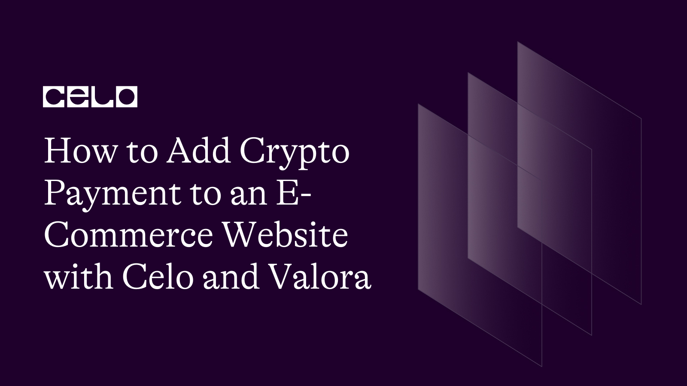

## Introduction​

In recent years, the use of cryptocurrency as a form of payment has gained popularity, and businesses are increasingly accepting crypto payments.
With the rise of decentralized finance (DeFi) and the growing interest in blockchain technology, accepting crypto payments can provide several advantages for e-commerce businesses.

In this article, you will learn how to add crypto payments to an e-commerce website using Celo and Valora. Celo is an open-source blockchain platform allowing fast and secure transactions with Celo Dollars (cUSD). Valora is a digital wallet that enables users to send, receive, and store cryptocurrencies.

This article will provide step-by-step instructions on how to add a crypto payment to your e-commerce website and explain the benefits of accepting crypto payments.

## Prerequisites​

This tutorial requires you to have a solid foundation on the following concept:

- **React**: React is a popular JavaScript library for building user interfaces. It is commonly used in web development and is highly recommended for creating scalable and maintainable web applications. React can be used to build dynamic and responsive user interfaces for your e-commerce website, enhancing the user experience and improving your website's performance. You’ll be writing most of this tutorial.

- **Celo and Valora**: You must create accounts on the Celo blockchain and Valora to receive and process crypto payments. This will require an internet-enabled device and a stable internet connection. You’ll be using the Valora app to test out payment after implementation.

- **Git/Github**: Git is a popular version control system developers use to manage code changes in a collaborative environment. GitHub is a web-based hosting service for Git repositories that offers additional features such as issue tracking, pull requests, and code reviews. You’ll use git to access the demo project and start the sample project for this tutorial.

## Getting Started

To start adding the Valora payment method using wallet connect, First, you’ll need a starter project to work with. [Here](https://github.com/Julius170/the-daylight-starter-app) is a link to the e-commerce website you’ll be modifying, and [here](https://github.com/Julius170/thedaylightstore) is the link to the completed application.

1. Create a project workspace on your preferred code editor.
2. First, you need access to the starter project you’ll be working on. To do this, run the code `git clone https://github.com/Julius170/the-daylight-starter-app`. After which, you should have the entire codebase of the fully functioning e-commerce website on your local device.
3. Now run the code `npm install` to install all the required packages for the application.
4. Next, run the command `npm start` to start up the application on your local PC, where you can get a feel of the available functionalities of the application.

## Adding Checkout and Payment with Valora

1. To add the Valora payment method to the application, head to the `App.js` file in the main directory and add the line below inside the `<Routes>` tag.

`<Route path="checkout" element={<Checkout />} />`

In the code, the path prop is set to `checkout,` meaning that this route will match any URL path ending with "/checkout.

2. To import the route, copy and paste the code below at the top of the file.
   The code `import Checkout from "./routes/checkout/checkout.component";` import Checkout from "./routes/checkout/checkout.component"; imports the Checkout component from the "./routes/checkout/checkout.component" file into the current file (likely app.js) so that it can be used within the current folder.

3. Next, head over to the `components` folder in your main directory, open the `routes` folder, and create a new folder, `checkout`, where you’ll have the code file for checking out items and making payments with Valora.

4. Create a new file, `checkout.styles.scss`, copy and add the following code snippet to the file to have the styling of the checkout file.

```scss
.checkout-container {
  width: 55%;
  min-height: 90vh;
  display: flex;
  flex-direction: column;
  align-items: center;
  margin: 50px auto 0;

  button {
    &:hover {
      cursor: pointer;
    }
  }
  .checkout-header {
    width: 100%;
    padding: 10px 0;
    display: flex;
    justify-content: space-between;
    border-bottom: 1px solid darkgrey;

    .header-block {
      text-transform: capitalize;
      width: 23%;

      &:last-child {
        width: 8%;
      }
    }
  }

  .total {
    margin-top: 30px;
    margin-left: auto;
    font-size: 36px;
  }
}

@media (max-width: 500px) {
  .checkout-container {
    width: 90%;
  }
}
```

5. Create another file `checkout.component.jsx`, and copy the codes in the code snippets below to add to the file.

```jsx
import { useContext, useState } from "react";
import { CartContext } from "../../contexts/cart.context";
import CheckoutItem from "../../components/checkout-item/checkout-item.component";
import "./checkout.styles.scss";
import { styleButton } from "../authentication/authentication.component";
import WalletConnectProvider from "@walletconnect/web3-provider";
import Web3 from "web3";
import { newKitFromWeb3 } from "@celo/contractkit";

let res = "";
let obj = {};
const Checkout = () => {
  const { cartItems, cartTotal } = useContext(CartContext);

  const [provider, setProvider] = useState(null);
  const [kit, setKit] = useState(null);
  const [someAddress, setSomeAddress] = useState(
    "0x9596d284619bbc628bef87333c20f0d78fee5a1b"
  );

  const connect = async () => {
    const provider = new WalletConnectProvider({
      rpc: {
        44787: "https://alfajores-forno.celo-testnet.org",
        42220: "https://forno.celo.org",
      },
    });

    await provider.enable();

    const web3 = new Web3(provider);
    let kit = newKitFromWeb3(web3);

    kit.defaultAccount = provider.accounts[0];

    provider.on("accountsChanged", (accounts) => {
      console.log(accounts, "this is the accounts");
    });

    setProvider(provider);
    setKit(kit);
  };

  const sendcUSD = async () => {
    try {
      let amount = kit.web3.utils.toWei(`${cartTotal}`, "ether");

      const stabletoken = await kit.contracts.getStableToken();

      const tx = await stabletoken
        .transfer(someAddress, amount)
        .send({ feeCurrency: stabletoken.address });
      const receipt = await tx.waitReceipt();
      console.log(receipt);
      alert("Successful");
    } catch (err) {
      alert(err);
    }
  };

  const disconnect = async () => {
    await provider.disconnect();
    setProvider(null);
    setKit(null);
  };

  let button, account, disconnectprop;

  if (provider !== null) {
    button = (
      <div>
        <button
          style={{
            ...styleButton,
            border: "none",
            padding: "1rem",
            margin: "2.3rem 0",
            borderRadius: "8px",
            listStyleType: "none",
          }}
          onClick={() => sendcUSD()}
        >
          Purchase Item
        </button>
      </div>
    );
    disconnectprop = (
      <div>
        <button
          style={{
            ...styleButton,
            border: "none",
            padding: "1rem",
            margin: "2.3rem 0",
            borderRadius: "8px",
            listStyleType: "none",
          }}
          onClick={() => disconnect()}
        >
          Disconnect
        </button>
      </div>
    );
  } else {
    button = (
      <div>
        <button
          style={{
            ...styleButton,
            border: "none",
            padding: "1rem",
            margin: "2.3rem 0",
            borderRadius: "8px",
            listStyleType: "none",
          }}
          onClick={() => connect()}
        >
          Connect
        </button>
      </div>
    );
  }

  if (kit !== null) {
    account = kit.defaultAccount;
  }

  return (
    <div className="checkout-container">
      <div className="checkout-header">
        <div className="header-block">
          <span>Prod.</span>
        </div>
        <div className="header-block">
          <span>Desc.</span>
        </div>
        <div className="header-block">
          <span>Qnt.</span>
        </div>
        <div className="header-block">
          <span>Prc.</span>
        </div>
        <div className="header-block">
          <span>Rm.</span>
        </div>
      </div>
      {cartItems.map((cartItem) => {
        const { productName } = cartItem;
        if (!obj[productName]) {
          obj[productName] = productName;
          res = res + " *" + productName;
        }
        return <CheckoutItem key={cartItem.id} cartItem={cartItem} />;
      })}
      <div className="total">TOTAL: $ {cartTotal}</div>

      {button}
      <span>
        {account
          ? "You are connected to " + account + " click on purchase item"
          : ""}
      </span>
      {disconnectprop}
    </div>
  );
};

export default Checkout;
```

- The code above is a React component called `Checkout`, which renders a checkout page for an online store. It imports several dependencies and components, such as `useContext` and `useState` from React, `CartContext` from `../../contexts/cart.context`, `CheckoutItem` from `../../components/checkout-item/checkout-item.component`, and some other dependencies.

- The component defines several state variables, including `provider` and `kit`, which are used to handle blockchain transactions. It also defines several functions, such as `connect`, `sendcUSD`, and `disconnect`, which are used to interact with the blockchain and handle the connection and disconnection of the user's wallet.

- The component renders a table of the products in the user's shopping cart and the total cost of the items. It also renders a button to connect the user's wallet, a message indicating whether the user is connected to their wallet, and a button to disconnect. Finally, the component renders a button to purchase the items in the user's cart, which triggers the `sendcUSD` function to transfer the necessary funds using the blockchain.

## How it works

- The line below imports the `useContext` and useState hooks from the React library, which are used to manage the state within a functional component:
  `import { useContext, useState } from "react";`

- The next line imports the `CartContext` object from a file in a parent directory called `cart.context.js`. The `CartContext` object contains a state related to the user's shopping cart:
  `import { CartContext } from "../../contexts/cart.context";`.

- The line imports the CheckoutItem component from a file located in a child directory called checkout-item, which is used to display the items in the user's shopping cart during checkout:  
  `import CheckoutItem from "../../components/checkout-item/checkout-item.component";`.

- This line imports a CSS file that contains styling for the Checkout component:
  `import "./checkout.styles.scss";`

- The next line imports the styleButton object from a file in a parent directory called authentication. This object contains CSS styling that is applied to buttons used in the Checkout component:
  `import { styleButton } from "../authentication/authentication.component";`.

- These lines import the WalletConnectProvider, Web3, and newKitFromWeb3 objects from external libraries. These objects are used to connect to a Celo blockchain network and interact with smart contracts on the network:

```jsx
import WalletConnectProvider from "@walletconnect/web3-provider";
import Web3 from "web3";
import { newKitFromWeb3 } from "@celo/contractkit";
```

- The entire code defines a React functional component called `Checkout`. It uses React's `useState` and `useContext` hooks to manage component state and access context.

- The component renders a checkout page, which displays a list of items in a shopping cart along with their quantities and prices. The total cost of all items in the cart is also displayed.

- The component uses the `CartContext` context to access the cart items and their total cost. It also uses the `WalletConnectProvider` and `Web3` libraries to connect to a Celo testnet and transfer Celo Dollars (cUSD) to a specific address.

- The `connect()` function initiates a connection to the Celo testnet using the WalletConnectProvider library. The `sendcUSD()` function transfers the total cost of the items in the cart to the specified address.

- The component displays a button to initiate the connection, a message to show the current account connected to the testnet, and a button to disconnect from the testnet. The `button`, `account`, and `disconnectprop` variables conditionally render the buttons and the connected account message.

- The `CheckoutItem` component is a child component of `Checkout` used to render individual items in the shopping cart.

## Testing the E-commerce Dapp

1. Firstly, You’ll need to log in to the application using your preferred method and email. You can also use a dummy email.


2. To add items to buy, Go to the shop and click on the cart icon attached to any items, and you’ll notice, it updated the number of items in the cart.


3. Click on the cart icon to view the Items and the `GO TO CHECKOUT` button, and you’ll be redirected to the checkout page.


4. Click on the button `connect` below to prompt you to connect by scanning a QR code with your Valora app.


5. Open your Valora app on your mobile device, and navigate to the scan QR screen to on your valora mobile app scan the QR code on the application. And click on `Allow` to connect your Valora app to the e-commerce application.


6. You will then be prompted in your Valora app to confirm payment. You can click on `Allow` to confirm the transaction and send the amount to the application’s receiving address.


7. Finally, you'll notice the difference in the your wallet address, both in the recieving and sending wallet. For this sample demo, you can send 0 celo.


## Conclusion​

Conclusively, adding a crypto payment to an e-commerce website using Celo and Valora is a straightforward and secure way to accept payments from customers globally. The steps involved include setting up a Celo network, integrating the Valora wallet into the website, creating a payment gateway, and testing the payment system.
With the rising popularity of cryptocurrencies, businesses that accept digital currencies stand to benefit from reduced transaction fees and an increased customer base. Additionally, Celo and Valora provide a user-friendly interface and fast transaction processing times, making it an attractive option for e-commerce businesses. Following the steps outlined in this guide, merchants can easily add crypto payments to their e-commerce websites and tap into the growing crypto economy.

## Next Steps​

Here are some other NFT-related tutorial articles you might be interested in:

- [Building a seed marketplace Dapp on celo](https://docs.celo.org/blog/tutorials/how-to-build-a-seed-marketplace-dapp-using-celo-solidity-and-javascript)
- [Building a scan-to-pay sharable link on celo](https://docs.celo.org/blog/tutorials/build-a-scan-to-pay-shareable-link-dapp-on-celo)

## About the Author​

Mayowa Julius Ogungbola

Is a Software Engineer and Technical writer always open to working on new ideas? I enjoy working on [GitHub](https://github.com/Julius170/), and you can also find out what I tweet about and connect with me on [LinkedIn](https://www.linkedin.com/in/julius-ogungbola-a71810229/).
