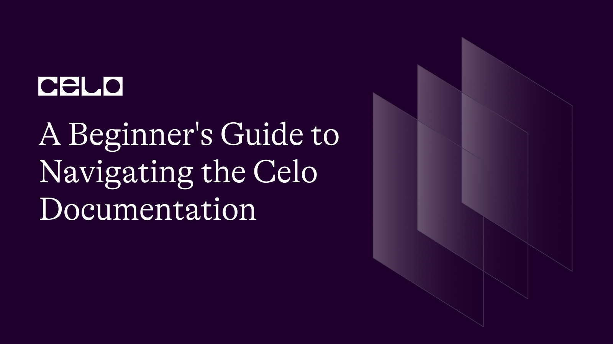

## Introduction

So, You can be a web3 developer who wants to start a journey with CELO, you may be a web2 developer who wants to start with the web3 development, or you may not be a developer at all and still, want to jump into web3 world and explore with it. For you guys and also many such scenarios, CELO got you covered, As we know CELO is a mobile-first ecosystem, and with this, it is trying to get blockchain to the masses, now CELO knows it very well, that by just providing the technology it will not make the bigger impact which it wants to achieve, so it has one of the best systems to help anyone so that one can start understanding the tech and also can contribute to the such huge goal.

In this article, I will be helping you to navigate your way, so that you can utilize the potential of CELO to its fullest.

### Let’s get started

So as you search on the internet for the word CELO, The first link you will see will be celo.org after opening that you can see what CELO is doing

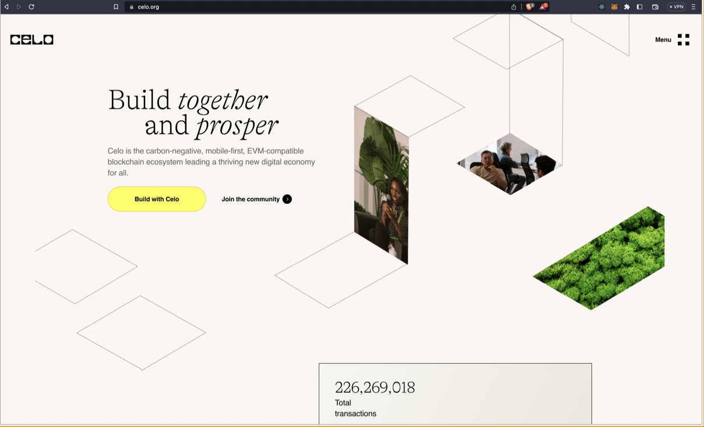

As you scroll down you will be able to see the beautiful animations which will help you to understand the three main achievements of the CELO

After that, you will be able to see what can be done with CELO

After that, there are many beautiful sections that you can browse through to see their vision, explore more about the ecosystem, and more

Now after that, you will be able to see this section

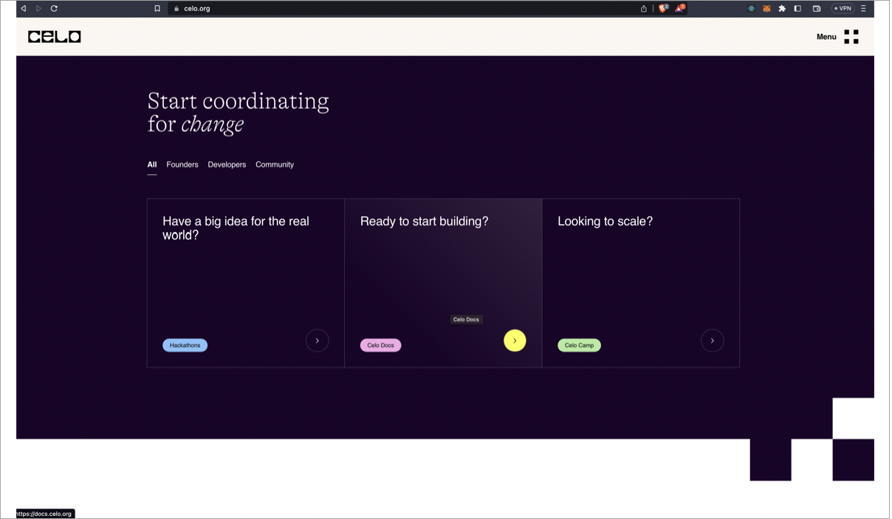

In hackathons sections, you will be able to see the events of CELO,

In the Second section, Ready to start building you will able to access the [docs.org](docs.org)

And in the third section, you will be able to see the CELO camps, where you can apply for the camp, and can get funding for your blockchain project

In this article, we will be discussing the second section which is [celo.docs.org](celo.docs.org)

And this will welcome with you this beautiful home page

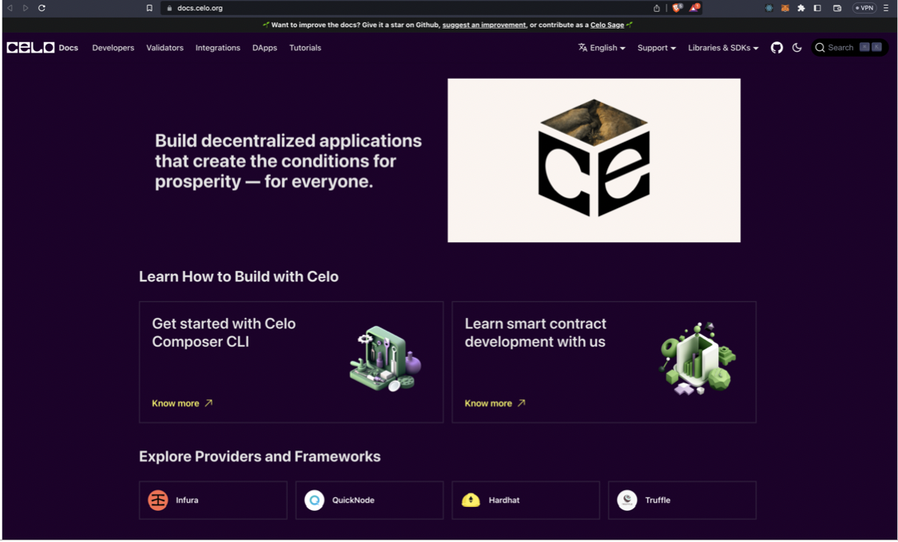

This will be the main website that you want to add to your bookmark section, as it will help you in your developing journey

You must start with the CELO composer CLI, as it allows you to quickly build, deploy and iterate on dApps using CELO

And you can learn more about it here with this link

- [celo-composer](https://github.com/celo-org/celo-composer)
- [celo-composer-gitbook](https://celo-composer.gitbook.io/docs/)

Or if you are familiar with EVM tools, you can start building with them too.

After that you can start here
[https://docs.celo.org/tutorials](https://docs.celo.org/tutorials)

As soon you will click this(above) link you will be redirected here

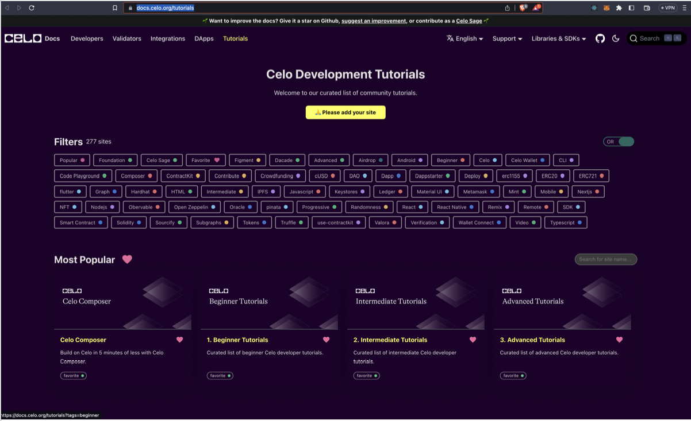

As you can see there are Beginner tutorials, Intermediate Tutorials, and advanced tutorials, You can start by exploring the Beginner tutorials

In each section, the articles are arranged in an alphabetical manner, which can be confusing for you, So here I will be trying to link some tutorials with which you can start,_(Shh-We are going to make this easier to navigate SOON)_

1. [Transition from web2 to web3](https://docs.celo.org/blog/tutorials/how-to-transition-from-web2-to-web3)

2. [3 simple steps to connect your metamask wallet to celo](https://docs.celo.org/blog/tutorials/3-simple-steps-to-connect-your-metamask-wallet-to-celo)

3. [Soliditiy from zero to hero](https://docs.celo.org/blog/tutorials/solidity-from-zero-to-hero) _(I know this is in intermediate section, but you must know solidity so I am suggesting you guys to have a read first for this article)_

4. [Celo-101](https://dacade.org/communities/celo/courses/celo-bc-101)

5. [Celo-cli a practical guide to energize your celo toolkit](https://docs.celo.org/blog/tutorials/celo-cli-a-practical-guide-to-energize-your-celo-toolkit)

6. [Celo for remix](https://learn.figment.io/tutorials/celo-for-remix)

7. [Deployng smart contracts on celo with truffle](https://learn.figment.io/tutorials/deploying-smart-contracts-on-celo-with-truffle)

8. [Hardhat and celo the ultimate guide to deploy celo dapps using hardhat](https://docs.celo.org/blog/tutorials/hardhat-and-celo-the-ultimate-guide-to-deploy-celo-dapps-using-hardhat)

I think after following the order, you will be easily able to make out which articles you want to follow to start your development journey

Now let’s talk about the documentation of the CELO, you can learn about the CELO, through its whitepapers and other such stuff

Here is the link- [white papers](https://docs.celo.org/general/whitepapers)

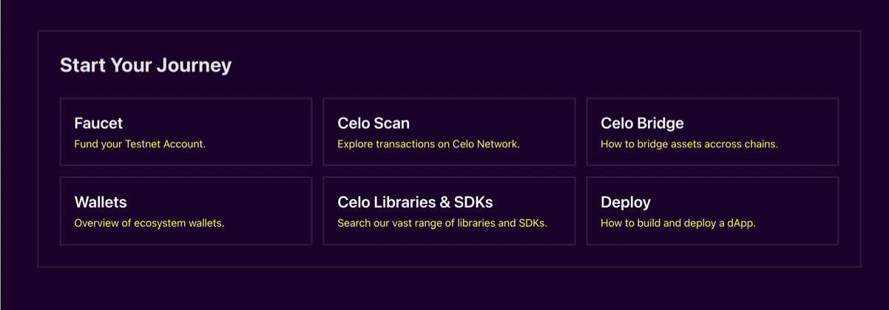

Now you can come back to the home page and then can go to the above-shown section, here you can see

Faucet-From here you can get test tokens for your CELO testnet accounts

CELO scan- It is used to see the transactions on the CELO network

And then you can explore CELO libraries and SDKs to explore more about your development journey

After doing these steps let's try to understand the filters
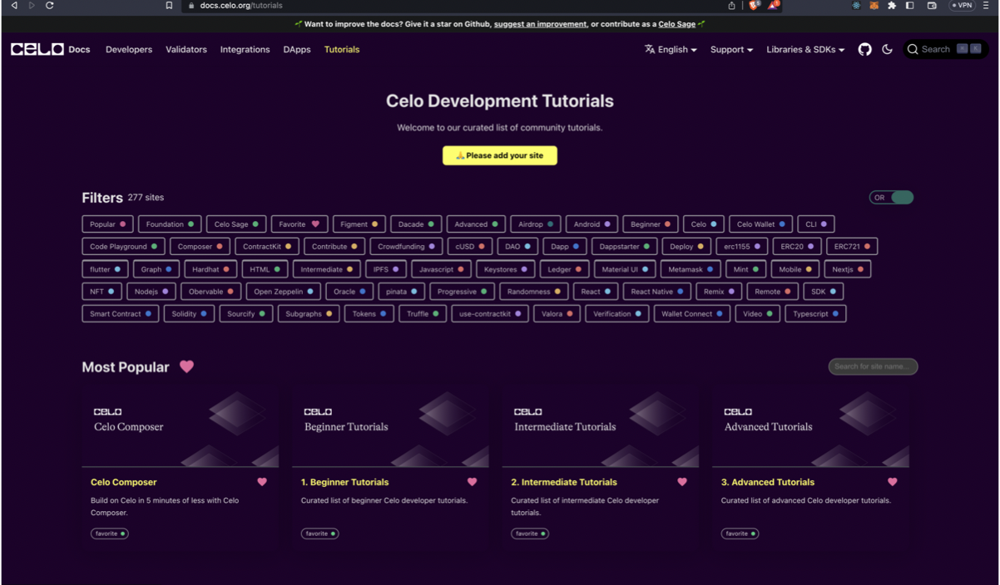

You can find the above-shown page here [tutorials](https://docs.celo.org/tutorials)

Filters-Filters are nothing but something exactly like tags, we authors add the tags to our articles so that it can be easy for you guys to catch an article with the help of tags, but I can understand that finding an article directly from the filters is difficult, so what you can do is, you can use filters after jumping into any one of the four Top cards which you can see in the photos, the top four cards are CELO Composer, Beginner Tutorials, Intermediate Tutorials, Advanced Tutorials, and in that finding a card with the help of filters will be helpful

You can see that there is one toggle switch on the right side in the filters section, it is for the filters you can get a combination of filters by selecting AND, like for example someone can select smart contract and solidity.

Now after completing the beginner tutorials section let's jump into the Intermediate tutorials section - [intermediate](https://docs.celo.org/tutorials?tags=intermediate)

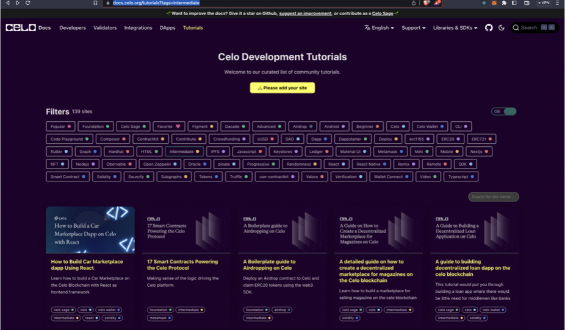

Now here also I will try to give some order of the tutorials because here the articles are set in alphabetical order

1. [Best practices for writing smart contract with real world examples](https://docs.celo.org/blog/tutorials/best-practices-for-writing-smart-contracts-with-real-world-examples)

2. [How to redeploy your ethereum dapp to celo with hardhat](https://docs.celo.org/blog/tutorials/how-to-redeploy-your-ethereum-dApp-to-celo-with-hardhat)

3. [Step-by-step guide to deploying your first full stack dapp on celo](https://docs.celo.org/blog/tutorials/step-by-step-guide-to-deploying-your-first-full-stack-dapp-on-celo)

4. [Regenerative finance and celo the process and partnership](https://docs.celo.org/blog/tutorials/regenerative-finance-and-celo-the-process-and-partnership)

5. [Send celo and cusd](https://learn.figment.io/tutorials/send-celo-and-cusd)

6. [Introduction to dappkit](https://learn.figment.io/tutorials/introduction-to-dappkit)

And after that, you will be off to set the excellent tutorials around in this section which will help you

Now just to give a rest to your developer side for a bit, and want to improve the skills, like tips for hackathons and stuff, I have written some articles, which you can give a read

1. [Basics of blockchain](https://docs.celo.org/blog/tutorials/blockchain-basics-an-introduction-to-web3-terms-and-concepts-with-celo) _(For clearing your fundamentals related to Blockchain and web3 stuff)_

2. [Build in Public](https://docs.celo.org/blog/tutorials/build-in-public-tips-for-making-an-impact) _(This is for the tips to grow your portfolio as a developer on Twitter(Here is Celo-sage’s Twitter- Give a follow for an amazing time- [Celo-Sage Twitter](twitter.com/celosages)))_

3. [Intersection of Web3 and AI](https://docs.celo.org/blog/tutorials/exploring-the-intersection-of-artificial-intelligence-and-web3) _(The article on a hot topic that How AI can be utilized to improve the development in web3 domain)_

4. [Hackathons-101](https://docs.celo.org/blog/tutorials/hackathons-101-everything-you-need-to-know-about-hackathons) _(It has tips and tricks which can help you to have a great hackathon)_

Now for the advanced section, I would like to keep it open, as after completing the beginners and intermediate sections, you will be able to decide the articles to follow, You have to follow as per your interest.

Now here are the amazing dApps
[dApps](https://docs.celo.org/showcase)

On the home page, there is one more section, which can help you, to explore the docs with the category

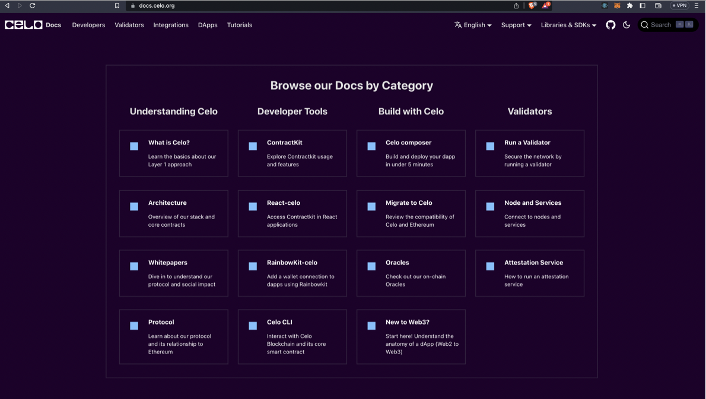

But here also the order which can be beneficial to you is

1. Understanding Celo Section
2. Build with Celo Section
3. Developer Tools section
4. Validators section

Note-Keep in mind to follow this after following the above articles which are mentioned in this article

After this, you can explore the providers and frameworks which support CELO, and if you think you can integrate with it, give it a go

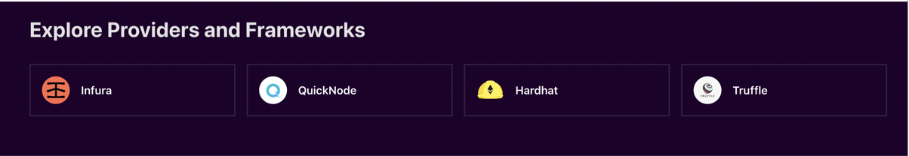

After going through this, if you feel that you can improve the docs be a contributor by joining the CELO sage program - [celo-sage](https://docs.celo.org/community/celo-sage)

Or you can submit an issue too- [Submit your issues here](https://github.com/celo-org/docs/issues/new)

And after all, this, don’t forget to see the footer section of the site

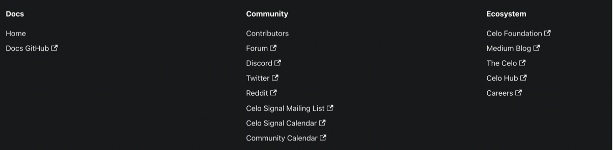

You can join us in discord- [discord invite](https://discord.com/invite/atBpDfqQqX)
Participate in our Forums-[Forums](https://forum.celo.org/)
On Twitter-[Twitter](https://twitter.com/CeloOrg)
On Reddit-[Reddit](https://www.reddit.com/r/celo/)
Join The mailing list, so that you can get notified when new articles, come out because I am sure you don’t want to miss the opportunity-[Mailing List](https://share.hsforms.com/1Qrhush1vSA2WIamd_yL4ow53n4j)

_(WE ARE WAITING FOR YOU TO JOIN )_

And you can explore the ecosystem

[Medium Blog](https://blog.celo.org/)
[The CELO](https://thecelo.com/)
[CELO HUB](https://celohub.org/)
[CELO careers](https://celo.org/careers)

## Conclusion

In this article, you will be able to have the clarity that you can use the CELO docs, to make your developing journey, smooth and easy, after this you will be able to develop at a speed without much confusion.

## About the author

I am Ishan Pathak, I am a Frontend Developer, I am a UI/UX designer, I am still in college and also maintaining a community of my own to help all the students around me

GitHub - [https://github.com/Ishanpathak1](https://github.com/Ishanpathak1)
Linkedln - [https://www.linkedin.com/in/ishan-pathak-96852a1b7/](https://www.linkedin.com/in/ishan-pathak-96852a1b7/)
