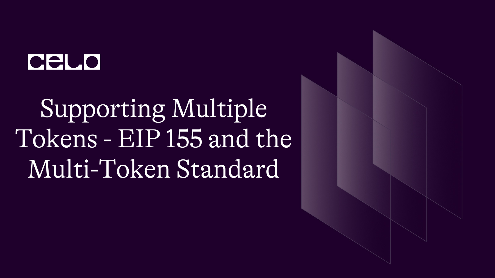

## 🌱 Introduction

Celo is an open-source blockchain platform that aims to make financial systems more accessible to people worldwide. Smart contracts are a key feature of Celo, as they allow for the creation of decentralized applications and the execution of complex financial transactions. Foundry is a development tool that simplifies the process of building and deploying smart contracts on the Celo blockchain. In this guide, we will walk you through the process of deploying smart contracts on Celo using Foundry.

## 🗈 Prerequisites

Before you can deploy smart contracts on Celo using Foundry, you need to have the following prerequisites:

- A basic understanding of smart contracts and their deployment process
- Node.js and npm installed on your computer
- A Celo wallet with testnet CELO tokens
- Foundry CLI installed on your computer
- Step 1: Create a new project
- To create a new project using Foundry, you need to run the following

## What is EIP-155 Standards

The world of blockchain and cryptocurrencies is constantly evolving. As new use cases and applications for blockchain technology are being discovered, the need for more advanced and efficient features has become apparent. One of the areas that have seen a lot of development in recent years is the support for multiple tokens within a single smart contract.

The Ethereum platform has been at the forefront of this development, with the introduction of EIP 155 and the Multi-Token Standard. These two features have made it possible for smart contracts to support multiple tokens, each with its own unique properties and functions.

## EIP-155

EIP 155 is a proposal that was introduced to the Ethereum platform in 2016. The purpose of this proposal was to improve the security of transactions on the platform by introducing a new transaction signing scheme. This new scheme would ensure that transactions would be signed with the same private key, regardless of which token was being used.

Before the introduction of EIP 155, each token on the Ethereum platform required its own separate private key. This created a lot of confusion and made it difficult for users to keep track of their tokens. With EIP 155, users can now use a single private key to sign transactions for all of their tokens, making the process much more streamlined and efficient.

## What is The Multi-Token Standard

The Multi-Token Standard is a set of guidelines that was introduced to the Ethereum platform in 2017. These guidelines provide a framework for smart contracts to support multiple tokens within a single contract. By following these guidelines, developers can create smart contracts that can support multiple tokens, each with its own unique properties and functions.

The Multi-Token Standard is particularly useful for tokens that have different use cases or functionalities. For example, the ERC-20 token standard is commonly used for fungible tokens, while the ERC-721 token standard is used for non-fungible tokens (NFTs). By using the Multi-Token Standard, developers can create a smart contract that supports both ERC-20 and ERC-721 tokens, allowing users to interact with both types of tokens within a single contract.

## Smart Contract Code

Here is an example of a smart contract that implements the Multi-Token Standard:

```solidity
// SPDX-License-Identifier: MIT
pragma solidity ^0.8.0;

import "@openzeppelin/contracts/token/ERC1155/ERC1155.sol";
import "@openzeppelin/contracts/access/Ownable.sol";

contract MyERC1155Token is ERC1155, Ownable {
    constructor() ERC1155("https://example.com/api/token/{id}.json") {}

    function mint(address account, uint256 id, uint256 amount, bytes memory data) public onlyOwner {
        _mint(account, id, amount, data);
    }

    function mintBatch(address to, uint256[] memory ids, uint256[] memory amounts, bytes memory data) public onlyOwner {
        _mintBatch(to, ids, amounts, data);
    }

    function burn(address account, uint256 id, uint256 amount) public {
        require(msg.sender == account || msg.sender == owner(), "caller is not owner nor account");
        _burn(account, id, amount);
    }
}
```

You can check Contract Code [Here](https://gist.github.com/developerkunal/a7cadab95e588e1c1ed20a82d2494c03#file-multitoken-sol)

**_This contract inherits from the OpenZeppelin ERC1155 and Ownable contracts. It has a constructor that sets the metadata URL for the token. Here's an explanation of the three functions in the contract:_**

- mint: This function allows the owner of the contract to mint new tokens and assign them to a specific account. The account parameter is the address that will receive the newly minted tokens, id is the ID of the token to be minted, amount is the number of tokens to mint, and data is any additional data to include with the minting transaction.

- mintBatch: This function allows the owner of the contract to mint multiple tokens and assign them to a specific account. The to parameter is the address that will receive the newly minted tokens, ids is an array of the IDs of the tokens to be minted, amounts is an array of the numbers of tokens to mint for each corresponding ID, and data is any additional data to include with the minting transaction.

- burn: This function allows a token holder to burn (destroy) their tokens. The account parameter is the address of the token holder, id is the ID of the token to burn, and amount is the number of tokens to burn. Only the token holder or the owner of the contract can call this function.

- Note that this is just an example implementation, and you should always thoroughly test and audit your smart contract before deploying it on the blockchain.

## Resolving Issues with ERC-20 and ERC-721 Tokens

Before the introduction of the Multi-Token Standard, there were issues with how ERC-20 and ERC-721 tokens interacted with each other. For example, it was difficult for users to trade ERC-20 tokens for ERC-721 tokens and vice versa. This made it challenging for developers to create dApps that required the use of both types of tokens.

The Multi-Token Standard solves this issue by allowing developers to create smart contracts that support both ERC-20 and ERC-721 tokens. This makes it possible for users to trade and exchange both types of tokens within a single contract, providing a more seamless user experience.

In addition, the Multi-Token Standard also allows for the creation of more complex and sophisticated smart contracts. For example, a smart contract could be created that allows users to trade a specific ERC-20 token for a unique ERC-721 NFT. This type of functionality was not possible before the introduction of the Multi-Token Standard.

Overall, the Multi-Token Standard and EIP 155 have made it much easier for developers to create smart contracts that support multiple tokens. By providing a framework for smart contracts to support both ERC-20 and ERC-721 tokens, developers can create more sophisticated and complex applications on the Ethereum platform.

## Conclusion

Supporting multiple tokens within a single smart contract is an important development in the world of blockchain and cryptocurrencies. The introduction of EIP 155 and the Multi-Token Standard has made it possible for developers to create smart contracts that support both ERC-20 and ERC-721 tokens, providing a more seamless user experience and enabling the creation of more sophisticated applications.

As the world of blockchain continues to evolve, we can expect to see further developments in the support for multiple tokens within smart contracts. With the introduction of new token standards and proposals, the possibilities for smart contracts on the Ethereum platform are truly endless.

## About Author

Hi! My name is Kunal Dawar and I am a Full Stack web2/web3 Developer. I have participated in numerous hackathons and have been fortunate enough to win many of them.

One thing that I am truly passionate about is creating things that are reliable and don't break easily. I believe that creating high-quality products is important not only for the users but also for the overall growth and success of a business.

In my free time, I enjoy learning about new technologies and staying up-to-date with the latest trends in the field. I also love to share my knowledge with others and mentor those who are interested in pursuing a career in web development.
