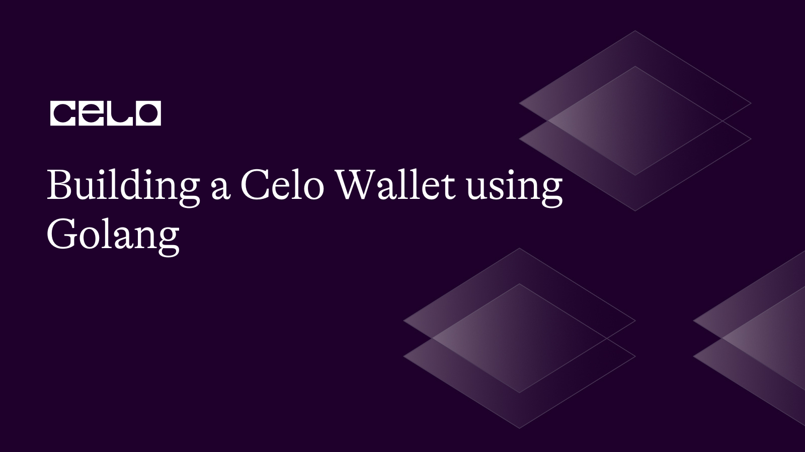

## Introduction

Celo is a decentralized open-source mobile-first blockchain that allows users to send, receive and store digital assets securely and easily. Cryptocurrency wallets are secure digital applications or wallets used to manage, store and interact with blockchian assets. These wallets allows users to receive, send and manage their digital assets such as cryptocurrencies like Ethereum, Celo, Bitcoin, etc.

In this article, we will implement a cryptocurrency wallet using Solidity and Golang (a light weight and secure programming language used for building secure server side applications).

Our wallet will have the following features:

1. Generating a new Celo wallet
2. Importing an existing Celo wallet
3. Wallet encryption and password protection
4. Check wallet balance
5. Send and receive transactions

## Prerequisites

In this tutorial, we’ll be implementing a custom token on Celo with Golang, so before we begin, you should have some familiarity with the following technologies:

- Go programming language
- Celo blockchain

## Requirements

Before we get started, make sure you have the following installed:

- [Go programming language](https://go.dev/doc/) (version 1.13 or higher)
- [Node.js](https://nodejs.org/en/docs) (version 10 or higher)
- [Git](https://git-scm.com/downloads)
- Text editor (e.g. Visual Studio Code)
- [Go Ethereum](https://github.com/ethereum/go-ethereum)

### What are the main components of a Cryptocurrency wallet?

1. A public key, often known as an address, is created from the wallet's private key. To share digital items with other people, this public key serves as an address. It is comparable to a bank account number or email address.
2. Private key: An encrypted code that only the wallet's owner knows. To prove ownership of the digital assets in the wallet, transactions are signed and authorized using the private key. The wallet's assets could be permanently lost if the private key were to be lost or hacked, hence maintaining its security is essential.

### Step 1: Set up development environment

On your terminal, create a new directory for this project:

```bash
mkdir celo-wallet
cd celo-wallet
```

Initialize a new Go module:

```bash
go mod init celo-wallet
```

Install the Celo blockchain package:

```bash
go get -u github.com/ethereum/go-ethereum
```

Note: This Go Ethereum package created by Celo is a fork of the main Go Ethereum package. If you are having any import errors, just go to your terminal and run:

### Step 2: Connect to the Celo Testnet

In your root project directory, create a new file called ‘main.go’ and paste the following code:

```go
package main

import (
	"context"
	"crypto/ecdsa"
	"encoding/hex"
	"fmt"
	"log"
	"math/big"

	"github.com/ethereum/go-ethereum/accounts/abi/bind"
	"github.com/ethereum/go-ethereum/accounts/keystore"
	"github.com/ethereum/go-ethereum/common"
	"github.com/ethereum/go-ethereum/core/types"
	"github.com/ethereum/go-ethereum/crypto"
	"github.com/ethereum/go-ethereum/crypto/secp256k1"
	"github.com/ethereum/go-ethereum/ethclient"
)

const nodeURL = "https://alfajores-forno.celo-testnet.org"

func main() {
	client, err := ethclient.Dial(nodeURL)
	if err != nil {
		log.Fatalf("Failed to connect to the Ethereum network: %v", err)
	}
	defer client.Close()

	// replace with your own private key
	privateKeyHex := ""

	// Load the private key
	privateKeyBytes, err := hex.DecodeString(privateKeyHex)
	if err != nil {
		log.Fatal(err)
	}

	privateKey, err := crypto.ToECDSA(privateKeyBytes)
	if err != nil {
		log.Fatal(err)
	}
}
```

The code above allows us to connect to the Celo Alfajores or Testnet and also loads our private key from a hex string.

### Step 3: Generating a new wallet

Next, create a function for generating a new Cello wallet

```go
func newWallet() {
	// Generate a new Celo wallet
	privateKey, publicKey, celoAddress, err := generateNewWallet()
	if err != nil {
		log.Fatal(err)
	}

	fmt.Printf("Private key: %x\n", privateKey.D)
	fmt.Printf("Public key: %x\n", publicKey)
	fmt.Printf("Celo address: %s\n", celoAddress.Hex())
}

func generateNewWallet() (*ecdsa.PrivateKey, []byte, common.Address, error) {
	// Generate a private key using the secp256k1 curve
	privateKey, err := crypto.GenerateKey()
	if err != nil {
		return nil, nil, common.Address{}, err
	}

	// Derive the public key from the private key
	publicKey := privateKey.Public().(*ecdsa.PublicKey)

	// Convert the public key to compressed format
	publicKeyBytes := secp256k1.CompressPubkey(publicKey.X, publicKey.Y)

	// Generate the Celo address from the public key
	celoAddress := crypto.PubkeyToAddress(*publicKey)

	return privateKey, publicKeyBytes, celoAddress, nil
}

```

The code above generates a new wallet and a public key, private key and wallet address and prints them.

Now call the “newWallet” function in your main function:

```go
func main() {
	...

	newWallet()

}
```

### Step 4: Importing an existing Celo wallet

Next, create a function that allows a user to import an existing wallet using a private key hex.

```go
 func existingWallet() {
	// replace with your own private key
	privateKeyHex := ""

	// Import an existing Celo wallet
	privateKey, publicKey, celoAddress, err := importWallet(privateKeyHex)
	if err != nil {
		log.Fatal(err)
	}

	fmt.Printf("Private key: %x\n", privateKey.D)
	fmt.Printf("Public key: %x\n", publicKey)
	fmt.Printf("Celo address: %s\n", celoAddress.Hex())

}

func importWallet(privateKeyHex string) (*ecdsa.PrivateKey, []byte, common.Address, error) {
	// Decode the private key from hex string
	privateKeyBytes, err := hex.DecodeString(privateKeyHex)
	if err != nil {
		return nil, nil, common.Address{}, err
	}

	// Load the private key
	privateKey, err := crypto.ToECDSA(privateKeyBytes)
	if err != nil {
		return nil, nil, common.Address{}, err
	}

	// Derive the public key from the private key
	publicKey := privateKey.Public().(*ecdsa.PublicKey)

	// Convert the public key to compressed format
	publicKeyBytes := secp256k1.CompressPubkey(publicKey.X, publicKey.Y)

	// Generate the Celo address from the public key
	celoAddress := crypto.PubkeyToAddress(*publicKey)

	return privateKey, publicKeyBytes, celoAddress, nil
}
```

```go
 func main() {
	...

	existingWallet()

}
```

### Step 5: Wallet encryption and password protection

Next, we need to implement functionalities to encrypt and decrypt the wallet to make it more secure.

```go
func encryptWallet(privateKey *ecdsa.PrivateKey, password string) (string, error) {
	keyJSON, err := keystore.EncryptKey(&keystore.Key{
		PrivateKey: privateKey,
		Address:    crypto.PubkeyToAddress(privateKey.PublicKey),
	}, password, keystore.StandardScryptN, keystore.StandardScryptP)

	if err != nil {
		return "", err
	}

	return string(keyJSON), nil
}

func decryptWallet(encryptedWallet string, password string) (*ecdsa.PrivateKey, error) {
	key, err := keystore.DecryptKey([]byte(encryptedWallet), password)
	if err != nil {
		return nil, err
	}

	return key.PrivateKey, nil
}

func walletProtect() {
	// replace with your own private key
	privateKeyHex := ""

	// Load the private key
	privateKeyBytes, err := hex.DecodeString(privateKeyHex)
	if err != nil {
		log.Fatal(err)
	}

	privateKey, err := crypto.ToECDSA(privateKeyBytes)
	if err != nil {
		log.Fatal(err)
	}

	// Example password for encrypting the wallet
	password := "your-strong-password"

	// Encrypt the wallet
	encryptedWallet, err := encryptWallet(privateKey, password)
	if err != nil {
		log.Fatal(err)
	}

	fmt.Println("Encrypted wallet:", encryptedWallet)

	// Decrypt the wallet
	decryptedPrivateKey, err := decryptWallet(encryptedWallet, password)
	if err != nil {
		log.Fatal(err)
	}

	fmt.Printf("Decrypted private key: %x\n", decryptedPrivateKey.D)
}
```

```go
 func main() {
	...

	walletProtect()

}
```

### Step 5: Check wallet balance

Next, we will implement a function that allows users to check their balances in their wallets

```go
func checkWalletBalance(client *ethclient.Client, privateKey *ecdsa.PrivateKey) {
	// Check wallet balance
	address := crypto.PubkeyToAddress(privateKey.PublicKey)
	balance, err := client.BalanceAt(context.Background(), address, nil)
	if err != nil {
		log.Fatal(err)
	}
	fmt.Printf("Wallet balance: %s\n", balance.String())

}
```

```go
func main() {
	...

	checkWalletBalance(client, privateKey)

}
```

### Step 6: Send and receive transactions

The final functionality that would be implemented in our wallet are functions that allows users to send and receive tokens into their wallets

```go
func send(client *ethclient.Client) {
	// (replace with your own private key)
	privateKeyHex := ""

	// Load the private key
	privateKeyBytes, err := hex.DecodeString(privateKeyHex)
	if err != nil {
		log.Fatal(err)
	}

	privateKey, err := crypto.ToECDSA(privateKeyBytes)
	if err != nil {
		log.Fatal(err)
	}

	// Send a transaction
	toAddress := common.HexToAddress("0x8BdDeC1b7841bF9eb680bE911bd22051f6a00815")
	value := big.NewInt(100000000000000000) // 0.1 CELO

	txHash, err := sendTransaction(client, privateKey, toAddress, value)
	if err != nil {
		log.Fatal(err)
	}

	fmt.Printf("Transaction hash: %s\n", txHash.Hex())
}

func sendTransaction(client *ethclient.Client, privateKey *ecdsa.PrivateKey, toAddress common.Address, value *big.Int) (common.Hash, error) {
	// Create a new transactor
	fromAddress := crypto.PubkeyToAddress(privateKey.PublicKey)
	nonce, err := client.PendingNonceAt(context.Background(), fromAddress)
	if err != nil {
		return common.Hash{}, err
	}

	// Assuming you have an Ethereum client instance named 'client'
	gasPrice, err := client.SuggestGasPrice(context.Background())
	if err != nil {
		log.Fatalf("Failed to get the gas price: %v", err)
	}

	// Increase the gas price by 10% (or more, depending on how quickly you want the transaction to be mined)
	gasPrice = gasPrice.Mul(gasPrice, big.NewInt(11)).Div(gasPrice, big.NewInt(10))

	// Assuming you have an Ethereum client instance named 'client'
	chainID, err := client.ChainID(context.Background())
	if err != nil {
		log.Fatalf("Failed to get the chain ID: %v", err)
	}

	// Assuming you have a private key instance named 'privateKey'
	auth, err := bind.NewKeyedTransactorWithChainID(privateKey, chainID)
	if err != nil {
		log.Fatalf("Failed to create the auth object: %v", err)
	}

	auth.Nonce = big.NewInt(int64(nonce))
	auth.Value = value
	auth.GasLimit = uint64(21000)
	auth.GasPrice = gasPrice

	tx := types.NewTransaction(auth.Nonce.Uint64(), toAddress, auth.Value, auth.GasLimit, auth.GasPrice, nil)
	signedTx, err := auth.Signer(auth.From, tx)
	if err != nil {
		return common.Hash{}, err
	}

	err = client.SendTransaction(context.Background(), signedTx)
	if err != nil {
		return common.Hash{}, err
	}

	return signedTx.Hash(), nil
}

```

```go
func main() {
	...

	checkWalletBalance(client, privateKey)

}
```

Our final code should look like this:

```go
package main

import (
	"context"
	"crypto/ecdsa"
	"encoding/hex"
	"fmt"
	"log"
	"math/big"

	"github.com/ethereum/go-ethereum/accounts/abi/bind"
	"github.com/ethereum/go-ethereum/accounts/keystore"
	"github.com/ethereum/go-ethereum/common"
	"github.com/ethereum/go-ethereum/core/types"
	"github.com/ethereum/go-ethereum/crypto"
	"github.com/ethereum/go-ethereum/crypto/secp256k1"
	"github.com/ethereum/go-ethereum/ethclient"
)

const nodeURL = "https://alfajores-forno.celo-testnet.org"

func main() {
	client, err := ethclient.Dial(nodeURL)
	if err != nil {
		log.Fatalf("Failed to connect to the Ethereum network: %v", err)
	}
	defer client.Close()

	// replace with your own private key
	privateKeyHex := ""

	// Load the private key
	privateKeyBytes, err := hex.DecodeString(privateKeyHex)
	if err != nil {
		log.Fatal(err)
	}

	privateKey, err := crypto.ToECDSA(privateKeyBytes)
	if err != nil {
		log.Fatal(err)
	}

	newWallet()

	existingWallet()

	walletProtect()

	send(client)

	checkWalletBalance(client, privateKey)

}

func send(client *ethclient.Client) {
	// (replace with your own private key)
	privateKeyHex := ""

	// Load the private key
	privateKeyBytes, err := hex.DecodeString(privateKeyHex)
	if err != nil {
		log.Fatal(err)
	}

	privateKey, err := crypto.ToECDSA(privateKeyBytes)
	if err != nil {
		log.Fatal(err)
	}

	// Send a transaction
	toAddress := common.HexToAddress("0x8BdDeC1b7841bF9eb680bE911bd22051f6a00815")
	value := big.NewInt(100000000000000000) // 0.1 CELO

	txHash, err := sendTransaction(client, privateKey, toAddress, value)
	if err != nil {
		log.Fatal(err)
	}

	fmt.Printf("Transaction hash: %s\n", txHash.Hex())
}

func newWallet() {
	// Generate a new Celo wallet
	privateKey, publicKey, celoAddress, err := generateNewWallet()
	if err != nil {
		log.Fatal(err)
	}

	fmt.Printf("Private key: %x\n", privateKey.D)
	fmt.Printf("Public key: %x\n", publicKey)
	fmt.Printf("Celo address: %s\n", celoAddress.Hex())
}

func existingWallet() {
	// replace with your own private key
	privateKeyHex := ""

	// Import an existing Celo wallet
	privateKey, publicKey, celoAddress, err := importWallet(privateKeyHex)
	if err != nil {
		log.Fatal(err)
	}

	fmt.Printf("Private key: %x\n", privateKey.D)
	fmt.Printf("Public key: %x\n", publicKey)
	fmt.Printf("Celo address: %s\n", celoAddress.Hex())

}

func walletProtect() {
	// replace with your own private key
	privateKeyHex := ""

	// Load the private key
	privateKeyBytes, err := hex.DecodeString(privateKeyHex)
	if err != nil {
		log.Fatal(err)
	}

	privateKey, err := crypto.ToECDSA(privateKeyBytes)
	if err != nil {
		log.Fatal(err)
	}

	// Example password for encrypting the wallet
	password := "your-strong-password"

	// Encrypt the wallet
	encryptedWallet, err := encryptWallet(privateKey, password)
	if err != nil {
		log.Fatal(err)
	}

	fmt.Println("Encrypted wallet:", encryptedWallet)

	// Decrypt the wallet
	decryptedPrivateKey, err := decryptWallet(encryptedWallet, password)
	if err != nil {
		log.Fatal(err)
	}

	fmt.Printf("Decrypted private key: %x\n", decryptedPrivateKey.D)
}

func importWallet(privateKeyHex string) (*ecdsa.PrivateKey, []byte, common.Address, error) {
	// Decode the private key from hex string
	privateKeyBytes, err := hex.DecodeString(privateKeyHex)
	if err != nil {
		return nil, nil, common.Address{}, err
	}

	// Load the private key
	privateKey, err := crypto.ToECDSA(privateKeyBytes)
	if err != nil {
		return nil, nil, common.Address{}, err
	}

	// Derive the public key from the private key
	publicKey := privateKey.Public().(*ecdsa.PublicKey)

	// Convert the public key to compressed format
	publicKeyBytes := secp256k1.CompressPubkey(publicKey.X, publicKey.Y)

	// Generate the Celo address from the public key
	celoAddress := crypto.PubkeyToAddress(*publicKey)

	return privateKey, publicKeyBytes, celoAddress, nil
}

func generateNewWallet() (*ecdsa.PrivateKey, []byte, common.Address, error) {
	// Generate a private key using the secp256k1 curve
	privateKey, err := crypto.GenerateKey()
	if err != nil {
		return nil, nil, common.Address{}, err
	}

	// Derive the public key from the private key
	publicKey := privateKey.Public().(*ecdsa.PublicKey)

	// Convert the public key to compressed format
	publicKeyBytes := secp256k1.CompressPubkey(publicKey.X, publicKey.Y)

	// Generate the Celo address from the public key
	celoAddress := crypto.PubkeyToAddress(*publicKey)

	return privateKey, publicKeyBytes, celoAddress, nil
}

func encryptWallet(privateKey *ecdsa.PrivateKey, password string) (string, error) {
	keyJSON, err := keystore.EncryptKey(&keystore.Key{
		PrivateKey: privateKey,
		Address:    crypto.PubkeyToAddress(privateKey.PublicKey),
	}, password, keystore.StandardScryptN, keystore.StandardScryptP)

	if err != nil {
		return "", err
	}

	return string(keyJSON), nil
}

func decryptWallet(encryptedWallet string, password string) (*ecdsa.PrivateKey, error) {
	key, err := keystore.DecryptKey([]byte(encryptedWallet), password)
	if err != nil {
		return nil, err
	}

	return key.PrivateKey, nil
}

func checkWalletBalance(client *ethclient.Client, privateKey *ecdsa.PrivateKey) {
	// Check wallet balance
	address := crypto.PubkeyToAddress(privateKey.PublicKey)
	balance, err := client.BalanceAt(context.Background(), address, nil)
	if err != nil {
		log.Fatal(err)
	}
	fmt.Printf("Wallet balance: %s\n", balance.String())

}

func sendTransaction(client *ethclient.Client, privateKey *ecdsa.PrivateKey, toAddress common.Address, value *big.Int) (common.Hash, error) {
	// Create a new transactor
	fromAddress := crypto.PubkeyToAddress(privateKey.PublicKey)
	nonce, err := client.PendingNonceAt(context.Background(), fromAddress)
	if err != nil {
		return common.Hash{}, err
	}

	// Assuming you have an Ethereum client instance named 'client'
	gasPrice, err := client.SuggestGasPrice(context.Background())
	if err != nil {
		log.Fatalf("Failed to get the gas price: %v", err)
	}

	// Increase the gas price by 10% (or more, depending on how quickly you want the transaction to be mined)
	gasPrice = gasPrice.Mul(gasPrice, big.NewInt(11)).Div(gasPrice, big.NewInt(10))

	// Assuming you have an Ethereum client instance named 'client'
	chainID, err := client.ChainID(context.Background())
	if err != nil {
		log.Fatalf("Failed to get the chain ID: %v", err)
	}

	// Assuming you have a private key instance named 'privateKey'
	auth, err := bind.NewKeyedTransactorWithChainID(privateKey, chainID)
	if err != nil {
		log.Fatalf("Failed to create the auth object: %v", err)
	}

	auth.Nonce = big.NewInt(int64(nonce))
	auth.Value = value
	auth.GasLimit = uint64(21000)
	auth.GasPrice = gasPrice

	tx := types.NewTransaction(auth.Nonce.Uint64(), toAddress, auth.Value, auth.GasLimit, auth.GasPrice, nil)
	signedTx, err := auth.Signer(auth.From, tx)
	if err != nil {
		return common.Hash{}, err
	}

	err = client.SendTransaction(context.Background(), signedTx)
	if err != nil {
		return common.Hash{}, err
	}

	return signedTx.Hash(), nil
}
```

To run the application, on your terminal, run the following command:

```bash
go run main.go
```

You should see the results on your terminal:


## Conclusion

In this article, we have implemented a Celo wallet that can be used to store, send, and receive digital assets. You should now have a strong foundation on building a custom wallet and integrating it to existing applications.

## Next Steps

Consider adding the following features to your Celo wallet to further enhance and expand it:

1. Options for wallet backups and recovery
2. Support for more assets and tokens based on Celo
3. Support for multiple signatures for improved security

## About the Author

I am a Software engineer with an interest in Blockchain technology. I love picking up new technologies and sharing my knowledge as I learn to give back to the tech community. You can find one on [GitHub](https://github.com/Divine572) and [Twitter](https://twitter.com/divine_finix).

## References

1. [Celo Developer Documentation](https://docs.celo.org/)
2. [Go Programming Language Documentation](https://golang.org/doc/)
3. [Github repo](https://github.com/Divine572/Celo-Wallet)
