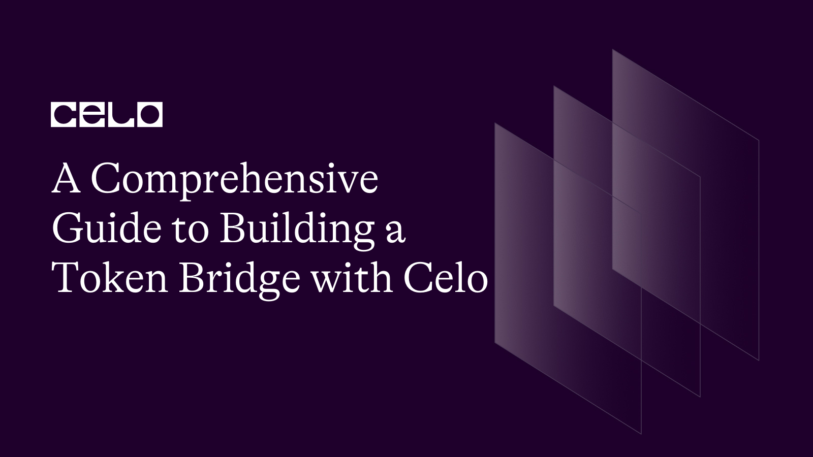
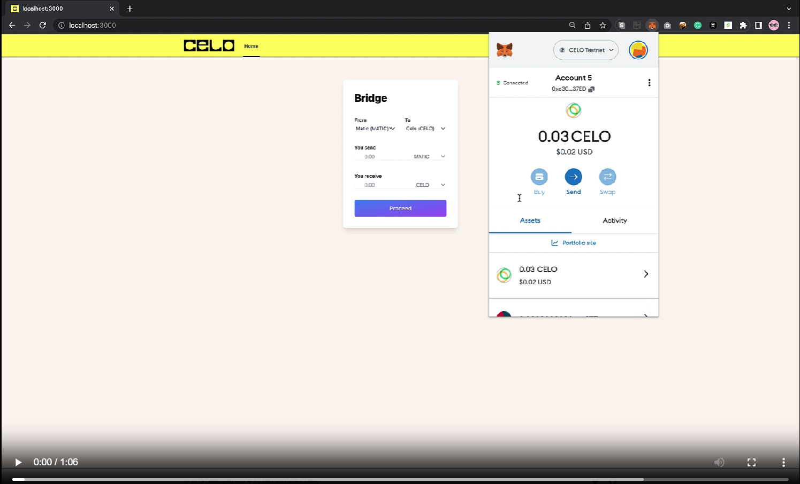

## Introduction

Have you ever wondered how to build a bridge that allows seamless transfer of assets between the Celo network and other Ethereum-based networks, such as the Ethereum mainnet or a testnet like Mumbai? This tutorial is for you. This guide will walk through the process of building a token bridge on Celo using Celo Composer, solidity and node.js. The dApp we will build bridges assets from Polygon testnet to Celo testnet. We are covering the deployments of related smart contracts, listening for events from the smart contract and finally building a frontend that displays the briding of assets between the networks.

## Background Knowledge

Token Bridges are interoperability protocol which allows users to move their owned Token on a certain chain or e.g cUSD on Celo between networks in a quick and cost-efficient manner. Such as switch the cUSD on Celo to MATIC on Polygon.

## Project Flow


## Project Demo

[](https://user-images.githubusercontent.com/7295729/229337139-b6dea0ac-9fe8-4126-a9a8-19ba66722cfb.mp4)


## Requirements

Prior to beginning this tutorial, it is important to ensure that your computer has the necessary tools installed. Please check that you have the following installed

- Node.js
- NPM (Node Package Manager)

## Github Code

For a more comprehensive understanding and implementation of this tutorial, check out the codebase [here](https://github.com/alofeoluwafemi/celotokenbridge)

## Celo Composer

If you are not aware of what Celo Composer is, it is a tool built by the Celo Devrel team which you can use to quickly build, deploy, and iterate on decentralized applications. Read more [here](https://github.com/celo-org/celo-composer)

Let's spin up something with Celo Composer starter app in few minutes.

Start by running the following command on your terminal.

`npx @celo/celo-composer create`

You will be prompted to select the framework you want to work with. In this case, we are using React.


You will also be prompted to pick a web3 library for the react app. Choose rainbowkit as that is what we will use.


You will also be prompted to choose the smart contract framework. Hardhat is what we will be working with. Choose hardhat

Additionally, you will be asked if you want to create a subgraph, we don't need to create one so we can select No.


Lastly, choose a name for your project


You did it! :confetti_ball::confetti_ball:

With this in place, we are ready to begin our token bridge.

> Note that you will need to import the network you want to bridge as Celo Composer gives priority to Celo networks so in packages >> react-app >> pages >> \_app.tsx add polygonMumbai to the list like this

```javascript
const { chains, provider } = configureChains(
  [Alfajores, Celo, polygonMumbai],
  [
    jsonRpcProvider({
      rpc: (chain) => ({ http: chain.rpcUrls.default.http[0] }),
    }),
  ]
);
```

## Writing your Smart Contract

Within your integrated development environment (IDE), navigate to the package directory and locate the hardhat folder.

`npm install @openzeppelin/contracts`

Still in the hardhat folder, you should find a contracts directory that contains built-in contracts. First things first, we create the contracts that holds the asset we want to send.

Create a new TokenBridgeMumbai solidity file.

```solidity
// SPDX-License-Identifier: MIT
pragma solidity ^0.8.0;

contract TokenBridgeMumbai {
    address public owner;
    mapping(address => uint256) public balances;

    modifier onlyOwner() {
        require(msg.sender == owner, "Only signer can call this function");
        _;
    }

    constructor() {
        owner = msg.sender;
    }

    event Deposit(address indexed depositor, uint256 amount);

    function sendMatic(
        uint256 amount,
        address payable recipient
    ) external onlyOwner {
        require(address(this).balance >= amount, "Not enough balance");
        bool success = recipient.send(amount);
        require(success, "Failed to send Matic!");
    }

    function depositMatic() external payable {
        require(msg.value > 0, "Amount must be greater than zero");
        balances[msg.sender] += msg.value;
        emit Deposit(msg.sender, msg.value);
    }

    receive() external payable {}
}
```

From here, we see that this contract is written to receive(hence payable) and lock up Matic. There is also another function to send matic from the contract. In that case, if another person interacts with the contract, the user will receive Matic for CELO.

Create a new TokenBridgeCelo solidity file.

```solidity
// SPDX-License-Identifier: MIT
pragma solidity ^0.8.0;

contract TokenBridgeCelo {
    address public owner;
    mapping(address => uint256) public balances;

    modifier onlyOwner() {
        require(msg.sender == owner, "Only signer can call this function");
        _;
    }

    constructor() {
        owner = msg.sender;
    }

    event Deposit(address indexed depositor, uint256 amount);

    function sendCelo(
        uint256 amount,
        address payable recipient
    ) external onlyOwner {
        require(address(this).balance >= amount, "Not enough balance");
        bool success = recipient.send(amount);
        require(success, "Failed to send Celo!");
    }

    function depositCelo() external payable {
        require(msg.value > 0, "Amount must be greater than zero");
        balances[msg.sender] += msg.value;
        emit Deposit(msg.sender, msg.value);
    }

    receive() external payable {}
}
```

From here, we see that this contract is written to receive(hence payable) and lock up CELO. There is also another function to send CELO from the contract. In that case, if another person interacts with the contract, the user will receive CELO for Matic.

An event is in both contracts called Deposit which is emitted in the function. This event will be called by a listener node js server that we will set up shortly.

After this, we will create a deployment file for the contract.

Create a `deploymumbai.js` to deploy the first contract TokenBridgeMumbai file. You can have this in the scripts folder. packages>> hardhat >> script. The code will look like this

```solidity
const hre = require("hardhat");

async function main() {
  const TokenBridgeMumbai = await hre.ethers.getContractFactory(
    "TokenBridgeMumbai"
  );
  const tokenBridgeMumbai = await TokenBridgeMumbai.deploy();
  await tokenBridgeMumbai.deployed();
  console.log(
    "TokenBridgeMumbai address deployed to:",
    tokenBridgeMumbai.address
  );
}

main();
```

Create another file `deploycelo.js` to deploy the second contract TokenBridgeCelo file. The code will look like this

```javascript
const hre = require("hardhat");

async function main() {
  const TokenBridgeCelo = await hre.ethers.getContractFactory(
    "TokenBridgeCelo"
  );
  const tokenBridgeCelo = await TokenBridgeCelo.deploy();
  await tokenBridgeCelo.deployed();
  console.log("TokenBridgeCelo address deployed to:", tokenBridgeCelo.address);
}

main();
```

> Make sure to create a `.env` file and keep all your environment variables in it, your account's private key and api keys that will be needed for deployment.

```
PRIVATE_KEY=YOUR_PRIVATE_KEY
CELOSCAN_API_KEY=YOUR_CELOSCAN_KEY
MUMBAI_RPC=https://rpc-mumbai.maticvigil.com
POLYSCAN_API_KEY=YOUR_POLYSCAN_KEY
CELO_NETWORK=https://alfajores-forno.celo-testnet.org
```

In your `hardhat.config.js` file which is still in the hardhat folder, edit your module exports to look similar to this

```javascript
module.exports = {
  defaultNetwork,
  networks: {
    localhost: {
      url: "http://127.0.0.1:8545",
      accounts: {
        mnemonic: DEVCHAIN_MNEMONIC,
      },
    },
    alfajores: {
      url: "https://alfajores-forno.celo-testnet.org",
      accounts: [process.env.PRIVATE_KEY],
      chainId: 44787,
    },
    celo: {
      url: "https://forno.celo.org",
      accounts: [process.env.PRIVATE_KEY],
      chainId: 42220,
    },
    mumbai: {
      url: "https://rpc-mumbai.maticvigil.com",
      accounts: [process.env.PRIVATE_KEY],
    },
  },
  etherscan: {
    apiKey: {
      alfajores: process.env.CELOSCAN_API_KEY,
      celo: process.env.CELOSCAN_API_KEY,
      mumbai: process.env.POLYSCAN_API_KEY,
    },
  },
  solidity: {
    version: "0.8.17",
  },
};
```

Run the following to deploy and verify your contracts

```shell
npx hardhat --network alfajores run scripts/deploycelo.js
npx hardhat --network mumbai run scripts/deploymumbai.js
```

```shell
npx hardhat verify --network alfajores REPLACE_YOUR_DEPLOYED_CONTRACT_ADDRESS_O
N_ALFAJORES
```

```shell
npx hardhat verify --network mumbai REPLACE_YOUR_DEPLOYED_CONTRACT_ADDRESS_ON_MUMBAI
```

## Set up your node.js server

In your hardhat folder still and still in the scripts folder. We will create a wrapper.js file. Here we call the contract with the deposit function

```javascript
// Import dependencies
require("dotenv").config();
const { providers, Contract, ethers } = require("ethers");
const { abi } = require("../../../TokenBridgeMumbai.json");
const bridgeMumbaiAddress = "0x27923264F18D9d6C9F7007B36FF5D50d56E12C97"; // address of the TokenBridgeMumbai contract

async function getMumbaiBridgeContract() {
  const bridgeMumbaiABI = abi; // ABI of the TokenBridgeMumbai contract
  let bridgeMumbaiContract;
  try {
    const { ethereum } = window; //  ethereum object from the window object
    console.log(ethereum.chainId);
    if (ethereum.chainId === "0x13881") {
      const provider = new providers.Web3Provider(ethereum);
      console.log("provider", provider);
      const signer = provider.getSigner();
      bridgeMumbaiContract = new Contract(
        bridgeMumbaiAddress,
        bridgeMumbaiABI,
        signer
      );
    } else {
      throw new Error("Please connect to the Mumbai network"); // Throw an error if not connected to the Mumbai network
    }
  } catch (error) {
    console.log("ERROR:", error);
  }
  console.log(bridgeMumbaiContract);
  return bridgeMumbaiContract; // Return the contract instance
}

async function start(amount) {
  const contract = await getMumbaiBridgeContract();
  console.log("bridge", await contract);
  const tx = contract.depositMatic({
    gasLimit: 300000,
    value: ethers.utils.parseUnits(amount, 18),
  });
  console.log(await tx);
  tx.then((receipt) => {
    console.log("Transaction receipt:", receipt);
  });
}

module.exports = { getMumbaiBridgeContract, start };
```

It's now time to create a node server that will listen for the Deposit event in our contract.

Create a watchMumbai.js file in the same folder as wrapper.js, you can decide to keep it anywhere too. Inside here, we can use the Celo ContractKit. The ContractKit is a library used for interacting with the Celo blockchain. Import the kit like below

```javascript
const {
  CeloContract,
  newKitFromWeb3,
  ContractKit,
} = require("@celo/contractkit");
```

To create an instance of the contract, all you need to do is

`const contract = new kit.web3.eth.Contract(YOUR_ABI, mumbaiContractAddress);`
`const mumbaiContractAddress = YOUR_CONTRACT_ADDRESS;`

Initialize providers for each of the networks as we need to refer to them as we proceed. These values can also be your environment variables.

```javascript
const providerCelo = new ethers.providers.JsonRpcProvider(
  "https://alfajores-forno.celo-testnet.org"
);
const providerMumbai = new ethers.providers.JsonRpcProvider(
  "https://rpc-mumbai.maticvigil.com"
);
```

Using ethers.js, create an interface that would be able to get filters

```javascript
const iface = new ethers.utils.Interface([
  "event Deposit(address indexed depositor, uint256 amount)",
]);

filter = {
  address: mumbaiContractAddress,
  topics: [
    // the name of the event, parnetheses containing the data type of each event, no spaces
    ethers.utils.id("Deposit(address,uint256)"),
  ],
};
```

Use ethers.js to listen for the Deposit function and invoke the function to send the equivalent CELO token.

```javascript
//Listen event
providerMumbai.on(filter, (event) => {
  const eventData = iface.decodeEventLog("Deposit", event.data, event.topics);
  console.log(iface.decodeEventLog("Deposit", event.data, event.topics));
  const amount = eventData.amount;
  const tx = fromContract
    .sendCelo(amount, toAddress)
    .then((d) => console.log(d))
    .catch((error) => console.log(error));
  console.log("Transaction", tx);
});
```

Your full code will eventually look like this

```javascript
// Import dependencies
require("dotenv").config();
const mumbai = require("../../../TokenBridgeMumbai.json");
const alfajores = require("../../../TokenBridgeCelo.json");
const Web3 = require("web3");
const ethers = require("ethers");
const {
  CeloContract,
  newKitFromWeb3,
  ContractKit,
} = require("@celo/contractkit");

// Initialize the kit with a URL to a Celo node
const web3 = new Web3("wss://alfajores-forno.celo-testnet.org/ws");
const kit = newKitFromWeb3(web3);

const mumbaiContractAddress = "0xbDeEc110E30d65Ba25B84C58aE050bf797f52438";
const contract = new kit.web3.eth.Contract(mumbai.abi, mumbaiContractAddress);

console.log("events", contract.events);

const providerCelo = new ethers.providers.JsonRpcProvider(
  process.env.CELO_NETWORK
);
const providerMumbai = new ethers.providers.JsonRpcProvider(
  process.env.MUMBAI_RPC
);
const privateKey = YOUR_PRIVATE_KEY;
const signer = new ethers.Wallet(privateKey, providerCelo);
const fromAddress = "0x892D2863A03bAC1fEE174b2DAbE0921c402622ED"; // Alfajores contract
const abi = ["function sendCelo(uint256 amount,address payable recipient)"];
const fromContract = new ethers.Contract(fromAddress, abi, signer);

const iface = new ethers.utils.Interface([
  "event Deposit(address indexed depositor, uint256 amount)",
]);

filter = {
  address: mumbaiContractAddress,
  topics: [
    // the name of the event, parnetheses containing the data type of each event, no spaces
    ethers.utils.id("Deposit(address,uint256)"),
  ],
};

//Watch event
providerMumbai.on(filter, (event) => {
  console.log("Received event");
  console.log("event", event);
  const eventData = iface.decodeEventLog("Deposit", event.data, event.topics);
  const amount = eventData.amount;
  const tx = fromContract
    .sendCelo(amount, eventData.depositor)
    .then((d) => console.log(d))
    .catch((error) => console.log(error));
  console.log("Transaction", tx);
});
```

> Repeat this same process and create a watchCelo.js file with the variables inverted.

The code listens for the Deposit event during the bridging activity and sends funds from the bridge contract holding CELO and sends it to the wallet connected. You can run this command to check if your code works properly.

`node index.js`

In your console, you should see something similar to this


Next up is for us to build our frontend

## Build your Frontend

To move ahead, let us navigate to our react-app folder and create a component. Let's name it BridgeForm.tsx.

Import the wrapper file and define a handleBridge function

```javascript
import { start } from "../../hardhat/scripts/wrapper";
```

```javascript
const handleBridge = async () => {
  try {
    try {
      await start(amount);
    } catch (error) {
      console.error(error);
    }
    // Update the UI to show the bridging was successful
    setBridgeSuccess(true);
  } catch (error) {
    console.log(error);
    setBridgeError("Something went wrong. Please try again.");
  }
};
```

The full code can look like what we have below

```solidity
import React, { useState } from "react";
import { ethers } from "ethers";
import { start } from "../../hardhat/scripts/wrapper";

const currencies = [
  { name: "Matic", symbol: "MATIC" },
  { name: "Celo", symbol: "CELO" },
];

const BridgeForm = () => {
  const [amount, setAmount] = useState("");
  const [bridgeLoading, setBridgeLoading] = useState(false);
  const [bridgeSuccess, setBridgeSuccess] = useState(false);
  const [bridgeError, setBridgeError] = useState("");

  const [fromCurrency, setFromCurrency] = useState(currencies[0]);
  const [toCurrency, setToCurrency] = useState(currencies[1]);

  const handleBridge = async () => {
    try {
      try {
        let txn = await start(amount);
        setBridgeLoading(true);
        console.log("Loading...", txn.hash);
        await txn.wait();
        console.log("Finalized -- ", txn.hash);
        setBridgeSuccess(true);
        setBridgeLoading(false);
      } catch (error) {
        console.error(error);
      }
    } catch (error) {
      console.log(error);
      setBridgeError("Something went wrong. Please try again.");
    }
  };

  return (
    <div className="bg-white rounded-lg shadow-lg p-8 max-w-3xl mx-auto">
      <h2 className="text-3xl font-bold mb-8">Bridge</h2>
      <div className="grid grid-cols-1 gap-6 mb-8 sm:grid-cols-2">
        <div>
          <label htmlFor="fromCurrency" className="text-sm font-medium">
            From
          </label>
          <div className="relative">
            <select
              id="fromCurrency"
              name="fromCurrency"
              className="block w-full mt-1 border-gray-300 focus:border-blue-500 focus:ring-blue-500 rounded-md shadow-sm text-gray-700 text-sm"
              value={fromCurrency.symbol}
            >
              {currencies.map((currency) => (
                <option key={currency.symbol} value={currency.symbol}>
                  {currency.name} ({currency.symbol})
                </option>
              ))}
            </select>
            <div className="pointer-events-none absolute inset-y-0 right-0 flex items-center px-2 text-gray-700">
              <svg
                className="w-4 h-4 fill-current"
                viewBox="0 0 20 20"
                xmlns="http://www.w3.org/2000/svg"
              >
                <path
                  fillRule="evenodd"
                  clipRule="evenodd"
                  d="M6.293 6.293a1 1 0 011.414 0L10 8.586l2.293-2.293a1 1 0 011.414 1.414l-3 3a1 1 0 01-1.414 0l-3-3a1 1 0 010-1.414z"
                />
              </svg>
            </div>
          </div>
        </div>
        <div>
          <label htmlFor="toCurrency" className="text-sm font-medium">
            To
          </label>
          <div className="relative">
            <select
              id="toCurrency"
              name="toCurrency"
              className="block w-full mt-1 border-gray-300 focus:border-blue-500 focus:ring-blue-500 rounded-md shadow-sm text-gray-700 text-sm"
              value={toCurrency.symbol}>
              {currencies.map((currency) => (
                <option key={currency.symbol} value={currency.symbol}>
                  {currency.name} ({currency.symbol})
                </option>
              ))}
            </select>
          </div>
        </div>
      </div>
      <div className="mb-8">
        <label htmlFor="amount" className="text-sm font-medium">
          You send
        </label>
        <div className="mt-1 relative rounded-md shadow-sm">
          <div className="absolute inset-y-0 left-0 pl-3 flex items-center pointer-events-none">
            <span className="text-gray-500 sm:text-sm"></span>
          </div>
          <input
            type="text"
            name="amount"
            id="amount"
            className="focus:ring-blue-500 focus:border-blue-500 block w-full pl-7 pr-12 sm:text-sm border-gray-300 rounded-md"
            placeholder="0.00"
            value={amount}
            onChange={(e) => setAmount(e.target.value)}
          />
          <div className="absolute inset-y-0 right-0 flex items-center">
            <label htmlFor="currency" className="sr-only">
              Currency
            </label>
            <select
              id="currency"
              name="currency"
              className="focus:ring-blue-500 focus:border-blue-500 h-full py-0 pl-2 pr-7 border-transparent bg-transparent text-gray-500 sm:text-sm rounded-md"
              defaultValue="MATIC"
            >
              <option>MATIC</option>
            </select>
          </div>
        </div>
      </div>

      <div className="mb-8">
        <label htmlFor="amount" className="text-sm font-medium">
          You receive
        </label>
        <div className="mt-1 relative rounded-md shadow-sm">
          <div className="absolute inset-y-0 left-0 pl-3 flex items-center pointer-events-none">
            <span className="text-gray-500 sm:text-sm"></span>
          </div>
          <input
            type="text"
            name="amount"
            id="amount"
            className="focus:ring-blue-500 focus:border-blue-500 block w-full pl-7 pr-12 sm:text-sm border-gray-300 rounded-md"
            placeholder="0.00"
            value={amount}
            onChange={(e) => setAmount(e.target.value)}
          />
          <div className="absolute inset-y-0 right-0 flex items-center">
            <label htmlFor="currency" className="sr-only">
              Currency
            </label>
            <select
              id="currency"
              name="currency"
              className="focus:ring-blue-500 focus:border-blue-500 h-full py-0 pl-2 pr-7 border-transparent bg-transparent text-gray-500 sm:text-sm rounded-md" defaultValue="CELO">
              <option>CELO</option>
            </select>
          </div>
        </div>
      </div>

      <button
        type="button"
        className="w-full py-3 px-6 rounded-md text-base font-medium text-white bg-gradient-to-br from-blue-500 to-purple-500 hover:bg-gradient-to-br hover:from-blue-600 hover:to-purple-600"
        onClick={handleBridge}
      >
        Proceed
      </button>
      {bridgeLoading && <p className="text-red-500 mt-4 text-sm">Loading...</p>}
      {bridgeSuccess && (
        <p className="text-green-500 mt-4 text-sm">
          Bridging successful! Check your Alfajores wallet
        </p>
      )}
      {bridgeError && (
        <p className="text-red-500 mt-4 text-sm">{bridgeError}</p>
      )}
    </div>
  );
};

export default BridgeForm;
```

It will call the start function in the wrapper file. The start functions makes a call to the contract and once the event on the contract is deposited, the node js server is listening and transfers the equivalent CELO.

The next thing we do is import the component into index.tsx

```typescript
import React from "react";
import ReactDOM from "react-dom";
import BridgeForm from "../components/BridgeForm";

export default function Home(): JSX.Element {
  return (
    <div>
      <BridgeForm />
    </div>
  );
}
```

Let's test our dApp by running this command

`npm run dev`

Your interface looks like what is shown below :-1:


Click on proceed and confirm your transaction in your wallet


After a successful transaction, the bridging will be successful so you can update your frontend. It will now look like this


Confirm the transaction in your CELO wallet

Once a confirmation is done, go back to your node terminal to check that your listener has received the deposit event. In your terminal, you should see a log to confirm that the event has been received.


Wait for the transaction to be completed on the chain and you can copy your transaction hash to confirm the transaction on the alfajores explorer.

There you have it, you just successfully developed a bridge that allowed seamless transfer between two of your assets.

## Conclusion

I hope this tutorial has given more context on how bridging works and how important it is for interoperability among networks as well as the leveraging of strengths of multiple networks.

## About Author

Oluwafemi Alofe is a Blockchain developer with 3 years of applicable knowledge and 8 years of total experience as a Software engineer. He has written and deployed vulnerability-free smart contracts as a blockchain developer on a variety of blockchains, including but not limited to Ethereum, BCS, and Celo. Oluwafemi has a strong interest in developing distributed systems, and continues to learn new things every day to stay current with technological advancements.

He is has two [Udemy courses on solidity development](https://www.udemy.com/user/alofeoluwafemi/) with over 6,300 student enrolled and also a book on [Amazon KDP](https://www.amazon.com/Beginning-PHP-Laravel-approach-Inventory-ebook/dp/B086434XWV/) for PHP and Laravel Developers.

He's currently a platform owner at [myco.io](https://myco.io), first world, watch to earn platform with over 1 Million users.

Connect with Oluwafemi on [Twitter](https://twitter.com/alofeoluwafemi_) or [Linkedin](https://www.linkedin.com/in/oluwafemialofe/).
