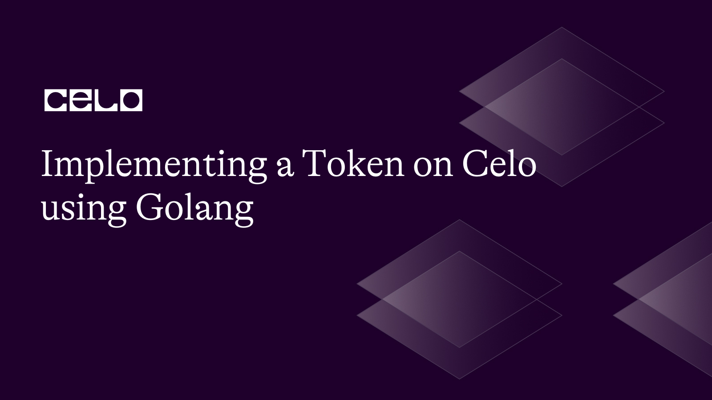

## Introduction

Celo is a blockchain platform that is designed to send, receive, and store digital assets securely on a mobile phone. The Celo blockchain is built using the Solidity programming language and is fully compatible with Ethereum. The Celo blockchain ecosystem provides financial tools and makes them more accessible and user-friendly for people all over the world. Building on top of the Celo blockchain enables developers to create and deploy various tokens according to their use cases. In this article, we will implement a token on Celo and interact with it using the Golang programming language.

## Prerequisites

In this tutorial, we’ll be implementing a custom token on Celo with Golang, so before we begin, you should have some familiarity with the following technologies:

- Go programming language
- Solidity programming language
- Celo blockchain

## Requirements

Before we get started, make sure you have the following installed:

- [Go programming language](https://go.dev/doc/) (version 1.13 or higher)
- [Node.js](https://nodejs.org/en/docs) (version 10 or higher)
- [Git](https://git-scm.com/downloads)
- Text editor (e.g. Visual Studio Code)
- [Go Ethereum](https://github.com/ethereum/go-ethereum)

### Step 1: Setting up a development environment

On your terminal, create a new directory for this project:

```bash
mkdir custom-celo-token
cd custom-celo-token
```

Initialize a new Go module:

```bash
go mod init custom-celo-token
```

Install the Celo blockchain package:

```bash
go get -u github.com/ethereum/go-ethereum
```

Note: This Go Ethereum package created by Celo is a fork of the main Go Ethereum package. If you are having any import errors, just go to your terminal and run:

### Step 2: Develop the Smart Contract

Next, let’s create a new file called “CustomToken.sol” in the root directory of our project which would contain the smart contract logic of our token. The contract includes the token's name, total supply, symbol, and other necessary functions, such as minting and transferring tokens.

CustomToken.sol

```solidity
// SPDX-License-Identifier: MIT

pragma solidity ^0.8.0;

contract CustomToken {
    string public name;
    string public symbol;
    uint256 public totalSupply;
    address public owner;

    mapping(address => uint256) public balanceOf;
    mapping(address => mapping(address => uint256)) public allowance;

    event Transfer(address indexed _from, address indexed _to, uint256 _value);
    event Approval(address indexed _owner, address indexed _spender, uint256 _value);

    modifier onlyOwner() {
        require(msg.sender == owner, "Only the contract owner can call this function");
        _;
    }

    constructor(string memory _name, string memory _symbol, uint256 _totalSupply) {
        name = _name;
        symbol = _symbol;
        totalSupply = _totalSupply;
        owner = msg.sender;
        balanceOf[msg.sender] = _totalSupply;
    }

    function transfer(address _to, uint256 _value) public returns (bool success) {
        require(balanceOf[msg.sender] >= _value, "Insufficient balance");
        balanceOf[msg.sender] -= _value;
        balanceOf[_to] += _value;
        emit Transfer(msg.sender, _to, _value);
        return true;
    }

    function approve(address _spender, uint256 _value) public returns (bool success) {
        allowance[msg.sender][_spender] = _value;
        emit Approval(msg.sender, _spender, _value);
        return true;
    }

    function transferFrom(address _from, address _to, uint256 _value) public returns (bool success) {
        require(balanceOf[_from] >= _value, "Insufficient balance");
        require(allowance[_from][msg.sender] >= _value, "Allowance exceeded");
        balanceOf[_from] -= _value;
        balanceOf[_to] += _value;
        allowance[_from][msg.sender] -= _value;
        emit Transfer(_from, _to, _value);
        return true;
    }

    function mint(address _to, uint256 _value) public onlyOwner {
        totalSupply += _value;
        balanceOf[_to] += _value;
        emit Transfer(address(0), _to, _value);
    }

}
```

Without any external dependencies, this smart contract defines the CustomToken contract. The contract contains variables for the token's name, symbol, total supply, and owner, as well as account balance and allowance mappings. The contract also includes the modifier “onlyOwner”, which limits certain functions to the contract owner.

The constructor assigns the total supply to the contract deployer and sets the token's name, symbol, and total supply. The contract then implements the ERC20 standard's transfer, approve, and transferFrom functions, as well as a mint function that allows the contract owner to create new tokens.

Note: The contract above, only shows the logic of a custom token without some security features provided by libraries such as Openzeppelin. For production use cases, ensure to use some of the custom logic and functions from Openzeppelin to minimize risks.

## Step 3: Compiling and Deploying the Smart Contract

Next, we need to compile our custom token smart contract to generate the ABI and Byte codes. Two files called “CustomToken.abi” and “CustomToken.bin” would be created.

We need to install the solidity compiler:

```bash
npm init --y
npm install solc@0.8.0
```

Create a new file called “compile.js” in your root folder:

compile.js

```jsx
const fs = require("fs");
const solc = require("solc");

const input = fs.readFileSync("CustomToken.sol", "utf8");

const output = solc.compile(
  JSON.stringify({
    language: "Solidity",
    sources: {
      "CustomToken.sol": {
        content: input,
      },
    },
    settings: {
      outputSelection: {
        "*": {
          "*": ["*"],
        },
      },
    },
  })
);

const { CustomToken } = JSON.parse(output).contracts["CustomToken.sol"];
fs.writeFileSync("CustomToken.abi", JSON.stringify(CustomToken.abi));
fs.writeFileSync("CustomToken.bin", CustomToken.evm.bytecode.object);
```

Run the following command on your terminal to compile:

```bash
node compile.js
```

The next step is to deploy the contract which we will implement with Golang. Create a new folder called “deploy” and name a file called “main.go” in your root directory and paste the following code in it:

main.go

```bash
package main

import (
	"context"
	"crypto/ecdsa"
	"fmt"
	"io/ioutil"
	"log"
	"math/big"

	"github.com/ethereum/go-ethereum/accounts/abi/bind"
	"github.com/ethereum/go-ethereum/common"
	"github.com/ethereum/go-ethereum/core/types"
	"github.com/ethereum/go-ethereum/crypto"
	"github.com/ethereum/go-ethereum/ethclient"
)

// Replace this with your own private key and Celo node URL
const privateKey = "your-private-key"
const nodeURL = "https://alfajores-forno.celo-testnet.org"

func main() {
	// Connect to the Celo network
	client, err := ethclient.Dial(nodeURL)
	if err != nil {
		log.Fatalf("Failed to connect to the Celo network: %v", err)
	}
	defer client.Close()

	// Load the private key
	key, err := crypto.HexToECDSA(privateKey)
	if err != nil {
		log.Fatalf("Failed to load the private key: %v", err)
	}

	// Load the contract ABI
	abiBytes, err := ioutil.ReadFile("Exchange.abi")
	if err != nil {
		log.Fatalf("Failed to read the contract ABI: %v", err)
	}
	fmt.Println(abiBytes)

	// Load the contract bytecode
	bytecode, err := ioutil.ReadFile("Exchange.bin")
	if err != nil {
		log.Fatalf("Failed to read the contract bytecode: %v", err)
	}

	// Get the public address associated with the private key
	publicKey := key.Public().(*ecdsa.PublicKey)
	address := crypto.PubkeyToAddress(*publicKey)

	// Get the nonce associated with the address
	nonce, err := client.PendingNonceAt(context.Background(), address)
	if err != nil {
		log.Fatalf("Failed to get the nonce: %v", err)
	}

	// Get the gas price
	gasPrice, err := client.SuggestGasPrice(context.Background())
	if err != nil {
		log.Fatalf("Failed to get the gas price: %v", err)
	}

	// Create a new transaction
	tx := types.NewContractCreation(nonce, big.NewInt(0), 3000000, gasPrice, common.FromHex(string(bytecode)))

	// Sign the transaction
	signedTx, err := types.SignTx(tx, types.NewEIP155Signer(big.NewInt(44787)), key)
	if err != nil {
		log.Fatalf("Failed to sign the transaction: %v", err)
	}

	// Broadcast the transaction
	err = client.SendTransaction(context.Background(), signedTx)
	if err != nil {
		log.Fatalf("Failed to broadcast the transaction: %v", err)
	}

	// Wait for the transaction receipt
	receipt, err := bind.WaitMined(context.Background(), client, signedTx)
	if err != nil {
		log.Fatalf("Failed to get the transaction receipt: %v", err)
	}

	// Print the contract address
	fmt.Printf("Smart contract deployed at address: %s\n", receipt.ContractAddress.Hex())
}
```

Let’s go through the code step by step.

```go
package main

import (
	"context"
	"crypto/ecdsa"
	"fmt"
	"io/ioutil"
	"log"
	"math/big"

	"github.com/ethereum/go-ethereum/accounts/abi/bind"
	"github.com/ethereum/go-ethereum/common"
	"github.com/ethereum/go-ethereum/core/types"
	"github.com/ethereum/go-ethereum/crypto"
	"github.com/ethereum/go-ethereum/ethclient"
)
```

The “package main” initializes this file as our main Go package and the “import” command is used to import all the package dependencies.

```go
const privateKey = "your-private-key"
const nodeURL = "https://alfajores-forno.celo-testnet.org"
```

Replace the string with your Celo wallet private key and the node URL is the Celo Alfrajores or Testnet URL.

```go
// Connect to the Celo network
client, err := ethclient.Dial(nodeURL)
	if err != nil {
		log.Fatalf("Failed to connect to the Celo network: %v", err)
	}
	defer client.Close()

	// Load the private key
	key, err := crypto.HexToECDSA(privateKey)
	if err != nil {
		log.Fatalf("Failed to load the private key: %v", err)
	}

	// Load the contract ABI
	abiBytes, err := ioutil.ReadFile("Exchange.abi")
	if err != nil {
		log.Fatalf("Failed to read the contract ABI: %v", err)
	}
	fmt.Println(abiBytes)

	// Load the contract bytecode
	bytecode, err := ioutil.ReadFile("Exchange.bin")
	if err != nil {
		log.Fatalf("Failed to read the contract bytecode: %v", err)
	}
```

The code above allows us to connect to the Celo blockchain, load our private key, and load our contract ABI and byte codes which were generated when our contract was compiled.

```go
// Get the public address associated with the private key
	publicKey := key.Public().(*ecdsa.PublicKey)
	address := crypto.PubkeyToAddress(*publicKey)

	// Get the nonce associated with the address
	nonce, err := client.PendingNonceAt(context.Background(), address)
	if err != nil {
		log.Fatalf("Failed to get the nonce: %v", err)
	}

	// Get the gas price
	gasPrice, err := client.SuggestGasPrice(context.Background())
	if err != nil {
		log.Fatalf("Failed to get the gas price: %v", err)
	}
```

From the code above, our contract address and public key are gotten from the crypto package. The nonce and “gasPrice” are needed for a transaction to occur on the blockchain.

```go
// Create a new transaction
	tx := types.NewContractCreation(nonce, big.NewInt(0), 3000000, gasPrice, common.FromHex(string(bytecode)))

	// Sign the transaction
	signedTx, err := types.SignTx(tx, types.NewEIP155Signer(big.NewInt(44787)), key)
	if err != nil {
		log.Fatalf("Failed to sign the transaction: %v", err)
	}

	// Broadcast the transaction
	err = client.SendTransaction(context.Background(), signedTx)
	if err != nil {
		log.Fatalf("Failed to broadcast the transaction: %v", err)
	}

	// Wait for the transaction receipt
	receipt, err := bind.WaitMined(context.Background(), client, signedTx)
	if err != nil {
		log.Fatalf("Failed to get the transaction receipt: %v", err)
	}

	// Print the contract address
	fmt.Printf("Smart contract deployed at address: %s\n", receipt.ContractAddress.Hex())
}
```

A new transaction is created and signed and a receipt is generated to validate that the smart contract is actually deployed and has a particular contract address attached to it.

To deploy the contract, go to your terminal and run:

```bash
go run deploy.go
```

Your token should deploy and print out a wallet address:


## Conclusion

In this article, you have been able to create, deploy, and interact with your token on the Celo blockchain which opens possibilities for your token to be listed on the Celo network.

## Next Steps

To explore further on this article, you can check out the following topics:

- Integrating your token with the Celo mobile wallet
- Building a decentralized application (dApp) on Celo
- Enhancing the token's functionality with additional Smart contract features

## About the Author

I am a Software engineer with an interest in Blockchain technology. I love picking up new technologies and sharing my knowledge as I learn to give back to the tech community. You can find one on [GitHub](https://github.com/Divine572) and [Twitter](https://twitter.com/divine_finix).

## References

1. [Celo Developer Documentation](https://docs.celo.org/)
2. [Go Programming Language Documentation](https://golang.org/doc/)
3. [Solidity Documentation](https://solidity.readthedocs.io/)
4. [Github repo](https://github.com/Divine572/Custom-celo-token)
