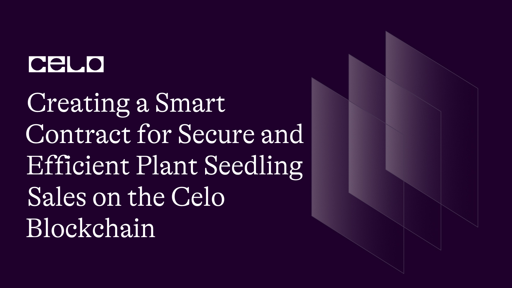

## INTRODUCTION

This project is a simple implementation of a marketplace for buying and selling seedlings using Solidity, a programming language for developing smart contracts on the Celo blockchain. The marketplace allows users to add seedlings for sale, view existing seedlings, change the description of their own seedlings, and buy seedlings from other users using a custom ERC20 token called cUSD. The project uses OpenZeppelin, a library of reusable smart contracts for Ethereum, to import the SafeMath library for secure arithmetic operations.

## REQUIREMENT

To follow this tutorial, you will require:

- A code editor or text editor such as Remix.

- An internet browser and a stable internet connection.
  
## PREREQUISITE

To successfully complete this tutorial, it is recommended that you have:

- Familiarity with Javascript programming language.
  
- A basic understanding of Blockchain technology and its functioning.
  
- Basic knowledge of the Solidity programming language used for smart contract development on the blockchain.
  
 We will begin by using the Remix IDE to write our smart contract. Let's get started!
 
 The complete code for this session.
 
 ```solidity
 // SPDX-License-Identifier: MIT

pragma solidity >=0.7.0 <0.9.0;
import "@openzeppelin/contracts/utils/math/SafeMath.sol";


interface IERC20Token {
   function transfer(address, uint256) external returns (bool);

    function approve(address, uint256) external returns (bool);

    function transferFrom(
        address,
        address,
        uint256
    ) external returns (bool);

    function totalSupply() external view returns (uint256);

    function balanceOf(address) external view returns (uint256);

    function allowance(address, address) external view returns (uint256);

    event Transfer(address indexed from, address indexed to, uint256 value);
    event Approval(
        address indexed owner,
        address indexed spender,
        uint256 value
    );
}

contract SeedlingsMarketplace {
    
    
    uint internal seedlingsLength = 0;
    address internal cUsdTokenAddress =  0x874069Fa1Eb16D44d622F2e0Ca25eeA172369bC1;

    struct  Seedling {
        address payable owner;
        string name;
        string species;
        string description;
        uint price;
         
        
    }
     mapping (uint =>  Seedling) internal seedlings;

      function  addSeedling(
        string memory _name, 
        string memory _species,
        string memory _description,
        uint _price

          ) public {
       Seedling storage seedling = seedlings[seedlingsLength];


         seedling.owner = payable(msg.sender);
           seedling.name = _name;
           seedling.species = _species;
           seedling.description = _description;
              seedling.price = _price;

  
        seedlingsLength++;
          }

          
     function getSeedling(uint _index) public view returns (
        address payable,
        string memory,  
        string memory,
        string memory,
        uint
        
    ) {
        return (  
            seedlings[_index].owner,
             seedlings[_index].name,
              seedlings[_index].species,
              seedlings[_index].description,
                 seedlings[_index].price
               
        );
    }


     function replaceSeedlingDescription(uint _index, string memory _description) public {
        require(msg.sender == seedlings[_index].owner, "Only the owner can change the description");
        seedlings[_index].description = _description;
     }

    
      function buySeedling(uint _index) public payable  {
        require(
          IERC20Token(cUsdTokenAddress).transferFrom(
            msg.sender,
            seedlings[_index].owner,
            seedlings[_index].price
          ),
          "Transfer failed."
        );

         seedlings[_index].owner = payable(msg.sender);
         
    }

     function getSeedlingsLength() public view returns (uint) {
        return (seedlingsLength);
    }
}

 ```
 
 
## Analyzing the code

```solidity
// SPDX-License-Identifier: MIT

pragma solidity >=0.7.0 <0.9.0;
import "@openzeppelin/contracts/utils/math/SafeMath.sol";
```

The contract is licensed under the `MIT License`, which is a permissive open-source software license.

The pragma statement specifies the version of the Solidity compiler that should be used to compile the contract. In this case, the contract uses a version of Solidity that is greater than or equal to version `0.7.0`, but less than version `0.9.0`.

The contract imports the `SafeMath` library from the `OpenZeppelin` library of smart contracts. SafeMath is a library that provides arithmetic functions with overflow and underflow protection, which helps ensure that the calculations in the smart contract are executed safely without unexpected results.

In the following discussion, we will cover the IERC20 token, which provides the functionality for conducting transactions using the Celo Usd stablecoin.

```solidity
interface IERC20Token {
   function transfer(address, uint256) external returns (bool);

    function approve(address, uint256) external returns (bool);

    function transferFrom(
        address,
        address,
        uint256
    ) external returns (bool);

    function totalSupply() external view returns (uint256);

    function balanceOf(address) external view returns (uint256);

    function allowance(address, address) external view returns (uint256);

    event Transfer(address indexed from, address indexed to, uint256 value);
    event Approval(
        address indexed owner,
        address indexed spender,
        uint256 value
    );
}
```

We can see from the code that an interface definition has been provided for an ERC20 token on the Celo blockchain. This interface specifies how we can interact with a smart contract on the blockchain by outlining six essential functions such as transfer, approve, and transferFrom.

These functions enable us as users to perform various actions on the Celo blockchain, such as transferring tokens to other addresses, authorizing other addresses to spend tokens on our behalf, and moving tokens from one address to another.

In addition, the code also includes three functions that allow us to retrieve information about a Celo ERC20 token contract, such as the total supply of tokens, the balance of tokens held by an address, and the amount of tokens authorized for spending by a specific address.

Finally, we can see that the code has two events that are triggered when a token transfer or approval occurs, which allows external applications to receive notifications when a token transfer or approval happens on the Celo blockchain.

To start, we give a name to our smart contract and define a struct.

```solidity
contract SeedlingsMarketplace {
    
    
    uint internal seedlingsLength = 0;
    address internal cUsdTokenAddress =  0x874069Fa1Eb16D44d622F2e0Ca25eeA172369bC1;

    struct  Seedling {
        address payable owner;
        string name;
        string species;
        string description;
        uint price;
         
        
    }
```

In this session, we define a smart contract named `SeedlingsMarketplace`. Within this contract, we create a `struct` called `Seedling`, which represents the properties of a seedling that will be sold on the marketplace.

The Seedling struct contains the following properties:

- `owner`: the address of the account that owns the seedling

- `name`: the name of the seedling

- `species`: the species of the seedling

- `description`: a brief description of the seedling

- `price`: the price of the seedling in cUSD, the stablecoin used on the Celo blockchain

In addition to the Seedling struct, we also define two internal variables:

- `seedlingsLength`: a counter variable that keeps track of the number of seedlings added to the marketplace
cUsdTokenAddress: the address of the cUSD token contract on the Celo blockchain, which will be used to facilitate payments for seedlings on the marketplace.
These variables are marked as internal, which means they can only be accessed within the smart contract and its inherited contracts.

Next, we add our mapping.

```solidity
     mapping (uint =>  Seedling) internal seedlings;
```

With the `mapping (uint => Seedling) internal seedlings`, we are creating a data structure that will allow us to store and retrieve Seedling objects based on their unique identifier. In other words, we are creating a mapping from uint values to Seedling objects.

The internal keyword indicates that this mapping is only accessible from within the contract and any derived contracts. This means that we can't access it directly from outside the contract, but we can create functions within the contract that use the mapping to interact with the Seedling objects.

By using this mapping, we can efficiently store and retrieve Seedling objects without having to iterate over an array of objects. Instead, we can simply access the object directly using its unique identifier.

To make our smart contract more engaging, we will start incorporating functions. The initial function we will implement is the `addSeedling` function.

```solidity
  function  addSeedling(
        string memory _name, 
        string memory _species,
        string memory _description,
        uint _price

          ) public {
       Seedling storage seedling = seedlings[seedlingsLength];


         seedling.owner = payable(msg.sender);
           seedling.name = _name;
           seedling.species = _species;
           seedling.description = _description;
              seedling.price = _price;

  
        seedlingsLength++;
          }
```

In this sessiom, we have created a function named `addSeedling` that takes in four parameters: ` _name`, `_species`, `_description`, and `_price`. The function is set to `public`, which means anyone can call it.

Inside the function, we first create a new Seedling `struct` instance by declaring a Seedling variable named seedling and assigning it to the seedlings mapping at the current length of seedlings.

Next, we set the `owner`, `name`, `species`, `description`, and `price` properties of the seedling struct to the values passed in as parameters.

After that, we increment the `seedlingsLength` variable to indicate that a new seedling has been added to the seedlings mapping.

Furthermore, we add the `getSeedlingfunction`.

```solidity
function getSeedling(uint _index) public view returns (
        address payable,
        string memory,  
        string memory,
        string memory,
        uint
        
    ) {
        return (  
            seedlings[_index].owner,
             seedlings[_index].name,
              seedlings[_index].species,
              seedlings[_index].description,
                 seedlings[_index].price
               
        );
    }

```

We can use the `getSeedling` function to retrieve information about a specific seedling in the marketplace. This function takes an index as its input and returns a tuple with the owner's `address`, the `name` of the seedling, the `species`, the `description`, and the `price`. The view keyword indicates that this function only reads data from the blockchain and does not modify it. We can use this function to display seedling information to users of the marketplace or to build functionality that depends on specific seedlings in the marketplace.

Next we add `the replaceSeedlingDescription` function.

```solidity
  function replaceSeedlingDescription(uint _index, string memory _description) public {
        require(msg.sender == seedlings[_index].owner, "Only the owner can change the description");
        seedlings[_index].description = _description;
     }

```

In this session,  we have a function named `replaceSeedlingDescription` which enables the owner of a seedling to `update` the description of the seedling. The function takes two parameters, the index of the seedling to be updated and the new description.

The require statement ensures that only the owner of the seedling can update the description. If someone other than the owner tries to update the description, the transaction will `fail`.

Once the ownership check is passed, the function updates the description of the specified seedling by accessing it through the seedlings mapping and setting the description property to the new value provided.

By providing this function, we are giving the owners of seedlings the ability to modify the description of their seedlings, adding more flexibility and control to our smart contract.

Additionally, we add a function that will be used to buy seedling from the blockchain.

```solidity
function buySeedling(uint _index) public payable  {
        require(
          IERC20Token(cUsdTokenAddress).transferFrom(
            msg.sender,
            seedlings[_index].owner,
            seedlings[_index].price
          ),
          "Transfer failed."
        );

         seedlings[_index].owner = payable(msg.sender);
         
    }

```

In this session, we have a function called buySeedling which enables users to buy a seedling from the marketplace.

Firstly, the function requires that the user sends the exact amount of `cUSD` required to purchase the seedling. This is done by passing the amount of cUSD tokens in the transaction as msg.value.

Next, the function uses the transferFrom function of the `IERC20Token` interface to transfer the required amount of cUSD tokens from the buyer's address to the seller's address.

If the transfer is successful, the ownership of the seedling is `transferred` to the buyer by changing the owner property of the corresponding Seedling struct.

The function also includes a require statement to ensure that the transfer was successful. If the transfer fails, the transaction is reverted and an error message is returned.

Finally we add the `function getSeedlingsLength()`

```solidity

     function getSeedlingsLength() public view returns (uint) {
        return (seedlingsLength);
    }
}
```

In this part of the smart contract, we have the `getSeedlingsLength` function. This function simply returns the total number of seedlings currently available for sale on the marketplace.

The function is a `view function`, meaning that it only reads data from the blockchain and does not modify any state. This makes it a `read-only` function that can be called by anyone at any time without incurring any gas costs.

By calling this function, users of the marketplace can know the current size of the inventory and make informed decisions about buying and selling seedlings.

## CONTRACT DEPLOYMENT

In order to deploy the Event smart contract on the Celo blockchain, several things are required such as:

To ensure a smooth deployment of our smart contract, it is essential to download the Celo extension wallet from the given link, [Celo Extension wallet](https://chrome.google.com/webstore/detail/celoextensionwallet/kkilomkmpmkbdnfelcpgckmpcaemjcdh?hl=en). Once done, the next step is to fund the wallet that we have created, [Celo faucet](https://faucet.celo.org/). This can be accomplished by accessing the Celo Alfojares faucet using the provided link.

With our wallet funded, we can now proceed to deploy the smart contract using the Celo plugin available in Remix.

## CONCLUSION

Great work on completing the smart contract for the sale of event tickets on the Celo blockchain! Your achievement is impressive, and I want to congratulate you on your success. You can now feel proud of yourself and enjoy the results of your hard work. Keep up the good work! 🎉

## Next step

Great job! It's always helpful to provide additional resources for further learning. Don't hesitate to reach out if you have any more questions or if you need further assistance, you can reach out to me on twitter by clicking [this link](https://twitter.com/thompsonogoyi). Happy learning!

## About the author

My name is Ogoyi Thompson, and I'm a web3 developer based in Nigeria. I am enthusiastic about working with blockchain technology.

