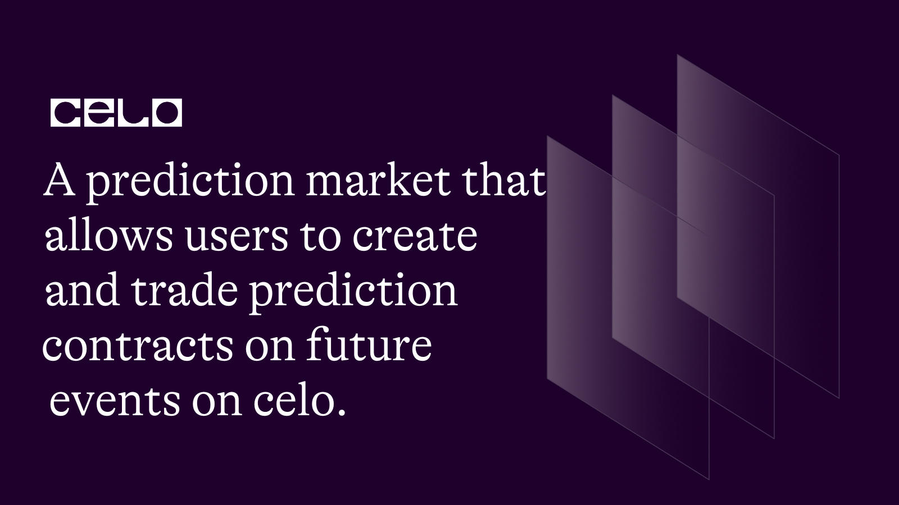

## Introduction

The contract is a Solidity smart contract for a decentralized prediction market. It enables users to create and trade prediction contracts on future events, and the outcome is settled automatically based on the event outcome. The contract stores information on each contract's creator, description, end time, price, and outcome, allowing for transparent trading without the need for intermediaries. Users can buy shares using cUSD tokens, and payouts are made to those who correctly predict the outcome. The contract is designed to be secure, using the Celo blockchain to enforce the rules of the market.

## REQUIREMENT

To follow this tutorial, you will require:

- A code editor or text editor such as Remix.

- An internet browser and a stable internet connection.

## PREREQUISITE

To successfully complete this tutorial, it is recommended that you have:

- Familiarity with Javascript programming language.

- A basic understanding of Blockchain technology and its functioning.

- Basic knowledge of the Solidity programming language used for smart contract development on the blockchain.

  We will begin by using the Remix IDE to write our smart contract. Let's get started!

The complete code:

```solidity
 // SPDX-License-Identifier: MIT

pragma solidity >=0.7.0 <0.9.0;
import "@openzeppelin/contracts/utils/math/SafeMath.sol";


interface IERC20Token {
  function transfer(address, uint256) external returns (bool);

   function approve(address, uint256) external returns (bool);

   function transferFrom(
       address,
       address,
       uint256
   ) external returns (bool);

   function totalSupply() external view returns (uint256);

   function balanceOf(address) external view returns (uint256);

   function allowance(address, address) external view returns (uint256);

   event Transfer(address indexed from, address indexed to, uint256 value);
   event Approval(
       address indexed owner,
       address indexed spender,
       uint256 value
   );
}

contract PredictionMarket {

   using SafeMath for uint;

   uint internal numContracts = 0;
   address internal cUsdTokenAddress = 0x874069Fa1Eb16D44d622F2e0Ca25eeA172369bC1;

   struct Contract {
       address payable creator;
       string description;
       uint endTimestamp;
       uint yesShares;
       uint noShares;
       uint price;
       bool resolved;
       bool outcome;
   }

   mapping(uint => Contract) internal contracts;

   function createContract(
       string memory _description,
       uint _endTimestamp,
       uint _price
   ) public {
       Contract storage newContract = contracts[numContracts];
       newContract.creator = payable(msg.sender);
       newContract.description = _description;
       newContract.endTimestamp = _endTimestamp;
       newContract.price = _price;
       newContract.resolved = false;
       newContract.outcome = false;
       numContracts++;
   }

   function getContract(uint _index) public view returns (
   address,
   string memory,
   uint,
   uint,
   uint,
   uint,
   bool,
   bool
) {
   Contract storage c = contracts[_index];
   return (
       c.creator,
       c.description,
       c.endTimestamp,
       c.yesShares,
       c.noShares,
       c.price,
       c.resolved,
       c.outcome
   );
}

   function buyShares(uint _index, bool _outcome) public payable {
       require(
           !contracts[_index].resolved,
           "Contract has already been resolved."
       );
       require(
           msg.value == contracts[_index].price,
           "Incorrect amount of cUSD sent."
       );
       if (_outcome) {
           contracts[_index].yesShares = contracts[_index].yesShares.add(msg.value);
       } else {
           contracts[_index].noShares = contracts[_index].noShares.add(msg.value);
       }
   }
function resolveContract(uint _index, bool _outcome) public {
   require(
       block.timestamp > contracts[_index].endTimestamp,
       "Contract has not yet expired."
   );
   require(
       !contracts[_index].resolved,
       "Contract has already been resolved."
   );
   contracts[_index].resolved = true;
   contracts[_index].outcome = _outcome;
   uint totalShares = contracts[_index].yesShares.add(contracts[_index].noShares);
   if (totalShares > 0) {
       uint payoutPerShare = address(this).balance.div(totalShares);
       if (_outcome) {
           contracts[_index].creator.transfer(contracts[_index].yesShares.mul(payoutPerShare));
       } else {
           contracts[_index].creator.transfer(contracts[_index].noShares.mul(payoutPerShare));
       }
   }
}

    }
```

```solidity
 // SPDX-License-Identifier: MIT

pragma solidity >=0.7.0 <0.9.0;
import "@openzeppelin/contracts/utils/math/SafeMath.sol";
```

In this Solidity code, we first specify the license of the code using the MIT license, which allows anyone to use, copy, modify, merge, publish, distribute, sublicense, and/or sell the software.

Next, we specify the Solidity version that the code is compatible with using the "pragma" statement. This ensures that the code is compiled using the correct version of Solidity.

We then import the SafeMath library from the OpenZeppelin contract library using the "import" statement. The SafeMath library provides safe arithmetic operations to prevent overflow and underflow errors in the contract, which can cause security vulnerabilities in smart contracts.

```solidity
interface IERC20Token {
   function transfer(address, uint256) external returns (bool);

    function approve(address, uint256) external returns (bool);

    function transferFrom(
        address,
        address,
        uint256
    ) external returns (bool);

    function totalSupply() external view returns (uint256);

    function balanceOf(address) external view returns (uint256);

    function allowance(address, address) external view returns (uint256);

    event Transfer(address indexed from, address indexed to, uint256 value);
    event Approval(
        address indexed owner,
        address indexed spender,
        uint256 value
    );
}
```

In this Solidity code, we have defined an interface for an ERC20 token on the Celo blockchain. When we create an interface in Solidity, we are essentially creating a blueprint that specifies how external contracts should interact with our contract.

In this particular interface, we have defined six key functions that any Celo ERC20 token contract should implement. These functions include "transfer", "approve", and "transferFrom", which enable users to transfer tokens to other addresses, authorize other addresses to spend tokens on their behalf, and move tokens from one address to another.

In addition to these six functions, we have also defined three functions that provide information about a Celo ERC20 token contract. These functions include "totalSupply", "balanceOf", and "allowance", which allow users to retrieve data on the total supply of tokens, the balance of tokens held by a specific address, and the amount of tokens authorized for spending by a particular address.

Finally, we have also included two events in this code, which are triggered when a token transfer or approval occurs. These events enable external applications to receive notifications when a token transfer or approval happens on the Celo blockchain, which can be useful for building more complex applications that depend on real-time information about token transactions.

```solidity
contract PredictionMarket {

    using SafeMath for uint;

    uint internal numContracts = 0;
    address internal cUsdTokenAddress = 0x874069Fa1Eb16D44d622F2e0Ca25eeA172369bC1;

    struct Contract {
        address payable creator;
        string description;
        uint endTimestamp;
        uint yesShares;
        uint noShares;
        uint price;
        bool resolved;
        bool outcome;
    }
```

This code defines a smart contract called `PredictionMarket`. In this contract, we are using the SafeMath library, which provides secure mathematical operations to prevent overflow and underflow errors.

We have also defined two global variables. The first is `numContracts`, which keeps track of the number of prediction contracts created by the contract. The second is `cUsdTokenAddress`, which is the address of the cUSD token contract on the Celo blockchain.

Next, we have defined a struct called "Contract", which represents a prediction contract. This struct contains information about the creator of the contract, a description of the prediction, the end time for the prediction, the number of shares that were bought for the `yes` outcome, the number of shares bought for the `no` outcome, the price of each share, whether the contract has been resolved, and the outcome of the contract.

Using this struct, we can create new prediction contracts by calling the `createContract` function. This function takes in a description of the prediction, the end time for the prediction, and the price of each share.

When a user buys shares for a prediction contract, they call either the `buyYesShares` or "buyNoShares" function, depending on the outcome they are betting on. These functions update the `yesShares` or `noShares` variables in the Contract struct, as well as transfer cUSD tokens from the buyer's account to the contract creator's account.

Once the end time for a prediction contract has passed, the creator of the contract can call the `resolveContract` function. This function calculates the outcome of the prediction based on the number of shares bought for each outcome, and updates the `resolved` and `outcome` variables in the Contract struct accordingly.

Next, we add a `Mapping`

```solidity
   mapping(uint => Contract) internal contracts;
```

In the `PredictionMarket` contract, we have defined a mapping called `contracts`. A mapping is a data structure in Solidity that allows us to associate a key-value pair. In this case, the key is a unique unsigned integer, and the value is a "Contract" struct that we defined earlier.

Using this mapping, we can store information about each prediction contract created in the contract. The key for each mapping entry is the index of the prediction contract, and the value is the corresponding `Contract` struct.

For example, if we create a new prediction contract with index `0`, we can access its information by calling the `contracts[0]` mapping entry.

This allows us to keep track of multiple prediction contracts and access their information in a structured and efficient way. We can also update the information for a specific prediction contract by updating the corresponding mapping entry.

To add more functionality to our smart contract, we will be implementing various functions. The first function we will add is called `createContract`.

```solidity
  function createContract(
        string memory _description,
        uint _endTimestamp,
        uint _price
    ) public {
        Contract storage newContract = contracts[numContracts];
        newContract.creator = payable(msg.sender);
        newContract.description = _description;
        newContract.endTimestamp = _endTimestamp;
        newContract.price = _price;
        newContract.resolved = false;
        newContract.outcome = false;
        numContracts++;
    }
```

The `createContract` function is a public function that anyone can call to create a new prediction contract in our `PredictionMarket` contract. The function takes three parameters: the `description` of the `prediction`, the `timestamp` for when the prediction will end, and the `price` of the prediction.

In the function, we first create a new `Contract` struct and store it in the `contracts` mapping with a unique index number equal to the current value of `numContracts`. We then increment `numContracts` to ensure that each new prediction contract gets a unique index number.

We then set the properties of the new `Contract` struct using the function parameters and some default values. Specifically, we set the creator of the prediction contract to be the address of the person who called the function using `msg.sender`, the description of the prediction to be the string provided as a parameter, the end timestamp for the prediction, the price of the prediction, and some default values for the `resolved` and `outcome` properties.

Furthermore, we add the `getContract` function.

```solidity
  function getContract(uint _index) public view returns (
    address,
    string memory,
    uint,
    uint,
    uint,
    uint,
    bool,
    bool
) {
    Contract storage c = contracts[_index];
    return (
        c.creator,
        c.description,
        c.endTimestamp,
        c.yesShares,
        c.noShares,
        c.price,
        c.resolved,
        c.outcome
    );
}
```

The `getContract` function is a public view function that anyone can call to retrieve the details of a specific prediction contract in our `PredictionMarket` contract. The function takes an `index` number as a parameter, which is used to look up the corresponding contract in our `contracts` mapping.

In the function, we first retrieve the `Contract` struct from our `contracts` mapping using the provided `index` number. We then return a tuple containing all the relevant properties of the `Contract` struct.

Specifically, we return the address of the person who created the prediction contract, the description of the prediction, the end timestamp for the prediction, the number of `yes` shares, the number of `no` shares, the price of the prediction, and the status of the prediction contract `(resolved or not)` and its outcome.

Additionally, we add the `buyShares` function.

```solidity
    function buyShares(uint _index, bool _outcome) public payable {
        require(
            !contracts[_index].resolved,
            "Contract has already been resolved."
        );
        require(
            msg.value == contracts[_index].price,
            "Incorrect amount of cUSD sent."
        );
        if (_outcome) {
            contracts[_index].yesShares = contracts[_index].yesShares.add(msg.value);
        } else {
            contracts[_index].noShares = contracts[_index].noShares.add(msg.value);
        }
    }
```

In this session, we have the `buyShares` function which allows a user to buy shares in a contract by sending cUSD to the contract. The function takes two parameters: the `\_index` parameter specifies which contract to buy shares in, and the `\_outcome` parameter specifies whether the user is buying shares in the `yes` outcome `(if \_outcome is true)` or the `no` outcome `(if \_outcome is false)`.

The function first checks whether the contract has already been resolved by verifying that the resolved boolean flag is set to `false`. If the contract has already been resolved, the function will throw an error and stop executing.

Next, the function checks whether the correct amount of cUSD has been sent by the user. If the sent amount is incorrect, the function will throw an error and stop executing.

Finally, if the checks are successful, the function updates the share count for the corresponding outcome by adding the sent amount of cUSD to the yesShares or noShares field of the Contract struct, depending on the value of \_outcome. This is done using the add function provided by the SafeMath library to prevent arithmetic overflow errors.

Finally, we add the `resolveContract` function

```solidity
function resolveContract(uint _index, bool _outcome) public {
    require(
        block.timestamp > contracts[_index].endTimestamp,
        "Contract has not yet expired."
    );
    require(
        !contracts[_index].resolved,
        "Contract has already been resolved."
    );
    contracts[_index].resolved = true;
    contracts[_index].outcome = _outcome;
    uint totalShares = contracts[_index].yesShares.add(contracts[_index].noShares);
    if (totalShares > 0) {
        uint payoutPerShare = address(this).balance.div(totalShares);
        if (_outcome) {
            contracts[_index].creator.transfer(contracts[_index].yesShares.mul(payoutPerShare));
        } else {
            contracts[_index].creator.transfer(contracts[_index].noShares.mul(payoutPerShare));
        }
    }
}

     }
```

The `resolveContract` function is used to determine the outcome of a prediction market contract and distribute the winnings to the participants accordingly. We first check that the contract has expired and not already been resolved. If these conditions are met, we mark the contract as resolved and set the outcome to the provided boolean value. We then calculate the total number of shares and the payout per share. If the outcome is true, we transfer the winnings to the creator based on the number of `yes` shares they hold. Otherwise, we transfer the winnings based on the number of `no` shares they hold. Overall, this function enables us to accurately determine the outcome of the contract and distribute winnings accordingly.

You can access the complete code for this tutorial by clicking this link [Github repo](https://github.com/Ogoyi/Prediction-marketPlace-on-celo)

## CONTRACT DEPLOYMENT

In order to deploy the Event smart contract on the Celo blockchain, several things are required such as:

To ensure a smooth deployment of our smart contract, it is essential to download the Celo extension wallet from the given link, [Celo Extension wallet](https://chrome.google.com/webstore/detail/celoextensionwallet/kkilomkmpmkbdnfelcpgckmpcaemjcdh?hl=en). Once done, the next step is to fund the wallet that we have created, [Celo faucet](https://faucet.celo.org/). This can be accomplished by accessing the Celo Alfojares faucet using the provided link.

With our wallet funded, we can now proceed to deploy the smart contract using the Celo plugin available in Remix.

## CONCLUSION

Great job on learning about the Prediction Market smart contract on the Celo blockchain! By following this tutorial, we have gained a deeper understanding of how to create and interact with smart contracts, and how they can be used to create decentralized prediction markets. We hope that you found this tutorial informative and useful, and that you can apply this knowledge to build even more sophisticated smart contracts in the future. Keep up the great work! 🚀

## Next step

Great job! It's always helpful to provide additional resources for further learning. Don't hesitate to reach out if you have any more questions or if you need further assistance, you can reach out to me on twitter by clicking [this link](https://twitter.com/thompsonogoyi). Happy learning!

## About the author

My name is Ogoyi Thompson, and I'm a web3 developer based in Nigeria. I am enthusiastic about working with blockchain technology.
