import YouTube from '@components/YouTube';

# Celo Spotlight: Building a Financial System that Creates the Conditions for Prosperity - for Everyone.

_Everything you need to get started with Celo._


## Hello Developers 🌱

Welcome to today's post, where we'll break down a blockchain topic into bite-sized pieces to help you learn and apply your new skills in the real world.
Today's topic is Getting started with Celo.

**Here's an overview of what we'll cover 🗒**

- ✅ Introduction to Celo
- ✅ Applications built on Celo
- ✅ Celo platform
- ✅ Celo first steps
- ✅ Get project funding
- ✅ Join the community

By the end of this post, you'll have a look at the Celo mission, applications, platform, funding, community, and more. This should put you on the path to start your journey with Celo.
Let's go! 🚀

## ✅ Introduction to Celo

[Celo](https://celo.org/) is a mobile-first blockchain that makes decentralized financial (DeFi) tools and services accessible to anyone with a mobile phone. It aims to break down barriers by bringing the powerful benefits of DeFi to the users of the 6 billion smartphones in circulation today.

<YouTube videoId="kKggE5OvyhE"/>

:::tip

View the website at [celo.org](celo.org)

:::

## Designing a future where everyone can prosper

Celo was designed to enable a new universe of financial solutions accessible for mobile users, creating a global financial ecosystem where an end-user can onboard into the Celo ecosystem with just a mobile number.

<YouTube videoId="vwfHiaVzc2E"/>

### Financial tools for a global audience

Give anyone access to powerful financial tools no matter who they are or where they live. Celo's mobile-first approach allows you to create financial applications for anyone with a mobile phone.
Accessible to billions of smartphone users

Scale to reach billions of users with the support of Celo's open-source blockchain infrastructure, cross-chain interoperability, and vision for currency inclusivity.

### Solving problems in the real world

With Celo's reliable 5 second block times, low gas fees, and decentralized phone verification protocol, Celo has made blockchain's vision for a globally accessible decentralized financial system a reality.

:::tip

Learn more: [Hello from Celo](https://blog.celo.org/hello-from-celo-34bf195cb99)

:::

### Creators and founders reshaping local economies

Celo is focused on developing use cases for the Celo Platform and ecosystem of technologies, furthering the mission of financial inclusion and prosperity, and driving adoption of the Celo blockchain and ecology of digital assets.

<YouTube videoId="8BnhsJ25ypY"/>

- [Philippines: Weavers accessing international markets](https://blog.celo.org/how-celo-powered-a-small-community-of-philippine-weavers-to-access-international-markets-cf73c834ac8f)
- [Haiti: Delivering digital humanitarian aid](https://medium.com/celoorg/hope-for-haiti-chooses-celo-and-emerging-impact-as-first-blockchain-partners-to-deliver-digital-cd6e6062d50c)
- [Climate Collective: Tokenizing the rainforest](https://climatecollective.org/)
- [Kickstarter: Building community commerce](https://www.kickstarter.com/articles/the-future-of-crowdfunding-creative-projects)
- [DeFi for the People: Enabling financial access](https://www.defiforthepeople.org/)
- [Alliance for Prosperity: Mission aligned organizations](https://medium.com/p/a3b32d15bc4c)

:::tip

Learn more: [Community in action](https://forum.celo.org/t/clabs-product-priorities/1395)

:::

## Cryptocurrency for a beautiful planet

Celo's aim is to create the conditions for prosperity, defined as people fulfilling basic needs, growing along their own unique paths, and supporting each other. All of Celo's projects have a specific hypothesis that ties our activities to one or more of these indicators of prosperity.

<YouTube videoId="tX5ep1JzY6k"/>

:::tip

Learn more: [Cryptocurrency for a beautiful planet](https://medium.com/celoorg/cryptocurrency-for-a-beautiful-planet-e47299dfb1c3)

:::

## Built for the 6 Billion smartphones on Earth

Celo enables digital assets to circulate at extremely low costs and high speeds across devices, carriers, and countries, making money mobile, global and accessible like never before.

<YouTube videoId="4a70pVEcRw4"/>

:::tip

Learn more: [A Look at the Celo Whitepaper](https://medium.com/celoorg/a-look-at-the-celo-whitepaper-c0061118ffd4)

:::

## Meet CELO, the platform native asset

Celo's native asset is the core utility, reserve, staking, and governance asset. CELO is the platform-native asset that supports the growth and development of the Celo blockchain and ecosystem. CELO holders can earn rewards, stake with validators, and vote on proposals that shape the future of Celo.

<YouTube videoId="mkpTmbkRv4A"/>

:::tip

Learn more: [Make your voice heard through on-chain governance](https://medium.com/celoorg/celo-gold-holders-make-your-voice-heard-through-on-chain-governance-96cb5a1e8b90)

:::

## Reimagine the possibilities of financing

Named for the currencies they follow, [Celo Dollars (cUSD)](https://medium.com/celoorg/celo-dollars-powerful-new-digital-money-in-circulation-b4147eda2d10), [Celo Euros (cEUR)](https://medium.com/celoorg/deutsche-telekom-joins-celo-ecosystem-as-the-first-mobile-carrier-amid-launch-of-ceur-stablecoin-2b79aae38540), and [Celo Real (cREAL)](https://medium.com/celoorg/celo-launches-the-creal-stablecoin-11da0d560c1c) are stablecoins that allow you to share value faster, cheaper, and more easily on your mobile phone. Celo stablecoins instantly unlock access for everyday uses like low-cost remittances and cross-border payments, global distribution of charitable aid, effortlessly paying online, or transferring value within exchanges, particularly in markets subject to currency volatility.

<YouTube videoId="n1k1JcjTnp8"/>

:::tip

Learn more: [Argentina: A Case Study for Stablecoins](https://medium.com/celoorg/argentina-a-case-study-for-stablecoins-66abdbf526ae)

:::

## ✅ Applications built on Celo

Since the launch of Celo Mainnet in 2020, Celo's network now supports 1000+ projects from builders, developers, and artists, who continue to create new applications and issue digital currencies from over 100 countries around the world.

### Valora

[Valora](https://valoraapp.com/) is a mobile payments app that works worldwide. Start transacting with 6 billion other smartphone users around the world from your phone and on the go.

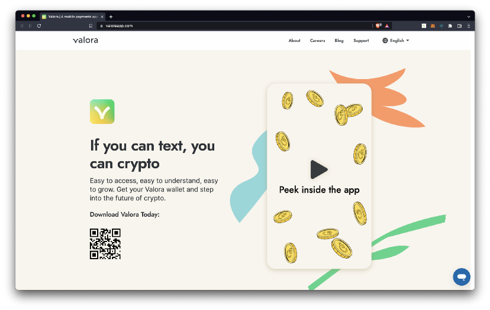

### Ubeswap

[Ubeswap](https://ubeswap.org/) is a mobile-first DeFi exchange powering DeFi on Celo. Trade assets from your phone without having to deal with old technology or centralized systems.


### Moola

[Moola](https://moola.market/) is a non-custodial liquidity protocol built on Celo that is democratizing access to credit and yield. Start earning interest on your CELO, cUSD, and cEUR.

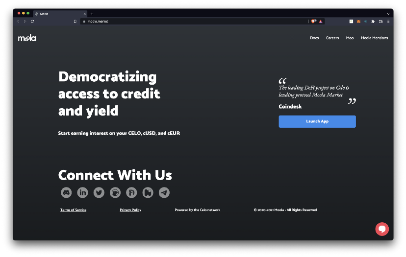

:::tip

Learn more: [View more dApps at Celohub.org](https://celohub.org/)

:::

## ✅ Celo Platform

Celo is focused on supporting an accessible experience for end-users who may have no familiarity with cryptocurrencies and could be using low-cost devices with limited connectivity. To achieve this, Celo takes a full-stack approach, where each layer is designed to ensure the speed, security, and stability of every application built on the Celo platform.

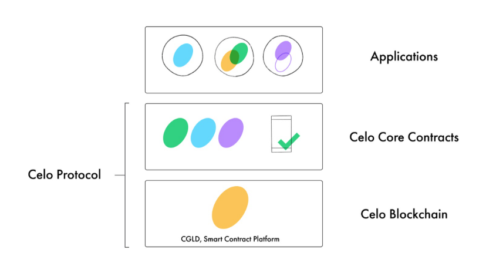

### Applications

Accessible financial applications that take advantage of Celo innovations in the Celo Protocol.

### Core Contracts

Define platform logic including ERC-20 stable currencies, identity attestations, proof-of-stake, and governance.

### Blockchain

An open cryptographic protocol that allows applications to make transactions and run smart contracts.

:::tip

Learn more: [The Celo Tech Stack](https://www.youtube.com/watch?v=KqLmm8lfP1w)

:::

## ✅ Built for mobile so you can build for all

The Celo Platform is a fully [EVM compatible](https://medium.com/celoorg/donut-hardfork-is-live-on-celo-585e2e294dcb), [proof-of-stake](https://medium.com/celoorg/celos-proof-of-stake-mechanism-31061fbebea), [carbon-negative](https://medium.com/celoorg/a-carbon-negative-blockchain-its-here-and-it-s-celo-60228de36490), layer-1 protocol, featuring a fast ultralight client and built-in seigniorage stablecoins, collateralized by crypto and natural assets. It has an average block time of 5 seconds, an average cost of less than \$.01 per transaction, and has a carbon-negative offset averaging 65.7 tons per month.

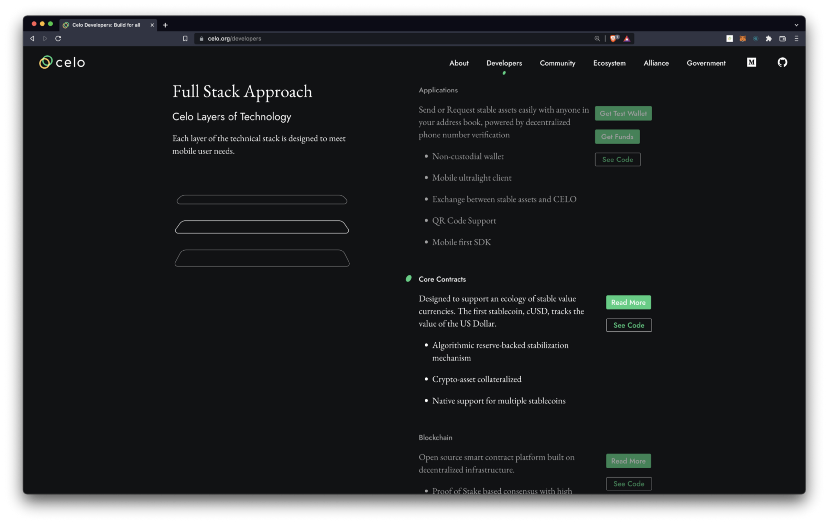

### Phone Number Mapping

Authenticate users by mapping their phone numbers to public keys for a convenient mobile payment experience.

### Fast sync for ultralight clients

Provide secure and highly efficient blockchain syncing for quick, trustless payment verification for users on any mobile device.

### Cross-chain interoperability

Build cross-chain applications that send transactions, assets, and messages between a growing number of interoperable blockchains.

### Stable value currencies

Make crypto payments accessible using a family of Celo-native stablecoins with full support for ERC-20-like tokens including cUSD, cEUR, and cREAL.

### Multi-currency gas fees

Keep crypto payments fast and simple by allowing transaction fee payments in any Celo-native stable currency.

### EVM Compatibility

Develop using popular [Ethereum tools](https://ethereum.org/en/developers/) (like [MetaMask](https://metamask.io/), [Truffle](https://trufflesuite.com/) & [Hardhat](https://hardhat.org/), code in Solidity, and quickly deploy EVM compatible applications on Celo.

:::tip

Learn more: [Celo Whitepapers](https://coinmarketcap.com/)

:::

## ✅ Celo first steps

Celo's collection of applications, tools, and resources make it simple to access wallets, manage assets, explore the blockchain or start building advanced dApps and integrations.


### Send, receive, and save Celo assets

Choose a wallet to start managing Celo assets.

### Celo Wallet

Easily send, receive, and save Celo assets with a [Celo Wallet](https://celo.org/developers/wallet). Install the [browser extension](https://chrome.google.com/webstore/detail/celoextensionwallet/kkilomkmpmkbdnfelcpgckmpcaemjcdh), [wallet app](https://celowallet.app/setup), or [developer wallet](https://celo.org/developers/wallet) to start using Celo.

### Valora

Make global peer-to-peer payments simple and accessible to anyone with Valora. Install the [Valora app ](https://valoraapp.com/)and view the [GitHub](https://github.com/valora-inc/wallet#valora-mobile-app) for more info and developer integration options.

### MetaMask

Connect Celo to any EVM-compatible application with MetaMask. [Install MetaMask](https://metamask.io/download/), configure it to [work with Celo](/blog/tutorials/3-simple-steps-to-connect-your-metamask-wallet-to-celo), and [import Valora](/wallet/metamask/import) (optional) to start managing Celo assets.

:::tip

Learn more: [View all Celo Wallets](https://docs.celo.org/getting-started/wallets)

:::

## ✅ Manage your CELO, cUSD, cEUR, and cREAL

Use your wallet to send, receive, and save your Celo assets.

### Get CELO

Earn rewards, stake with validators, and vote on proposals that shape the future of Celo as a CELO holder. Get CELO on any of these [20+ exchanges worldwide](https://coinmarketcap.com/currencies/celo/markets/).

### Use Celo Stablecoins

Make use of [Celo Dollars (cUSD)](https://coinmarketcap.com/currencies/celo-dollar/markets/), [Celo Euro (cEUR)](https://coinmarketcap.com/currencies/celo-euro/), and [Celo Real (cREAL)](https://coinmarketcap.com/currencies/celo-brazilian-real/) stablecoins which algorithmically follow their currency and are backed by the [Celo Reserve](https://celoreserve.org/).

### Get Test Funds

Get testnet funds by switching your [Celo Wallet](https://celo.org/developers/wallet) or [MetaMask Wallet](https://docs.celo.org/developer-resources/testnet-wallet) to the [Alfajores testnet](/network). Send your wallet funds for testing or development using the [Alfajores testnet faucet](https://faucet.celo.org).

:::tip

Learn more: [Celo Holder Guide](https://docs.celo.org/celo-holder-guide/owners)

:::

## ✅ Explore on-chain Celo network data

View live data on any network on a website or with the command-line interface.

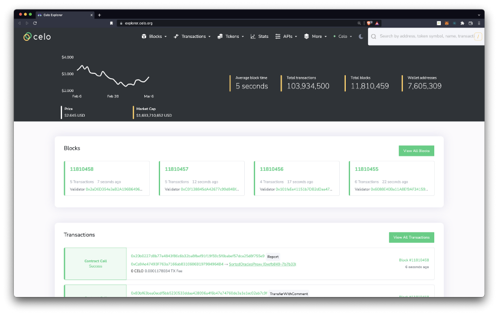

### View statistics

Access information about the Celo blockchain including average block time, total transactions, and additional transaction details using [blockscout](https://explorer.celo.org/) or [stats.celo.org](https://stats.celo.org/).

### Install the CLI

Interact with the Celo Protocol smart contracts using the Celo command-line interface (CLI). [Install using npm](https://www.npmjs.com/package/@celo/celocli) and view the [CLI docs](https://docs.celo.org/command-line-interface/introduction) to learn more.

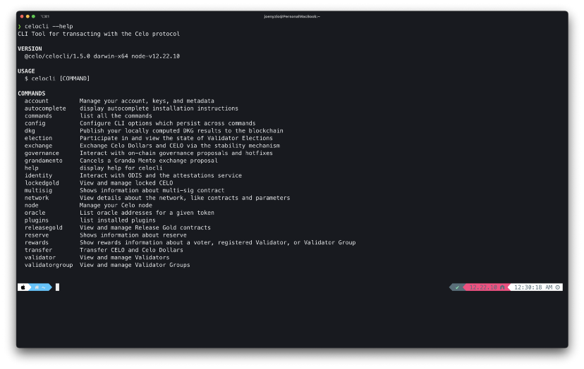

```js
npm install -g @celo/celocli
```

:::tip

Learn more: [View the Celo Monorepo on GitHub](https://github.com/celo-org/celo-monorepo)

:::

## ✅ Build fast, sustainable, mobile dApps

Celo allows you to develop using popular Ethereum tools like MetaMask, Truffle, Hardhat, and more. Code using the Solidity programming language for fast development and secure smart contracts. Deploy dApps using Celo's Ethereum Virtual Machine (EVM) compatible infrastructure.

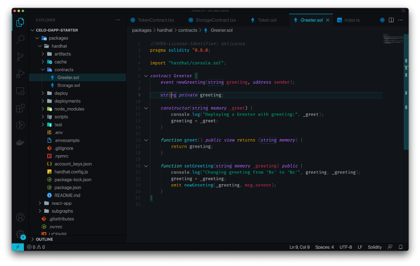

### Set up your Environment

Install dependencies including Celo CLI, Node.js, Xcode, and Android Studio on [Mac](https://docs.celo.org/developer-resources/using-mac)/[Windows](https://docs.celo.org/developer-guide/start/develop-on-windows) or get started fast using the [Remix IDE](https://docs.celo.org/developer-resources/deploy-remix).

### Build a dApp

Deploy a dApp on Celo using [Remix](https://docs.celo.org/developer-resources/deploy-remix), [Truffle](https://docs.celo.org/developer-resources/deploy-truffle),[Hardhat](https://docs.celo.org/developer-resources/deploy-hardhat), or [Replit](https://docs.celo.org/developer-resources/deploy-replit). Explore developer tutorials on [Figment](https://learn.figment.io/protocols/celo), [Dacade](https://dacade.org/communities/celo-development-101), or in the [developer docs](https://docs.celo.org/blog).

### Accelerate your development

Expand your toolkit with [Celo Composer](https://github.com/celo-org/celo-composer), [ContractKit](https://docs.celo.org/developer-guide/contractkit), [celo-react](https://github.com/celo-org/react-celo), and a growing collection of Celo tools built on the [Celo GitHub](https://github.com/celo-org).

:::info

Learn more: [Find more Celo tools on GitHub](https://github.com/celo-org)

:::

## ✅ Host, run, and connect to Celo nodes

Celo has 3 networks; [Mainnet](https://explorer.celo.org/), [Alfajores Testnet](https://alfajores-blockscout.celo-testnet.org/) (for developers), and [Baklava Testnet](https://baklava-blockscout.celo-testnet.org/). You have the option to host, run, or connect to full nodes to on any network to support your needs.

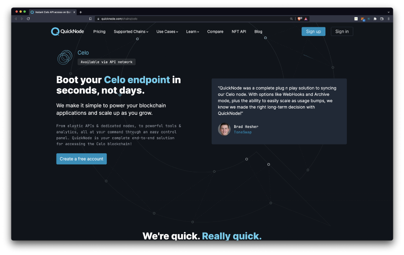

### Connect to hosted nodes

Get started fast with a hosted node service. Connect to [Forno](https://docs.celo.org/developer-guide/forno) or [Figment Datahub](https://www.figment.io/datahub/celo) for quick development or [Quicknode](https://www.quicknode.com/chains/celo) for enterprise-grade node services.

### Run a local or remote node

Use a Docker image to run a local [Mainnet](https://docs.celo.org/getting-started/mainnet/running-a-full-node-in-mainnet), [Alfajores](https://docs.celo.org/getting-started/alfajores-testnet/running-a-full-node-in-alfajores), or [Baklava](https://docs.celo.org/getting-started/baklava-testnet/running-a-full-node-in-baklava) node or ganache-cli to run a test node. Alternatively, run a remote node on [AWS](https://docs.celo.org/getting-started/hosted-nodes#amazon-web-services) or [Google Cloud Platform](https://docs.celo.org/getting-started/hosted-nodes#google-cloud-platform).

### Run a network validator

Secure the network by participating in Celo's proof-of-stake protocol running a [Mainnet Validator](https://docs.celo.org/getting-started/mainnet/running-a-validator-in-mainnet) or [Baklava Testnet Validator](https://docs.celo.org/getting-started/baklava-testnet/running-a-validator-in-baklava) node.

:::tip

Learn more: [Celo Networks](https://docs.celo.org/getting-started/choosing-a-network)

:::

## ✅ Connect Celo with bridges, oracles, and mobile identity

Use advanced Celo features for blockchain interoperability, external data connections, or verification using mobile identities.

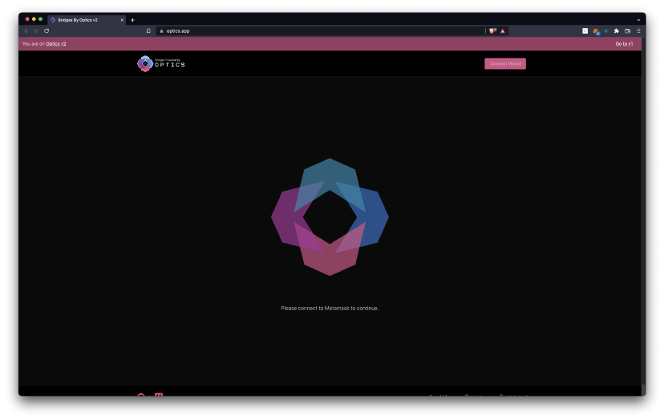

### Build cross-chain bridges

Go cross-chain with interoperable, cross-platform dApps that bridge assets across using [Optics](https://docs.celo.org/celo-codebase/protocol/optics), [AllBridge](https://app.allbridge.io/bridge?from=ETH&to=POL&asset=USDC), and [Moss](https://bridge.moss.earth/).

### Connect with oracles

Build dApps that connect to external data using [Celo Reserve Oracles](https://docs.celo.org/celo-codebase/protocol/stability/oracles), and [Band Protocol](https://docs.celo.org/celo-codebase/protocol/oracles/band-protocol-how-to), [RedStone oracles](https://docs.celo.org/celo-codebase/protocol/oracles/redstone-protocol-how-to).

### Verify mobile identity

Connect to mobile with a [lightweight identity layer](/protocol/identity) that allows you to identify users by their phone number, utilize an [attestation service](https://docs.celo.org/validator-guide/attestation-service), and [query on-chain identifiers](https://docs.celo.org/developer-guide/contractkit/odis).

:::tip

Learn more: [Celo Documentation](https://docs.celo.org/)

:::

## ✅ Get project funding

The Celo Foundation provides the tools for the Celo community to learn about the Celo Foundation Grant program, application process, and program administration. The Grant program is one way that the Foundation helps support and nurture the Celo ecosystem.

:::tip

Learn more: [Hitchhiker's Guide to Fundraising in the Celo Ecosystem](https://docs.celo.org/community/fundraising)

:::

### Celo Camp & Grants

[Celo Camp](https://www.celocamp.com/) and [grants program](https://celo.org/experience/grants#introduction) provide funding and support for developers building a monetary system that creates conditions of prosperity for all.

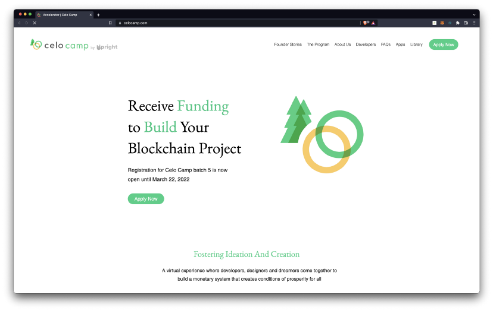

:::tip

Learn more: [Upright and Celo Launch Celo Camp Batch 5](https://medium.com/celoorg/upright-and-celo-launch-celo-camp-batch-5-apply-now-934aa776dba0)

:::

### Ecosystem Venture Fund

The [Celo Ecosystem Venture Fund](https://celo.org/community#fund) is a Polychain-led venture, supported by founding investors Andreessen Horowitz and Celo, with the goal of investing in and developing the Celo ecosystem.

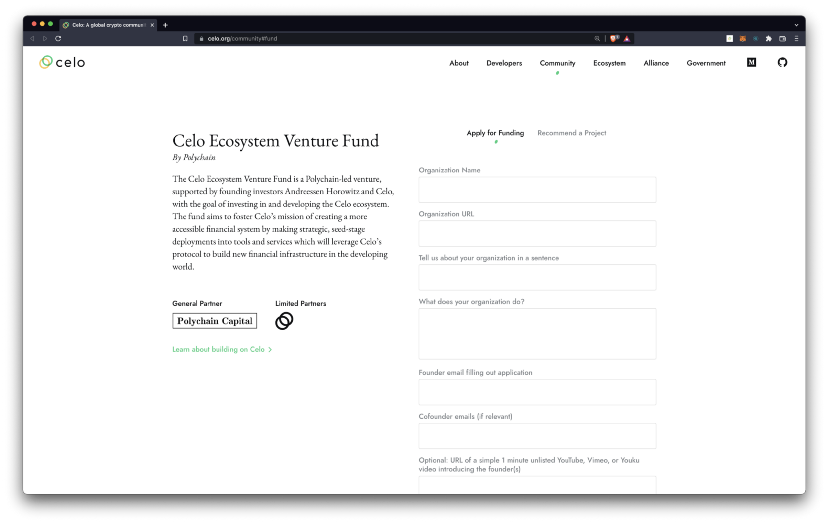

:::tip

Learn more: [Overview of current Funding Initiatives in the Celo Ecosystem](https://medium.com/celoorg/overview-of-current-funding-initiatives-in-the-celo-ecosystem-1995f800628e)

:::

### Flori Ventures

[Flori](https://www.floriventures.com/) is more than a seed-stage fund and a portfolio of startups: Their community of founders taps into the power of financial innovation to collaborate around global problems and unlock prosperity for all.

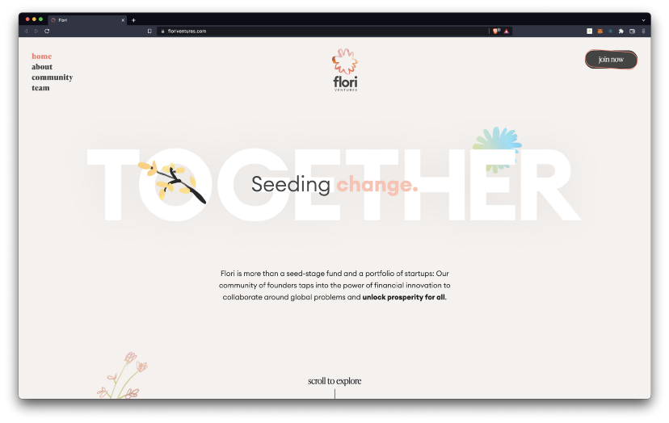

:::tip

Learn more: [Introducing Flori Ventures](https://medium.com/p/ce84ca0e5c7)

:::

## ✅ Join the community

### Kuneco

[Kuneco](https://celo.org/community) is Celo's monthly community call to celebrate progress towards Celo's mission, and strengthen the spirit of community "togetherness" around the world. Join us to hear the latest community news, see demos of the latest projects that have gone live, and make connections with others in the community.

<!-- VIDEO -->

:::tip

Learn more: [Recap: Togetherness through Celo Kuneco](https://medium.com/p/9c10a3540de4)

:::

### Follow on social

Celo is growing a global community of developers to build technology and products that are used and loved by people and solve real-world problems. Join the Celo community to contribute to a monetary system that creates the conditions of prosperity for all.

- [Twitter](https://twitter.com/CeloOrg)
- [Celo Monorepo](https://github.com/celo-org/celo-monorepo)
- [Celo Improvement Proposals](https://github.com/celo-org/celo-proposals)
- [Celo blog](https://medium.com/celoorg)
- [Forum](https://forum.celo.org/)
- [YouTube](https://www.youtube.com/channel/UCCZgos_YAJSXm5QX5D5Wkcw)

:::tip

Join the conversation: [Discord](https://discord.com/invite/6yWMkgM)

:::

## Congratulations 🎉

That wraps up today's topic on Getting started with Celo. You can review each of the items we covered below and check that you're ready to apply these new skills.

**Here's a quick review of what we covered 🤔**

- ✅ Introduction to Celo
- ✅ Applications built on Celo
- ✅ Celo platform
- ✅ Celo first steps
- ✅ Get project funding
- ✅ Join the community

You've had your first look at the Celo mission, applications, platform, funding, community and more. You're now ready to start your journey with Celo.

GN! 👋
