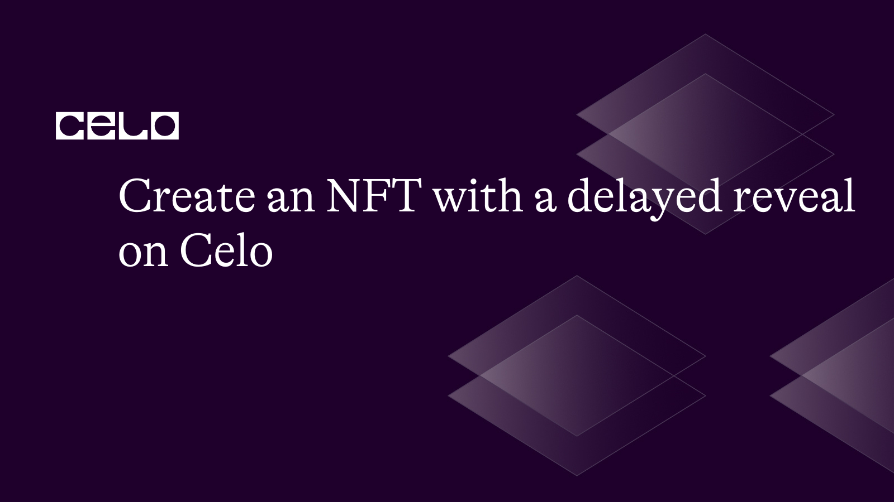
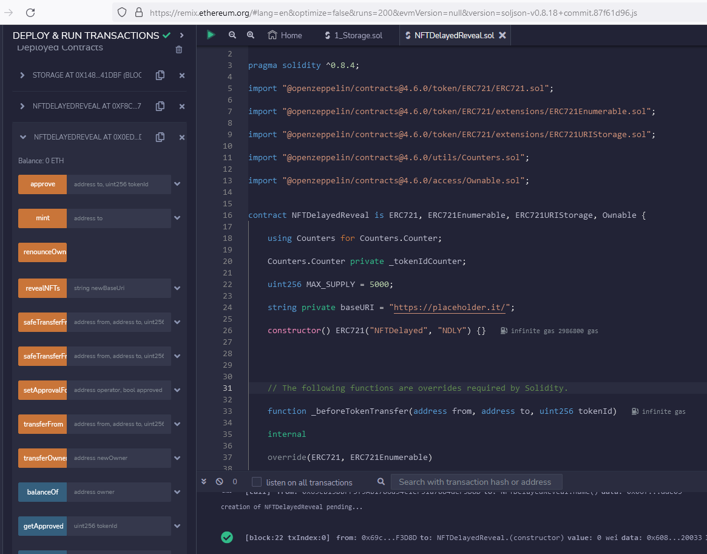

## Introduction

NFT Reveals have started gaining prominence as a way to generate hype about projects and ensure that interest in an NFT projects is sustained for longer times. In this tutorial we will look at how to implement a simple NFT Contract that implements an NFT reveal in solidity. We will deploy the contract to the Celo blockchain on remix and show how to perform the reveal on remix.

### What are Delayed Reveal NFTs

Delayed reveal is an NFT feature that allows you to release your NFTs with hidden content that is only revealed at a later time. NFT owners will initially release their NFTs with placeholder metadata masking the real content of their NFTs till such a time they decide to do the reveal. The reveal is often hours later , or even up to a month later.

When you mint an NFT, what you see on the NFT marketplace is not the exact image that you minted but a placeholder dummy that will be the same for everyone. Every minter/buyer will see the same picture.

This helps to provide a level playing field for participants of the NFT mints; rarity of the NFTs are not immediately known to all minters and so minters can not immediately dump their NFTs on the market affecting the price dynamics.

**How are Delayed Reveal NFTs implemented**
Delayed reveals are implemented in NFT smart contracts by taking advantage of the nature of NFTs.
Most NFTs usually has 2 major attributes that distinguish them:

1. The Token Id
2. The Base URI

The base URI is a link that points to where the metadata for the whole collection is stored, you can think of it as a folder under which each NFT image , its rarity attributes and other details are stored categroized by their token id.

Delayed reveals are then implemented by switching the Base URI from the default Base URI set on first deployment to the final Base URI containing the actual metadata for the NFTs. This is usually done by addiing a smart contract function that allows the NFT Collection Owner to switch the base URI. e.g

```js
function revealNFTs(string memory newBaseUri) public onlyOwner {
	baseURI = newBaseUri;
}
```

At the beginning when deploying the NFT Contract, the base URI will be set to a location containing dummy placeholder images. i.e Each Token ID will have the exact picture, some NFTs have used a black square to represent this.

At the decided time for the reveal, the NFT owner will then call the reveal fuction in the contract and switch the base URI to the new URI where the actual NFT metadata are located. The NFT minters/buyers will then see thattheir black squares have all been replaced by actual unique images.

## Prerequisites

This tutorial assumes that you are familiar with solidity, understand how smart contracts work and know how to deploy smart contracts to a network using remix IDE. Celo is an Ethereum Virtual Machine (EVM) compatible chain, so all the languages and workflows you learned while building for any EVM chain apply to Celo also.

You will also need a knowledge of how NFT smart contracts work, as we will not be covering the basics of NFT in this tutorial. We will only focus on the part that pertains to a delayed NFT Reveal. We will use the openzeppelin NFT library as a base.

You will need the following also

- Metamask (with Celo testnet configured)
- [Remix IDE](https://remix.ethereum.org)
- Pinata Cloud Account (with a v1 API key)
- Node (> 14+ installed on your PC)

## Setup our Project

To write our smart contract for our NFT, we will leverage the [openzeppelin](https://www.openzeppelin.com/) library. We are utilizing this library to avoid writing certain components from scratch.

Next, we head over to [Remix IDE](https://remix.ethereum.org/#optimize=false&runs=200&evmVersion=null&version=soljson-v0.8.7+commit.e28d00a7.js) and create a new solidity file and name it NFT721.sol and we input the following code

```solidity
// SPDX-License-Identifier: MIT

pragma solidity ^0.8.4;

import "@openzeppelin/contracts@4.6.0/token/ERC721/ERC721.sol";

import "@openzeppelin/contracts@4.6.0/token/ERC721/extensions/ERC721Enumerable.sol";

import "@openzeppelin/contracts@4.6.0/token/ERC721/extensions/ERC721URIStorage.sol";

import "@openzeppelin/contracts@4.6.0/utils/Counters.sol";

import "@openzeppelin/contracts@4.6.0/access/Ownable.sol";

contract NFTDelayedReveal is ERC721, ERC721Enumerable, ERC721URIStorage, Ownable {

	using Counters for Counters.Counter;

	Counters.Counter private _tokenIdCounter;

	uint256 MAX_SUPPLY = 5000;

	string private baseURI = "ipfs://cid/folder/";

	constructor() ERC721("NFTDelayed", "NDLY") {}

	// The following functions are overrides required by Solidity.

	function _beforeTokenTransfer(address from, address to, uint256 tokenId)

	internal

	override(ERC721, ERC721Enumerable)

	{

		super._beforeTokenTransfer(from, to, tokenId);

	}

	function _burn(uint256 tokenId) internal override(ERC721, ERC721URIStorage) {

		super._burn(tokenId);

	}

	function tokenURI(uint256 tokenId) public view override(ERC721, ERC721URIStorage) returns (string memory)
	{

		return super.tokenURI(tokenId);

	}

	function supportsInterface(bytes4 interfaceId) public view override(ERC721, ERC721Enumerable) returns (bool)
	{
		return super.supportsInterface(interfaceId);
	}

	function mint(address to) public {

        uint256 tokenId = _tokenIdCounter.current();

        require(tokenId <= MAX_SUPPLY, "Sorry, all NFTs have been minted!");

        _tokenIdCounter.increment();

        _safeMint(to, tokenId);

    }

    function _baseURI() internal view override returns (string memory) {
        return baseURI;
    }

    function revealNFTs(string memory newBaseUri) public onlyOwner {
        baseURI = newBaseUri;
    }

}
```

The last 3 functions are of particular interest to us.

The _\_baseURI_ function is a view function that allows us to set the Base URI for the NFT metadata. This is an override of the openzeppelin **ERC721** contract, and in our override we set the function to return whatever is stored in the _baseURI_ contract variable.

The _mint_ function mints an NFT to the address specified by the caller as long as the total supply is not yet exceeded. Notice that we do not call the base _setTokenUri_ function from the **ERC721** Base class. This allows the contract to generate the Uri for each token by _concatenating the Base URI and the token ID_ only, instead of having us specify the token URI for each token ID.

### Compile and Deploy the NFT Smart Contract on the Alfajores Testnet

Conect your Metamask to the Celo Alfajores Testnet, and ensure the wallet is funded with some testnet coins.

Go to the deploy section on your [Remix IDE](remix.ethereum.org) Deploy and select _Injected Web3_ as the Environment. This will connect to the netwrok selected in your injected Metamask. Select your smart contract in the Contract Tab and click on Deploy.

Metamask should popup asking you to submit the transaction and pay the fees. Click on Confirm and wait for a few seconds. It will add the deployed contract in the Remix!

Our NFT is now deplyed to the CELO testnet. Anyone can mint an NFT by calling the mint function.



### Add NFT Metadata

Our NFT is still missing some key detail, we are yet to upload the metadata supporting the NFT content.

We are going to store metadata for our NFT offchain on IPFS through Pinata Cloud, so install pinata cloud cli by running the following command

```bash
npm i -g pinata-upload-cli
```

Pinata Cloud cli will help you easily upload files and folders via running some commands on your local system. You will need a pinata V1 API Key to use the cli, so signup on [Pinata](pinata.cloud) and get your Api key.

Once you have your Api key, authenticate your IPFS by running the below

```bash
pinata-cli -a APIJWTKEY
```

_Please replace `APIJWTKEY` with your real `JWT`._

We are going to have 2 sets of NFT Metadata, Each set will contain metadata for each of the NFT units thats possible to generate. Ideally, you should be using an automated tool to generate your NFT metadata for your complete collection. The tool will take care of generating unique random attributes for each unit of yur NFT and will ensure you don't have to manually create a large number of files for yourself,

**Set 1**
This set of metadata will represent our placeholder images, its going to point to a black rectangular square. We are going to use the [place-hold.it](place-hold.it) service to generate this rectangle instead of having to upload a dark rectangle image.

Each metadata in this set will contain the exact data as shown below

```json
{
  "description": "Plceholder for Delayed Reveal NFT",

  "external_url": "https://alchemy.com",

  "image": "https://place-hold.it/500x500/000/fff&text=Nft",

  "name": "NFTDelayed",

  "attributes": [
    {
      "trait_type": "Token Standard",

      "value": "ERC721"
    }
  ]
}
```

Create a folder called **temp** , Create as many files as the number of NFT tokens you require and name them based on the token Ids. The content of each file should be the JSON metadata above.
Your Folder should resemble something like this


**Set 2**
This set of metadata will represent our real images with the different rarity attributes for each token. Ideally this set should be generated by whatever tool you are using to manage your NFT collection.
For this tutorial, we will manually generate this.

To generate this set of metadata, duplicate the current **temp** folder and rename it to **main**. Change the metadata to reflect the real NFT details. You will probably add more attributes in the attributes section and change the image and external link as desired.

### Upload Metadata to Pinata

To upload your metadata to Pinata, run the below for each folder

```bash
pinata-cli -u Path-To-Your-TEMP-or-MAIN-Folder
```

Once the folder is uploaded successfully, login to your Pinata account. Go to the files section.
Your folder should show up in the list of files, indicating that it has been uploaded to IPFS and pinned.

Copy the cid and generate a URL by prepending the ipfs scheme.


The URl should be similar to this (I created my temp folder under another folder called stuffs, you don't have to do that)

```text
ipfs://QmcBbMrevuiTPekbDoa5AHRKZ9KsteYHcQzcCG9zKa1wyi/Stuffs/temp
```

Your metadata for each NFT token should be listed under this URL, and this URL will serve as your Base Url.

_The URI we just generated (for the temp folder) should have been your default Base URI while deploying the NFT Contract. But if you have already deployed the contract before getting to this point, it's fine. Call the **RevealNFTs** function in the NFT Contract to switch the Base URI to the URI you just got. If you were doing this for a real world project, you will want to do this before you the mint data begins so that minters will get the placeholder images when they mint._

Go back to your remix IDE, and make sure your active metamask wallet is the wallet you used to deploy the contract.
Now copy the temp folder ipfs url ,and pass it to the RevealNFTs function to switch your Base URI. _Ensure your Base URI ends with a forward slash, as your contract will append each token ID to the Base URI to get their respective token URI._


Confirm the transaction in metamask when asked. This will put our NFT Contract in the state it should be before users start minting.

**Reveal the NFTs**

Our NFT Contract's metadata is currently pointing to the placeholder metadata we uploaded to IPFS. We can confirm this by minting an NFT, and checking the URI for that token. Let's go ahead to mint an NFT.

Go back to remix, to the deployed contract.
Copy your address from Metamask and enter in the input box for the mint Function. Click on Mint to mint 1 token. If this is the first token you are minting then the tokenID will be 0.


Let's ensure our tokenIds are currently pointing to our Base URI by calling the tokenURI view function in our contract. Go back to remix and enter in 0 for the tokenURI function


Your token URI should be returned and should follow the format _Base URI + Token ID_

Noe repeat the process of uploading the folder with the main Folder. Get the generated gateway URI for the main folder. Store the URI somewhere safe and on the sceduled date for the NFT Reveal, replace the plaecholder url by calling the **Reveal** function in the contract and passing it your new URI.

Let's try it out again to see how the Token URI for the token 0 NFT will change once we reveal our NFTs.

We are going to assume that the main folders URI is

```text
ipfs://QmcBbMrevuiTPekbDoa5AHRKZ9KsteYHcQzcCG9zKa1wyi/Stuffs/main/
```

Go to remix IDe and call the revealNFTs function with this new URI.

Now scroll down the list of functions and Call the same tokenURI function you called earlier for token 0. What did you get back as your URI?


## Conclusion

NFT Reveals can change the dynamics of your NFT collections. Switching the Base URI is such an easy implementation but can introduce some excitement to your NFT mints.

## Next Steps

Our RevealNFTs function allows NFT Owners to easily switch the Base URI for their NFTs. For a Real life production case, you will want to implement safe guards to check if you already switched the Base URI before and restrict you to switching only once on the reveal day, otherwise users might doubt if you will not abuse the power and change the URI again in future.

I will leave implementing the safeguards to you to do.

Let me know in the comments if you have any questions.

Source code for this article is [here](https://gist.github.com/layinka/edf4bd680f6da1c8e06c160243cfb4e9)

## About the Author

**[Yinka Tan](https://twitter.com/layinka)** is a full-stack blockchain developer who is fascinated with DeFi, NFTs, and FinTech.

## References

- How do NFT Reveals work? [https://blog.xp.network/how-do-nft-reveals-work-9cbf3c3565a7](https://blog.xp.network/how-do-nft-reveals-work-9cbf3c3565a7)
