# Hardhat and Celo | The Ultimate Guide to Deploy Celo dApps using Hardhat

_How to deploy a smart contract to Celo testnet, mainnet, or a local network using Hardhat._

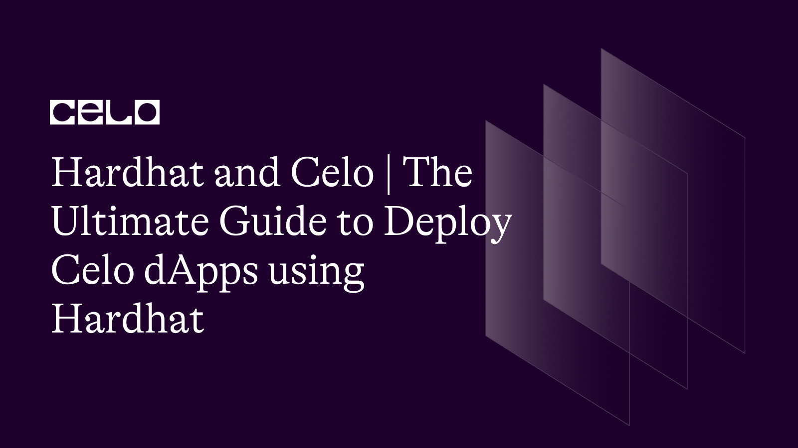

## Hello Developers 🌱

Welcome to today’s post, where we’ll break down a blockchain topic into bite-sized pieces to help you learn and apply your new skills in the real world.

Today’s topic is Deploying on Celo with Truffle.

**Here’s a list of what we’ll cover 🗒**

- ✅ **Step 1:** Environment setup​
- ✅ **Step 2:** Project setup
- ✅ **Step 3:** Write project code
- ✅ **Step 4:** Configure deployment settings
- ✅ **Step 5:** Compile and migrate your contract
- ✅ **Step 6:** Deploy your Contract
- ✅ **Step 7:** View your deployed contract
- ✅ **Step 8:** Verify your smart contract

By the end of this post, you’ll be able to create, deploy, and interact with your smart contract on Celo testnet, mainnet, or localhost using Truffle.

Let’s go! 🚀

## Introduction to Hardhat​

[Hardhat](https://hardhat.org/) is a development environment to compile, deploy, test, and debug your Ethereum or Celo software. It helps developers manage and automate the recurring tasks that are inherent to the process of building smart contracts and dApps, as well as easily introducing more functionality around this workflow. This means compiling, running, and testing smart contracts at the very core.

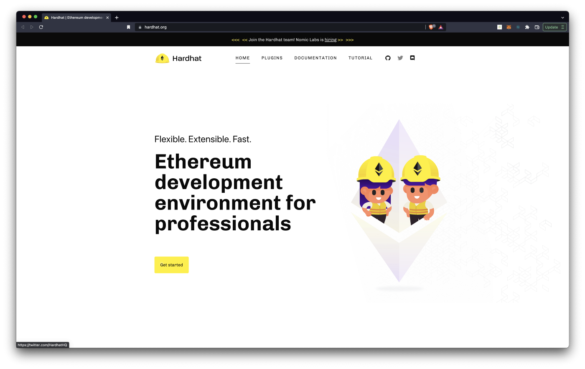

:::tip

Learn more: If you are new to Hardhat check out [Hardhat.org](https://hardhat.org/).

:::

## ✅ Step 1: Environment setup​

Before getting started you’ll need to set up Celo in your local environment. You can do this on Mac or Windows and can find the details on [docs.celo.org](docs.celo.org).

- [Using Windows](https://docs.celo.org/developer-guide/start/develop-on-windows)
- [Using Mac](https://docs.celo.org/developer-resources/using-mac)

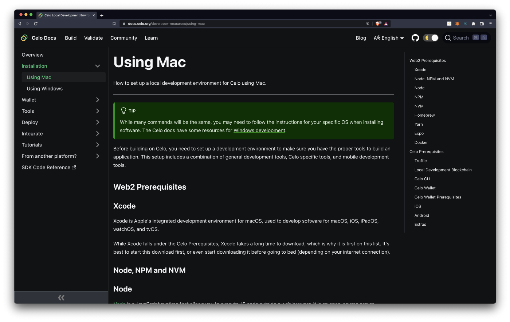

Celo projects include common dependencies like `Nodejs`, `npm`, `nvm`, `yarn`, `git`, and `xCode`. If you already have these installed you can follow this post to set up Celo specific dependencies.

### Node v12.0.0

To build on Celo you’ll need to install and use node v12.0.0.

```
nvm install v12.0.0
nvm use v12.0.0
node --version
```

### Celo Command Line Interface

The celocli lets you interact with the Celo Protocol smart contracts.

```
npm install -g @celo/celocli
```

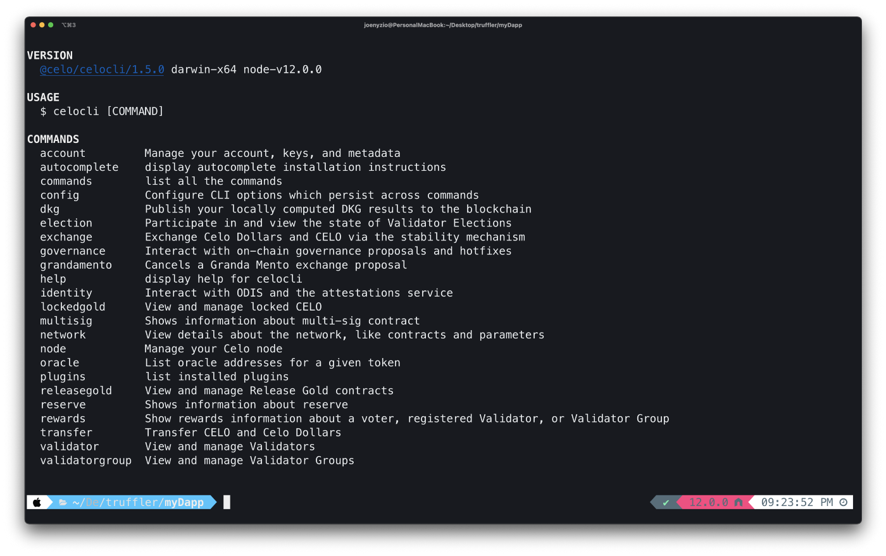

:::tip

Learn more: [17 smart contracts powering the Celo protocol](https://joenyzio.medium.com/17-powerful-celo-protocol-core-contracts-you-need-to-know-d84c1fbc5a6)

:::

## Install Ganache (optional)

[Ganache UI](https://next-stack.github.io/ganache/) creates a local blockchain to help you deploy and test contracts. You can install and set up the UI from their website and can find more details in the [Ganache docs](https://trufflesuite.com/docs/ganache/overview.html).

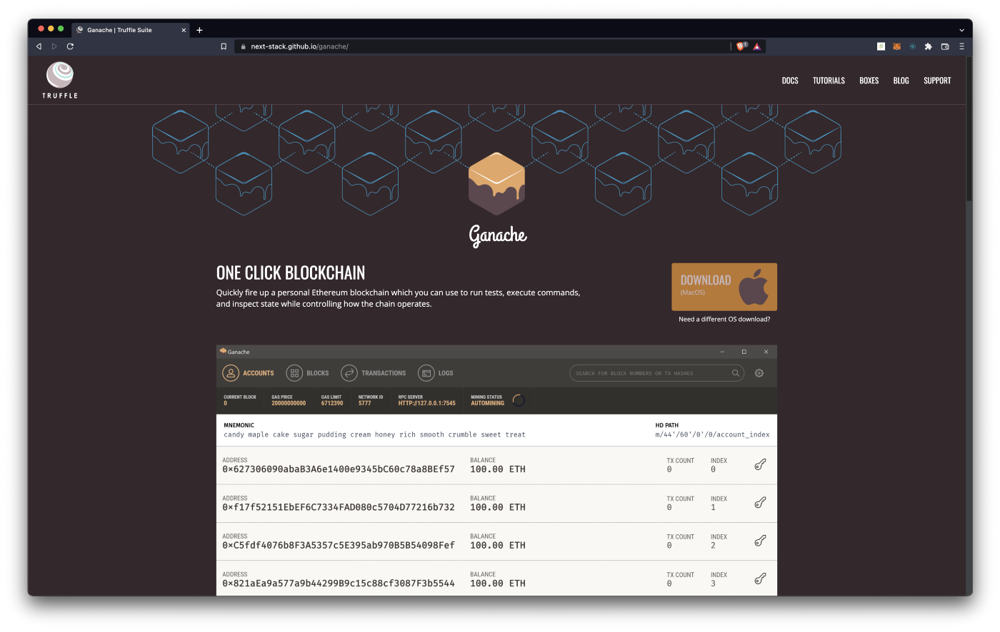

:::tip

The [@celo/ganache-cli](https://github.com/celo-org/ganache-cli) is Celo’s version of Ganache. It doesn’t seem to be working for me but you can try installing it in your environment.

:::

From the Ganache UI, create a new workspace on `localhost:7545`.


## ✅ Step 2: Project setup

Now that you have your environment setup, you’re ready to create your project! Open your terminal to create and navigate into a project folder.

```
mkdir celo-hardhat && cd celo-hardhat
```

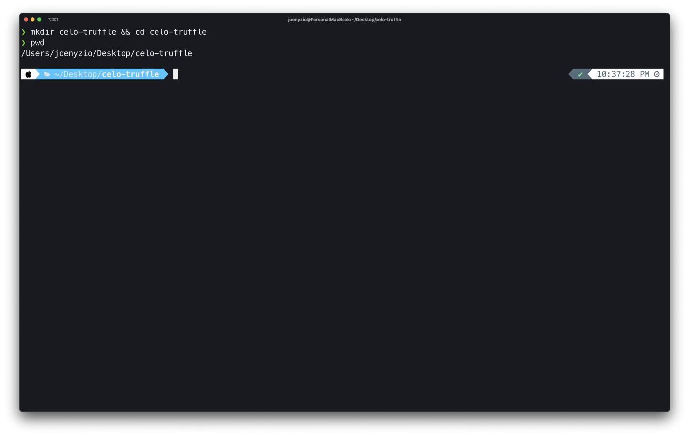

### Initialize an npm project

Initialize an npm project from within the project directory.

```
npm init -y
```

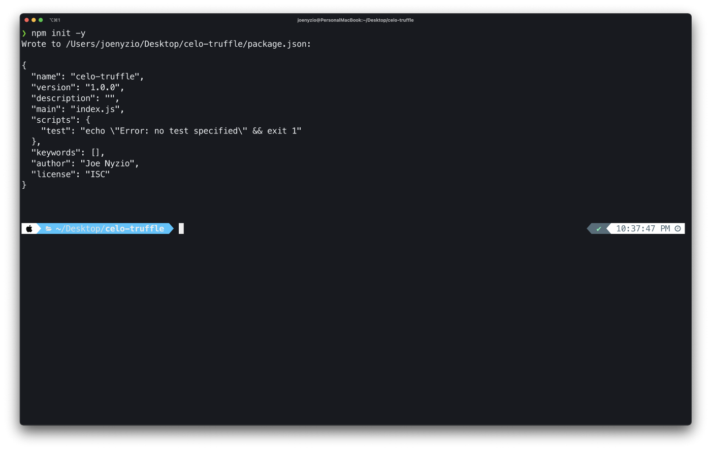

### Install dotenv

[Dotenv](https://www.npmjs.com/package/dotenv) is a module that loads environment variables from a `.env` file. Install this now and you’ll use this to import information to your Truffle configuration file.

```
npm install dotenv
```

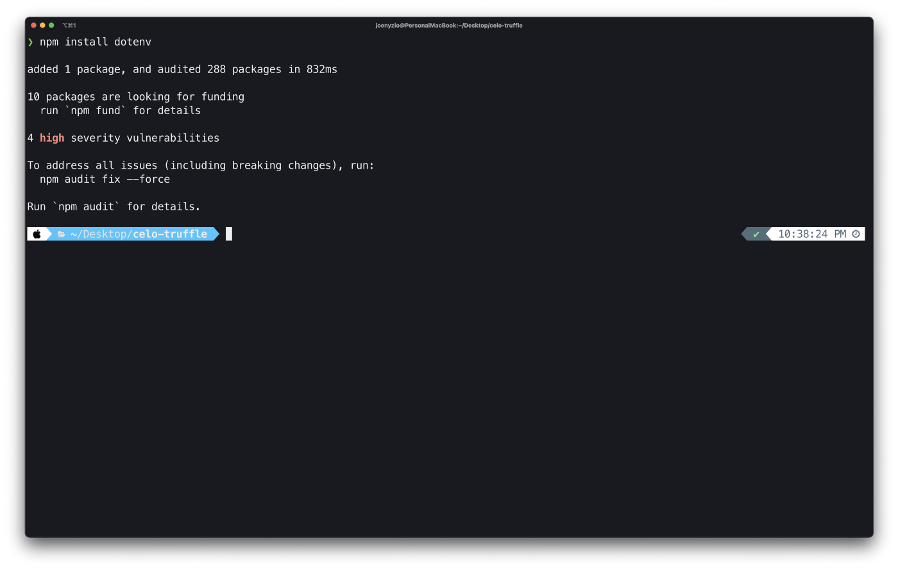

### Initialize hardhat

Adding hardhat to your project allows you to easily build, test, and deploy smart contracts. You can install using `npm` or `npx`.

```
npm install --save-dev hardhat
```

or

```
npx hardhat
```

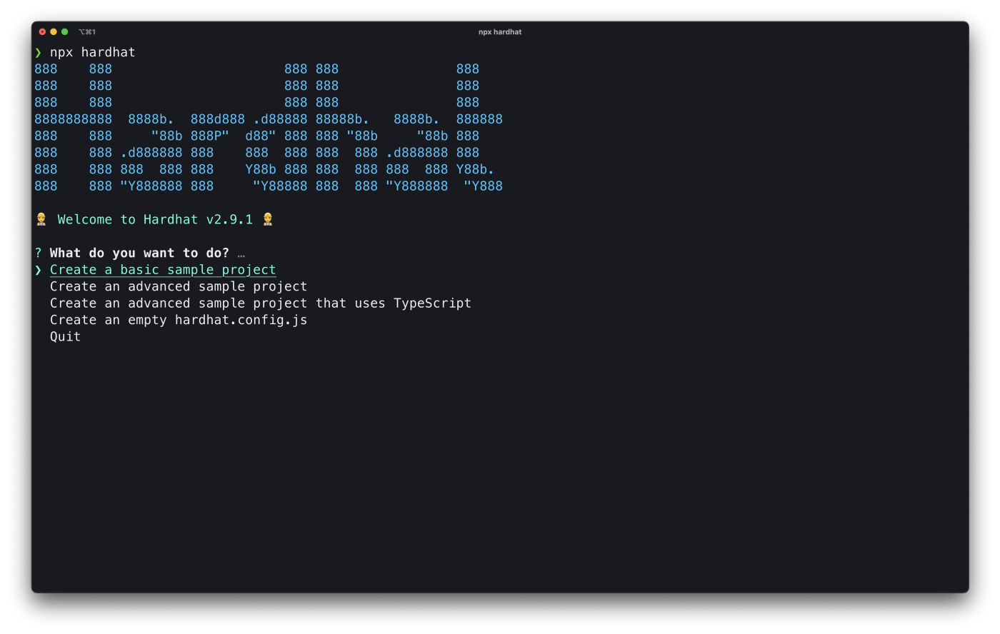

:::tip

Learn more: Follow the [installation instructions and quickstart](https://hardhat.org/getting-started/#installation) for additional details.

:::

### Customize project settings

After initializing hardhat have the chance to customize your project settings. In this post, we’ll Create a basic sample project and accept all of the default settings.

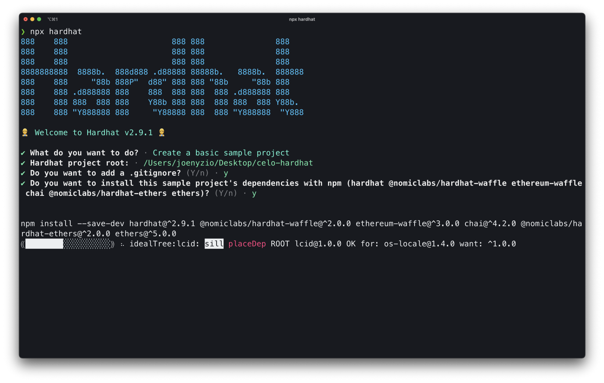

### Open your project

Your project is set up and you’re ready to start building! Open your project in [Visual Studio code](https://www.microsoft.com/en-us/resilience/remote-development-solutions/?&ef_id=Cj0KCQjwtrSLBhCLARIsACh6RmixaTeMbvlNJN4yrdykHGg5e4aN2Px1-Vf_oUq2edhP86n2C1-8lDIaAkxcEALw_wcB:G:s&OCID=AID2200893_SEM_Cj0KCQjwtrSLBhCLARIsACh6RmixaTeMbvlNJN4yrdykHGg5e4aN2Px1-Vf_oUq2edhP86n2C1-8lDIaAkxcEALw_wcB:G:s) or your preferred IDE.

```
code .
```

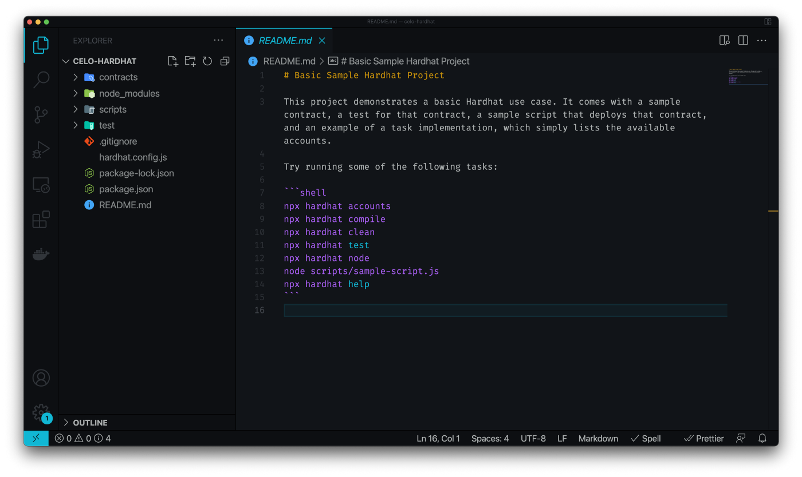

:::tip

You can launch VS Code from the command line by [installing it in your shell path](https://code.visualstudio.com/docs/setup/mac).

:::

## ✅ Step 3: Write project code

To build your project you’ll write a `smart contract`, `script` , `.env`, and `.gitignore` file. You’ll also create an account, fund it with test tokens, and connect the account to your project.

### Smart Contract Code

Hardhat provides a `Greeter.sol` contract to get you started. For this post, you’ll make your own files to give you a better idea of how everything works. Start by creating a file named `HelloCelo.sol` in the `/contracts` folder and add the Solidity code below.

```
// SPDX-License-Identifier: MIT
pragma solidity ^0.8.3;
contract HelloCelo {
   string public greet = "Hello Celo!";
}
```

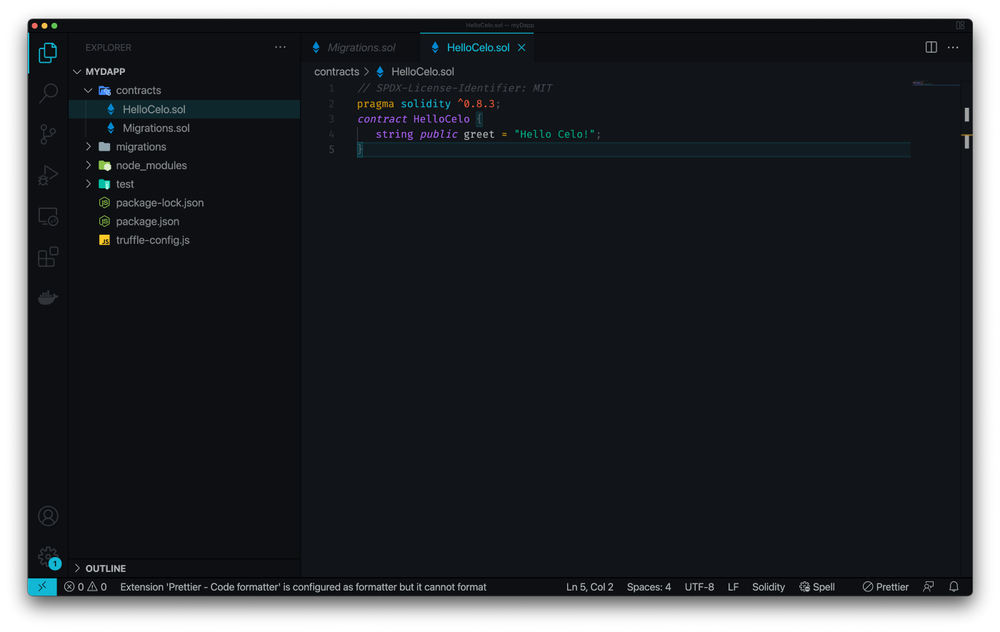

:::tip

Learn more: Read the [Solidity docs](https://docs.soliditylang.org/en/v0.8.9/) or [Solidity by Example](https://solidity-by-example.org/) to learn more about the programming language for building smart contracts.

:::

### Script files

Hardhat also provides a `sample-script.js` file in the `/scripts` folder that you can use to deploy your smart contract. By default, it will deploy the `Greeter.sol` contract. Run the sample script to deploy this contract now!

### Deploy Greeter.sol

```
npx hardhat run scripts/sample-script.js
```

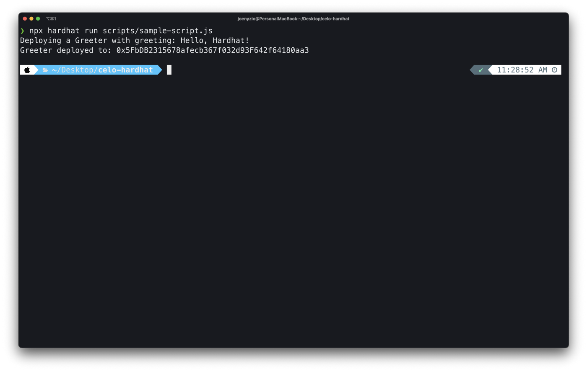

To deploy the `HelloCelo.sol` contract you created, you’ll need to update the `sample-script.js` file to include the new smart contract information. To do this, replace lines 17–22 with the code below.

```
const HelloCelo = await hre.ethers.getContractFactory("HelloCelo");
const helloCelo = await HelloCelo.deploy();
await helloCelo.deployed();
console.log("HelloCelo deployed to:", helloCelo.address);
```

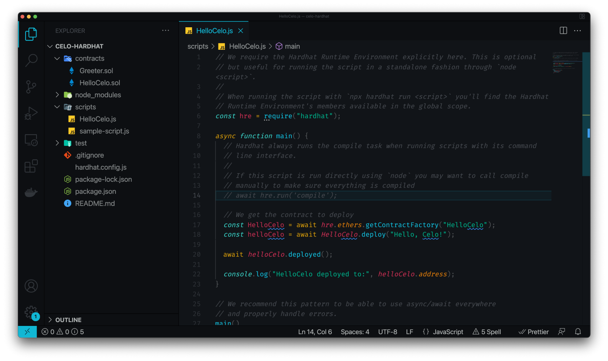

:::tip

If you created a different smart contract, update the const names, file requirement and deployment to match your new contract.

:::

### Deploy HelloCelo.sol

You can now re-run `sample-script.js` to deploy the `HelloCelo.sol` contract.

```
npx hardhat run scripts/sample-script.js
```

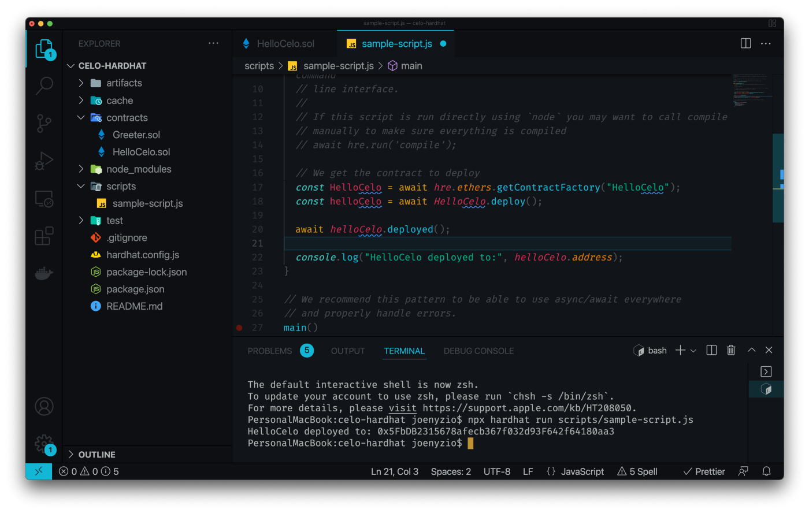

## ✅ Step 4: Create and fund your account

To deploy to the test or main Celo networks, you’ll need an account that is funded with CELO tokens. In this post, you’ll get set up to deploy for free on the Celo Alfajores test network!

### Create an account

If you don’t already have an account you would like to use, you can run celocli account:newfrom your terminal to create one for this project.

```
celocli account:new
```

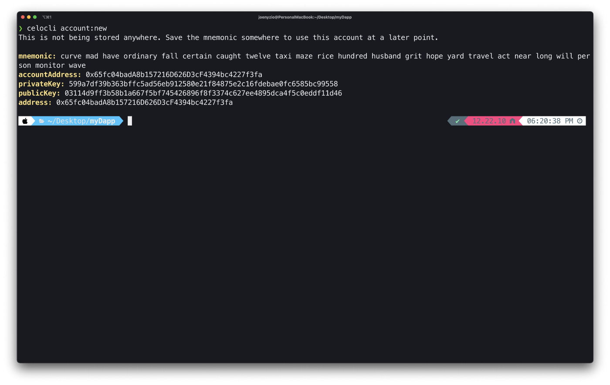

:::tip

Learn more: [Celo CLI: A practical guide to energize your Celo toolkit](https://joenyzio.medium.com/celo-cli-a-practical-guide-to-energize-your-celo-toolkit-9253067fff3a)

:::

### Fund your account

The [Alfajores testnet faucet](https://faucet.celo.org) helps you fund your account with test tokens. Copy your address from the terminal and paste it into the site to fund your account. This should send you tokens within a few seconds.

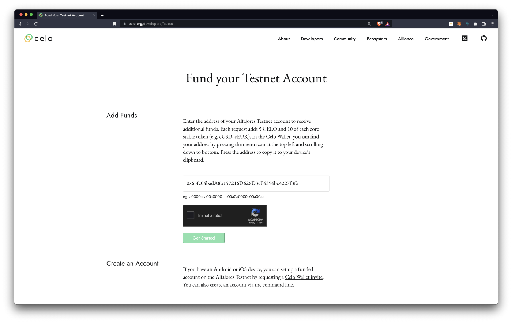

### Check account balance

If you’d like to check your new account balance, you can use celocli to make sure you received your test funds.

```
celocli account:balance 0xYOURADDRESS
```

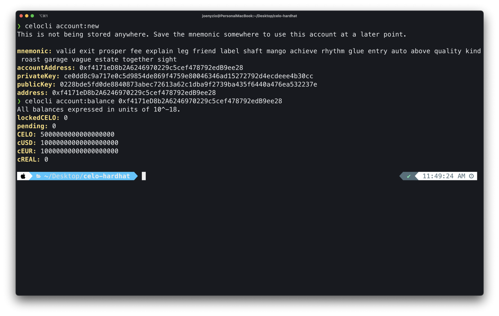

### Create .env file

A `.env` file will help you hide the sensitive information you need for your configuration file. Create a `.env` file in your root folder and add your account’s private key.

```
PRIVATE_KEY="5ead931ce4812310e31f84c471945b96a13098aa6dc8cf0d3f6f451a5dea56cc"
```

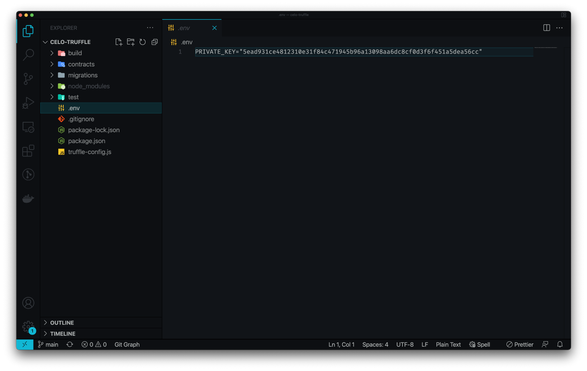

:::tip

See [ignoring files](https://help.github.com/articles/ignoring-files/) for more information.

:::

## ✅ Step 5: Configure deployment settings

The hardhat configuration file specifies the networks for your contract deployment. As of now, the `sample-script.js` file ​is deploying your contracts to a local blockchain on Hardhat.

### Update hardhat.config

To deploy to Celo, you to update the configuration file to point to the Celo network. To do this, open [hardhat-config.js](https://hardhat.org/config/) in a text editor and replace its contents with this [Celo configuration code](https://github.com/joenyzio/celo-hardhat/blob/main/hardhat.config.js).

### Local network

Creating your new Ganache workspace earlier made a local blockchain at `localhost:7545`. The `local` configuration connects to this local blockchain.

```
localhost: {
      url: "http://127.0.0.1:7545"
    },
```

:::tip

If you choose to [Set up a Local Development Chain](https://docs.celo.org/developer-guide/development-chain), your blockchain will also be hosted on a private network on localhost. This same configuration can be used to connect to the local development chain.

:::

### Alfajores test network

The `alfajores` configuration uses Forno to connect you to Alfajores using the private key in your `.env` file.

```
alfajores: {
   url: “https://alfajores-forno.celo-testnet.org",
   accounts: [process.env.PRIVATE_KEY],
   chainId: 44787,
},
```

### Celo main network

The `celo` configuration uses Forno to connect you to mainnet using the private key in your `.env` file. This tutorial will use Alfajores but you can to deploy to the main network whenever you’d like.

```
celo: {
   url: "https://forno.celo.org",
   accounts: [process.env.PRIVATE_KEY],
   chainId: 42220,
},
```

:::tip

[Forno](https://docs.celo.org/developer-guide/forno) is a cLabs hosted node service for interacting with the Celo network. This allows you to connect to the Celo Blockchain without having to run your own node.

:::

## ✅ Step 6: Deploy your contract

You’ve done the hard part and it’s now time to deploy your contract to Celo! Run any of the following commands from your root project directory to deploy to Celo.

### Deploy to Alfajores

This post got you set up to deploy on Alfajores. Try it out now! If this works you can skip the other deployment options and move on to the next step.

```
npx hardhat run scripts/sample-script.js --network alfajores
```

### Deploy to Mainnet

Replace the private key in `.env` with a Celo Mainnet account that has Celo. Once you’ve done that you’ll be ready to deploy to Mainnet.

```
npx hardhat run scripts/sample-script.js --network celo
```

### Deploy to Local Host

Open Ganache (installation instructions at beginning of the post) and create a workspace on `localhost:7545`. Then you’ll be able to deploy to localhost.

```
npx hardhat run scripts/sample-script.js --network localhost
```

## ✅ Step 7: View your deployed contract

Now that you deployed your contract, you can view it in the Celo block explorer (known as [BlockScout](https://explorer.celo.org/). Copy your contract address from the terminal and navigate to the [block explorer](https://explorer.celo.org/) to search for your deployed contract.

- Switch to your network using the dropdown by the search bar.
- Navigate to [BlockScout](https://explorer.celo.org/) and select the network of your deployed contract.
- Paste your contract address from the terminal window and search for it in BlockExplorer.

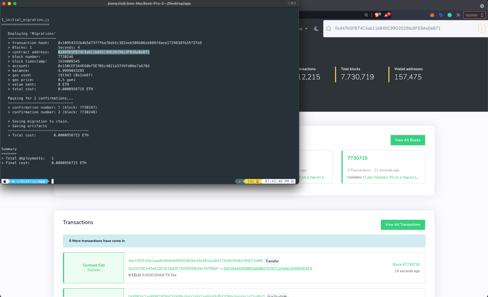

:::tip

Learn more about building and deploying dApps using the [HardHat documentation](https://hardhat.org/).

:::

## ✅ Step 8: Verify your smart contract

For people to use and interact with your contract, they’ll want to be able to view the smart contract code you created. Verifying a smart contract allows people to to do this from within the Celo Block Explorer.

### Using Blockscout​

Navigate to the `Code` tab on the `Explorer` page for your contract’s address
Click `Verify & Publish` to enter the smart contract verification page

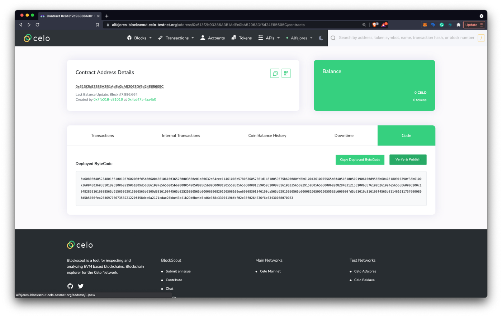

- Upload your smart contract (example: `HelloCelo.sol`) and its `.json` file (example: `HelloCelo.json`) found in `build > contracts folder`.

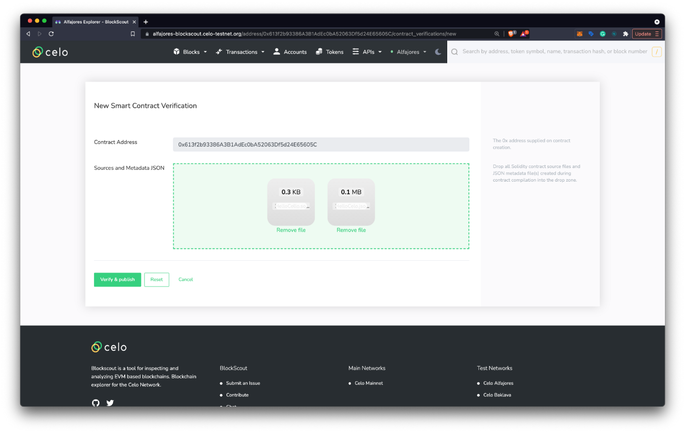

- Click `Verify & Publish`
- Navigate to the `Contract Address Details` Page in the block explorer to, use the Code, Read Contract, and Write Contract panels to view and interact with your deployed smart contract.

### Using Hardhat-deploy plugin​

You can read an in depth guide about how to deploy and verify contracts on Celo programmatically using the hardhat-deploy plugin [here](https://docs.celo.org/blog/hardhat-deploy-verify).

## Congratulations 🎉

That wraps up today’s topic on _Deploying on Celo with Hardhat_. You can review each of the items we covered below and check that you’re ready to apply these new skills.

**Here’s a review of what we covered 🤔**

- ✅ **Step 1:** Environment setup​
- ✅ **Step 2:** Project setup
- ✅ **Step 3:** Write project code
- ✅ **Step 4:** Configure deployment settings
- ✅ **Step 5:** Compile and migrate your contract
- ✅ **Step 6:** Deploy your Contract
- ✅ **Step 7:** View your deployed contract
- ✅ **Step 8:** Verify your smart contract

If you run into any issues, try reviewing the content or searching online to explore each topic in more detail. Hopefully, you’ve learned a few things about **Deploying on Celo with Hardhat** that you can apply in the real world.

GN! 👋
