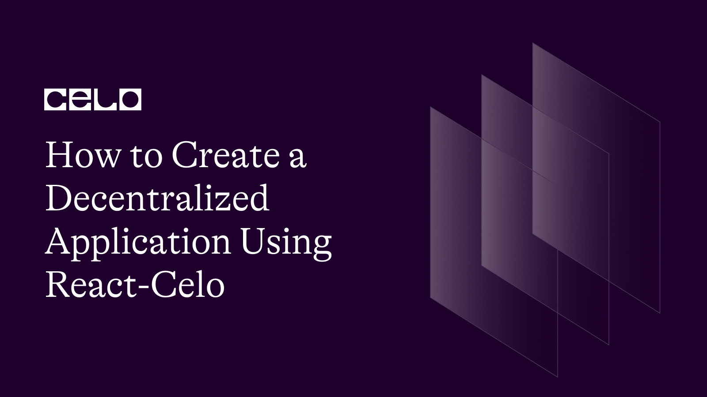

## Introduction

In this tutorial, we will be building a decentralized application(Dapp) for the crowdfunding smart contract we created and deployed to the Celo blockchain previously. A decentralized application(Dapp) according to [Wikipedia](https://en.wikipedia.org/wiki/Decentralized_application) is an application that can run autonomously, typically through a smart contract, that runs through a decentralized computing, blockchain, or other distributed ledger. Simply put a Dapp is an application that runs without human intervention and is not owned by any one entity. Tokens are distributed by the Dapp to represent ownership.

## Prerequisites

For the purpose of this tutorial, you will need to have some level of knowledge of Javascript, React, and Solidity.

## Requirements

For this article, you will be needing a code editor VScode preferable, a chrome browser, and the Celo wallet extension installed on your chrome browser. If you don’t have the Celo wallet extension installed, follow this video tutorial on [how to install the Celo wallet extension on your chrome browser](https://youtu.be/KD_0kKxtl8c).

## The Smart Contract

In a previous tutorial, we created and deployed a crowdfunding smart contract to the Celo blockchain. Here is the smart contract code.

```solidity
//SPDX-License-Identifier: MIT
pragma solidity ^0.8.4;
contract crowdFunding {
address payable public owner;
uint public MinimumContribution;
address[] public contributors;
constructor(uint minimum) {
owner = payable(msg.sender);
MinimumContribution = minimum;
 }
modifier onlyOwner() {
require(owner == msg.sender);
_;
}
function contribute() public payable {
require(msg.value > MinimumContribution);
contributors.push(msg.sender);
}
function withdraw(uint amount) public onlyOwner returns (bool) {
require(amount < address(this).balance);
owner.transfer(amount);
return true;
}
function viewBalance() public view onlyOwner returns (uint) {
return address(this).balance;
 }
function viewContributors() public view onlyOwner returns (address[] memory) {
return contributors;
 }
 }
```

In the smart contract code above, we created the contract class and called it CrowdFunding. In our smart contract, we defined a variable of owner to store the address of the creator of the smart contract, a variable defined as minimunContribution to store the minimum amount a contributor can contribute to the crowdfunding program, and a list of addresses to store the addresses of contributors. The smart contract also contains function calls that allow users to make contributions to the smart contract. For in-depth details on creating and deploying the smart contract, go through the tutorial on [creating your first smart contract on the celo blockchain](https://www.notion.so/Creating-a-Smart-Contract-Dapp-8f4b831ed38341c2a84e5eeb17ba42c5) before continuing with this tutorial.

## The Decentralized Application

We will be using React to build the Dapp/website. React is an open-source JavaScript library for creating websites and user interfaces. Visit the official Reactjs website to learn more about React.

First, you will need to create a new react app. In the previous tutorial, where we built our smart contract, we created a folder called crowdfunding-contract, it is in this folder we will also be creating our react app. In the terminal point to the crowdfunding-contract and type

```bash
mkdir dapp
cd dapp
yarn create react-app .
```

yarn creat react-app initializes a new React project for us. Once initialization of our React application is done, our dapp folder should look like this.


For the styling of the Dapp, I will be using tailwindcss. Tailwindcss is a utility first CSS framework that provides us with predefined classes to build custom user interface. To install and initialize tailwindcss, copy and paste these commands in your terminal:

```bash
yarn add --dev tailwindcss
npx tailwindcss init
///
```

npx tailwindcss init creates a tailwind.config.js file in your dapp folder. In the tailwind.config.js file, copy and paste this code.

```js
/** @type {import('tailwindcss').Config} */
module.exports = {
  content: ["./src/**/*.{js,jsx,ts,tsx}"],
  theme: {
    extend: {},
  },
  plugins: [],
};
```

Add the @tailwind directives for each of Tailwind’s layers to your index.css file.

```css
@tailwind base;
@tailwind components;
@tailwind utilities;
```

After react app has been successfully created and tailwindcss installed, we will have to install react-celo along with celo contract-kit in the dapp folder we created. react-celo is a React hook for managing access to Celo with a built-in headless modal system for connecting to your user's wallet of choice. To install react-celo and celo contract-kit run the following commands in your terminal.

```bash
yarn add @celo/react-celo @celo/contractkit
```

We will have to make further configurations to our project folder to enable us to use react-celo without running into errors or bugs. This configuration involves installing webpack and other dependencies. To install webpack, type these commands in your terminal.

```bash
yarn add --dev webpack
```

After successfully installing webpack, create a webpack.config.js file in the dapp folder and paste the code in it.

```js
const path = require("path");
module.exports = {
  entry: "./src/index.js",
  output: {
    filename: "main.js",
    path: path.resolve(__dirname, "build"),
  },
  node: {
    net: "empty",
  },
};
```

For the other dependencies, paste this in your terminal.

```bash
yarn add --dev react-app-rewired crypto-browserify stream-browserify assert stream-http https-browserify os-browserify url buffer process
```

Create config-overrides.js in the dapp folder with the content:

```js
const webpack = require("webpack");
module.exports = function override(config) {
  const fallback = config.resolve.fallback || {};
  Object.assign(fallback, {
    crypto: require.resolve("crypto-browserify"),
    stream: require.resolve("stream-browserify"),
    assert: require.resolve("assert"),
    http: require.resolve("stream-http"),
    https: require.resolve("https-browserify"),
    os: require.resolve("os-browserify"),
    url: require.resolve("url"),
  });
  config.resolve.fallback = fallback;
  config.plugins = (config.plugins || []).concat([
    new webpack.ProvidePlugin({
      process: "process/browser",
      Buffer: ["buffer", "Buffer"],
    }),
  ]);
  return config;
};
```

In the package.json file, change the scripts field for start, build, and test. Replace react-scripts with react-app-rewired:

```json
"scripts": {
      "start": "react-app-rewired start",
      "build": "react-app-rewired build",
      "test": "react-app-rewired test",
      "eject": "react-scripts eject"
},
```

Once we are done with the necessary configurations, the dapp folder should look like this:


In the index.js file under the src folder, import the CeloProvider component and "@celo/react-celo/lib/styles.css”.

```js
//src/index.js
import { CeloProvider } from "@celo/react-celo";
import "@celo/react-celo/lib/styles.css";
```

Then wrap the CeloProvider component around the <App/> component in the index.js file.

```js
//src/index.js
import React from "react";
import ReactDOM from "react-dom/client";
import "./index.css";
import App from "./App";
import reportWebVitals from "./reportWebVitals";
import { CeloProvider } from "@celo/react-celo";
import "@celo/react-celo/lib/styles.css";
import { SupportedProviders } from "@celo/react-celo";
const root = ReactDOM.createRoot(document.getElementById("root"));
root.render(
  <React.StrictMode>
    <CeloProvider>
      <App />
    </CeloProvider>
  </React.StrictMode>
);
// If you want to start measuring performance in your app, pass a function
// to log results (for example: reportWebVitals(console.log))
// or send to an analytics endpoint. Learn more: https://bit.ly/CRA-vitals
reportWebVitals();
```

react-celo uses [React's Context.Provider](https://reactjs.org/docs/context.html#contextprovider) under the hood to inject state throughout your application. This is why it is important to wrap your application with the provider in order to be able to access all the goodies react-celo provides.

In the CeloProvider component, we will specify the props, dapp and connectModal . The connectModal prop allows us to modify the connect wallet modal that has been made for users to connect their wallet through react-celo .

```js
//src/index.js
root.render(
  <React.StrictMode>
    <CeloProvider
      dapp
      connectModal={{
        // This options changes the title of the modal and can be either a string or a react    element
        title: <span>Connect your Wallet</span>,
        // This option toggles on and off the searchbar
        searchable: true,
      }}
    >
      <App />
    </CeloProvider>
  </React.StrictMode>
);
// If you want to start measuring performance in your app, pass a function
// to log results (for example: reportWebVitals(console.log))
// or send to an analytics endpoint. Learn more: https://bit.ly/CRA-vitals
reportWebVitals();
```

We can also hide specific wallets from the default list through the providersOptions. To learn more about using providersOptions to hide some default wallets, visit the [react-celo](https://docs.celo.org/developer/react-celo#default-wallets-and-customization) official documentation. In this tutorial, we will be going along with the wallet provided by react-celo.

Next, we will leave the index.js file and jump into the App.js to create the UI that allows users to connect to their wallet and also interact with the crowdfunding smart contract we created. In the App.js file, alight and delete all the code present leaving you with a blank App.js file. In the blank App.js file, import the useCelo hook from react-celo. The useCelo hook allows us to access the connect function that initiates the connection to a wallet and opens a modal from which the user can choose a wallet to connect.

```js
//src/App.js
import { useCelo } from "@celo/react-celo";
```

Still in the App.js file, we will create the App component that will house our Dapp UI.

```js
//src/App.js
import { useCelo } from "@celo/react-celo";
function App() {
  return (
    <div className="flex flex-col justify-center items-center h-screen bg-[url(https://images.pexels.com/photos/3943716/pexels-photo-3943716.jpeg?auto=compress&cs=tinysrgb&w=1260&h=750&dpr=2)] bg-cover bg-center bg-no-repeat">
      {" "}
      <div className="text-center bg-[#7b7a82] text-white text-xl p-2">
        {" "}
        <span>
          Welcome to our crowdfunding Dapp, where anyone can invest in
          innovative ideas and exciting projects.
        </span> <span>
          Join us today and become a part of the next big thing!
        </span>{" "}
      </div> <div className="mt-4">
        {" "}
        {address ? (
          <button className="bg-[#49cc90] text-white"> Donate </button>
        ) : (
          <button
            onClick={connect}
            className="bg-[#bd8822] text-white py-2 px-4 rounded-md"
          >
            {" "}
            Connect Wallet{" "}
          </button>
        )}{" "}
      </div>{" "}
    </div>
  );
}
export default App;
```

In the App component, we created a parent div and centered its contents vertically and horizontally using flexbox by applying the predefined classes provided by tailwindcss for flexbox. In the parent div, we also conditionally rendered a button. The donate button gets rendered when the user has successfully connected their wallet to the Dapp and the address property is set to true. While the connect wallet button always gets rendered when a user hasn’t connected their wallet and the address property is set to false. Our next line of action is to destructure the connect function from the useCelo hook we imported, in order for us to be able to call it when the onClick event on the connect wallet button is triggered.

In the App component above the return statement, destructure the connect function and address property from the useCelo hook.

```js
//src/App.js
import { useCelo } from "@celo/react-celo";
function App() {
  const { connect, address } = useCelo();
  return (
    <div className="flex flex-col justify-center items-center h-screen bg-[url(https://images.pexels.com/photos/3943716/pexels-photo-3943716.jpeg?auto=compress&cs=tinysrgb&w=1260&h=750&dpr=2)] bg-cover bg-center bg-no-repeat">
      {" "}
      <div className="text-center bg-[#7b7a82] text-white text-xl p-2">
        {" "}
        <span>
          Welcome to our crowdfunding Dapp, where anyone can invest in
          innovative ideas and exciting projects.
        </span> <span>
          Join us today and become a part of the next big thing!
        </span>{" "}
      </div> <div className="mt-4">
        {" "}
        {address ? (
          (alert("Wallet successfully connected"),
          (<button className="bg-[#49cc90] text-white"> Donate </button>))
        ) : (
          <button
            onClick={connect}
            className="bg-[#bd8822] text-white py-2 px-4 rounded-md"
          >
            {" "}
            Connect Wallet{" "}
          </button>
        )}{" "}
      </div>{" "}
    </div>
  );
}
export default App;
```

In your terminal pointing to the dapp folder, run the yarn start to start the React development server. Once the server starts, the React application opens on localhost:3000.

[Here](https://drive.google.com/file/d/1rYq2X9dfitQP-08t0rVYGQ-L3M1npd7e/view?usp=share_link) is a quick view of how your DApp should look like.

Clicking on the connect button opens a modal that prompts you to select from a list of default wallets. Click on [the Celo wallet extension](https://chrome.google.com/webstore/detail/celoextensionwallet/kkilomkmpmkbdnfelcpgckmpcaemjcdh?hl=en) to connect it to your Dapp. If you don't have a celo wallet extension installed on your browser, check out this video on how to set up a celo wallet extension on your browser.

Moving on, let us create a modal that contains an input field where users can put the amount of donation they would like to make to the crowdfunding smart contract. To create the modal, we create a different file in the src folder and call it contributeModal.js.

```js
const ContributeModal = (props) => {
  return (
    <div className="bg-[rgba(0,0,0,0.3)] fixed inset-0 z-50 flex flex-col justify-center items-center">
      <form onSubmit={handleSubmit} className="bg-white py-4 px-6 rounded">
        <div
          className="text-end text-xl font-medium cursor-pointer"
          onClick={props.onClose}
        >
          {" "}
          x
        </div>
        <div className="mt-3">
          <div>
            <label className="text-sm">Amount:</label>
          </div>
          <input
            className="outline-none border border-black rounded-[5px] text-sm px-4 py-1.5"
            placeholder="Enter a Celo Amount"
            ref={amountRef}
            onChange={handleAmount}
          />
        </div>
        <div className="text-center mt-3">
          <button
            type="submit"
            className="bg-[#49cc90] px-4 py-2 rounded-md text-white"
          >
            Contribute
          </button>
        </div>
      </form>
    </div>
  );
};
///
```

Create a ContributeModal component. In the component, return a div wrapped around the form. The div serves as the modal wrapper and is given a position of fixed. The form contains an input field to accept the amount and a button to transfer the amount specified to the smart contract.
Still in the src folder, we will create a file called crowdfunding.abi.js and in it export the ABI for the smart contract we created. An ABI (Application Binary Interface) gives a smart contract, in this case the smart contract we created the ability to communicate with the Dapp and other smart contracts.
Import the ContributeModal into the App.js file.

```js
// src/App.js
import { useCelo } from "@celo/react-celo";
import ContributeModal from "./contributeModal";
import { useState } from "react";
function App() {
  const { connect, address } = useCelo();
  const [openContributeModal, setOpenContributeModal] = useState(false);
  return (
    <div className="flex flex-col justify-center items-center h-screen bg-[url(https://images.pexels.com/photos/3943716/pexels-photo-3943716.jpeg?auto=compress&cs=tinysrgb&w=1260&h=750&dpr=2)] bg-cover bg-center bg-no-repeat">
      {" "}
      <div className="text-center bg-[#7b7a82] text-white text-xl p-2">
        {" "}
        <span>
          Welcome to our crowdfunding Dapp, where anyone can invest in
          innovative ideas and exciting projects.
        </span> <span>
          Join us today and become a part of the next big thing!
        </span>{" "}
      </div> <div className="mt-4">
        {" "}
        {address ? (
          (alert("Wallet successfully connected"),
          (<button className="bg-[#49cc90] text-white"> Donate </button>))
        ) : (
          <button
            onClick={connect}
            className="bg-[#bd8822] text-white py-2 px-4 rounded-md"
          >
            {" "}
            Connect Wallet{" "}
          </button>
        )} {openContributeModal ? (
          <ContributeModal onClose={() => setOpenContributeModal(false)} />
        ) : null}{" "}
      </div>{" "}
    </div>
  );
}
export default App;
```

Import the React useState and in the App component declare a openContributeModal state and give it a value of false. On the contribute button, declare an onClick event that calls a function which changes the state of the openContributeModal to true when the button is clicked. Then conditionally render the ContributionModal component and pass in the onClose props which calls a when that sets the openContributionModal to false and closes the modal.

In the crowdfunding.abi.js file, copy and paste this code.

```js
export const abi = [
  {
    inputs: [{ internalType: "uint256", name: "minimum", type: "uint256" }],
    stateMutability: "nonpayable",
    type: "constructor",
  },
  {
    inputs: [],
    name: "MinimumContribution",
    outputs: [{ internalType: "uint256", name: "", type: "uint256" }],
    stateMutability: "view",
    type: "function",
  },
  {
    inputs: [],
    name: "contribute",
    outputs: [],
    stateMutability: "payable",
    type: "function",
  },
  {
    inputs: [{ internalType: "uint256", name: "", type: "uint256" }],
    name: "contributors",
    outputs: [{ internalType: "address", name: "", type: "address" }],
    stateMutability: "view",
    type: "function",
  },
  {
    inputs: [],
    name: "owner",
    outputs: [{ internalType: "address payable", name: "", type: "address" }],
    stateMutability: "view",
    type: "function",
  },
  {
    inputs: [],
    name: "viewBalance",
    outputs: [{ internalType: "uint256", name: "", type: "uint256" }],
    stateMutability: "view",
    type: "function",
  },
  {
    inputs: [],
    name: "viewContributors",
    outputs: [{ internalType: "address[]", name: "", type: "address[]" }],
    stateMutability: "view",
    type: "function",
  },
  {
    inputs: [{ internalType: "uint256", name: "amount", type: "uint256" }],
    name: "withdraw",
    outputs: [{ internalType: "bool", name: "", type: "bool" }],
    stateMutability: "nonpayable",
    type: "function",
  },
];
```

## Getting User’s Wallet Balance

```bash
yarn add bignumber.js
```

Many Celo operations operate on numbers that are outside the range of values used in Javascript. In this case we will use bignumber.js because it can handle these numbers.

```js
// src/App.js
import { useCelo } from "@celo/react-celo"; import ContributeModal from "./contributeModal"; import { useState } from "react"; import BigNumber from "bignumber.js"; function App() { 	const {connect, address, getConnectedKit} = useCelo(); 	const [openContributeModal, setOpenContributeModal] = useState(false); 	const ERC20_DECIMALS = 18 return ( 	 ... ) } export default App;
```

Create the variable ERC20_DECIMALS and set it to 18. Since cUSD, the one that you are going to use here, is an ERC20 token, use ERC20_DECIMALS to convert values.

```js
// src/App.js
import { useCelo } from "@celo/react-celo";
import ContributeModal from "./contributeModal";
import { useState } from "react";
function App() { 	const {connect, address, getConnectedKit} = useCelo(); 	const [openContributeModal, setOpenContributeModal] = useState(false); const [totalBalance, setTotalBalance] = useState(); const ERC20_DECIMALS = 18 	const getStableToken = async () => { const kit = await getConnectedKit(); const cUSDToken = await kit.contracts.getStableToken(); const usercUSDBalance = await cUSDToken.balanceOf(address); return usercUSDBalance; } const accountSummary = async () => { const totalBalance = await getStableToken(); const cUSDBalance = new BigNumber(totalBalance) .shiftedBy(-ERC20_DECIMALS) .toFixed(2); setTotalBalance(cUSDBalance); }; if(address) { accountSummary(); }
  return (
    ...
  );
}
export default App;
```

Create a state variable totalBalance. We will store the value of the user balance in this state.

Import the getConnectedKit from useCelo. getConnectedKit gets the connected instance of MiniContractKit. If the user is not connected, this opens up the connection modal.

In the getStableToken function, create and store the instance of MiniContractKit in the variable kit. Then get the instance of the cUSD token contract wrapper. To get the user cUSD balance call the balanceof function on the instance of the cUSD token contract wrapper we created with the address passed as a parameter. store this value in a variable and return the variable.

In the accountSummary function, call the getStableToken function to get the returned value and store it in the totalBalance variable. The value returned from the getStableToken function is a big number, so convert it to be readable by shifting the comma 18 places to the left and use toFixed(2) to display only two decimal places after the decimal point. Instead of 10000000000000000000, you get 10.00.

Then call the accountSummary function. Store the reduced number in the totalBalance state. To display the user balance on the Dapp, you will have to change the UI of the Dapp slightly.

Copy the layout below and use it to replace the current layout you are returning in the App component.

```js
<div className="bg-[url(https://images.pexels.com/photos/3943716/pexels-photo-3943716.jpeg?auto=compress&cs=tinysrgb&w=1260&h=750&dpr=2)] bg-cover bg-center bg-no-repeat">
  {" "}
  <div className="text-end p-4">cUSD: {totalBalance}</div> <div className="flex flex-col justify-center items-center h-screen relative">
    {" "}
    <div className="text-center bg-[#7b7a82] text-white text-xl p-2">
      {" "}
      <span>
        Welcome to our crowdfunding Dapp, where anyone can invest in innovative
        ideas and exciting projects.
      </span> <span>
        Join us today and become a part of the next big thing!
      </span>{" "}
    </div> <div className="mt-4">
      {" "}
      {address ? (
        <button
          onClick={() => setOpenContributeModal(true)}
          className="bg-[#49cc90] text-white outline-none py-2 px-4 rounded-md"
        >
          {" "}
          Donate{" "}
        </button>
      ) : (
        <button
          onClick={connect}
          className="bg-[#bd8822] text-white py-2 px-4 rounded-md outline-none"
        >
          {" "}
          Connect Wallet{" "}
        </button>
      )}{" "}
    </div> {openContributeModal ? (
      <ContributeModal onClose={() => setOpenContributeModal(false)} />
    ) : null}{" "}
  </div>{" "}
</div>
```

Now you have an extra div that shows the user’s cUSD token balance. The content of the div will be the state variable we created to store the reduced value of the user’s cUSD token balance.

Your App.js file should now look like this.

```js
function App() { const {connect, address, getConnectedKit} = useCelo(); 	const [openContributeModal, setOpenContributeModal] = useState(false); const [totalBalance, setTotalBalance] = useState(); const ERC20_DECIMALS = 18 	const getStableToken = async () => { const kit = await getConnectedKit(); const cUSDToken = await kit.contracts.getStableToken(); const usercUSDBalance = await cUSDToken.balanceOf(address); return usercUSDBalance; } const accountSummary = async () => { const totalBalance = await getStableToken(); const cUSDBalance = new BigNumber(totalBalance) .shiftedBy(-ERC20_DECIMALS) .toFixed(2); setTotalBalance(cUSDBalance); }; accountSummary(); return ( <div className="bg-[url(https://images.pexels.com/photos/3943716/pexels-photo-3943716.jpeg?auto=compress&cs=tinysrgb&w=1260&h=750&dpr=2)] bg-cover bg-center bg-no-repeat"> <div className="text-end p-4">cUSD: {totalBalance}</div> <div className="flex flex-col justify-center items-center h-screen relative"> <div className="text-center bg-[#7b7a82] text-white text-xl p-2"> <span>Welcome to our crowdfunding Dapp, where anyone can invest in innovative ideas and exciting projects.</span> <span>Join us today and become a part of the next big thing!</span> </div> <div className="mt-4"> {address ? ( <button onClick={() => setOpenContributeModal(true)} className="bg-[#49cc90] text-white outline-none py-2 px-4 rounded-md" > Donate </button> ) : ( <button onClick={connect} className="bg-[#bd8822] text-white py-2 px-4 rounded-md outline-none" > Connect Wallet </button> )} </div> {openContributeModal ? ( <ContributeModal onClose={() => setOpenContributeModal(false)} /> ) : null} </div> </div> ); } export default App;
```

Pass the address as a prop in the ContibuteModal component. In the contributeModal.js file.

```js
import { useState, useRef } from "react";
import { useCelo } from "@celo/react-celo";
const ContributeModal = (props) => {
  const [amount, setAmount] = useState("");
  const contractAddress = "0xc6b26C6CC673DF83BA051871b8140cE9ff61859f";
  const amountRef = useRef();
  const { performActions } = useCelo();
  const transferFunds = async (amount) => {
    performActions(async (kit) => {
      const celoTokenContract = await kit.contracts.getStableToken();
      const tx = await celoTokenContract
        .transfer(contractAddress, amount)
        .send({ from: props.address });
      const receipt = await tx.waitReceipt();
      console.log("Transaction Receipt: ", receipt);
    });
  };
  const handleAmount = async () => {
    setAmount(amountRef.current.value);
  };
  const handleSubmit = async (e) => {
    e.preventDefault();
    await transfer(amount);
  };
  return (
    <div className="bg-[rgba(0,0,0,0.3)] fixed inset-0 z-50 flex flex-col justify-center items-center">
      {" "}
      <form onSubmit={handleSubmit} className="bg-white py-4 px-6 rounded">
        {" "}
        <div
          className="text-end text-xl font-medium cursor-pointer"
          onClick={props.onClose}
        >
          {" "}
          x{" "}
        </div> <div className="mt-3">
          {" "}
          <div>
            {" "}
            <label className="text-sm">Amount:</label>{" "}
          </div> <input
            className="outline-none border border-black rounded-[5px] text-sm px-4 py-1.5"
            placeholder="Enter a Celo Amount"
            ref={amountRef}
            onChange={handleAmount}
          />{" "}
        </div> <div className="text-center mt-3">
          {" "}
          <button
            type="submit"
            className="bg-[#49cc90] px-4 py-2 rounded-md text-white"
          >
            {" "}
            Contribute{" "}
          </button>{" "}
        </div>{" "}
      </form>{" "}
    </div>
  );
};
export default ContributeModal;
```

Import React useState and useRef and useCelo from react-celo. Create a state to store the amount gotten from the user input, store the smart contract address in a variable.

Create a ref using useRef to keep the value gotten from the input field. Create a function that gets called when there is a change in the input field and a function that gets called when a user clicks on the contribute button.

De-structure performActions from useCelo. performActions is a helper function for handling any interaction with a Celo wallet.

In the transferFunds function, call the performActions function and pass in a callback function that accepts the instance of the MiniContractKit, kit. In the callback function, create an instance of a StableTokenWrapper by calling the method await kit.contracts.getStableToken.

To transfer cUSD to the smart contract, call the transfer and send method on the instance of the StableTokenWrapper. The transfer method accepts two arguments, the smart contract address and the amount the user wants to transfer, while the send method accepts an object that takes the from key carrying the address of the sender as a value. Then create a variable that stores the receipt of the transaction.

In the handleSubmit function, call the transferFunds function and pass in the amount the sender wishes to send as a parameter to the transfer function. Clicking on the contribute button triggers the handleSubmit function and the transferFunds function gets called. This opens the user wallet and prompts the user to either confirm or cancel the transaction.

## Conclusion

So far we have been able to create a smart contract Dapp using React. We created the UI enabled a user to connect their wallet to the Dapp, display the user's wallet balance and also ensure the user can transfer funds to the smart contract we created.

## Next Steps

Check out the Celo docs for more information on using react-celo in your Dapp and building on the Celo blockchain. You can also check out this [Github repo](https://github.com/Southpaw0/how-to-create-a-dapp-on-celo-using-reactcelo) for more guide and code resources.

## About the Author

[Israel Okunaya](https://meetisraelokunaya.curious.page/) is an ace writer with a flair for simplifying complexities and a knack for storytelling. He leverages over four years of experience to meet the most demanding writing needs in different niches, especially food and travel, blockchain, and marketing. He sees blockchain as a fascinating yet tricky affair. So, he's given to simplifying its complexities with text and video tutorials.

## References

- [React-celo](https://docs.celo.org/developer/react-celo#default-wallets-and-customization)

- [How to Install the Celo Wallet Extension on your Chrome Browser](https://youtu.be/KD_0kKxtl8c)

- [Sending Celo and Mento Stable Assets](https://docs.celo.org/developer/walkthrough/hello-celo)

- [React's Context.Provider](https://reactjs.org/docs/context.html#contextprovider)
