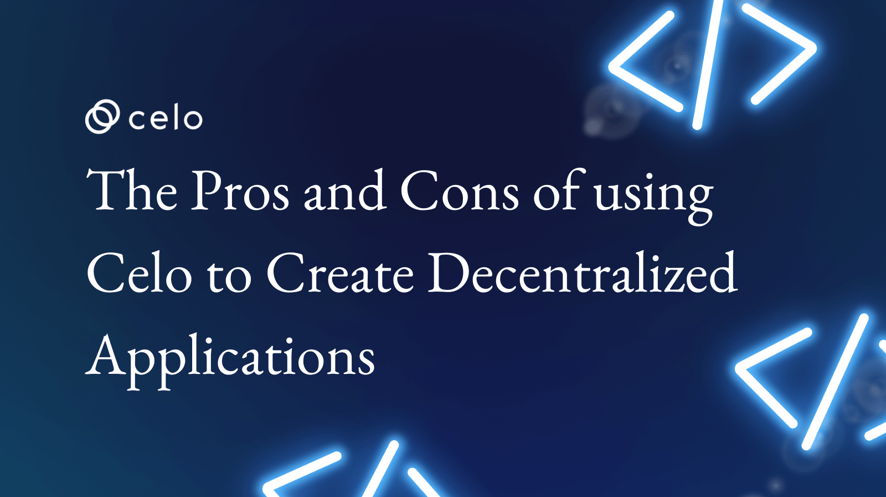

## Introduction

The Celo platform will be examined in this article, along with how it functions as a decentralized platform for creating and deploying decentralized applications (dApps). I'll be talking about the advantages and disadvantages of using the Celo to make dApps from the perspective of a developer.

## Prerequisites

You should have a fundamental understanding of blockchain technology and how it is used to create dApps in order to completely understand this article. Additionally, you should be knowledgeable about the idea of proof-of-stake consensus systems and have some background creating applications using APIs.

## What is Celo's Methodology?

The fact that Celo is based on a proof-of-stake (PoS) blockchain means that validators who own a stake in the platform are responsible for protecting the network. These validators are in charge of approving transactions and adding them to the blockchain, and they are rewarded for doing so by receiving CELO, the platform's native money.

Stablecoins, which are digital assets linked to fiat money, are one of Celo's key characteristics. cUSD, cEUR, and cREAL are the three stablecoins that Celo currently offers. These stablecoins can be used to speed up transactions and hold value in dApps on the Celo platform. A dApp might, as an illustration, permit users to exchange products and services using the US dollar-pegged cUSD. Users may benefit from stability and predictability as a result because the stablecoin's value ought to be relatively stable.

Additionally, Celo offers a decentralized governance structure that enables the community to decide how the platform will develop. This is accomplished through a procedure known as "voting," in which validators and other stakeholders can express their support for or opposition to community-submitted proposals. This makes decision-making more democratic and ensures that the platform responds to user needs.

## THE PROS OF USING CELO FOR DAPP DEVELOPMENT

- **Security** The security that the Celo provides is one of its main benefits. The proof-of-stake consensus process used by the Celo platform can aid in preserving the network's security and integrity. This is significant for every dApp because user trust is maintained through security. What do I mean by that?

On a blockchain network like Celo, an algorithmic technique called proof-of-stake consensus is utilized to protect and confirm transactions. A proof-of-stake system selects the network's validators (also known as "nodes") based on the quantity of bitcoin they possess, or their "stake" in the network, to create new blocks and validate transactions. In contrast, validators in proof-of-work systems are chosen based on their capacity to resolve challenging computational tasks, or "work."

Proof-of-stake has the advantage of being less resource- and energy-intensive than proof-of-work, which can require more computing power to solve problems. As a result, a proof-of-stake system has the potential to be both more effective and less expensive to run than a proof-of-work system.

Proof-of-stake also has the advantage of potentially being more secure than proof-of-work because validators have a stake in preserving the network's integrity. A validator would run the risk of losing interest in the network if they attempted to engage in harmful activities. As a result, validators are motivated to act honorably and uphold the network's security.

In general, the proof-of-stake consensus method can aid in preserving the security and integrity of the Celo network, which is crucial for fostering user confidence in dApps created with the Celo.

- **Scalability**: A dApp's ability to manage an increasing volume of users and transactions without encountering delays or bottlenecks is known as its scalability, and it is a key factor to take into account. A dApp that is not scalable would find it difficult to satisfy user needs, which would be bad for the user experience.

Highly scalable dApps are made possible via the Celo Blockchain. The proof-of-stake consensus method used by the Celo network is typically more effective and less resource-intensive than proof-of-work systems. This indicates that there won't be any delays or bottlenecks as a result of the volume of transactions the Celo network can process.

Additionally, the Celo Blockchain offers features and tools that can aid developers in creating scalable dApps. For instance, the "state channels'' feature of Celo enables off-chain transactions to be handled significantly more quickly than on-chain transactions. This can ease the load on the primary blockchain, increase scalability, and facilitate a better user experience.

Overall, Celo’s scalability might be a huge advantage for developers trying to create dApps that are meant to be used by a broad user base.

- **Interoperability** The capacity of various systems or platforms to cooperate and exchange data is referred to as "interoperability." Interoperability in the context of blockchain refers to the capacity of various blockchain networks to communicate and exchange information with one another.

The ability to use dApps created on one blockchain platform on other platforms is one advantage of interoperability. Developers that want to make their dApps more accessible to a larger audience may find this to be helpful. A dApp created on the Celo platform, for instance, might be utilized by users of other blockchain networks, including Ethereum or Bitcoin.

Through the use of "bridges'' that link several networks, Celo provides compatibility with other blockchain platforms.
Users can transfer assets between networks thanks to these bridges, facilitating smooth interoperability between various blockchain systems.

Therefore, the interoperability offered by Celo can be a huge advantage for developers wishing to create decentralized applications (dApps) that can run on different blockchain platforms and be used by a larger user base.

- **Ease of use** For developers creating decentralized apps (dApps) on the Celo platform, Celo is designed to be simple to use. It can be simpler for developers to create dApps on the platform because the API has been designed to be easy to integrate into already-existing applications.

One of the main advantages of using Celo is that it frees developers from having to spend a lot of time and energy integrating with the underlying platform and instead enables them to concentrate on creating and upgrading their dApps. This can aid developers in marketing their dApps more rapidly and effectively, which can be crucial in a highly competitive market.

Additionally, a user-friendly API can also assist in lowering the entrance barrier for developers who are new to creating dApps, making it easier for a larger spectrum of developers to get engaged.

## Additional Celo Features Include

The Celo platform contains a variety of other characteristics that make it a desirable option for dApp development, in addition to stablecoins and a decentralized governance framework. For instance:

- **Gas fees using numerous cryptocurrencies** When users carry out specific actions on the Celo blockchain, such as running a smart contract or transferring tokens, they are paid gas fees. These costs, which are often paid in the network's native cryptocurrency, are required to stop spam and other forms of abuse on the network (in this case, CELO).

The ability to pay gas fees in cryptocurrencies other than CELO is one advantage the Celo platform offers dApp developers. This can be useful for users and developers who prefer to pay for gas expenses using a particular currency rather than purchasing CELO expressly for this reason.

Since users can use the currency they are most familiar with, this functionality may make it simpler for developers to create and release their dApps on the Celo platform. Additionally, since they may use their preferred currency to pay for gas prices, it can make it easier for users to interact with dApps on the Celo platform.

- **Carbon-Negative Blockchain** The Celo platform is made to offset more carbon emissions than it produces, making it carbon-negative. For developers that are worried about the environmental impact of their dApps and want to make sure they are creating sustainable and responsible applications, this can be a crucial factor to take into account.

The Celo platform aspires to be carbon-negative in a number of ways. The platform, for instance, uses a proof-of-stake consensus method, which requires less energy than some other blockchains' proof-of-work algorithms. Additionally, the Celo Foundation has committed to using a combination of carbon offset programs and investments in renewable energy to offset the carbon emissions produced by the platform. The Celo platform can help by offsetting more carbon emissions than it produces.

Hence, the Celo platform's carbon-negative status can be a significant advantage for developers who want to create dApps that are both technically and socially responsible. It can aid in ensuring that dApps developed on the platform have a positive environmental impact as opposed to causing negative environmental outcomes.

## THE CONS OF USING CELO FOR DAPP DEVELOPMENT

- **Limited adoption** The limited adoption of Celo is one potential disadvantage. Because it is still in its infancy, the Celo platform might not be as widely used as older, more well-known platforms like Ethereum. This might make it harder for dApps made with Celo to acquire user adoption.

- **Complexity** No matter the platform utilized, creating decentralized apps (dApps) can be a challenging task. Developers who are not familiar with blockchain technology or dApp development may find it difficult to work with the Celo Blockchain.

One potential drawback of using Celo for dApp development is that it can be too complicated for programmers who are inexperienced with the platform or its specific requirements. This may be particularly relevant if the developer lacks prior knowledge of blockchain technology or general dApp development. Since learning about the Celo platform and how to use the API properly can be time-consuming in this situation, the developer may need to devote additional time to these tasks.

But the intricacy of the API is probably less of a problem for developers who are already familiar with the Celo platform and have experience with dApp development. These programmers will probably be able to use the API more effectively and launch their dApps more swiftly. The developer's level of expertise, familiarity with the platform, and knowledge of dApp development in general will ultimately determine whether or not the complexity of Celo is a pro or a con.

- **Limited resources** As a more recent platform, the Celo ecosystem might not offer developers as many resources as older platforms like Ethereum. This may be a drawback for developers wishing to create decentralized apps (dApps) on the Celo platform because it may limit their access to resources like tools, libraries, and other resources.

For instance, there might be fewer libraries and tools available to developers building dApps on the Celo platform, which can make it harder for them to discover the best solutions for their needs. Additionally, the documentation and support resources for the Celo platform may be more constrained than those for more well-known systems, making it more challenging for developers to discover solutions to their problems.

In general, developers may find it more difficult to create and maintain dApps on the Celo platform due to the platform's restricted resources, especially if they are unfamiliar with the platform and its unique requirements. However, more resources may become available to developers as the Celo ecosystem develops and evolves, which can help to offset this problem.

### Conclusion

In conclusion, the Celo API provides dApp developers with a number of advantages, including security, scalability, compatibility, and simplicity of usage. However, it's necessary to also take into account any potential difficulties and disadvantages of using Celo, such as its slow uptake, complexity, and resource limitations. The demands and objectives of your dApp project will determine whether or not Celo is the best option.

### References

[Celo documentation](https://docs.celo.org/developer)
[Celo whitepaper](https://celo.org/papers/whitepaper)

### About the Author

Maxwell Onyeka is a strategy and results-driven manager with more than five years experience building paid and organic marketing funnels for SaaS companies. [LinkedIn](https://www.linkedin.com/in/maxwell-onyeka-3b4b1118b/) [Twitter](https://twitter.com/Maxwellowy)
