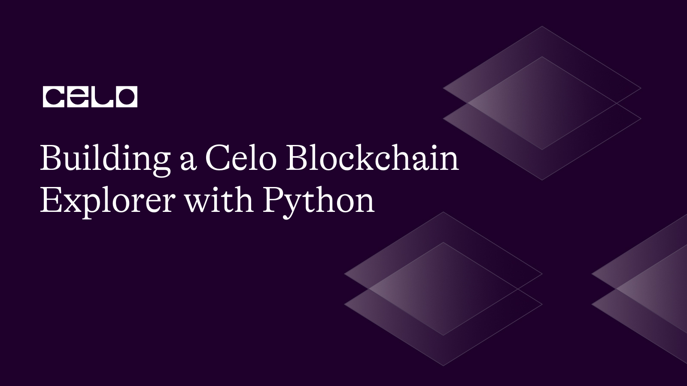

## Introduction

Blockchain explorers are crucial resources for comprehending the information kept on a blockchain. They enable users, developers, and other blockchain-related data to examine transactions, accounts, smart contracts, and other information. In this tutorial, we'll create a blockchain explorer for the Celo network using Python and the web3.py library.

## Prerequisites

Before beginning this lesson, you should have a fundamental understanding of blockchain technology, the Celo network, Python, and the web3.py module. A Celo node or endpoint that implements the Celo JSON-RPC API should also be available.

## Requirements

To develop the Celo blockchain explorer, we will require the following libraries:

- Python 3.7 or later
- [Web3.py](https://web3py.readthedocs.io/en/stable/) (for interacting with the blockchain)

## Step 1: Set up the Project

On your terminal, use the following commands to create a new folder for your project:

```bash
mkdir celo-blockchain-explorer
cd celo-blockchain-explorer
```

In your new directory, create a Python virtual environment and activate it with the following commands:

```bash
python3 -m venv env
source env/bin/activate
```

Next, Install the following libraries using pip, the Python package manager:

```bash
pip install web3 py-solc-x python-dotenv
```

## Step 2: Importing Required Libraries and Setting Up Web3 Connection

First, create a file called [app.py](http://app.py) in the root directory of your project and paste the following code:

```python
import os
from web3 import Web3
from web3.middleware import geth_poa_middleware
from dotenv import load_dotenv

load_dotenv()

# Set up web3 connection
provider_url = os.environ.get("CELO_PROVIDER_URL")
w3 = Web3(Web3.HTTPProvider(provider_url))
assert w3.is_connected(), "Not connected to a Celo node"

w3.middleware_onion.inject(geth_poa_middleware, layer=0)
```

The `os` module, which offers a communication mechanism with the operating system, is first imported. The Web3 class, which we will use to communicate with the Celo blockchain, is also imported and the web3.middleware module's `geth_poa_middleware function` is required to establish a connection to a Proof of Authority (PoA) chain like Celo. The `load_dotenv function`, which loads environment variables from a `.env` file, is imported in the fourth line of the `dotenv` library.

## Step 3: Retrieving Transaction and Block Data

Next, a blockchain explorer should have functionality that allows users to get transaction details, block information, and wallet balance.

```python
# Retrieving Transaction and Block Data
latest_block_number = w3.eth.block_number
print(f'Latest Block Number: {latest_block_number}')

# To get the details of a specific block:
block_number = 1000
block = w3.eth.get_block(block_number)
print(f'Block {block_number} details: {block}')

# To obtain transaction details by transaction hash:
transaction_hash = '0x8c183dc066cc5ece0e4f6cf9a0dcfb4965c6af496d2985df8356d24275717759'
transaction = w3.eth.get_transaction(transaction_hash)
print(f'Transaction details: {transaction}')

# To check the balance of a specific wallet address:
address = '0x8BdDeC1b7841bF9eb680bE911bd22051f6a00815'
balance = w3.eth.get_balance(address)
print(f'Address balance: {balance} Celo')
```

The most recent block number is first obtained using the `w3.eth.block_number` attribute, which is then printed to the terminal.

Using the `w3.eth.get_block` method and the block number as a parameter, we may get information about a particular block. After that, the console is printed with the block specifics.

By supplying the transaction hash as a parameter to the `w3.eth.get_transaction` method, we may access transaction details by the transaction hash. The transactional information is thereafter printed to the console.

We utilize the `w3.eth.get_balance` method, supplying the address as a parameter, to verify the balance of a certain wallet address. Following that, the address balance is reported to the console.

## Step 3: Building the Command-Line Interface

Next, let us build a command line interface for working with the features of our blockchain Explorer.

```python
def main():
    print('Welcome to the Celo Blockchain Explorer!')
    while True:
        user_input = input('Enter a command (h for help): ').lower()
        if user_input == 'h':
            print_help()
        elif user_input == 'q':
            break
        else:
            handle_command(user_input)

def print_help():
    print('Commands:')
    print('  h - Display help')
    print('  q - Quit the explorer')
    print('  block <block_number> - Show block details')
    print('  tx <transaction_hash> - Show transaction details')
    print('  balance <wallet_address> - Show wallet balance')

def handle_command(command):
    cmd_parts = command.split()
    if len(cmd_parts) == 0:
        return
    cmd = cmd_parts[0]
    if cmd == 'block':
        show_block_details(cmd_parts[1:])
    elif cmd == 'tx':
        show_transaction_details(cmd_parts[1:])
    elif cmd == 'balance':
        show_wallet_balance(cmd_parts[1:])
    elif cmd == 'search':
        search_data(cmd_parts[1:])
    elif cmd == 'stats':
        show_network_stats()
    elif cmd == 'contract':
        show_contract_details(cmd_parts[1:])
    else:
        print('Invalid command. Type "h" for help.')

def search_data(args):
    if len(args) != 1:
        print('Invalid search query. Please provide a valid transaction hash, block hash, or wallet address.')
        return

    query = args[0]
    if query.startswith('0x'):
        if len(query) == 66:
            show_transaction_details([query])
        elif len(query) == 42:
            show_wallet_balance([query])
        else:
            show_block_details([query])
    else:
        show_block_details([query])

def show_network_stats():
    latest_block = w3.eth.get_block('latest')
    block_number = latest_block['number']
    gas_used = latest_block['gasUsed']
    avg_block_time = (
        latest_block['timestamp'] - w3.eth.get_block(block_number - 100)['timestamp']) / 100

    print(f'Total blocks: {block_number}')
    print(f'Latest block gas used: {gas_used}')
    print(
        f'Average block time (last 100 blocks): {avg_block_time:.2f} seconds')

def show_transaction_details(args):
    if len(args) != 1:
        print('Invalid transaction hash. Please provide a valid transaction hash.')
        return

    transaction_hash = args[0]
    transaction = w3.eth.get_transaction(transaction_hash)
    if transaction is None:
        print('Transaction not found.')
        return

    ERC20_ABI = [
        {
            "constant": true,
            "inputs": [],
            "name": "totalSupply",
            "outputs": [{"name": "", "type": "uint256"}],
            "payable": false,
            "stateMutability": "view",
            "type": "function"
        },
        {
            "constant": true,
            "inputs": [{"name": "owner", "type": "address"}],
            "name": "balanceOf",
            "outputs": [{"name": "", "type": "uint256"}],
            "payable": false,
            "stateMutability": "view",
            "type": "function"
        },
        {
            "constant": false,
            "inputs": [
                {"name": "to", "type": "address"},
                {"name": "value", "type": "uint256"}
            ],
            "name": "transfer",
            "outputs": [{"name": "", "type": "bool"}],
            "payable": false,
            "stateMutability": "nonpayable",
            "type": "function"
        },
        {
            "constant": true,
            "inputs": [
                {"name": "owner", "type": "address"},
                {"name": "spender", "type": "address"}
            ],
            "name": "allowance",
            "outputs": [{"name": "", "type": "uint256"}],
            "payable": false,
            "stateMutability": "view",
            "type": "function"
        },
        {
            "constant": false,
            "inputs": [
                {"name": "spender", "type": "address"},
                {"name": "value", "type": "uint256"}
            ],
            "name": "approve",
            "outputs": [{"name": "", "type": "bool"}],
            "payable": false,
            "stateMutability": "nonpayable",
            "type": "function"
        },
        {
            "constant": false,
            "inputs": [
                {"name": "from", "type": "address"},
                {"name": "to", "type": "address"},
                {"name": "value", "type": "uint256"}
            ],
            "name": "transferFrom",
            "outputs": [{"name": "", "type": "bool"}],
            "payable": false,
            "stateMutability": "nonpayable",
            "type": "function"
        }
    ]

    # Check if the transaction involves a token transfer
    if transaction['input'].startswith('0xa9059cbb'):
        token_contract = w3.eth.contract(
            address=transaction['to'], abi=ERC20_ABI)
        recipient = '0x' + transaction['input'][34:74]

        token_amount = int(transaction['input'][74:], 16) / \
            (10 ** token_contract.functions.decimals().call())

        token_symbol = token_contract.functions.symbol().call()
        print(f'Token transfer: {token_amount} {token_symbol} -> {recipient}')
    else:
        print(f'Transaction details: {transaction}')

if __name__ == '__main__':
    main()
```

The command-line interface's principal purpose is to serve as an entry point. It presents a welcome message and requests input from the user. The user input is handled by using the handle command function. To display the available commands, the user must type "h," which calls the print help function.

The handle command function analyzes user input to identify the entered command before calling the proper function to process it. An error notice appears if an invalid command is entered.

Using a user-entered query, the search data function looks for data. A query that begins with "0x" is presumed to represent a block or transaction hash. It is considered that a wallet address is being used if the query exceeds 42 characters. The relevant function is then invoked to display the data.

The show network stats function estimates the total number of blocks, the latest block gas used, and the average block time over the previous 100 blocks by retrieving the most recent block using the `w3.eth.get_block` method. The console is then printed with these facts.

The `w3.eth.get_transaction` method is used by the show transaction details function to receive the transaction details and determine whether a token transfer is involved. If so, the receiver, symbol, and token value are shown. If not, the transactional information is shown.

Go to your terminal and run the code with this command:

```bash
python app.py
```


## Conclusion

In this tutorial, we learned how to create a blockchain explorer for the Celo blockchain using Python and Web3.py. In addition to implementing functions to get transaction and block data, show address balances, and accept user input, we also covered the fundamental aspects of a blockchain explorer. We also looked at how to display network data and manage token transfers. Readers can explore the wide ecosystem of Celo-native coins and applications by building a fully functional blockchain explorer for the Celo blockchain by following this tutorial.

## Next Steps

Here are some potential next actions to improve this Python tutorial on creating a Celo blockchain explorer:

- Provide a function that shows the history of transactions for a particular wallet address.
- Improve the ability to track and investigate transactions involving native Celo tokens such as the cUSD and cEUR.
- Provide a web-based user interface for the Celo blockchain explorer by integrating it with a web framework such as Flask or Django.
- Investigate more complex blockchain ideas, such as smart contracts, and create tools for the Celo blockchain to provide details of implemented contracts by making the data retrieved from the Celo blockchain accessible to developers via a RESTful API or GraphQL endpoint. You may grant them API access.
- To make the Celo blockchain explorer available to more people, deploy it on a cloud hosting platform like AWS or Heroku.

## About the Author

[Israel Okunaya](https://meetisraelokunaya.curious.page/) is an ace writer with a flair for simplifying complexities and a knack for storytelling. He leverages over four years of experience to meet the most demanding writing needs in different niches, especially food and travel, blockchain, and marketing. He sees blockchain as a fascinating yet tricky affair. So, he is given to simplifying its complexities with text and video tutorials.

## References

1. [Celo documentation](https://docs.celo.org/)
2. [web3.py documentation](https://web3py.readthedocs.io/)
3. [Github repo](https://github.com/Divine572/blockchain-explorer)
