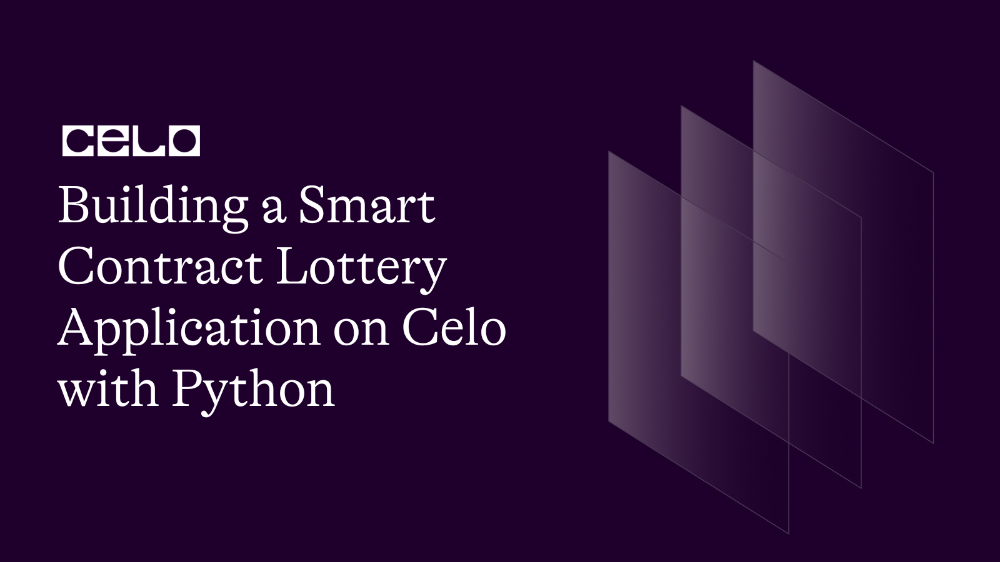

## Introduction

Lottery applications are one of the major applications of blockchain technology since the early days of Ethereum. Smart contracts enable the operation of secure and transparent lotteries that cannot be manipulated by centralized parties. Furthermore, they can automate many lottery-related processes, such as ticket sales, winner selection, and prize distribution.
In this tutorial, we will learn how to to build a lottery smart contract and deploy it on the Celo blockchain with Python using brownie framework.

## Prerequisites

To understand this tutorial, you must be familiar with:

- Building Smart contracts
- The Python Programming Language

## Requirements

 You should have the following installed on your computer to follow along:

- Python 3.7 or later
- [Node.js](https://nodejs.org/en/download/)
- [Celo Testnet account](https://faucet.celo.org/)
- [Celo Wallet](https://docs.celo.org/blog/tutorials/3-simple-steps-to-connect-your-metamask-wallet-to-celo)
- [Python-dotenv](https://pypi.org/project/python-dotenv/) (for environment variables)
- [Ganache](https://trufflesuite.com/ganache/) (local blockchain)
- [eth-brownie](https://eth-brownie.readthedocs.io/en/stable/install.html)(for interacting with the blockchain)

## Setting Up The Project

To get started, we have to create a new directory for our project and install the following dependencies:

```bash
mkdir lottery
cd lottery
```

```bash
# Create virtual environment
python3.10 -m venv venv

# activate virtual environment
source venv/bin/activate
```

Note: For some reason, brownie works best with python3.10

```bash
# Install ganache
npm install -g ganache

# Install eth-brownie and python-dotenv
pip3 install eth-brownie python-dotenv
```

After installing dependencies, we need to initialize our project as a brownie project.

```bash
brownie init
```

This command generates some folders which look like this:


After initializing brownie into our project, in your root directory, create two files called .env and brownie-config.yaml. The .env file is used to store environment variables that shouldn’t be exposed to the public such as our private key, mnemonic phrase, etc, while brownie-config.yaml is used to configure brownie in our project.

.env

```bash
MNEMONIC='...'
PRIVATE_KEY='0x...'
```

brownie-config.yaml 

```bash
compiler:
    solc:
        version: 0.8.15
        optimizer:
            enabled: true
            runs: 200
networks:
    default: celo-alfajores
console:
    show_colors: true
    color_style: monokai
    auto_suggest: true
    completions: true
    editing_mode: emacs
dotenv: .env
wallets:
    from_mnemonic: ${MNEMONIC}
		from_key: ${PRIVATE_KEY}
```

The next step is to add Celo Testnet or Alfajores to our brownie project:

```bash
brownie networks add Celo celo-alfajores host=https://alfajores-forno.celo-testnet.org chainid=44787 explorer=https://alfajores-blockscout.celo-testnet.org
```

You can see the list of networks that have been added to our brownie project:

```bash
brownie networks list
```


### Implementing the Smart Contract

Next, we have to write the smart contract for our Lottery application. In your contracts directory, create a new file called Lottery.sol 

Lottery.sol

```solidity
// SPDX-License-Identifier: MIT
pragma solidity ^0.8.15;

contract Lottery {
    address public manager;
    address payable[] public players;
    uint public minimumBet;
    uint public numTickets;

    constructor(uint _minimumBet, uint _numTickets) {
        manager = msg.sender;
        minimumBet = _minimumBet;
        numTickets = _numTickets;
    }

    function enter() public payable {
        require(msg.value >= minimumBet, "Not enough ether to enter the lottery.");
        require(players.length < numTickets, "The lottery is full.");

        players.push(payable(msg.sender));
    }

    function pickWinner() public restricted {
        require(players.length == numTickets, "The lottery is not full yet.");

        uint index = random() % numTickets;
        players[index].transfer(address(this).balance);

        // reset the lottery
        delete players;
    }

    function getPlayers() public view returns (address payable[] memory) {
        return players;
    }

    function getBalance() public view returns (uint) {
        return address(this).balance;
    }

    function random() private view returns (uint) {
        return uint(keccak256(abi.encodePacked(block.timestamp, block.prevrandao, players.length)));
    }

    modifier restricted() {
        require(msg.sender == manager, "Only the manager can call this function.");
        _;
    }
}
```

Let’s go through the code step by step:

```solidity
	address public manager;
    address payable[] public players;
    uint public minimumBet;
    uint public numTickets;

    constructor(uint _minimumBet, uint _numTickets) {
        manager = msg.sender;
        minimumBet = _minimumBet;
        numTickets = _numTickets;
    }
```

The manager is the address of the owner of the contract who is the only one allowed to pick the winner of the lottery. The player's array holds the addresses of the lottery players. The minimumBet is the minimum amount of ether required to place a bet in the lottery, and the numTickets is the number of tickets available to purchase. The constructor sets the manager as the lottery owner, the minimum bet, and the total number of tickets available.

```solidity
 function enter() public payable {
        require(msg.value >= minimumBet, "Not enough ether to enter the lottery.");
        require(players.length < numTickets, "The lottery is full.");

        players.push(payable(msg.sender));
    }
```

The enter function enables players to enter the lottery and makes sure they deposit at least the minimum bet amount.

```solidity
    function pickWinner() public restricted {
        require(players.length == numTickets, "The lottery is not full yet.");

        uint index = random() % numTickets;
        players[index].transfer(address(this).balance);

        // reset the lottery
        delete players;
    }

```

The pickWinner function picks at random the winner of the lottery and makes sure it’s only the contract manager that can send the balance of the contract

```solidity
function getPlayers() public view returns (address payable[] memory) {
        return players;
    }

    function getBalance() public view returns (uint) {
        return address(this).balance;
    }

    function random() private view returns (uint) {
        return uint(keccak256(abi.encodePacked(block.timestamp, block.prevrandao, players.length)));
    }

    modifier restricted() {
        require(msg.sender == manager, "Only the manager can call this function.");
        _;
    }
```

The getPlayers function returns an array of all the players that entered the lottery. The getBalance function returns the balance of the lottery contract. The random function picks at random the winner of the lottery and the restricted modifier is what allows a function to be restricted to just the lottery manager.

### Deploying the Contract

Next, we need to compile and deploy the contract on the Celo Testnet, Run the following command to compile the contract.

```bash
brownie compile
```


To deploy the smart contract on Celo, create a new file called deploy.py in the scripts directory of your project.

deploy.py

```python
from brownie import Lottery, accounts, config, network

def deploy_lottery():
    # Load the account to deploy from
    dev = accounts.add(config["wallets"]["from_key"])
    print(f"Deploying from {dev.address}")

    # Deploy the contract
    lottery = Lottery.deploy({"from": dev})

    print(f"NFTMarketplace contract deployed to {lottery.address}")

def main():
    # Set the network to deploy to
    network_name = network.show_active()
    print(f"Deploying to {network_name} network")

    # Call the deploy function
    deploy_lottery()

```

The deploy_lottery function gets the account we would use to deploy the contract


## Conclusion

Lottery applications are one of the major applications of blockchain technology since the early days of Ethereum. Smart contracts enable the operation of secure and transparent lotteries that cannot be manipulated by centralized parties. Furthermore, they can automate many lottery-related processes, such as ticket sales, winner selection, and prize distribution.
In this tutorial, we will learn how to to build a lottery smart contract and deploy it on the Celo blockchain with Python using brownie framework.

## Next Steps

Here are some additional resources to help you learn more about smart contract development and lottery applications:

- [Chainlink VRF](https://docs.chain.link/vrf/v2/introduction): A decentralized and secure method for generating random numbers on the blockchain, Chainlink VRF. It can be used to ensure that lottery applications and other games of chance are fair.
- [CryptoZombies](https://cryptozombies.io/): CryptoZombies is a gamified interactive code school that teaches you how to build Ethereum dApps. A lesson on creating a lottery application is included in the tutorial series.

## About the Author

[Israel Okunaya](https://meetisraelokunaya.curious.page/) is an ace writer with a flair for simplifying complexities and a knack for storytelling. He leverages over four years of experience to meet the most demanding writing needs in different niches, especially food and travel, blockchain, and marketing. He sees blockchain as a fascinating yet tricky affair. So, he's given to simplifying its complexities with text and video tutorials.

## References

1. [Celo Developer Documentation](https://docs.celo.org/)
2. [Solidity Documentation](https://solidity.readthedocs.io/)
3. [Brownie Documentation](https://eth-brownie.readthedocs.io/en/stable/)
4. [Github Repo](https://github.com/Divine572/lottery)
