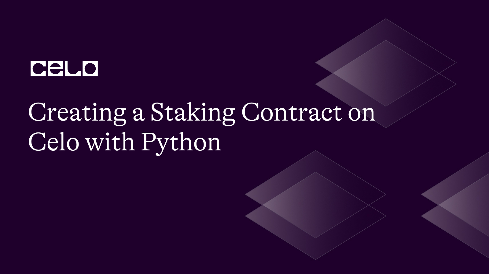

## Introduction

The manner that transactions are carried out has been transformed by blockchain technology. The most well-known blockchain for creating decentralized applications, Ethereum, provides a robust smart contract ecosystem. In the Ethereum blockchain, smart contracts are self-executing contracts that allow for programmatic interaction from developers. A Pythonic interface for communicating with the Ethereum blockchain is provided via the Web3.py module. This article will teach you how to communicate with a deployed Python smart contract using Web3.py.

## Prerequisites

Before we begin, it is essential to be familiar with:

- Building Smart contracts
- The Python programming language

## Requirements

It would help if you had the following installed on your computer to follow along:

- Python 3.7 or later
- [Node.js](https://nodejs.org/en/download/)
- [Celo Testnet account](https://faucet.celo.org/)
- [Celo Wallet](https://docs.celo.org/blog/tutorials/3-simple-steps-to-connect-your-metamask-wallet-to-celo) (with some Celo tokens)
- [Python-dotenv](https://pypi.org/project/python-dotenv/) (for environment variables)
- [Web3.py](https://web3py.readthedocs.io/en/stable/) (for interacting with the blockchain)

## Step 1: Set up the Project

On your terminal, use the following commands to create a new folder for your project:

```bash
mkdir stakng-contract
cd stakng-contract
```

In your new directory, create a python virtual environment and activate it with the following commands:

```bash
python3 -m venv env
source env/bin/activate
```

Next, Install the following libraries using pip, the python package manager:

```bash
pip install web3 py-solc-x python-dotenv
```

## Step 2: Write a Smart Contract

Next, let’s create file called “Staking.sol” in the root directory of our project and paste the following code:

Staking.sol

```solidity
// SPDX-License-Identifier: MIT
pragma solidity ^0.8.0;

import "node_modules/@openzeppelin/contracts/token/ERC20/IERC20.sol";
import "node_modules/@openzeppelin/contracts/access/Ownable.sol";

contract Staking is Ownable {
    IERC20 public cUSDToken;
    IERC20 public CELOToken;

    uint256 public stakingPeriod;

    struct StakingInfo {
        uint256 amount;
        uint256 startTime;
        bool claimed;
    }

    mapping(address => StakingInfo) public stakingInfo;

    event Staked(address indexed user, uint256 amount);
    event Unstaked(address indexed user, uint256 amount);

    constructor(
        address _cUSDToken,
        address _CELOToken,
        uint256 _stakingPeriod
    ) {
        cUSDToken = IERC20(_cUSDToken);
        CELOToken = IERC20(_CELOToken);
        stakingPeriod = _stakingPeriod;
    }

    function stake(uint256 _amount) external {
        require(_amount > 0, "Amount must be greater than 0");
        require(
            cUSDToken.balanceOf(msg.sender) >= _amount,
            "Insufficient cUSD balance"
        );

        cUSDToken.transferFrom(msg.sender, address(this), _amount);

        stakingInfo[msg.sender] = StakingInfo({
            amount: _amount,
            startTime: block.timestamp,
            claimed: false
        });

        emit Staked(msg.sender, _amount);
    }

    function unstake() external {
        StakingInfo storage userStakingInfo = stakingInfo[msg.sender];
        require(userStakingInfo.amount > 0, "No staked tokens found");
        require(
            block.timestamp >= userStakingInfo.startTime + stakingPeriod,
            "Staking period not completed"
        );

        uint256 rewardAmount = calculateReward(userStakingInfo.amount);

        userStakingInfo.claimed = true;

        cUSDToken.transfer(msg.sender, userStakingInfo.amount);
        CELOToken.transfer(msg.sender, rewardAmount);

        emit Unstaked(msg.sender, userStakingInfo.amount);

        delete stakingInfo[msg.sender];
    }

    function calculateReward(uint256 _amount) public view returns (uint256) {
        // Implement your reward calculation logic here
        // In this example, we will return a simple 5% reward
        return (_amount * 5) / 100;
    }

    function setStakingPeriod(uint256 _stakingPeriod) external onlyOwner {
        stakingPeriod = _stakingPeriod;
    }

    function setCUSDToken(address _cUSDToken) external onlyOwner {
        cUSDToken = IERC20(_cUSDToken);
    }

    function setCELOToken(address _CELOToken) external onlyOwner {
        CELOToken = IERC20(_CELOToken);
    }
}
```

To manage ERC20 tokens and ownership, this contract makes use of the OpenZeppelin library. Users can stake cUSD coins and receive rewards in CELO tokens thanks to the contract. How long users must stake their tokens before they may withdraw is determined by the "stakingPeriod.”

Each function does the following:

- constructor: Sets the staking duration and initializes the staking contract with the addresses for the cUSD and CELO tokens.
- stake: With the help of this feature, users can stake their cUSD tokens. It needs the user to have a sufficient balance of cUSD tokens and the \_amount of cUSD tokens to stake. After that, the function moves the tokens from the user's address to the contract address and modifies the user's stakingInfo mapping with the staked sum, start time, and claimed status set to false. The user's address and the amount staked are included in an event called Staked.
- Unstake: After the staking time is over, users can use this function to remove their tokens from staking and get their winnings. It verifies whether the staking period has expired and whether the user has any staked tokens. The function uses the calculateReward function to determine the user's reward if the conditions are satisfied. The user's claimed status is then declared accurate, the staked cUSD tokens and CELO incentives are returned to the user, and an Unstaked event is generated with the user's address and the staked sum. The user's stake information is then removed from the stakingInfo mapping.
- calculateReward: With the bet amount, this function determines the rewards. In this instance, it merely gives a 5% incentive. But, you are able to use a more intricate logic for award calculation here.
- setStakingPeriod**:** The contract owner can modify the staking period using the setStakingPeriod function. It modifies the stakingPeriod variable by accepting a new \_stakingPeriod as input.
- setCUSDToken: The contract owner can modify the cUSD token address using the method setCUSDToken. It refreshes the cUSDToken variable by accepting a fresh \_cUSDToken address as input.
- setCELOToken**:** The contract owner may modify the CELO token address using the setCELOToken method. It refreshes the CELOToken variable by accepting a fresh \_CELOToken address as input.

Note: To install the “Ownable” and “IERC20” solidity files, you need to install them via npm

```bash
npm init --y
npm install @openzeppelin/contracts
```

Now you should be able to import them like this:

```solidity
import "node_modules/@openzeppelin/contracts/token/ERC20/IERC20.sol";
import "node_modules/@openzeppelin/contracts/access/Ownable.sol";
```

## Step 3: Compile and Deploy the Smart Contract

Next, let’s compile and deploy our contract. Create a file called “deploy.py” in your root directory.

deploy.py

```python
import json
import os
from web3 import Web3
from dotenv import load_dotenv
from solcx import compile_standard, install_solc

load_dotenv()

# Install specific Solidity compiler version
install_solc("0.8.0")

# Set up web3 connection
provider_url = os.environ.get("CELO_PROVIDER_URL")
w3 = Web3(Web3.HTTPProvider(provider_url))
assert w3.is_connected(), "Not connected to a Celo node"

# Set deployer account and private key
deployer = os.environ.get("CELO_DEPLOYER_ADDRESS")
private_key = os.environ.get("CELO_DEPLOYER_PRIVATE_KEY")

with open("Staking.sol", "r") as file:
    contract_source_code = file.read()

# Compile the contract
compiled_sol = compile_standard({
    "language": "Solidity",
    "sources": {
        "Staking.sol": {
            "content": contract_source_code
        }
    },
    "settings": {
        "outputSelection": {
            "*": {
                "*": ["metadata", "evm.bytecode", "evm.sourceMap"]
            }
        }
    }
})

# Extract the contract data
contract_data = compiled_sol['contracts']['Staking.sol']['Staking']
bytecode = contract_data['evm']['bytecode']['object']
abi = json.loads(contract_data['metadata'])['output']['abi']

# Deploy the contract

# Prepare the contract object
contract = w3.eth.contract(abi=abi, bytecode=bytecode)

cUSDToken = "0x874069Fa1Eb16D44d622F2e0Ca25eeA172369bC1"
CELOToken = "0xF194afDf50B03e69Bd7D057c1Aa9e10c9954E4C9"
stakingPeriod = 30 * 24 * 60 * 60  # 30 days

# Estimate gas for contract deployment
gas_estimate = contract.constructor(cUSDToken, CELOToken, stakingPeriod).estimate_gas()

nonce = w3.eth.get_transaction_count(deployer)

# Prepare the transaction
transaction = {
    'from': deployer,
    'gas': gas_estimate,
    'gasPrice': w3.eth.gas_price,
    'nonce': nonce,
    'data': bytecode
}

signed_txn = w3.eth.account.sign_transaction(transaction, private_key)
transaction_hash = w3.eth.send_raw_transaction(signed_txn.rawTransaction)
transaction_receipt = w3.eth.wait_for_transaction_receipt(transaction_hash)

# Get the contract address
contract_address = transaction_receipt['contractAddress']
print(f"Contract deployed at address: {contract_address}")
```

The Identity contract is built and deployed to the Celo blockchain using this script, which also installs the necessary Solidity compiler version and establishes a connection to a Celo node. When executing the script, make careful to set the environment variables CELO PROVIDER URL, CELO DEPLOYER ADDRESS, and CELO DEPLOYER PRIVATE KEY.

Run the code in your terminal with the follwing command:

```bash
python deploy.py
```


### Step 4: Interact with the Deployed Contract

Finally, create a new file in the root directory of your project called [client.py](http://client.py) and paste the following code:

client.py

```python
import os
from web3 import Web3
from web3.middleware import geth_poa_middleware

import deploy

# Set up web3 connection
provider_url = os.environ.get("CELO_PROVIDER_URL")
w3 = Web3(Web3.HTTPProvider(provider_url))
assert w3.is_connected(), "Not connected to a Celo node"

# Add PoA middleware to web3.py instance
w3.middleware_onion.inject(geth_poa_middleware, layer=0)

abi = deploy.abi
contract_address = deploy.contract_address
account_address = deploy.deployer
private_key = deploy.private_key

contract = w3.eth.contract(address=contract_address, abi=abi)

# Stake tokens
def stake(amount):
    nonce = w3.eth.get_transaction_count(account_address)
    txn = contract.functions.stake(amount).build_transaction({
        'from': account_address,
        'gas': 200000,
        'gasPrice': w3.eth.gas_price,
        'nonce': nonce
    })

    signed_txn = w3.eth.account.sign_transaction(txn, private_key)
    txn_hash = w3.eth.send_raw_transaction(signed_txn.rawTransaction)
    txn_receipt = w3.eth.wait_for_transaction_receipt(txn_hash)
    print("Staked:", amount, "cUSD")

# Unstake tokens
def unstake():
    nonce = w3.eth.get_transaction_count(account_address)
    txn = contract.functions.unstake().build_transaction({
        'from': account_address,
        'gas': 200000,
        'gasPrice': w3.eth.gas_price,
        'nonce': nonce
    })

    signed_txn = w3.eth.account.sign_transaction(txn, private_key)
    txn_hash = w3.eth.send_raw_transaction(signed_txn.rawTransaction)
    txn_receipt = w3.eth.wait_for_transaction_receipt(txn_hash)
    print("Unstaked and claimed rewards")

# Check staking information for a user
def get_staking_info(user_address):
    info = contract.functions.stakingInfo(user_address).call()
    print("Staking Info for", user_address)
    print("Amount:", info[0])
    print("Start Time:", info[1])
    print("Claimed:", info[2])

# Replace this with the desired action
action = 'stake'  # 'unstake' or 'get_staking_info'

if action == 'stake':
    stake_amount = 100  # Replace with the desired staking amount
    stake(stake_amount)
elif action == 'unstake':
    unstake()
elif action == 'get_staking_info':
    user_address = account_address  # Replace with the desired user's address
    get_staking_info(user_address)
```

The Python Web3 package is used by the script to communicate with the Celo blockchain. We will outline the essential parts of the code and how they interact to make it possible for various staking-related operations.

Getting Started

Let's import the required modules first, then configure our Web3 connection.

```python
import os
from web3 import Web3
from web3.middleware import geth_poa_middleware

import deploy
```

We import Web3 to communicate with the blockchain, the os module to access environment variables, and geth_poa_middleware to support Proof of Authority (PoA). The deployed contract's ABI and other details are disclosed in the deploy module.

Establishing a Web3 Connection

```python
provider_url = os.environ.get("CELO_PROVIDER_URL")
w3 = Web3(Web3.HTTPProvider(provider_url))
assert w3.is_connected(), "Not connected to a Celo node"

w3.middleware_onion.inject(geth_poa_middleware, layer=0)
```

In this instance, we establish the Web3 connection by locating the Celo provider URL in the environment variable "CELO_PROVIDER_URL." After that, we establish a connection to a Celo node and build an instance of the Web3 object using the HTTPProvider. To manage PoA chains, we also inject the `geth_poa_middleware`.

Setting Up the Contract and Account Information

```python
abi = deploy.abi
contract_address = deploy.contract_address
account_address = deploy.deployer
private_key = deploy.private_key

contract = w3.eth.contract(address=contract_address, abi=abi)
```

We obtain the ABI and address of the contract from the deploy module. Additionally, the deployer's account address and private key are provided. Finally, we use the `Web3.eth.contract` method to construct a contract instance.

Staking Tokens

You can stake tokens on the contract using the stake function. It sends a transaction to the contract's stake function and accepts the number of staked tokens as a parameter.

```python
# Stake tokens
def stake(amount):
    nonce = w3.eth.get_transaction_count(account_address)
    txn = contract.functions.stake(amount).build_transaction({
        'from': account_address,
        'gas': 200000,
        'gasPrice': w3.eth.gas_price,
        'nonce': nonce
    })

    signed_txn = w3.eth.account.sign_transaction(txn, private_key)
    txn_hash = w3.eth.send_raw_transaction(signed_txn.rawTransaction)
    txn_receipt = w3.eth.wait_for_transaction_receipt(txn_hash)
    print("Staked:", amount, "cUSD")
```

UnStaking Tokens

You can `unstake` tokens and collect incentives using the `unstake` feature. It transmits a transaction to the `unstake` function of the contract.

```python
# Unstake tokens
def unstake():
    nonce = w3.eth.get_transaction_count(account_address)
    txn = contract.functions.unstake().build_transaction({
        'from': account_address,
        'gas': 200000,
        'gasPrice': w3.eth.gas_price,
        'nonce': nonce
    })

    signed_txn = w3.eth.account.sign_transaction(txn, private_key)
    txn_hash = w3.eth.send_raw_transaction(signed_txn.rawTransaction)
    txn_receipt = w3.eth.wait_for_transaction_receipt(txn_hash)
    print("Unstaked and claimed rewards")
```

Checking Stake Information

The `get_staking_info` function calls the contract's `stakingInfo` function using the user's address to receive stake information for the user.

```python
# Check staking information for a user
def get_staking_info(user_address):
    info = contract.functions.stakingInfo(user_address).call()
    print("Staking Info for", user_address)
    print("Amount:", info[0])
    print("Start Time:", info[1])
    print("Claimed:", info[2])
```

Final Step:

We specify the action variable with the appropriate action ('stake', 'unstake', or 'get_staking_info') and run the relevant function.

```python
# Replace this with the desired action
action = 'stake'  # 'unstake' or 'get_staking_info'

if action == 'stake':
    stake_amount = 100  # Replace with the desired staking amount
    stake(stake_amount)
elif action == 'unstake':
    unstake()
elif action == 'get_staking_info':
    user_address = account_address  # Replace with the desired user's address
    get_staking_info(user_address)
```

## Conclusion

On the Celo platform, you have now formed a staking contract. Those that wager their cUSD tokens can win CELO tokens as prizes. This contract can be further developed to provide more intricate reward systems, greater token support, or extra staking possibilities. The Celo ecosystem offers a wide range of chances for developers to produce cutting-edge and approachable decentralized financial solutions.

## Next Steps

There are a few actions you may take after using web3.py to successfully deploy the staking contract on the Celo network to further your knowledge and the capabilities of your contract. Learning how to communicate with the deployed contract, call functions, and carry out transactions can be your first step. Then, create a user-friendly frontend application that interacts with your staking contract using well-known frameworks like React, Angular, or Vue.js.

## About the Author

[Israel Okunaya](https://meetisraelokunaya.curious.page/) is an ace writer with a flair for simplifying complexities and a knack for storytelling. He leverages over four years of experience to meet the most demanding writing needs in different niches, especially food and travel, blockchain, and marketing. He sees blockchain as a fascinating yet tricky affair. So, he is given to simplifying its complexities with text and video tutorials.

## References

1. [Celo Documentation](https://docs.celo.org/)
2. [web3.py Documentation](https://web3py.readthedocs.io/)
3. [Github Repo](https://github.com/Divine572/stakng-contract)
