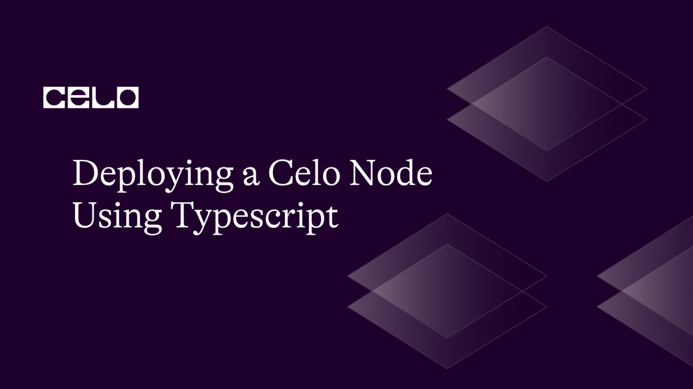

## Introduction
Are you looking to join the ranks of those empowering the Celo network? Do you want to contribute to the global accessibility of financial systems? This is possible by deploying a node that allows you to contribute to the network. In this article, we'll show you how to deploy a Celo node using TypeScript which uses the celo-monorepo. We'll take it step by step and explain each part along the way so you'll be able to understand better. Now, let's get started!  

## Prerequisites
We will deploy a celo node using typescript with this article. But before we do that, you will need to have at least a basic understanding of:
- Programming using [Typescript](https://www.w3schools.com/typescript/) 
- JavaScript frameworks such as [Nodejs](https://www.w3schools.com/nodejs/nodejs_intro.asp).
- The [blockchain technologies](https://www.ibm.com/topics/blockchain) including concepts of permissioned blockchain networks, security, scalability, and  decentralized networks.
- [Command-line](https://www.freecodecamp.org/news/command-line-for-beginners/) interface for installing packages.

## Requirements
Before we begin, it's crucial to know that successfully running a Celo node requires significant technical expertise including a strong hardware and internet resources. Therefore, to run the node successfully, you should have at least 16GB of RAM to handle the workload. Other requirements include Node.js version 14 or higher, Git, and Yarn installed on your computer. Once you can meet up with these requirements we are good to go.

## Setting Up Node
### Install Required Dependencies
The first thing on the agenda is installing appropriate dependencies. In order to do so, here are some of the programs you will need to get ready:
- Node.js version 14 or higher, 
- Git, 
- and Yarn. 

You can find Node.js on its [official website](https://nodejs.org), but if you have one already installed on your machine, you can check the version by typing in the command: 
```
	node --version
```

After Nodejs has been successfully installed, now we can move to [Git](https://git-scm.com/book/en/v2/Getting-Started-Installing-Git) and [Yarn](https://yarnpkg.com/getting-started/install) using the default package manager available on your system.

### Clone Celo-Monorepo

The Celo blockchain is managed through a monorepo containing all the necessary packages to run a Celo node. To access the repository on your local machine, use the following command: 
```
	git clone https://github.com/celo-org/celo-monorepo.git
```
This will create a new directory/folder called `celo-monorepo` in your specified directory. The directory should look like this after cloning:


### Initialize the Project

To initialize the project, run the npm initialization command below
```
	npm init -y
```
The command will initializes a new npm project and set it up using default settings. The final initialization process will be to install the TypeScript packages as a development dependency. To do this, use the command:
```
	npm install typescript --save-dev
```
### Install Dependencies

Once the monorepo shows up in the specified directory, the next step is to install its dependencies. To do so, navigate to the celo-monorepo directory and run the following command:
```
	yarn install
```
This may take several minutes to install the needed packages for our project. Once the packages are installed successfully, you can proceed to build the new packages by running
```
	yarn build –ignore docs
```
The ignore option will help you skip most of the possible errors that might arise while building. This will look something like this:


### Generate Validator Key
To run a Celo node, you will also need a validator key. This is a special key used to sign blocks and validate transactions. You can generate a validator key using the command: 
```
	yarn run generate:validator
```
This can be used to access your node, so ensure you keep the keys generated safe and secure at all times. 

### Create Configuration File

Afterwards, create a configuration file for your node. It should include network settings, validator key, and other relevant parameters. The template.env file is a great point of reference, to do this, you need to run:
```
	cp .env.template .env
```
this will copy the files in the template to the .env file. if for any reason the template file does not exist in the monorepo file, you don't need to panic about the error it throws, all you need to do is to create a new .env file and copy the lines of command below into it:
```
	CELO_VALIDATOR_ADDRESS=<your-validator-address>
	CELO_VALIDATOR_PRIVATE_KEY=<your-validator-private-key>
	CELO_BOOTNODES=<comma-separated-list-of-bootnodes>
```
However, you need to update the three values – `address`, `private key`, and a `list of bootnodes` (which can be found on the [Celo Website](https://celo.org/) or [Celo monorepo](https://github.com/celo-org/celo-monorepo.git)). You can find a list of bootnodes in the .env file located in the packages/protocol directory of the Celo monorepo.

### Start the Node

Your Celo node is ready to go! Run this command from the celo-monorepo directory to initiate the process:
```
	yarn run start:fullnode
```
It will take a few minutes for the node to sync with the network and begin processing transactions. 

## Monitor the Node

To ensure the health and performance of your node, use the celo command line tool. You can check status with: 
```
	yarn run celo status
```
And view logs with:
```
	yarn run celo logs
```
### Dealing with errors

One of the major problems that might throw error with setting up your node while working with the celo monorepo could be with "outdated dependencies" from the monorepo. When you get errors that say "depreciated", this indicates that the dependency now has a newer version that has not been updated in the monorepo. 

please check the monorepo later in the future when it will have been updated or you can also contribute to the Celo monorepo by updating the dependencies to keep it up to date for other developers. To do this, simply fork the monorepo repository and clone it to your local machine to start working on the updates.
## Conclusion
Congrats! You have just deployed a Celo node with TypeScript. Although running a node requires extensive expertise and resources, it is a key way to contribute to the Celo network and to the accessibility of global financial systems. Award yourself a pat on the back if you have successfully deployed your own celo node. Happy validating!

## Next Steps
Now that your node is up and running, another area you should try to read more is how to become a [celo validator](https://docs.celo.org/network/mainnet/run-validator#:~:text=Celo%20uses%20a%20proof%2Dof,to%20register%20a%20Validator%20Group.) which will allow you to participate in validating transactions and adding them to the blockchain, ensuring the network's security and reliability.

I'll be writing another article soon to guide you on how to manage your newly deployed node. Till then, you can keep learning more about Celo from the [Celo Documentation](https://docs.celo.org/).

## About the Author
‘Tobi Olajide is an enthusiastic writer interested in blockchain technology and has been writing about it for over 3years. He is also a software engineer with over 2years of experience. You can connect with him on [twitter](https://twitter.com/MrOluwatobiHere) or [github](https://github.com/TheKhafre) to learn more about his programming journey.

## References
- [Installing Latest Version of Nodejs](https://nodejs.org)
- [The Celo Monorepo for Setting up a Celo Node](https://github.com/celo-org/celo-monorepo.git)
- [How to Set Up a Celo Validator](https://docs.celo.org/network/mainnet/run-validator#:~:text=Celo%20uses%20a%20proof%2Dof,to%20register%20a%20Validator%20Group.)
- [Learn more About Typescript](https://www.typescriptlang.org/docs/)
- [Celo Documentation](https://docs.celo.org/)
- [Tutorial Source code](https://github.com/TheKhafre/celoNodeTypescript)
