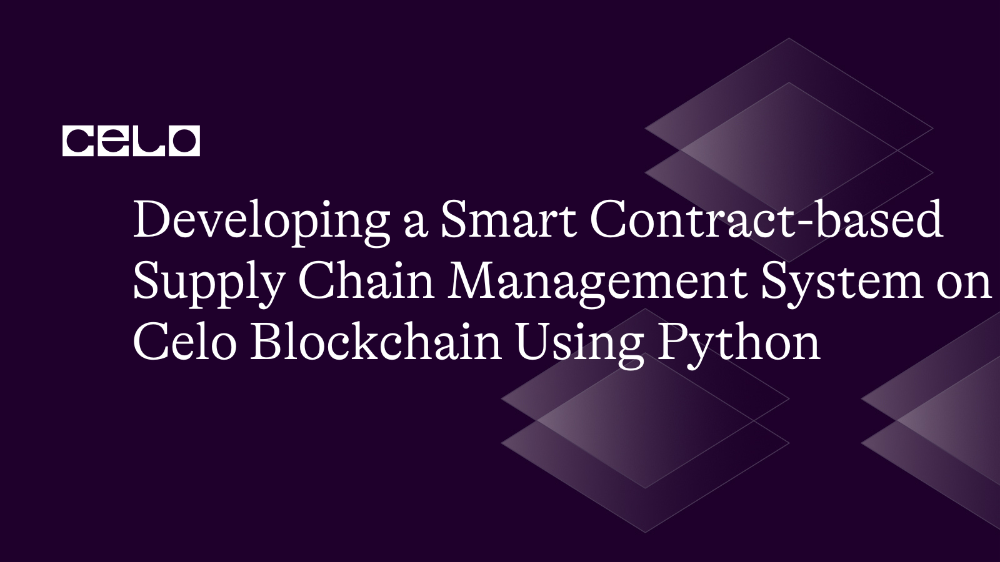

## Introduction

We will investigate how to utilize Python to create a supply chain management system that uses smart contracts on the Celo blockchain in this article. We will cover issues including ensuring product traceability, reducing counterfeit goods, and increasing supply chain efficiency with smart contracts as we talk about how to construct a secure and transparent supply chain process utilizing the Celo blockchain. We will also talk about the many Python libraries that may be used to communicate with the Celo blockchain, such as Web3.py

## Prerequisites

The following information and resources should be available to you before beginning this tutorial:

- Programming language Python with a basic grasp.
- Familiarity with smart contracts and blockchain technology.
- Basic understanding of the Celo blockchain.
- knowledge of the Solidity programming language for creating smart contracts.
- You have Python 3.X installed.

## Requirements

- Python 3.7 or a later version needs to be installed on your computer.
- An IDE or code editor (like PyCharm or Visual Studio Code).
- A Celo-compatible wallet, such as MetaMask or Valora
- A test Celo network account with some practice money (accessible via the Celo Faucet)

### Step 1: Setting up a Development Environment

First, we must set up a development environment for our supply chain management system.

On your terminal, use the following commands to create a new folder for your project:

```bash
mkdir supply-chain-management
cd supply-chain-management
```

In your new directory, Let's now establish and activate a virtual Python environment.

```bash
python3 -m venv venv
source venv/bin/activate
```

Next, Install the following libraries using pip, the Python package manager:

```bash
pip install python-dotenv web3 py-solc-x
```

### Step 2: Write the Smart Contract

Next, create a new file called `SupplyChainManagement.sol` which would contain functionalities such that, as products move through the supply chain, this smart contract aims to manage them, track their history, and confirm their authenticity.

SupplyChainManagement.sol

```solidity
// SPDX-License-Identifier: MIT

pragma solidity ^0.8.0;

contract SupplyChainManagement {

    struct Product {
        uint256 id;
        string name;
        uint256 timestamp;
        string location;
        address owner;
        bool isRegistered;
    }

    mapping(uint256 => Product) public products;
    mapping(uint256 => string[]) public productHistory;

    event ProductRegistered(uint256 indexed id, string name, string location, uint256 timestamp);
    event ProductOwnershipTransferred(uint256 indexed id, address indexed previousOwner, address indexed newOwner, uint256 timestamp);
    event ProductLocationUpdated(uint256 indexed id, string previousLocation, string newLocation, uint256 timestamp);

    function registerProduct(uint256 _id, string memory _name, string memory _location) public {
        require(!products[_id].isRegistered, "Product is already registered.");

        Product memory newProduct = Product({
            id: _id,
            name: _name,
            timestamp: block.timestamp,
            location: _location,
            owner: msg.sender,
            isRegistered: true
        });

        products[_id] = newProduct;
        productHistory[_id].push(_location);

        emit ProductRegistered(_id, _name, _location, block.timestamp);
    }

    function transferProductOwnership(uint256 _id, address _newOwner) public {
        require(products[_id].isRegistered, "Product is not registered.");
        require(products[_id].owner == msg.sender, "Only the current owner can transfer ownership.");

        address previousOwner = products[_id].owner;
        products[_id].owner = _newOwner;

        emit ProductOwnershipTransferred(_id, previousOwner, _newOwner, block.timestamp);
    }

    function updateProductLocation(uint256 _id, string memory _newLocation) public {
        require(products[_id].isRegistered, "Product is not registered.");
        require(products[_id].owner == msg.sender, "Only the current owner can update the location.");

        string memory previousLocation = products[_id].location;
        products[_id].location = _newLocation;
        productHistory[_id].push(_newLocation);

        emit ProductLocationUpdated(_id, previousLocation, _newLocation, block.timestamp);
    }

    function getProduct(uint256 _id) public view returns (Product memory) {
        require(products[_id].isRegistered, "Product is not registered.");
        return products[_id];
    }

    function getProductHistory(uint256 _id) public view returns (string[] memory) {
        require(products[_id].isRegistered, "Product is not registered.");
        return productHistory[_id];
    }
}
```

The following features are included in this smart contract:

- registerProduct: Assigns ownership to the transaction's sender and registers a new product with a distinctive identifier, name, and location.
- transferProductOwnership: Passes a product's ownership from its present owner to a new one.
- updateProductLocation: Updates a product's location and logs the change in the product's history.
- getProduct: Provides access to a registered product's information.
- getProductHistory: Returns information about a registered product's past locations.

### Step 3: Compiling and Deploying the Smart Contract

Next, let’s write a script that compiles and deploy our smart contract using the `solcx` and `web3.py` libraries. Create a new file called `deploy.py` in the root directory of our project and paste the following code:

deploy.py

```python
import json
import os
from solcx import compile_standard, install_solc
from dotenv import load_dotenv
from web3.middleware import geth_poa_middleware
from web3 import Web3

load_dotenv()

# Install specific Solidity compiler version
install_solc("0.8.0")

# Set up web3 connection
provider_url = os.environ.get("CELO_PROVIDER_URL")
w3 = Web3(Web3.HTTPProvider(provider_url))
assert w3.is_connected(), "Not connected to a Celo node"

# Set deployer account and private key
deployer = os.environ.get("CELO_DEPLOYER_ADDRESS")
private_key = os.environ.get("CELO_DEPLOYER_PRIVATE_KEY")

with open("SupplyChainManagement.sol", "r") as file:
    solidity_code = file.read()

# Add Geth POA middleware to handle extraData field in Celo transactions
w3.middleware_onion.inject(geth_poa_middleware, layer=0)

# Compile the Solidity smart contract
compiled_sol = compile_standard({
    "language": "Solidity",
    "sources": {
        "SupplyChainManagement.sol": {
            "content": solidity_code
        }
    },
    "settings": {
        "outputSelection": {
            "*": {
                "*": ["metadata", "evm.bytecode", "evm.deployedBytecode", "abi"]
            }
        },
        "optimizer": {
            "enabled": True,
            "runs": 200
        }
    }
})

# Get the bytecode, contract data, and ABI
contract_data = compiled_sol['contracts']['SupplyChainManagement.sol']['SupplyChainManagement']
bytecode = contract_data['evm']['bytecode']['object']
abi = json.loads(contract_data['metadata'])['output']['abi']

# Deploy the contract
nonce = w3.eth.get_transaction_count(deployer)
transaction = {
    'nonce': nonce,
    'gas': 2000000,
    'gasPrice': w3.eth.gas_price,
    'data': bytecode,
}
signed_txn = w3.eth.account.sign_transaction(transaction, private_key)
transaction_hash = w3.eth.send_raw_transaction(signed_txn.rawTransaction)
transaction_receipt = w3.eth.wait_for_transaction_receipt(transaction_hash)

# Get the contract address
contract_address = transaction_receipt['contractAddress']
print(f"Contract deployed at address: {contract_address}")
```

Implementing a Solidity smart contract on the Celo blockchain is demonstrated via this Python script. It starts by loading environment variables, importing the required libraries, and connecting via Web3 to a Celo node. The script uses the `solcx` library to build the Solidity code after reading it from a file. It then produces a deployment transaction and signs it using the deployer's private key after extracting the bytecode and ABI from the compiled contract. The contract address is then taken from the transaction receipt before the signed transaction is finally transmitted to the Celo network. The code offers programmers an effective way to use Python to deploy smart contracts on the Celo blockchain.

**Note**: Ensure to create a `.env` file containing the CELO_DEPLOYER_ADDRESS, CELO_DEPLOYER_PRIVATE_KEY, and CELO_PROVIDER_URL.

.env

```bash
CELO_PROVIDER_URL=https://alfajores-forno.celo-testnet.org
CELO_DEPLOYER_ADDRESS=your-wallet-address
CELO_DEPLOYER_PRIVATE_KEY=your-private-key
```

On your terminal, run the following command to deploy the smart contract:

```bash
python deploy.py
```


### Step 4: Interacting with the Smart Contract

Finally, we’ll write a script interacting with the smart contract functions. Create a new file called `client.py` in the root directory of your project and paste the following code:

client.py

```python
import os
from web3 import Web3
from web3.middleware import geth_poa_middleware

import deploy

# Set up web3 connection
provider_url = os.environ.get("CELO_PROVIDER_URL")
w3 = Web3(Web3.HTTPProvider(provider_url))
assert w3.is_connected(), "Not connected to a Celo node"

# Add PoA middleware to web3.py instance
w3.middleware_onion.inject(geth_poa_middleware, layer=0)

abi = deploy.abi
contract_address = deploy.contract_address
private_key = deploy.private_key
user_address = deploy.deployer

contract = w3.eth.contract(address=contract_address, abi=abi)

# Register a new product
product_id = 1
product_name = "Product 1"
product_location = "New York"

nonce = w3.eth.get_transaction_count(user_address)
transaction = {
    'from': user_address,
    'to': contract_address,
    'gas': 2000000,
    'gasPrice': w3.eth.gas_price,
    'nonce': nonce,
    'data': contract.encodeABI(fn_name="registerProduct", args=[product_id, product_name, product_location]),
}
signed_txn = w3.eth.account.sign_transaction(transaction, private_key)
transaction_hash = w3.eth.send_raw_transaction(signed_txn.rawTransaction)
transaction_receipt = w3.eth.wait_for_transaction_receipt(transaction_hash)

print(f"Product registered: {transaction_receipt}")

# Get product details
product = contract.functions.getProduct(product_id).call()
print(f"Product details: {product}")

# Get product history
product_history = contract.functions.getProductHistory(product_id).call()
print(f"Product history: {product_history}")

# Transfer product ownership
new_owner = "0xcdd1151b2bC256103FA2565475e686346CeFd813"
nonce = w3.eth.get_transaction_count(user_address)
transaction = {
    'from': user_address,
    'to': contract_address,
    'gas': 2000000,
    'gasPrice': w3.eth.gas_price,
    'nonce': nonce,
    'data': contract.encodeABI(fn_name="transferProductOwnership", args=[product_id, new_owner]),
}
signed_txn = w3.eth.account.sign_transaction(transaction, private_key)
transaction_hash = w3.eth.send_raw_transaction(signed_txn.rawTransaction)
transaction_receipt = w3.eth.wait_for_transaction_receipt(transaction_hash)

print(f"Product ownership transferred: {transaction_receipt}")

# Update product location
new_location = "Los Angeles"
nonce = w3.eth.get_transaction_count(user_address)
transaction = {
    'from': user_address,
    'to': contract_address,
    'gas': 2000000,
    'gasPrice': w3.eth.gas_price,
    'nonce': nonce,
    'data': contract.encodeABI(fn_name="updateProductLocation", args=[product_id, new_location]),
}
signed_txn = w3.eth.account.sign_transaction(transaction, private_key)
transaction_hash = w3.eth.send_raw_transaction(signed_txn.rawTransaction)
transaction_receipt = w3.eth.wait_for_transaction_receipt(transaction_hash)

print(f"Product location updated: {transaction_receipt}")
```

This script shows how to use Web3.py to communicate with a supply chain management smart contract that has been put on the Celo blockchain. It carries out the following duties:

1. Establishes the web3 connection to a Celo node and imports the required libraries.
2. Introduces the web3.py instance with the geth Proof of Authority (PoA) middleware.
3. Establishes a contract instance using the ABI and contract address from the deployment script.
4. Registers a new product using the smart contract's'registerProduct' function, giving it a unique ID, name, and location.
5. Calls the `getProduct` and `getProductHistory` services of the smart contract to retrieve the product information and history.
6. Calls the smart contract `transferProductOwnership` function to transfer ownership of the product to a new owner.
7. Calls the smart contract's `updateProductLocation` method to change the product's location.

Transaction receipts and product details are printed to the console at various points in the script, letting the user track how each operation is going.

Run the following command on your terminal to see the output of your script:

```bash
python client.py
```


## Conclusion

This tutorial showed us how to use smart contracts on the Celo blockchain to build a supply chain management system. We have looked into the use of smart contracts to increase supply chain efficiency, prevent counterfeit goods, and secure product traceability. We have created a safe and open supply chain system by utilizing the Celo blockchain and Python frameworks like Web3.py.

## Next Steps

Your supply chain management system can be improved still more by:

- Creating an intuitive [front-end application](https://docs.celo.org/blog/tutorials/designing-a-user-friendly-celo-dapp-a-beginners-guide-to-uiux) to facilitate interaction with smart contracts.
- Extending the [system to accommodate a wider range of supply chain actors](https://consensys.net/blockchain-use-cases/supply-chain-management/), including producers, distributors, merchants, and final customers.

## About the Author

[Israel Okunaya](https://meetisraelokunaya.curious.page/) is an ace writer with a flair for simplifying complexities and a knack for storytelling. He leverages over four years of experience to meet the most demanding writing needs in different niches, especially food and travel, blockchain, and marketing. He sees blockchain as a fascinating yet tricky affair. So, he is given to simplifying its complexities with text and video tutorials.

## References

1. [Solidity Documentation](https://solidity.readthedocs.io/)
2. [web3.py Documentation](https://web3py.readthedocs.io/)
3. [Github repo](https://github.com/Divine572/supply-chain-management)
