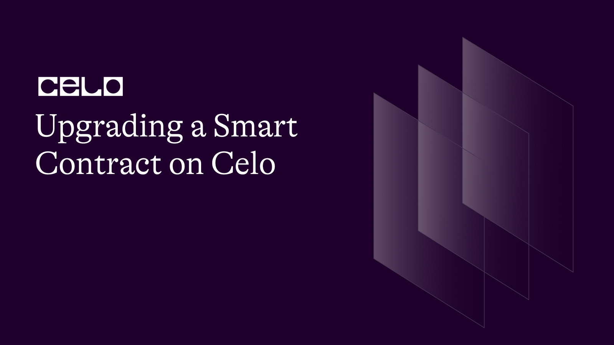

## Introduction

Smart Contract Upgradability is a state whereby changes or upgrades to a smart contract do not affect its state and functionality. This functionality allows smart contracts to be easily managed and improved upon over time.

Just like the normal software development lifecycle, where the software needs to be maintained, scaled, and optimized even after building its underlying infrastructure, smart contracts should undergo such a process too because bugs and vulnerabilities can be discovered even after a contract has been deployed, need for improvements maybe as a result of changes from the underlying blockchain protocol. But keep in mind that the process of upgrading a smart contract should be done with adequate planning so as to avoid bringing vulnerability attacks to your contract.

In this tutorial, we will explore different methods of upgrading a smart contract and how to implement one of them in Solidity.

## Prerequisites

To understand this tutorial, you must be familiar with:

- Building Smart contracts
- Solidity
- Remix or Truffle

## Requirements

- [Celo Testnet account](https://faucet.celo.org/)
- [Celo Wallet](https://docs.celo.org/blog/tutorials/3-simple-steps-to-connect-your-metamask-wallet-to-celo)

## Smart Contract Upgradability Approaches

Smart contract upgradability has several approaches but we will explore 3 common approaches and highlight their pros and cons.

1. Proxy Contracts: Using the proxy contract approach, a new contract is created that acts as an intermediary between the client and the actual contract. The proxy contract refers to the current implementation contract and delegated all method calls to it. When an upgrade is required, a new implementation contract is deployed and the proxy contract is updated to point to the newly deployed implementation contract. This method allows for smooth upgrades without interfering with the contract's state or functionality.
2. Upgradeable Libraries: The approach of an upgradeable library entails creating a library contract with reusable functions and deploying it separately from the contract that uses it. The library contract contains only the necessary state variables and delegated all function calls to it. When an upgrade is required, a new library contract is deployed, and the contract that makes use of it is updated to point to the new library contract. This method encourages code reuse and reduces the amount of code that must be redeployed during upgrades.
3. Eternal Storage: The eternal storage method involves decoupling the state of the contract from its logic. The logic is stored in a contract that delegated all state-related operations to the storage contract. When an upgrade is required, a new logic contract is deployed and the storage contract is updated to point to the newly deployed logic contract. This method ensures that the state of the contract is preserved during upgrades.

## Implementing an Upgradable Smart Contract on Celo

The proxy contract approach will be used to demonstrate how to implement an upgradable contract on the Celo blockchain. We'll write a simple contract that keeps track of a counter and allows users to increment it. The contract will then be upgraded by adding a new function that resets the counter to zero.

### Step1: Create a Proxy Contract

The first step is to draft the proxy contract, which will serve as an intermediary between the client and the implementation contract. The proxy contract should keep a reference to the current implementation contract and delegate all method calls to it.

Create a new directory and put all the code examples in this tutorial in it.

```bash
mkdir upgrading-smart-contracts
cd upgrading-smart-contracts
```

Here is an example code:

Create a file called CounterProxy.sol and put the following example code in it:

CounterProxy.sol

```solidity
pragma solidity ^0.8.0;

contract CounterProxy {
    address public implementation;

    constructor(address _implementation) {
        implementation = _implementation;
    }

    fallback() external payable {
        address _impl = implementation;
        assembly {
            let ptr := mload(0x40)
            calldatacopy(ptr, 0, calldatasize())
            let result := delegatecall(gas(), _impl, ptr, calldatasize(), 0, 0)
            let size := returndatasize()
            returndatacopy(ptr, 0, size)

            switch result
            case 0 { revert(ptr, size) }
            default { return(ptr, size) }
        }
    }
		receive() external  payable {

    }
}
```

In the code above, the constructor takes in the address of the implementation contract as argument. All method calls are delegated to the implementation contract via the fallback function. It accomplishes this by copying the method call data from the client's transaction and forwarding it to the implementation contract via a delegatecall function. The result of the call is returned to the client if it is successful. If the call fails, an exception is thrown, and the client's transaction is rolled back.

### Step2: Create the Actual Implementation Contract

The next step is to create the implementation contract which contains the actual logic of incrementing the counter by one.

Counter.sol

```solidity
pragma solidity ^0.8.0;

contract Counter {
    uint256 public count;

    function increment() public {
        count++;
    }
}
```

The count variable is public and stores the current value of the counter and the increment function increases the counter by one.

### Step3: Deploy the Proxy and Implementation Contract

Next, deploy the proxy and implementation contract on the Celo blockchain. You can follow this tutorial on [how to deploy a smart contract on Celo using Python](https://www.notion.so/Building-an-NFT-marketplace-on-Celo-with-Python-c351a9da2db34e679d2611c03e7e62af).

After you have deployed the implementation contract, get its address and pass it to the constructor of the proxy contract.

The updated Proxy contract code to deploy:

CounterProxy.sol

```solidity
// SPDX-License-Identifier: MIT

pragma solidity ^0.8.0;

import "./Counter.sol";

contract CounterProxy {
    address public implementation;

    constructor(address _implementation) {
        implementation = _implementation;
    }

    fallback() external payable {
        address _impl = implementation;
        assembly {
            let ptr := mload(0x40)
            calldatacopy(ptr, 0, calldatasize())
            let result := delegatecall(gas(), _impl, ptr, calldatasize(), 0, 0)
            let size := returndatasize()
            returndatacopy(ptr, 0, size)

            switch result
            case 0 { revert(ptr, size) }
            default { return(ptr, size) }
        }
    }

    function setImplementation(address _newImplementation) external {
        require(msg.sender == address(this), "Only the contract itself can call this function");
        implementation = _newImplementation;
    }


    receive() external  payable {

    }
}
```

In the code above, the "CounterFactory" contract includes a function called "createCounter," which generates a new instance of the "Counter" contract as well as a new instance of the "CounterProxy" contract. The "Counter" contract's address is passed to the "CounterProxy" contract's constructor. The function returns the address of the proxy contract. The “setImplementation” function sets the contract to implement the new contract address.

### Step4: Upgrade the Implementation Contract

The next step is to upgrade the implementation contract to include a new function that resets the counter to zero.

Counter.sol

```solidity
pragma solidity ^0.8.0;

contract Counter {
    uint256 public count;

    function increment() public {
        count++;
    }

    function reset() public {
        count = 0;
    }
}
```

### Step5: Upgrade the Proxy Contract

The final step is to modify the proxy contract so that it points to the new implementation contract. We have to deploy a new instance of the implementation contract and update the proxy contract's "implementation" variable to point to the new contract address.

```solidity
contract CounterFactory {
    function createCounter() public returns (address) {
        Counter counter = new Counter();
        CounterProxy proxy = new CounterProxy(address(counter));
        return address(proxy);
    }

    function upgradeCounter(address payable _proxy) public {
        Counter counter = new Counter();
        CounterProxy proxy = CounterProxy(_proxy);
        proxy.setImplementation(address(counter));
    }
}
```

A new "upgradeCounter" function takes the address of an existing proxy contract and upgrades it to use the new implementation contract. The function creates a new instance of the implementation contract and then modifies the proxy contract's "implementation" variable to point to the new contract address.

To upgrade the contract, we can use the address of the existing proxy contract to call the "upgradeCounter" function. This will update the proxy contract's implementation contract, allowing us to add new functionality to the contract without having to deploy a new proxy contract.

## Conclusion

In this tutorial, we explored what smart contract upgradability is and how we can implement them in solidity. We also looked at how we can implement contract upgradability patterns such as the Proxy contract, Eternal Storage and Upgradeable Libraries.

## Next Steps

We can read up on more upgradability patterns such as the proxy factor, governance contract, etc. You can also learn how they are implemented in Solifity and how to deploy them on the Celo blockchain.

## About the Author

[Israel Okunaya](https://meetisraelokunaya.curious.page/) is an ace writer with a flair for simplifying complexities and a knack for storytelling. He leverages over four years of experience to meet the most demanding writing needs in different niches, especially food and travel, blockchain, and marketing. He sees blockchain as a fascinating yet tricky affair. So, he's given to simplifying its complexities with text and video tutorials.

## References

1. [Celo Developer Documentation](https://docs.celo.org/)
2. [Solidity Documentation](https://solidity.readthedocs.io/)
3. [OpenZeppelin Upgrades](https://docs.openzeppelin.com/upgrades)
