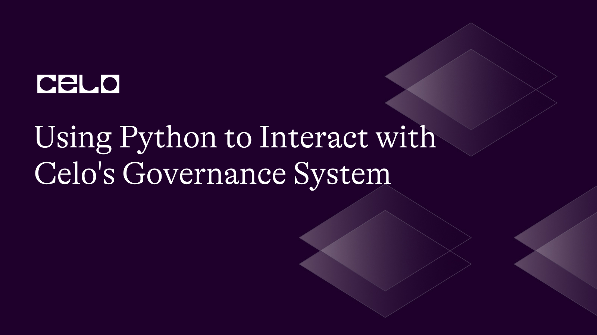

## Introduction

In this article, we will know what the Celo Governance system is and how we can interact with it using Python and web3.py (Python library used for interacting with Ethereum nodes). Celo is a fully mobile-first and open-source blockchain that allows developers to build smart contracts and DAPPS (decentralized applications). Holders of the native Celo token can vote on proposals that affect the platform's development, parameters, and future features through its governance system.

## Prerequisites

To follow along with this tutorial, you need to be familiar with:

- Building Smart contracts
- The Python programming language
- The Celo Governance contract ABI

## Requirements

You should have the following installed on your computer to follow along:

- Python 3.7 or later
- [Node.js](https://nodejs.org/en/download/)
- [Celo Testnet account](https://faucet.celo.org/)
- [Celo Wallet](https://docs.celo.org/blog/tutorials/3-simple-steps-to-connect-your-metamask-wallet-to-celo) (with some Celo tokens)
- [Python-dotenv](https://pypi.org/project/python-dotenv/) (for environment variables)
- [Web3.py](https://web3py.readthedocs.io/en/stable/) (for interacting with the blockchain)

## Set up the Project

On your terminal, use the following commands to create a new folder for your project:

```bash
mkdir celo-governance-system
cd celo-governance-system
```

In your new directory, create a python virtual environment and activate it with the following commands:

```bash
python3 -m venv env
source env/bin/activate
```

To install the web3.py, and python-dotenv:

```bash
pip install web3
pip install python-dotenv
```

## Setting up the Celo Environment

Next, let us connect to the Celo Alfajores. Create a new file in your root directory called “main.py”.

```python
from web3 import Web3
from web3.middleware import geth_poa_middleware

w3 = Web3(Web3.HTTPProvider(CELO_NODE_URL))
w3.middleware_onion.inject(geth_poa_middleware, layer=0)

# Check if connected to Celo network
if not w3.is_connected():
    print("Not connected to the Celo network.")
    exit(1)
```

Using the Web3 library, this Python code establishes a connection to a Celo node and activates the PoA (Proof of Authority) middleware. The connection to the Celo network is then checked to see if it was successful, and if not, a message is printed.

### Interacting with Governance Contracts on Celo

Smart contracts are the foundation of Celo's governance system, and the Governance contract will be the primary one we work with. Let's first import the required package and load the application binary interface (ABI) for the contract.

```python
import json

CELO_NODE_URL = 'https://alfajores-forno.celo-testnet.org'
PRIVATE_KEY='your-private-key'
GOVERNANCE_CONTRACT_ADDRESS = '0x88CdC239B61c5E5e1aCF31ca35AE015FF1a1706f'

GOVERNANCE_ABI_PATH = 'governance_abi.json'

with open(GOVERNANCE_ABI_PATH) as f:
    governance_abi = json.load(f)

# Set up the account and contract instances
account = w3.eth.account.from_key(PRIVATE_KEY)
governance = w3.eth.contract(
    address=Web3.to_checksum_address(GOVERNANCE_CONTRACT_ADDRESS),
    abi=governance_abi
)
```

To connect to the Celo network and communicate with a Governance contract, this Python function imports the “json” package and sets a few constants.
The URL to the Celo node that the code will connect to is CELO NODE URL.
PRIVATE KEY is a string that represents the account's private key, which will be used to communicate with the contract. The address of the Governance contract on the Celo network is “GOVERNANCE_CONTRACT_ADDRESS”. The path to a JSON file containing the ABI for the Governance contract is “GOVERNANCE_ABI_PATH”. The code then uses the “json.load()” function to read the ABI from the file supplied by “GOVERNANCE_ABI_PATH” and creates the account and contract instances using the Web3 library.

The contract address is changed to a checksum address using “Web3.to_checksum_address()” method to improve client compatibility.

You can find all the contract addresses (both proxies and implementation) of all Celo smart contracts [here](https://docs.celo.org/contract-addresses#celo-mainnet).

You can create a JSON file called “governance_abi.json” in the root directory of your project and check this [repo](https://github.com/Divine572/celo-governance-system-) to copy the Celo Governance ABI.

The JSON file contains the ABI of the Celo governance contract but in this article, we’ll be interacting with these functions:

- “proposalCount”: Used to get the total number of proposals
- "getProposal": Retrieves information about a particular proposal using its ID.
- "getProposalStage": Retrieves a proposal's current stage (e.g., Approval, Referendum, Execution).
- "propose": Submits a brand-new proposal with the targets, values, function signatures, calldatas, and URL for the description that has been specified.
- "vote": Casts a vote in favor of a proposal with the ID, index, and value supplied.

### Getting Proposal Details

With a proposal's ID, the “getProposal” method can be used to access the specifics of that proposal. This function is called in the script with the proposal ID “proposal_id”, and the output is saved in the proposal variable. The proposal's specifics are then printed.

```python
# Get the details of a specific proposal (e.g., proposal ID 1)
proposal_id = 123456
proposal = governance_contract.functions.getProposal(proposal_id).call()
print(f"Proposal details: {proposal}")
```

### Getting Proposal Stage

Given a proposal's ID, the “getProposalStage” method can be used to obtain the proposal's current stage. This function is called in the script with the proposal ID “proposal_id”, and the output is saved in the stage variable. The proposal's stage is then printed out.

```python
# get proposal stage
proposal_id = 123456
stage = governance_contract.functions.getProposalStage(proposal_id).call()

# print proposal stage
print(f"Proposal stage: {stage}")
```

### Voting on a Proposal

To vote on a proposal, use the “vote” function. The proposal id, index of the chosen choice, and vote value, which is set to 1 to support the proposal, are passed to this function in the script.

We then specify the gas, gas price, nonce, and the address to construct the transaction. The transaction is then sent, signed, and the transaction hash is printed.

```python
# vote on proposal
index = 0
vote_value = 1  # vote in favor of the proposal
tx = governance_contract.functions.vote(proposal_id, index, vote_value).build_transaction({
    'from': account.address,
    'gas': 1000000,
    'gasPrice': w3.to_wei('10', 'gwei'),
    'nonce': w3.eth.get_transaction_count(account.address)
})

# sign and send transaction
signed_tx = account.sign_transaction(tx)
tx_hash = w3.eth.send_raw_transaction(signed_tx.rawTransaction)

# print transaction hash
print(f"Transaction hash: {tx_hash.hex()}")
```

### Creating a Proposal

On the governance contract, a new proposal is made using the “propose” function. The values, destinations, data, data lengths, and description URL for the proposal are defined in this script, along with the deposit amount needed to submit the proposal.

The account's current nonce is then obtained, and it is increased to make sure it is higher than the previous nonce. By providing the from address, value, gas, gas price, and nonce, we construct the transaction. We print the transaction hash for the proposal after signing and sending the transaction.

```python
# set up proposal parameters
values = [100, 200, 300]
destinations = ['0x8BdDeC1b7841bF9eb680bE911bd22051f6a00815', '0xcdd1151b2bC256103FA2565475e686346CeFd813', '0xCD1117Ca9f96F9837a28C473B35C2b49EEd72973']
data = '0xabcdef123456'
data_lengths = [32, 64, 16]
description_url = 'https://my-proposal.com'

deposit_amount = 10000000

# Get the current nonce for the account
nonce = w3.eth.get_transaction_count(account.address)

# Increment the nonce by one to ensure it is higher than the previous nonce
nonce += 1

# create proposal transaction
tx = governance_contract.functions.propose(
    values,
    destinations,
    data,
    data_lengths,
    description_url
).build_transaction({
    'from': account.address,
    'value': deposit_amount,
    'gas': 1000000,
    'gasPrice': w3.eth.gas_price,
    'nonce': nonce
})

# sign and send proposal transaction
signed_tx = w3.eth.account.sign_transaction(tx, private_key=PRIVATE_KEY)
tx_hash = w3.eth.send_raw_transaction(signed_tx.rawTransaction)

# print transaction hash for the proposal
print(f"Proposal submitted. Transaction hash: {tx_hash.hex()}")
```

### Getting the Number of Proposals

The “proposalCount” function is then used to determine how many proposals are currently on the governance contract. The proposal count variable is used to store the outcome and print it.

```python
# Get the number of proposals
proposal_count = governance_contract.functions.proposalCount().call()

print(f'There are currently {proposal_count} proposals.')
```

Run the script by using this command on your terminal:

```bash
python main.py
```

Your code should successfully run and print the output on your terminal:


## Conclusion

In this article, we have learned how to interact with the Celo governance system using web3.py and Python. You can now engage in Celo’s governance process with what you’ve learned. We went over setting up the Celo environment, looking up information from the governance contract, making ideas, and voting on them. This ought to serve as a starting point for additional Python-based investigation and engagement with Celo's governance system.

## Next Steps

To learn more about building on Celo using Python, you can explore the following resources:

- [Celo documentation](https://docs.celo.org/)
- [Solidity](http://solidity-by-example.org)
- [Celo Governance](https://docs.celo.org/protocol/governance)
- [Celo Governance Github repo](https://github.com/celo-org/governance)

## About the Author

[Israel Okunaya](https://meetisraelokunaya.curious.page/) is an ace writer with a flair for simplifying complexities and a knack for storytelling. He leverages over four years of experience to meet the most demanding writing needs in different niches, especially food and travel, blockchain, and marketing. He sees blockchain as a fascinating yet tricky affair. So, he is given to simplifying its complexities with text and video tutorials.

## References

- [Celo docs](https://docs.celo.org/)
- [Web3.py](https://web3py.readthedocs.io/en/stable/quickstart.html)
- [Github repo](https://github.com/Divine572/celo-governance-system-)
