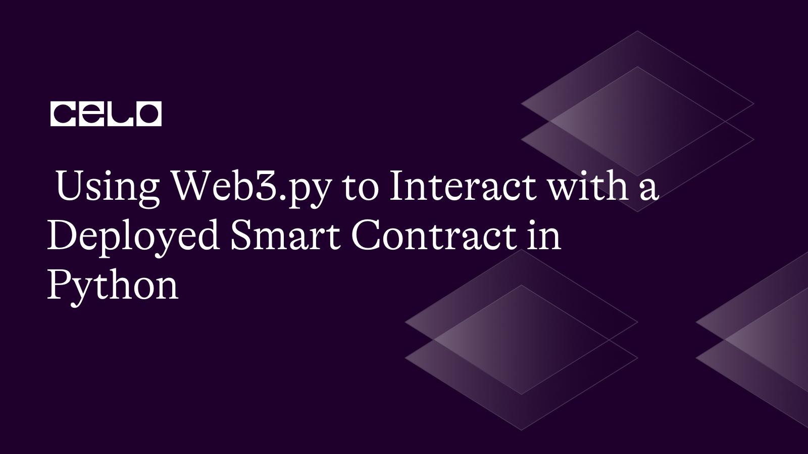

## Introduction

The manner that transactions are carried out has been transformed by blockchain technology. The most well-known blockchain for creating decentralized applications, Ethereum, provides a robust smart contract ecosystem. In the Ethereum blockchain, smart contracts are self-executing contracts that allow for programmatic interaction from developers. A Pythonic interface for communicating with the Ethereum blockchain is provided via the Web3.py module. This article will teach you how to communicate with a deployed Python smart contract using Web3.py.

## Prerequisites

Before we begin, it is essential to be familiar with:

- Building Smart contracts
- The Python programming language

## Requirements

It would help if you had the following installed on your computer to follow along:

- Python 3.7 or later
- [Node.js](https://nodejs.org/en/download/)
- [Celo Testnet account](https://faucet.celo.org/)
- [Celo Wallet](https://docs.celo.org/blog/tutorials/3-simple-steps-to-connect-your-metamask-wallet-to-celo) (with some Celo tokens)
- [Python-dotenv](https://pypi.org/project/python-dotenv/) (for environment variables)
- [Web3.py](https://web3py.readthedocs.io/en/stable/) (for interacting with the blockchain)

## Step 1: Set up the Project

I will use the smart contract created in my previous article on [Creating a staking contract on Celo](https://www.notion.so/Creating-a-Staking-Contract-on-Celo-397d62e031dc42b6a5e1177b3e9cc843), So, make sure you go through it before continuing with this tutorial.

Your smart contract should be as updated as this:

```solidity
// SPDX-License-Identifier: MIT
pragma solidity ^0.8.0;

import "node_modules/@openzeppelin/contracts/token/ERC20/IERC20.sol";
import "node_modules/@openzeppelin/contracts/access/Ownable.sol";

contract Staking is Ownable {
    IERC20 public cUSDToken;
    IERC20 public CELOToken;

    uint256 public stakingPeriod;

    struct StakingInfo {
        uint256 amount;
        uint256 startTime;
        bool claimed;
    }

    mapping(address => StakingInfo) public stakingInfo;

    event Staked(address indexed user, uint256 amount);
    event Unstaked(address indexed user, uint256 amount);

    constructor(
        address _cUSDToken,
        address _CELOToken,
        uint256 _stakingPeriod
    ) {
        cUSDToken = IERC20(_cUSDToken);
        CELOToken = IERC20(_CELOToken);
        stakingPeriod = _stakingPeriod;
    }

    function stake(uint256 _amount) external {
        require(_amount > 0, "Amount must be greater than 0");
        require(
            cUSDToken.balanceOf(msg.sender) >= _amount,
            "Insufficient cUSD balance"
        );

        cUSDToken.transferFrom(msg.sender, address(this), _amount);

        stakingInfo[msg.sender] = StakingInfo({
            amount: _amount,
            startTime: block.timestamp,
            claimed: false
        });

        emit Staked(msg.sender, _amount);
    }

    function unstake() external {
        StakingInfo storage userStakingInfo = stakingInfo[msg.sender];
        require(userStakingInfo.amount > 0, "No staked tokens found");
        require(
            block.timestamp >= userStakingInfo.startTime + stakingPeriod,
            "Staking period not completed"
        );

        uint256 rewardAmount = calculateReward(userStakingInfo.amount);

        userStakingInfo.claimed = true;

        cUSDToken.transfer(msg.sender, userStakingInfo.amount);
        CELOToken.transfer(msg.sender, rewardAmount);

        emit Unstaked(msg.sender, userStakingInfo.amount);

        delete stakingInfo[msg.sender];
    }

    function calculateReward(uint256 _amount) public view returns (uint256) {
        // Implement your reward calculation logic here
        // In this example, we will return a simple 5% reward
        return (_amount * 5) / 100;
    }

    function setStakingPeriod(uint256 _stakingPeriod) external onlyOwner {
        stakingPeriod = _stakingPeriod;
    }

    function setCUSDToken(address _cUSDToken) external onlyOwner {
        cUSDToken = IERC20(_cUSDToken);
    }

    function setCELOToken(address _CELOToken) external onlyOwner {
        CELOToken = IERC20(_CELOToken);
    }
}
```

The deployment script should also be updated as this:

```python
import json
import os
from web3 import Web3
from dotenv import load_dotenv
from solcx import compile_standard, install_solc

load_dotenv()

# Install specific Solidity compiler version
install_solc("0.8.0")

# Set up web3 connection
provider_url = os.environ.get("CELO_PROVIDER_URL")
w3 = Web3(Web3.HTTPProvider(provider_url))
assert w3.is_connected(), "Not connected to a Celo node"

# Set deployer account and private key
deployer = os.environ.get("CELO_DEPLOYER_ADDRESS")
private_key = os.environ.get("CELO_DEPLOYER_PRIVATE_KEY")

with open("Staking.sol", "r") as file:
    contract_source_code = file.read()

# Compile the contract
compiled_sol = compile_standard({
    "language": "Solidity",
    "sources": {
        "Staking.sol": {
            "content": contract_source_code
        }
    },
    "settings": {
        "outputSelection": {
            "*": {
                "*": ["metadata", "evm.bytecode", "evm.sourceMap"]
            }
        }
    }
})

# Extract the contract data
contract_data = compiled_sol['contracts']['Staking.sol']['Staking']
bytecode = contract_data['evm']['bytecode']['object']
abi = json.loads(contract_data['metadata'])['output']['abi']

# Deploy the contract

# Prepare the contract object
contract = w3.eth.contract(abi=abi, bytecode=bytecode)

cUSDToken = "0x874069Fa1Eb16D44d622F2e0Ca25eeA172369bC1"
CELOToken = "0xF194afDf50B03e69Bd7D057c1Aa9e10c9954E4C9"
stakingPeriod = 30 * 24 * 60 * 60  # 30 days

# Estimate gas for contract deployment
gas_estimate = contract.constructor(cUSDToken, CELOToken, stakingPeriod).estimate_gas()

nonce = w3.eth.get_transaction_count(deployer)

# Prepare the transaction
transaction = {
    'from': deployer,
    'gas': gas_estimate,
    'gasPrice': w3.eth.gas_price,
    'nonce': nonce,
    'data': bytecode
}

signed_txn = w3.eth.account.sign_transaction(transaction, private_key)
transaction_hash = w3.eth.send_raw_transaction(signed_txn.rawTransaction)
transaction_receipt = w3.eth.wait_for_transaction_receipt(transaction_hash)

# Get the contract address
contract_address = transaction_receipt['contractAddress']
print(f"Contract deployed at address: {contract_address}")
```

## Step 2: Create a Client that Interacts with the Contract

Next, let’s create a file called “client.py” containing implementations that interact with all the functions in our smart contract.

First, we must connect to a Celo testnet node and load our contract ABI and contract address from the “deploy.py” file. Create a file called “client.py” which will interact with our “staking” contract.

client.py

```python
import os
from web3 import Web3
from web3.middleware import geth_poa_middleware

import deploy

# Set up web3 connection
provider_url = os.environ.get("CELO_PROVIDER_URL")
w3 = Web3(Web3.HTTPProvider(provider_url))
assert w3.is_connected(), "Not connected to a Celo node"

# Add PoA middleware to web3.py instance
w3.middleware_onion.inject(geth_poa_middleware, layer=0)

abi = deploy.abi
contract_address = deploy.contract_address
account_address = deploy.deployer
private_key = deploy.private_key

contract = w3.eth.contract(address=contract_address, abi=abi)
```

## Step 3: Interact with the Stake Function

Create a “stake” function that takes in an amount in Celo USD and builds the transaction, signs it, and generates a receipt that shows that the stake was executed successfully.

```python
# Stake tokens
def stake(amount):
    nonce = w3.eth.get_transaction_count(account_address)
    txn = contract.functions.stake(amount).build_transaction({
        'from': account_address,
        'gas': 200000,
        'gasPrice': w3.eth.gas_price,
        'nonce': nonce
    })

    signed_txn = w3.eth.account.sign_transaction(txn, private_key)
    txn_hash = w3.eth.send_raw_transaction(signed_txn.rawTransaction)
    txn_receipt = w3.eth.wait_for_transaction_receipt(txn_hash)
    print("Staked:", amount, "cUSD")
```

## Step 4: Interact with the Unstake Function

An “unstake” function builds the transaction, signs it, and generates a receipt that shows that the function was executed successfully.

```python
# Unstake tokens
def unstake():
    nonce = w3.eth.get_transaction_count(account_address)
    txn = contract.functions.unstake().build_transaction({
        'from': account_address,
        'gas': 200000,
        'gasPrice': w3.eth.gas_price,
        'nonce': nonce
    })

    signed_txn = w3.eth.account.sign_transaction(txn, private_key)
    txn_hash = w3.eth.send_raw_transaction(signed_txn.rawTransaction)
    txn_receipt = w3.eth.wait_for_transaction_receipt(txn_hash)
    print("Unstaked and claimed rewards")
```

## Step 5: Interact with the staking_info Function

This function takes in a user’s address and calls the “stakingInfo” function from our smart contract ABI. It then prints out details such as the staking amount, start time, etc, of a particular stake.

```python
# Check staking information for a user
def get_staking_info(user_address):
    info = contract.functions.stakingInfo(user_address).call()
    print("Staking Info for", user_address)
    print("Amount:", info[0])
    print("Start Time:", info[1])
    print("Claimed:", info[2])
```

Finally, let us write conditional statements that would execute our functions:

```python
# Replace this with the desired action
action = 'stake'  # 'unstake' or 'get_staking_info'

if action == 'stake':
    stake_amount = 100  # Replace with the desired staking amount
    stake(stake_amount)
elif action == 'unstake':
    unstake()
elif action == 'get_staking_info':
    user_address = account_address  # Replace with the desired user's address
    get_staking_info(user_address)
```

The code above executes each function conditionally based on the string value passed into the “action” variable.

Run the code and see its output in your terminal:


The finished code should look like this:

client.py

```python
import os
from web3 import Web3
from web3.middleware import geth_poa_middleware

import deploy

# Set up web3 connection
provider_url = os.environ.get("CELO_PROVIDER_URL")
w3 = Web3(Web3.HTTPProvider(provider_url))
assert w3.is_connected(), "Not connected to a Celo node"

# Add PoA middleware to web3.py instance
w3.middleware_onion.inject(geth_poa_middleware, layer=0)

abi = deploy.abi
contract_address = deploy.contract_address
account_address = deploy.deployer
private_key = deploy.private_key

contract = w3.eth.contract(address=contract_address, abi=abi)

# Stake tokens
def stake(amount):
    nonce = w3.eth.get_transaction_count(account_address)
    txn = contract.functions.stake(amount).build_transaction({
        'from': account_address,
        'gas': 200000,
        'gasPrice': w3.eth.gas_price,
        'nonce': nonce
    })

    signed_txn = w3.eth.account.sign_transaction(txn, private_key)
    txn_hash = w3.eth.send_raw_transaction(signed_txn.rawTransaction)
    txn_receipt = w3.eth.wait_for_transaction_receipt(txn_hash)
    print("Staked:", amount, "cUSD")

# Unstake tokens
def unstake():
    nonce = w3.eth.get_transaction_count(account_address)
    txn = contract.functions.unstake().build_transaction({
        'from': account_address,
        'gas': 200000,
        'gasPrice': w3.eth.gas_price,
        'nonce': nonce
    })

    signed_txn = w3.eth.account.sign_transaction(txn, private_key)
    txn_hash = w3.eth.send_raw_transaction(signed_txn.rawTransaction)
    txn_receipt = w3.eth.wait_for_transaction_receipt(txn_hash)
    print("Unstaked and claimed rewards")

# Check staking information for a user
def get_staking_info(user_address):
    info = contract.functions.stakingInfo(user_address).call()
    print("Staking Info for", user_address)
    print("Amount:", info[0])
    print("Start Time:", info[1])
    print("Claimed:", info[2])

# Replace this with the desired action
action = 'stake'  # 'unstake' or 'get_staking_info'

if action == 'stake':
    stake_amount = 100  # Replace with the desired staking amount
    stake(stake_amount)
elif action == 'unstake':
    unstake()
elif action == 'get_staking_info':
    user_address = account_address  # Replace with the desired user's address
    get_staking_info(user_address)
```

## Conclusion

In this article, we learnt how smart contract contracts can be interacted with, using Web3.py through the smart contract’s ABI. In this case, we interacted with a “staking” contract as if we were using a web client interface.

## Next Steps

You can learn more about [Staking](https://chain.link/education-hub/what-is-staking-crypto) and how it can help the development lifecycle of blockchain and Defi applications. You can also implement a web interface using web frameworks like React or Vue.

## About the Author

[Israel Okunaya](https://meetisraelokunaya.curious.page/) is an ace writer with a flair for simplifying complexities and a knack for storytelling. He leverages over four years of experience to meet the most demanding writing needs in different niches, especially food and travel, blockchain, and marketing. He sees blockchain as a fascinating yet tricky affair. So, he is given to simplifying its complexities with text and video tutorials.

## References

1. [Celo Documentation](https://docs.celo.org/)
2. [Web3.py Documentation](https://web3py.readthedocs.io/)
3. [Github Repo](https://github.com/Divine572/stakng-contract)
