# Truffle and Celo | The Ultimate Guide to Deploy Celo dApps with Truffle

_How to deploy a smart contract to Celo testnet, mainnet, or a local blockchain using Truffle._

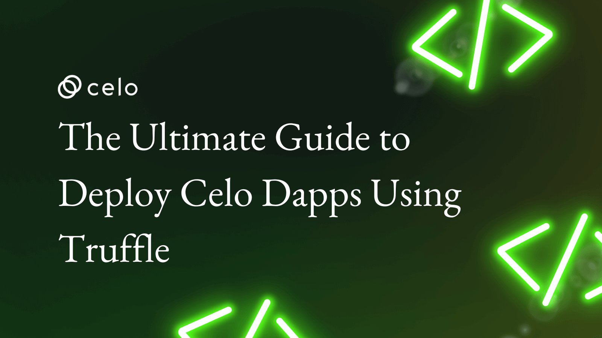

## Hello Developers 🌱

Welcome to today's post, where we'll break down a blockchain topic into bite-sized pieces to help you learn and apply your new skills in the real world.
Today's topic is Deploying on Celo with Truffle.

**Here's a list of what we'll cover 🗒**

- ✅ **Step 1:** Environment setup
- ✅ **Step 2:** Project setup
- ✅ **Step 3:** Write project code
- ✅ **Step 4:** Create and fund your account
- ✅ **Step 5:** Configure deployment settings
- ✅ **Step 6:** Compile and migrate your contract
- ✅ **Step 7:** Deploy your contract
- ✅ **Step 8:** View your deployed contract
- ✅ **Step 9:** Verify your smart contract

By the end of this post, you'll be able to create, deploy, and interact with your smart contract on Celo testnet, mainnet, or localhost using Truffle.

Let's go! 🚀

## Introduction to Truffle​

Truffle is a world-class development environment, testing framework, and asset pipeline for blockchains using the Ethereum Virtual Machine (EVM). By creating a Truffle project and editing a few configuration settings you can easily deploy your project on Celo.


:::tip

Learn more: If you are new to Truffle check out the [Truffle docs](https://trufflesuite.com/docs/index.html).

:::

## ✅ Step 1: Environment setup

Before getting started you'll need to set up Celo in your local environment. You can do this on Mac or Windows and can find the details on [docs.celo.org](docs.celo.org).

- [Using Windows](https://docs.celo.org/developer-guide/start/develop-on-windows)
- [Using Mac](https://docs.celo.org/developer-resources/using-mac)

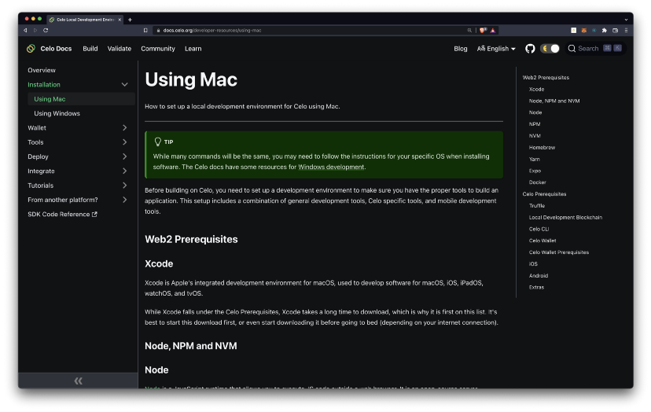

Celo projects include common dependencies like `Nodejs`, `npm`, `nvm`, `yarn`, `git`, and `xCode`. If you already have these installed you can follow this post to set up Celo specific dependencies.

### Node v12.0.0

To build on Celo you’ll use node `v12.0.0`.

```
nvm install v12.0.0
nvm use v12.0.0
node --version
```

### Celo Command Line Interface

The [celocli](https://www.npmjs.com/package/@celo/celocli) lets you interact with the Celo Protocol smart contracts.

```
npm install -g @celo/celocli
```

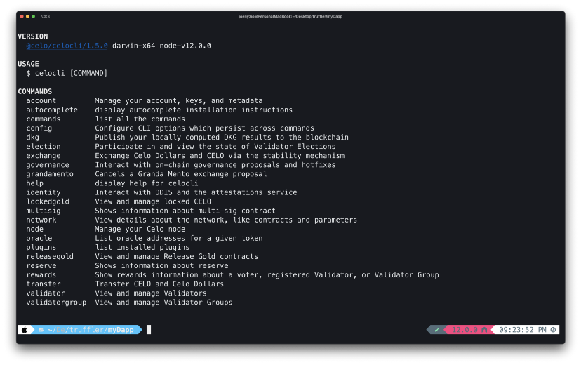

:::tip

Learn more: [17 smart contracts powering the Celo protocol](https://joenyzio.medium.com/17-powerful-celo-protocol-core-contracts-you-need-to-know-d84c1fbc5a6)

:::

### Install Truffle

[Truffle](https://www.trufflesuite.com/) lets you to develop, test, and deploy dApps on Celo.

```
npm install -g truffle
```

### Install Ganache

[Ganache UI](https://next-stack.github.io/ganache/) creates a local blockchain to help you deploy and test contracts. You can install and set up the UI from their website and can find more details in the [Ganache docs](https://trufflesuite.com/docs/ganache/overview.html).

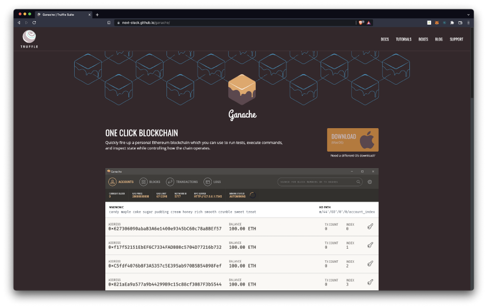

:::tip

The [@celo/ganache-cli](https://github.com/celo-org/ganache-cli) is Celo’s version of Ganache. It doesn’t seem to be working for me but you can try installing it in your environment.

:::

From the Ganache UI, create a new workspace on `localhost:7545`.

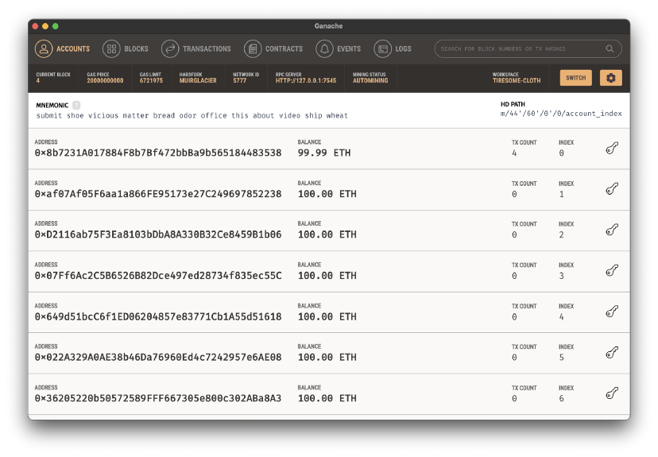

## ✅ Step 2: Project setup

Now that you have your environment setup, you’re ready to create your project! Open your terminal to create and navigate into a project folder.

```
mkdir celo-truffle && cd celo-truffle
```

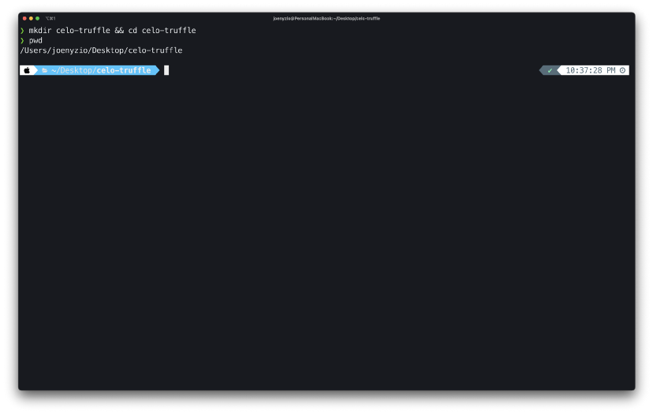

### Initialize an npm project

Initialize an npm project from within the project directory.

```
npm init -y
```

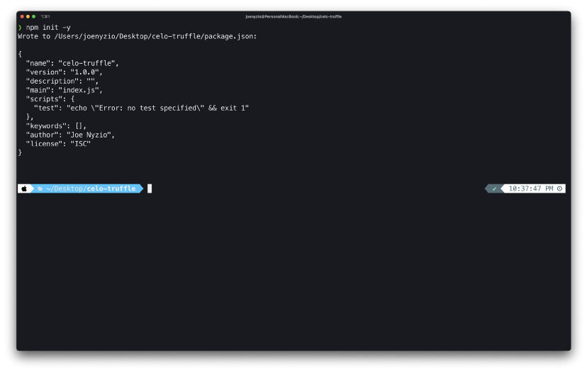

### Install hdwallet-provider

[Truffle/hdwallet-provider](https://github.com/trufflesuite/truffle/blob/develop/packages/hdwallet-provider/README.md#:~:text=HD%20Wallet%2Denabled%20Web3%20provider,12%20or%2024%20word%20mnemonic.) lets you sign Celo transactions for addresses derived from a mnemonic or private key. You can install this now and you’ll use it later when configuring your project.

```
npm install @truffle/hdwallet-provider --save
```

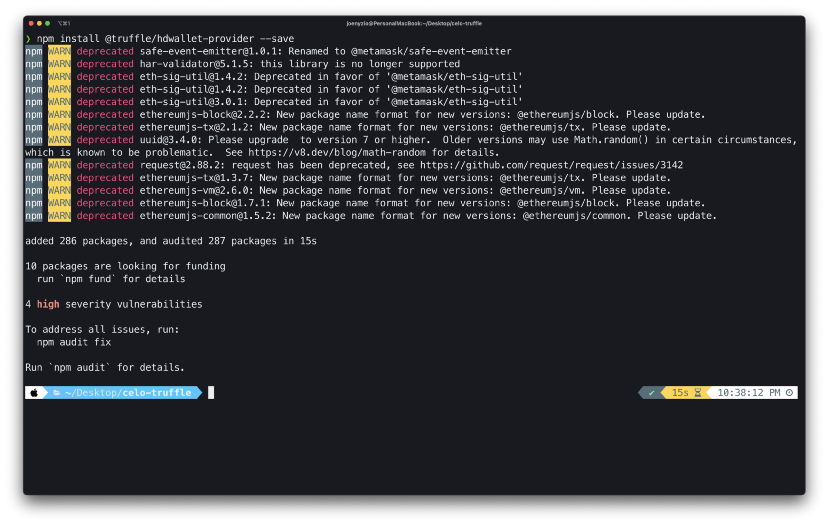

### Install dotenv

[Dotenv](https://www.npmjs.com/package/dotenv) is a module that loads environment variables from a .env file. Install this now and you’ll use this to import information to your Truffle configuration file.

```
npm install dotenv
```

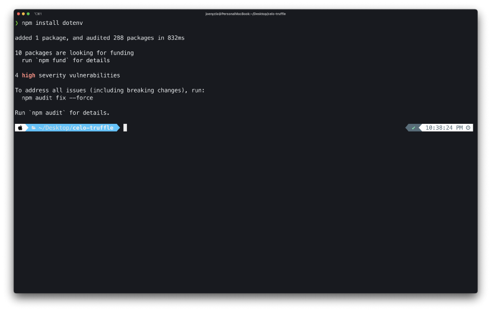

### Initialize Truffle

Initializing Truffle creates your project’s truffle environment. Use `truffle init` to start up your truffle project!

```
truffle init
```

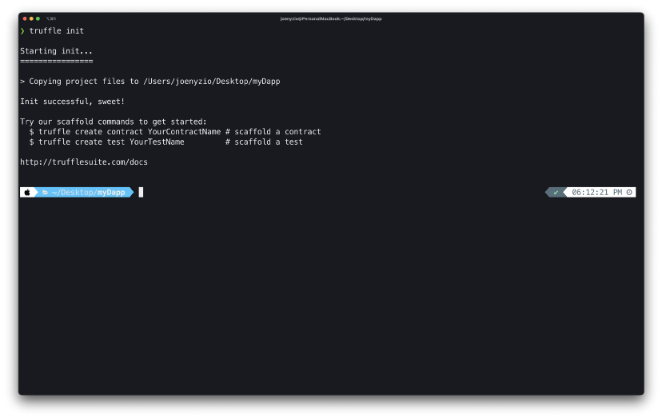

### Open your project

Your project is set up and you’re ready to start building! Open your project in [Visual Studio code](https://www.microsoft.com/en-us/resilience/remote-development-solutions/?&ef_id=Cj0KCQjwtrSLBhCLARIsACh6RmixaTeMbvlNJN4yrdykHGg5e4aN2Px1-Vf_oUq2edhP86n2C1-8lDIaAkxcEALw_wcB:G:s&OCID=AID2200893_SEM_Cj0KCQjwtrSLBhCLARIsACh6RmixaTeMbvlNJN4yrdykHGg5e4aN2Px1-Vf_oUq2edhP86n2C1-8lDIaAkxcEALw_wcB:G:s) or your preferred IDE.

```
code .
```

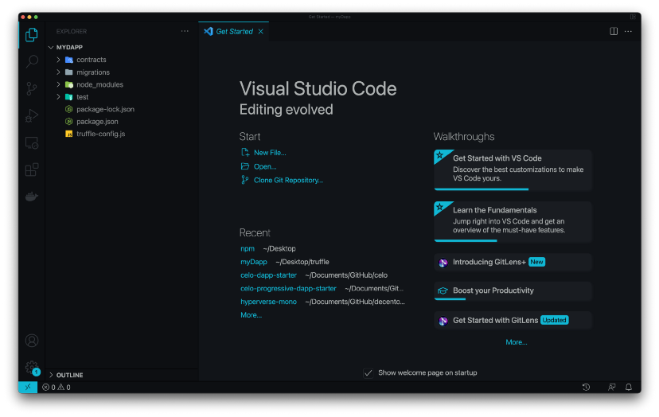

:::tip

You can launch VS Code from the command line by installing it in your shell path.

:::

## ✅ Step 3: Build your project

To build your project you’ll write a `smart contract`, `migrations`, `.env`, and `.gitignore` file. You’ll also create an account, fund it with test tokens, and connect the account to your project.

### Smart contract code

Create a file named `HelloCelo.sol` in the `/contracts` folder and add the Solidity code below.

```
// SPDX-License-Identifier: MIT
pragma solidity ^0.8.3;
contract HelloCelo {
   string public greet = "Hello Celo!";
}
```

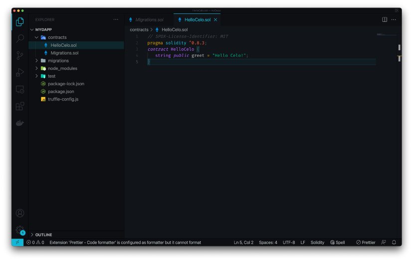

:::tip

Learn more: Read the Solidity docs or Solidity by Example to learn more about the programming language for building smart contracts.

:::

### Create migrations file

Create a file named `2_deploy_contracts.js` in the `/migrations` folder and add the code below.

```
var HelloCelo = artifacts.require('HelloCelo')
module.exports = function (deployer) {
 deployer.deploy(HelloCelo)
}
```

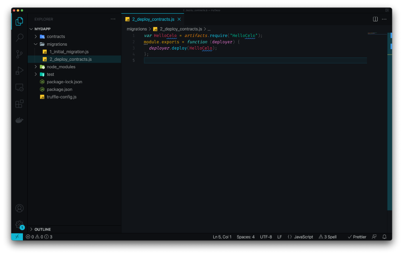

:::tip

If you created a different smart contract, update the variable name, file requirement and deployment to match your new contract.

:::

## ✅ Step 4: Create and fund your account

To deploy to the test or main Celo networks, you’ll need an account that is funded with CELO tokens. In this post, you’ll get set up to deploy for free on the Celo Alfajores test network!

### Create an account

If you don’t already have an account you would like to use, you can run `celocli account:new` from your terminal to create one for this project.

```
celocli account:new
```

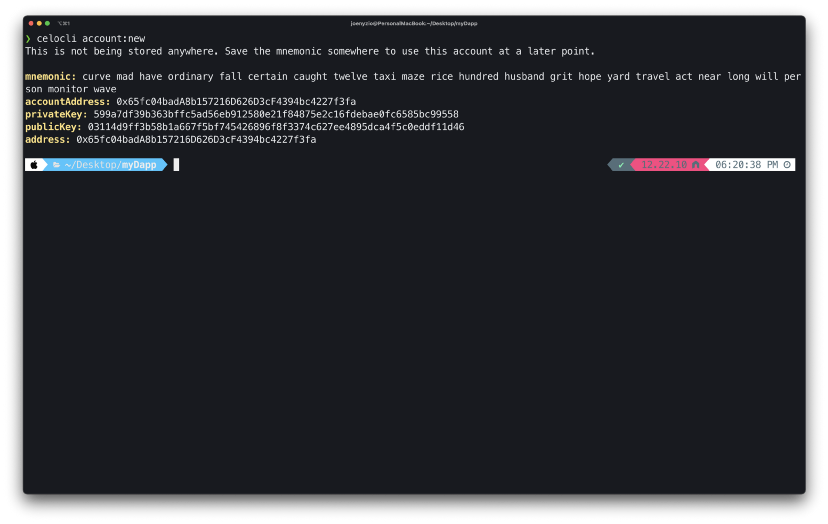

:::tip

Learn more: [Celo CLI: A practical guide to energize your Celo toolkit](https://joenyzio.medium.com/celo-cli-a-practical-guide-to-energize-your-celo-toolkit-9253067fff3a)

:::

### Fund your account

The [Alfajores testnet faucet](https://faucet.celo.org) helps you fund your account with test tokens. Copy your address from the terminal and paste it into the site to fund your account. This should send you tokens within a few seconds.

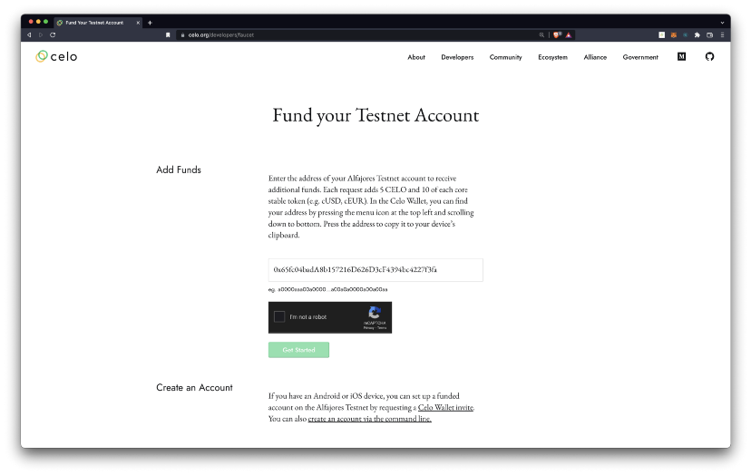

### Check account balance

If you’d like to check your new account balance, you can use `celocli` to make sure you received your test funds.

```
celocli account:balance 0xYOURADDRESS
```


### Create .env file

A `.env` file will help you hide the sensitive information you need for your configuration file. Create a `.env` file in your root folder and add your account’s private key.

```
PRIVATE_KEY="5ead931ce4812310e31f84c471945b96a13098aa6dc8cf0d3f6f451a5dea56cc"
```

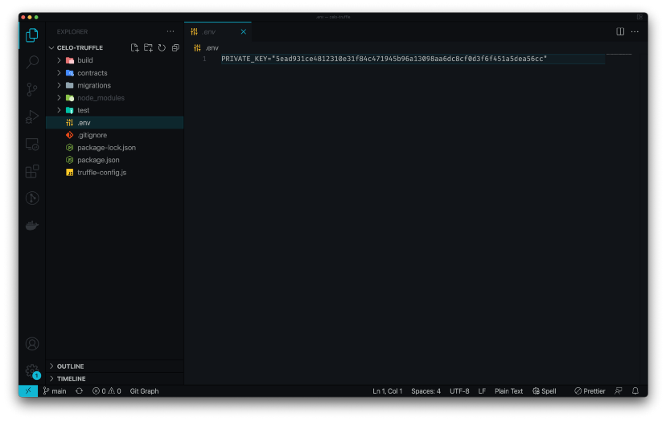

### Create .gitignore file

A `.gitignore` file will allow you to ignore certain files if you add this project to git or GitHub. Create a `.gitignore` file in your root directory and add the code below to ignnore your `node_modules`, `.DS_Store` and `.env` files.

```
# dependencies
/node_modules
# Mac users
.DS_Store
#hidden files
.env
```

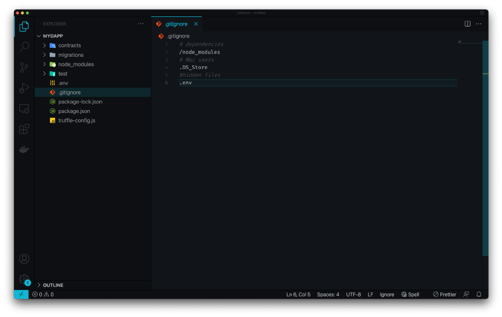

:::tip

See [ignoring files](https://help.github.com/articles/ignoring-files/) for more information.

:::

## ✅ Step 5: Configure deployment settings

The truffle configuration file specifies the networks for your contract deployment. By default, it is set up to deploy to the Ethereum network but you can update this information to deploy to any Celo network.

### Update Truffle.config

Open [truffle-config.js](https://www.trufflesuite.com/docs/truffle/reference/configuration#:~:text=Your%20configuration%20file%20is%20called,necessary%20to%20create%20your%20configuration.&text=js%20contained%20by%20the%20barebones%20project%20that%20truffle%20init%20creates.) in a text editor and replace its contents with this [Celo configuration code](https://github.com/joenyzio/celo-truffle/blob/main/truffle-config.js). This updates the `truffle.config.js` file to point toward Celo networks.

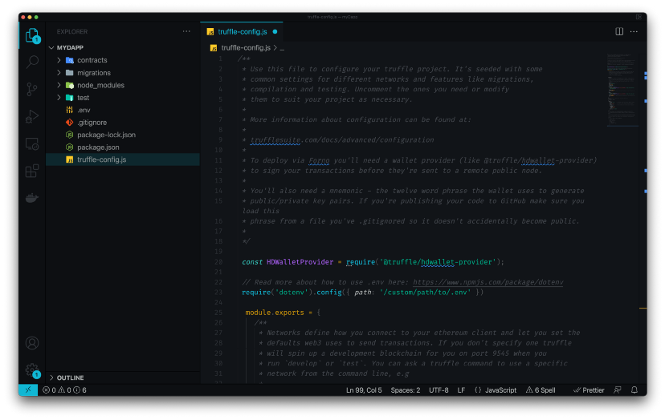

### Local network

Creating your Ganache workspace earlier made a local blockchain at `localhost:7545`. The `local` configuration connects to this local blockchain.

```
local: {
  host: "127.0.0.1",
  port: 7545,
  network_id: "*"
}
```

### Remote node connections

If you’re not running your own node, you can connect to remote nodes using [Forno](https://docs.celo.org/developer-guide/forno). Forno is a Celo node service that lets you connect to the Celo Alfajores Test Network and Celo Mainnet.

### Alfajores test network

The `alfajores` configuration uses Forno to connect you to Alfajores using `HDWalletProvider` and the private key in your `.env` file.

```
alfajores: {
  provider: function() {
    return new HDWalletProvider(process.env.MNEMONIC, "https://alfajores-forno.celo-testnet.org")
  },
  network_id: 44787,
  gas: 20000000
}
```

### Celo main network

The `celo` configuration uses Forno to connect you to mainnet using `HDWalletProvider` and the private key in your `.env` file. This tutorial will use Alfajores but you can to deploy to the main network whenever you’d like.

```
celo: {
  provider: function() {
    return new HDWalletProvider(process.env.MNEMONIC, "https://forno.celo.org")
  },
  network_id: 42220,
  gas: 4000000
}
```

:::tip

Learn more: To deploy to Celo Mainnet, follow [3 simple steps to connect your MetaMask wallet to Celo](https://joenyzio.medium.com/3-simple-steps-to-connect-your-metamask-wallet-to-celo-732d4a139587) and deploy to this account instead of your test account.

:::

## ✅ Step 6: Compile and migrate your contract

Compiling and migrating your contract prepares the code to deploy on a Celo network. This will also help you catch any errors and debug your code.

### Compile Contract

Compile the Solidity code into Ethereum bytecode. This command will compile any new or updated Solidity (.sol) contracts found in `/contracts`.

```
truffle compile
```

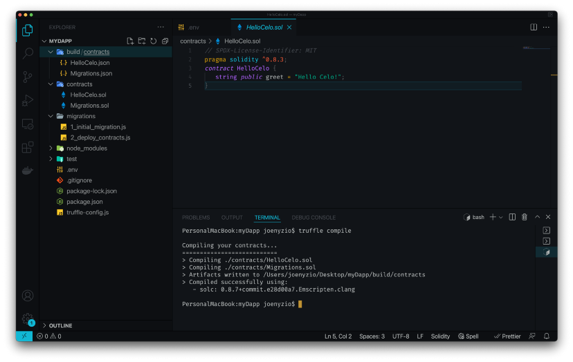

Now you should see `HelloCelo.json` in your `/build` folder.

:::tip

Learn more about compiling contracts with Truffle [here](https://www.trufflesuite.com/docs/truffle/getting-started/compiling-contracts).

:::

### Migrate Contract

Truffle migrate compiles AND migrates your contract. In the future you can run `truffle migrate` to complete both steps.

```
truffle migrate
```

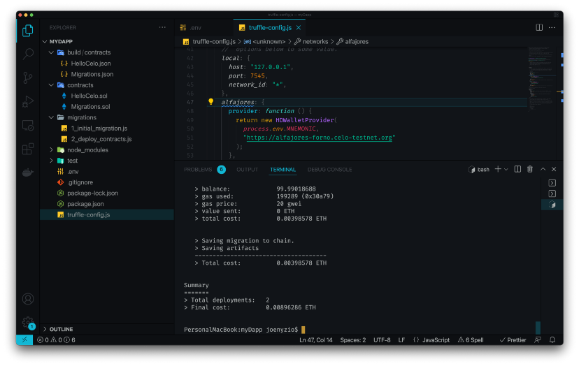

## ✅ Step 7: Deploy your Contract​

For this post, use `truffle deploy --network alfajores` to deploy to Alfajores but it’s easy to deploy to local or mainnet whenever you’d like!

```
truffle deploy --network alfajores
truffle deploy --network celo
truffle deploy --network local
```

### Deploy with — reset​ (optional)

You can edit contracts and redeploy at any time using the commands above. If for any reason you’d like to redeploy a contract that you didn’t edit you can use the `reset flag`. This will redeploy each contract to a new contract address.

```
truffle deploy --network NETWORK --reset
truffle migrate --network NETWORK --reset
```

:::tip

Save contract addresses for future reference. If you lose it, go to the block explorer to review your wallet transactions for contract creation and its response. Truffle saves deployment information, like transaction hashes and contract addresses, in JSON files in `./build/contracts/`.

:::

## ✅ Step 8: View your deployed contract

Now that you deployed your contract, you can view it in the Celo block explorer (known as [BlockScout](https://explorer.celo.org/). Copy your contract address from the terminal and navigate to the [block explorer](https://explorer.celo.org/) to search for your deployed contract.

- Switch to your network using the dropdown by the search bar.
- Navigate to [BlockScout](https://explorer.celo.org/) and select the network of your deployed contract.
- Paste your contract address from the terminal window and search for it in BlockExplorer.

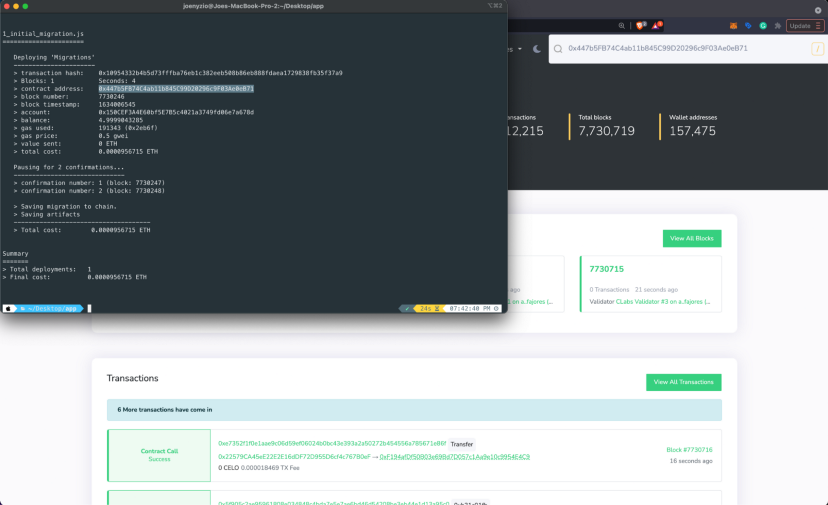

:::tip

Learn more about exploring the Celo network and smart contract details in BlockScout [here](https://docs.blockscout.com/).

:::

## ✅ Step 9: Verify your smart contract​

For people to use and interact with your contract, they’ll want to be able to view the smart contract code you created. Verifying a smart contract allows people to to do this from within the Celo Block Explorer.

- Navigate to the `Code` tab on the `Explorer` page for your contract’s address
- Click `Verify & Publish` to enter the smart contract verification page

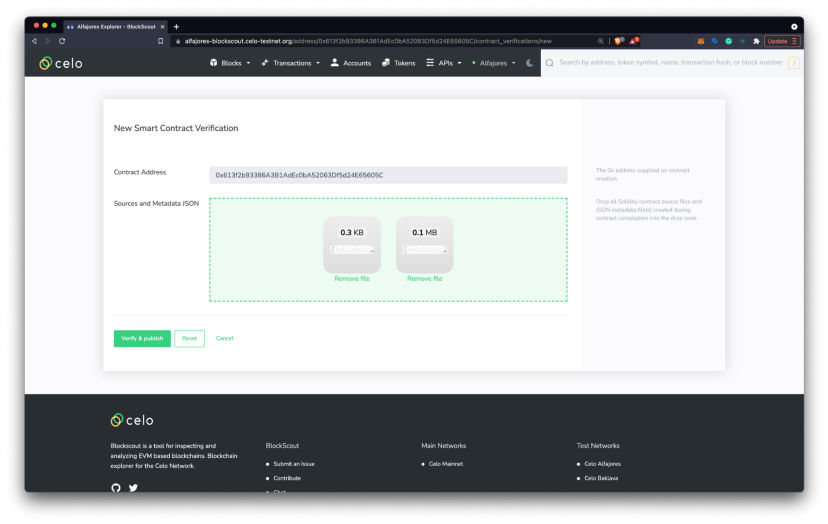

- Upload your smart contract (example: `HelloCelo.sol`) and its `.json` file (example: `HelloCelo.json`) found in `build > contracts folder`.

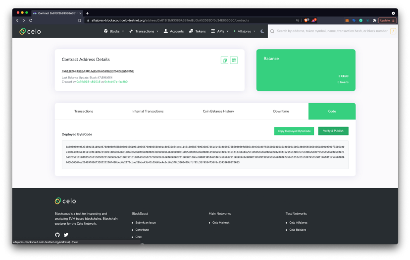

- Click `Verify & Publish`
- Navigate to the `Contract Address Details Page` in the block explorer to use the Code, Read Contract, and Write Contract panels to view and interact with your deployed smart contract.

## Congratulations 🎉

That wraps up today’s topic on _Deploying on Celo with Truffle_. You can review each of the items we covered below and check that you’re ready to apply these new skills.

_Here’s a review of what we covered 🤔_

- ✅ **Step 1:** Environment setup
- ✅ **Step 2:** Project setup
- ✅ **Step 3:** Write project code
- ✅ **Step 4:** Create and fund your account
- ✅ **Step 5:** Configure deployment settings
- ✅ **Step 6:** Compile and migrate your contract
- ✅ **Step 7:** Deploy your contract
- ✅ **Step 8:** View your deployed contract
- ✅ **Step 9:** Verify your smart contract

If you run into any issues, try reviewing the content or searching online to explore each topic in more detail. Hopefully, you’ve learned a few things about _Deploying on Celo with Truffle_ that you can apply in the real world.

GN! 👋
