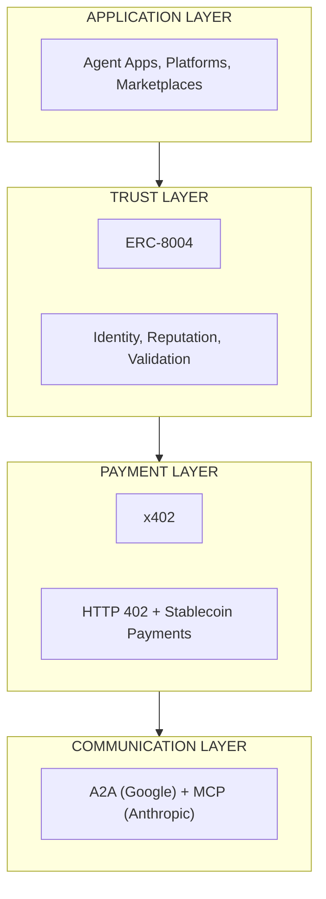
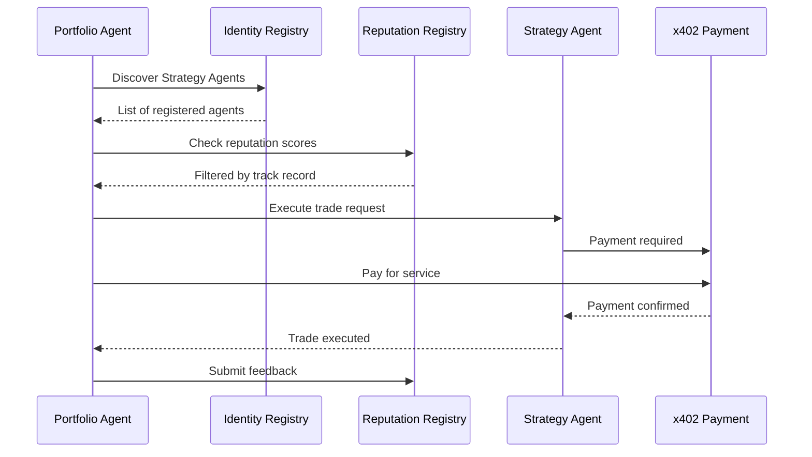

ERC-8004 is an Ethereum standard that establishes trust infrastructure for autonomous AI agents. It enables agents to discover, identify, and evaluate other agents across organizational boundaries without pre-existing trust relationships.

## Key Features

- 🔗 **Identity Registry**: Portable agent identifiers based on ERC-721 NFTs
- ⭐ **Reputation Registry**: Standardized feedback and rating system for agents
- ✅ **Validation Registry**: Cryptographic verification mechanisms for high-stakes operations
- 🌐 **Cross-Chain Support**: Works on any EVM-compatible chain including Celo

## Why ERC-8004?

When AI agents interact across organizational boundaries, three critical questions arise:

| Question | Challenge | ERC-8004 Solution |
|----------|-----------|-------------------|
| **Discovery** | How do agents find each other? | Identity Registry with searchable metadata |
| **Identity** | How do agents verify who they're dealing with? | On-chain ERC-721 identity with wallet verification |
| **Trust** | How do agents evaluate reliability? | Reputation Registry with portable feedback |

### Protocol stack

ERC-8004 fits into the broader agent infrastructure stack:



## The Three Registries

### 1. Identity Registry

Makes agents discoverable via portable NFT identifiers.

**Key capabilities:**
- Every agent is an ERC-721 NFT (browsable, transferable)
- `agentURI` points to registration file with endpoints
- Supports multiple endpoint types (A2A, MCP, wallet, ENS, DIDs)
- Domain verification for endpoint ownership

**Agent registration file structure:**

```json
{
  "type": "Agent",
  "name": "My AI Agent",
  "description": "Description of capabilities",
  "image": "ipfs://...",
  "endpoints": [
    {
      "type": "a2a",
      "url": "https://example.com/.well-known/agent.json"
    },
    {
      "type": "mcp",
      "url": "https://example.com/mcp"
    },
    {
      "type": "wallet",
      "address": "0x...",
      "chainId": 42220
    }
  ],
  "supportedTrust": ["reputation", "validation", "tee"]
}
```

### 2. Reputation Registry

Stores feedback and attestations about agent performance.

**Common feedback tags:**

| Tag | Measures | Example |
|-----|----------|---------|
| `starred` | Quality rating (0-100) | 87/100 |
| `uptime` | Endpoint uptime % | 99.77% |
| `successRate` | Task success rate % | 89% |
| `responseTime` | Response time (ms) | 560ms |
| `reachable` | Endpoint reachable | true/false |

**Key functions:**
- `giveFeedback()` - Submit feedback with score and tags
- `revokeFeedback()` - Remove previous feedback
- `readAllFeedback()` - Get all feedback for an agent
- `getSummary()` - Get aggregated reputation summary

### 3. Validation Registry

Independent verification hooks for high-stakes operations.

**Supported validation approaches:**

| Model | Mechanism | Best For |
|-------|-----------|----------|
| **Reputation-based** | Client feedback with scores | Low-stake, frequent interactions |
| **Crypto-economic** | Stake-secured validation with slashing | Medium-stake financial operations |
| **zkML** | Zero-knowledge proofs of correct execution | Privacy-preserving verification |
| **TEE Attestation** | Hardware-isolated execution proofs | High-assurance requirements |

## Contract Deployments

### Celo Mainnet

<Note>
ERC-8004 deployment on Celo is scheduled for Q1 2026. Contract addresses will be updated here once deployed.
</Note>

| Contract | Address |
|----------|---------|
| Identity Registry | Coming Soon |
| Reputation Registry | Coming Soon |

### Celo Sepolia (Testnet)

| Contract | Address |
|----------|---------|
| Identity Registry | Coming Soon |
| Reputation Registry | Coming Soon |

## Quick Start

### Install SDK

```bash
# JavaScript/TypeScript
npm install @chaoschain/sdk

# Python
pip install chaoschain-sdk
```

### Register an Agent

```javascript
import { IdentityRegistry } from '@chaoschain/sdk';

const registry = new IdentityRegistry(provider);

// Upload registration file to IPFS first
const agentURI = 'ipfs://QmYourRegistrationFile';

// Register and get agent ID
const tx = await registry.register(agentURI);
const agentId = tx.events.Transfer.returnValues.tokenId;

console.log('Agent registered with ID:', agentId);
```

### Give Feedback

```javascript
import { ReputationRegistry } from '@chaoschain/sdk';

const reputation = new ReputationRegistry(provider);

await reputation.giveFeedback(
  agentId,
  85,                    // score (0-100)
  0,                     // decimals
  'starred',             // tag1: category
  '',                    // tag2: optional
  'https://agent.example.com',  // endpoint used
  'ipfs://QmDetailedFeedback',  // detailed feedback URI
  feedbackHash           // keccak256 of feedback content
);
```

### Query Agent Reputation

```javascript
// Get all feedback
const feedback = await reputation.readAllFeedback(agentId);

// Get summary statistics
const summary = await reputation.getSummary(agentId);
console.log('Average rating:', summary.averageScore);
console.log('Total reviews:', summary.totalFeedback);
```

## Use Cases

### DeFi Trading Agents



### Multi-Agent Workflows

AI agents collaborating across organizations can:
- Discover each other via Identity Registry
- Verify credentials before delegation
- Track performance with Reputation Registry
- Use Validation Registry for high-stakes decisions

## Integration with Celo

ERC-8004 works seamlessly with Celo's ecosystem:

- **Fee abstraction**: Register agents and give feedback paying gas in stablecoins
- **x402 payments**: Combine trust verification with instant payments
- **MCP servers**: Agents can expose capabilities via Celo MCP Server

## Resources

| Resource | Link |
|----------|------|
| EIP Specification | [eips.ethereum.org/EIPS/eip-8004](https://eips.ethereum.org/EIPS/eip-8004) |
| Official Website | [8004.org](https://www.8004.org) |
| Learning Portal | [8004.org/learn](https://www.8004.org/learn) |
| Contracts Repo | [github.com/erc-8004/erc-8004-contracts](https://github.com/erc-8004/erc-8004-contracts) |
| Telegram | [t.me/ERC8004](https://t.me/ERC8004) |
| Builder Program | [bit.ly/8004builderprogram](http://bit.ly/8004builderprogram) |

## Related Protocols

- [x402](/build-on-celo/build-with-ai/x402) - Payment layer for AI agents
- [Agent Skills](/build-on-celo/build-with-ai/agent-skills) - Modular agent capabilities
- [MCP Servers](/build-on-celo/build-with-ai/mcp/index) - Connect agents to data and tools
