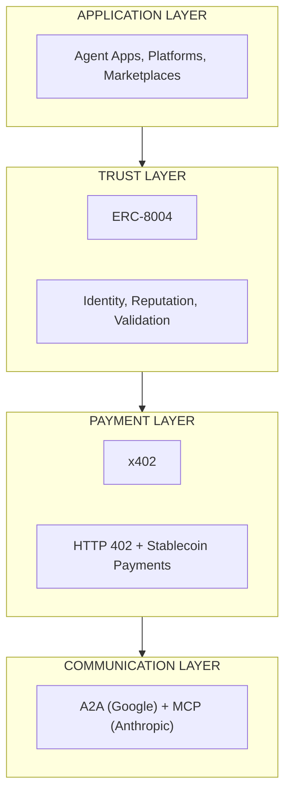
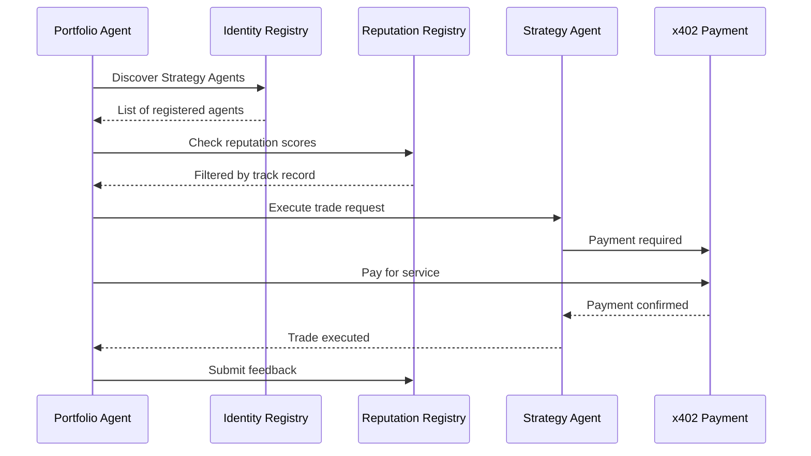

[ERC-8004](https://github.com/erc-8004/erc-8004-contracts/tree/master) is an Ethereum standard that establishes trust infrastructure for autonomous AI agents. It enables agents to discover, identify, and evaluate other agents across organizational boundaries without pre-existing trust relationships.

## Key Features

- **Identity Registry**: Portable agent identifiers based on ERC-721 NFTs
- **Reputation Registry**: Standardized feedback and rating system for agents
- **Validation Registry**: Independent verification hooks where third-party validators can attest to agent outputs—supporting stake-secured re-execution, zkML proofs, or TEE attestations for high-stakes operations
- **Cross-Chain Support**: Works on any EVM-compatible chain including Celo

## Why ERC-8004?

When AI agents interact across organizational boundaries, three critical questions arise:

- **Discovery**: How do agents find each other? The Identity Registry provides searchable metadata—agents query the registry to discover other agents by capabilities, endpoints, or domain.
- **Identity**: How do agents verify who they're dealing with? Each agent is an ERC-721 NFT with a cryptographically linked wallet, enabling verification that you're communicating with the authentic agent owner.
- **Trust**: How do agents evaluate reliability? The Reputation Registry stores feedback from every interaction, creating a portable track record that travels with the agent across platforms.

### Protocol stack

ERC-8004 fits into the broader agent infrastructure stack:


```mermaid
flowchart TB
    subgraph APP["APPLICATION LAYER"]
        A1["Agent Apps, Platforms, Marketplaces"]
    end

    subgraph TRUST["TRUST LAYER"]
        T1["ERC-8004"]
        T2["Identity, Reputation, Validation"]
    end

    subgraph PAY["PAYMENT LAYER"]
        P1["x402"]
        P2["HTTP 402 + Stablecoin Payments"]
    end

    subgraph COMM["COMMUNICATION LAYER"]
        C1["A2A (Google) + MCP (Anthropic)"]
    end

    APP --> TRUST
    TRUST --> PAY
    PAY --> COMM
```

## The Three Registries

### 1. Identity Registry

Makes agents discoverable via portable NFT identifiers.

**Key capabilities:**
- Every agent **identity** is represented as an ERC-721 NFT—the agent itself runs off-chain, but its on-chain identity is an NFT that's browsable in wallets, transferable between owners, and queryable by smart contracts
- `agentURI` points to a registration file listing the service endpoints — see [Register a service](#register-a-service)
- Endpoint types are customizable — `web`, `A2A`, `MCP`, `OASF`, `ENS`, `DID`, `email` and `wallet` are examples, not a closed list
- `register()` sets the agent's wallet to the address that sent the transaction; transferring the NFT clears it. `setAgentWallet()` changes it later, with a signature from the new wallet
- Domain verification for endpoint ownership

### 2. Reputation Registry

Stores feedback and attestations about agent performance. Feedback is submitted on-chain by any address that has interacted with the agent—this includes users who hired the agent, other agents that collaborated with it, or monitoring services that track uptime and responsiveness. The contract prevents agents from rating themselves (owner and operator addresses are blocked from submitting feedback on their own agent).

**Common feedback tags:**

| Tag | Measures | Example |
|-----|----------|---------|
| `starred` | Quality rating (0-100) | 87/100 |
| `uptime` | Endpoint uptime % | 99.77% |
| `successRate` | Task success rate % | 89% |
| `responseTime` | Response time (ms) | 560ms |
| `reachable` | Endpoint reachable | true/false |

**Key functions:**
- `giveFeedback()` - Submit feedback with score and tags
- `revokeFeedback()` - Remove previous feedback
- `readAllFeedback()` - Get all feedback for an agent
- `getSummary()` - Get aggregated reputation summary

### 3. Validation Registry

Independent verification hooks for high-stakes operations.

**Supported validation approaches:**

| Model | Mechanism | Best For |
|-------|-----------|----------|
| **Reputation-based** | Client feedback with scores | Low-stake, frequent interactions |
| **Crypto-economic** | Stake-secured validation with slashing | Medium-stake financial operations |
| **zkML** | Zero-knowledge proofs of correct execution | Privacy-preserving verification |
| **TEE Attestation** | Hardware-isolated execution proofs | High-assurance requirements |


Check out the [repository](https://github.com/erc-8004/erc-8004-contracts/tree/master) of the ERC-8004 protocol for agent discovery and trust through reputation and validation.


## Contract Deployments

### Celo Mainnet

| Contract | Address |
|----------|---------|
| Identity Registry |  0x8004A169FB4a3325136EB29fA0ceB6D2e539a432 |
| Reputation Registry |  0x8004BAa17C55a88189AE136b182e5fdA19dE9b63 |

### Celo Sepolia (Testnet)

| Contract | Address |
|----------|---------|
| Identity Registry | 0x8004A818BFB912233c491871b3d84c89A494BD9e |
| Reputation Registry | 0x8004B663056A597Dffe9eCcC1965A193B7388713 |

## Quick Start

### Register a service

An identity is not limited to an autonomous agent that acts on its own. Any callable service — an HTTP API, an [MCP server](/build-on-celo/build-with-ai/mcp/index), a bot — can hold one. The service itself needs no on-chain logic: what it gets is a record agents can find and rate, with endpoints in the Identity Registry and feedback in the Reputation Registry.

<Warning>
  **The address you register from becomes the agent's advertised wallet.** Every `register()` overload writes `agentWallet = msg.sender` and mints the NFT to that address, so whatever key signs this transaction is published as the agent's payment address. Use the key you actually want paid, not a throwaway ops key. `setAgentWallet()` changes it afterwards, but that needs a signature from the new wallet, so it is not a way to undo a mistake quietly. Transferring the agent NFT clears `agentWallet` outright.
</Warning>

The registration file is JSON you host anywhere an agent can fetch it — an HTTPS URL, IPFS, or a `data:` URI stored on-chain. `services` lists the endpoints you want callers to use. The names below are examples rather than a fixed set — the spec leaves the number and type of endpoints to you, and `wallet` entries for other chains are common. Set `x402Support` to `true` if those endpoints accept [x402](/build-on-celo/build-with-ai/x402) payments.

```json
{
  "type": "https://eips.ethereum.org/EIPS/eip-8004#registration-v1",
  "name": "Example Rates API",
  "description": "FX rates for Mento stablecoins, priced per request",
  "image": "https://example.com/logo.png",
  "services": [
    {
      "name": "web",
      "endpoint": "https://example.com"
    },
    {
      "name": "MCP",
      "endpoint": "https://example.com/mcp",
      "version": "2025-06-18"
    },
    {
      "name": "A2A",
      "endpoint": "https://example.com/.well-known/agent-card.json",
      "version": "0.3.0"
    }
  ],
  "x402Support": true,
  "active": true,
  "supportedTrust": ["reputation"],
  "registrations": [
    {
      "agentId": 12345,
      "agentRegistry": "eip155:42220:0x8004A169FB4a3325136EB29fA0ceB6D2e539a432"
    }
  ]
}
```

`registrations` is what lets a caller check that the file and the on-chain entry agree, which is the cross-domain verification described above. You only learn the agent ID once the registration is mined, so the order is: publish the file without `registrations`, register, then update the file with the ID it returned.

Then point the registry at that file. Read the agent ID from the `Registered` event on the receipt — the value `register()` returns is `_lastId` at simulation time, so anyone else registering first makes it wrong:

```ts
import {
  createPublicClient,
  createWalletClient,
  http,
  parseAbi,
  parseEventLogs,
} from 'viem';
import { privateKeyToAccount } from 'viem/accounts';
import { celo } from 'viem/chains';

// Celo mainnet (42220), Identity Registry
const identityRegistry = '0x8004A169FB4a3325136EB29fA0ceB6D2e539a432';
const abi = parseAbi([
  'function register(string agentURI) returns (uint256 agentId)',
  'event Registered(uint256 indexed agentId, string agentURI, address indexed owner)',
]);

// This key's address is minted the NFT and published as the agent's wallet
const account = privateKeyToAccount(process.env.PRIVATE_KEY as `0x${string}`);
const publicClient = createPublicClient({ chain: celo, transport: http() });
const walletClient = createWalletClient({
  account,
  chain: celo,
  transport: http(),
});

const { request } = await publicClient.simulateContract({
  account,
  address: identityRegistry,
  abi,
  functionName: 'register',
  args: ['https://example.com/.well-known/agent-registration.json'],
});

const hash = await walletClient.writeContract({
  ...request,
  // Celo mainnet (42220), USDC fee-currency adapter. USDC has 6 decimals, so
  // feeCurrency takes the adapter address, not the token address. Omit this
  // field to pay gas in CELO.
  feeCurrency: '0x2F25deB3848C207fc8E0c34035B3Ba7fC157602B',
});

const receipt = await publicClient.waitForTransactionReceipt({ hash });
const [registered] = parseEventLogs({ abi, eventName: 'Registered', logs: receipt.logs });
console.log('Registered as agent', registered.args.agentId);
```

Swap in a new file later with `setAgentURI(agentId, newURI)`, and set `"active": false` in the file when you retire the service. Gas for either call can be paid in a stablecoin — see [fee abstraction](/build-on-celo/fee-abstraction/overview).

### Install SDK

The feedback examples below use the ERC-8004 SDK, which wraps the registries for TypeScript/JavaScript and Python:

```bash
# JavaScript/TypeScript
npm install @chaoschain/sdk

# Python
pip install chaoschain-sdk
```

### Give Feedback

After interacting with an agent, submit feedback to the Reputation Registry. Each feedback entry includes a score, category tag (like "starred" for quality or "uptime" for availability), and an optional link to detailed off-chain feedback data:

```javascript
import { ReputationRegistry } from '@chaoschain/sdk';

const reputation = new ReputationRegistry(provider);

await reputation.giveFeedback(
  agentId,
  85,                    // score (0-100)
  0,                     // decimals
  'starred',             // tag1: category
  '',                    // tag2: optional
  'https://agent.example.com',  // endpoint used
  'ipfs://QmDetailedFeedback',  // detailed feedback URI
  feedbackHash           // keccak256 of feedback content
);
```

### Query Agent Reputation

Before delegating tasks to an agent, check its reputation. You can retrieve all individual feedback entries or get aggregated statistics:

```javascript
// Get all feedback
const feedback = await reputation.readAllFeedback(agentId);

// Get summary statistics
const summary = await reputation.getSummary(agentId);
console.log('Average rating:', summary.averageScore);
console.log('Total reviews:', summary.totalFeedback);
```

## Use Cases

### DeFi Trading Agents

This diagram shows a typical agent-to-agent interaction flow. A portfolio management agent needs to execute a trade, so it:
1. Queries the Identity Registry to discover available strategy agents
2. Filters candidates using the Reputation Registry (checking track records, success rates)
3. Selects an agent and requests a trade
4. Pays for the service via x402 (HTTP-native payments)
5. After the trade completes, submits feedback to build the strategy agent's reputation


```mermaid
sequenceDiagram
    participant PA as Portfolio Agent
    participant IR as Identity Registry
    participant RR as Reputation Registry
    participant SA as Strategy Agent
    participant x402 as x402 Payment

    PA->>IR: Discover Strategy Agents
    IR-->>PA: List of registered agents
    PA->>RR: Check reputation scores
    RR-->>PA: Filtered by track record
    PA->>SA: Execute trade request
    SA->>x402: Payment required
    PA->>x402: Pay for service
    x402-->>SA: Payment confirmed
    SA-->>PA: Trade executed
    PA->>RR: Submit feedback
```

### Multi-Agent Workflows

AI agents collaborating across organizations can:
- Discover each other via Identity Registry
- Verify credentials before delegation
- Track performance with Reputation Registry
- Use Validation Registry for high-stakes decisions

## Integration with Celo

ERC-8004 works seamlessly with Celo's ecosystem:

- **Fee abstraction**: Register agents and give feedback paying gas in stablecoins
- **x402 payments**: Combine trust verification with instant payments
- **MCP servers**: Agents can expose capabilities via Celo MCP Server
- **Self Agent ID**: A deployment of all three ERC-8004 registries on Celo that adds a zero-knowledge proof-of-human to each agent identity — see [Self Agent ID](/build-on-celo/build-with-ai/self-agent-id)

## Resources

| Resource | Link |
|----------|------|
| EIP Specification | [eips.ethereum.org/EIPS/eip-8004](https://eips.ethereum.org/EIPS/eip-8004) |
| Official Website | [8004.org](https://www.8004.org) |
| Learning Portal | [8004.org/learn](https://www.8004.org/learn) |
| Contracts Repo | [github.com/erc-8004/erc-8004-contracts](https://github.com/erc-8004/erc-8004-contracts) |
| Telegram | [t.me/ERC8004](https://t.me/ERC8004) |
| Builder Program | [bit.ly/8004builderprogram](http://bit.ly/8004builderprogram) |

## Related Protocols

- [Self Agent ID](/build-on-celo/build-with-ai/self-agent-id) - ERC-8004 registries with proof-of-human, live on Celo
- [x402](/build-on-celo/build-with-ai/x402) - Payment layer for AI agents
- [MPP](/build-on-celo/build-with-ai/mpp) - Machine Payments Protocol: charge USDC per request over HTTP
- [Celopedia](/build-on-celo/build-with-ai/celopedia) - Celo ecosystem knowledge for coding assistants
- [MCP Servers](/build-on-celo/build-with-ai/mcp/index) - Connect agents to data and tools
