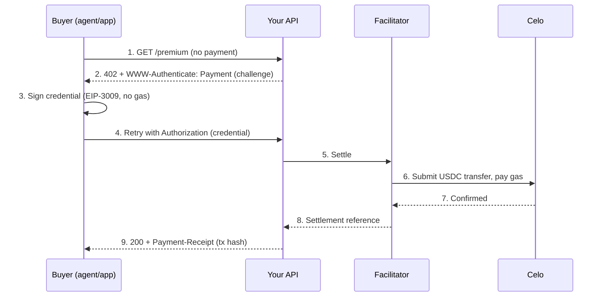

The **Machine Payments Protocol (MPP)** is an open standard for HTTP-native payments — it gives meaning to the HTTP `402 Payment Required` status code so that agents, apps, and services can pay each other for API access in a single request, with no accounts, invoices, or checkout flows.

On Celo, MPP lets any service charge **USDC** per request. The buyer pays **no gas** — settlement is handled on-chain by a hosted facilitator.

## How it works

A request with no payment gets a `402` carrying an MPP **Challenge**. The buyer signs a **Credential** and retries; the server settles the payment on Celo and returns a **Receipt** with the on-chain transaction.



USDC moves buyer → seller directly inside the token contract. The facilitator
submits the transaction and pays the gas; it never custodies funds.

## Prerequisites

Settlement runs through a hosted facilitator that charges a small credit per
transaction. Get an API key (a human does this once):

1. Open [x402.celo.org](https://x402.celo.org) and connect an EVM wallet.
2. Click **Create API key** and sign the message (no gas, no transaction).
3. Copy the key (shown once) — it looks like `x402_...`.
4. Set it as `X402_API_KEY` in your project.

New accounts start with free testnet and mainnet credits. Develop on **Celo
Sepolia** first.

## Build with MPP

Install the [`mppx`](https://www.npmjs.com/package/mppx) SDK.

```bash
npm i mppx @hono/node-server hono viem
```

### Seller — charge for your API

Configure MPP with one payment method — a one-time EVM charge on Celo — and
settle through the Celo facilitator. Passing the known asset
(`assets.celoSepolia.USDC`) lets `mppx` infer the chain id, decimals, and EIP-712
domain for you.

```ts
import { serve } from "@hono/node-server";
import { Hono } from "hono";
import { Mppx } from "mppx/server";
import { evm, assets } from "mppx/evm/server";

// Attach the facilitator API key to every settlement request.
const apiKeyFetch: typeof fetch = (input, init = {}) => {
  const headers = new Headers(init.headers);
  headers.set("X-API-Key", process.env.X402_API_KEY!);
  return fetch(input, { ...init, headers });
};

const mppx = Mppx.create({
  methods: [
    evm.charge({
      currency: assets.celoSepolia.USDC, // Celo Sepolia (mainnet: assets.celo.USDC)
      recipient: process.env.SELLER_PAY_TO as `0x${string}`, // your receiving wallet
      x402: {
        facilitator: "https://api.x402.sepolia.celo.org", // mainnet: https://api.x402.celo.org
        fetch: apiKeyFetch,
      },
    }),
  ],
  secretKey: process.env.MPP_SECRET_KEY!, // openssl rand -base64 32
});

const app = new Hono();
app.get("/premium", async (c) => {
  const result = await mppx.charge({ amount: "0.01" })(c.req.raw); // $0.01
  if (result.status === 402) return result.challenge;
  return result.withReceipt(Response.json({ data: "this response cost $0.01" }));
});

serve({ fetch: app.fetch, port: 3402 });
```

### Buyer — pay automatically

The `mppx` client patches `fetch` to answer MPP challenges automatically. The
buyer needs a wallet funded with USDC and **no** native gas.

```ts
import { privateKeyToAccount } from "viem/accounts";
import { Mppx } from "mppx/client";
import { evm } from "mppx/evm/client";

const account = privateKeyToAccount(process.env.BUYER_PRIVATE_KEY as `0x${string}`);

Mppx.create({
  methods: [
    evm.charge({
      account,
      networks: [11142220], // Celo Sepolia (mainnet: 42220)
      currencies: ["0x01C5C0122039549AD1493B8220cABEdD739BC44E"], // Celo Sepolia USDC
      decimals: 6,
      authorization: { name: "USDC", version: "2" }, // Celo USDC EIP-712 domain
      maxAmount: "1", // never pay more than 1 USDC per request
    }),
  ],
});

// Global fetch now pays MPP-gated endpoints automatically.
const res = await fetch("http://localhost:3402/premium");
console.log(res.status, await res.json()); // 200, your paid content
```

<Note>
  On the **buyer** side you must supply the token `decimals` and its EIP-712
  `authorization` (`{ name, version }`) — the client builds the payment
  credential locally and does not read these from the server's challenge. For
  Celo USDC the domain is `name: "USDC"`, `version: "2"`.
</Note>

## Example project

A complete, runnable seller + buyer you can clone and run in minutes — verified
end-to-end on Celo testnet and mainnet:

<Card title="celo-org/mpp-celo-example" icon="github" href="https://github.com/celo-org/mpp-celo-example">
  Minimal MPP example on Celo — a paid API and a client that pays it.
</Card>

```bash
git clone https://github.com/celo-org/mpp-celo-example
cd mpp-celo-example
npm install
cp .env.example .env   # add MPP_SECRET_KEY, X402_API_KEY, SELLER_PAY_TO, BUYER_PRIVATE_KEY
npm run seller         # terminal 1
npm run buyer          # terminal 2 — pays and prints the settlement tx
```

## Supported assets on Celo

| Token | Network | Address |
|-------|---------|---------|
| USDC | Celo mainnet | `0xcebA9300f2b948710d2653dD7B07f33A8B32118C` |
| USDC | Celo Sepolia | `0x01C5C0122039549AD1493B8220cABEdD739BC44E` |

Both are 6-decimal and support gasless EIP-3009 transfers.

## Resources

- MPP protocol: [mpp.dev](https://mpp.dev)
- `mppx` SDK: [npmjs.com/package/mppx](https://www.npmjs.com/package/mppx)
- Facilitator dashboard (API key + credits): [x402.celo.org](https://x402.celo.org)
- Example repo: [celo-org/mpp-celo-example](https://github.com/celo-org/mpp-celo-example)
