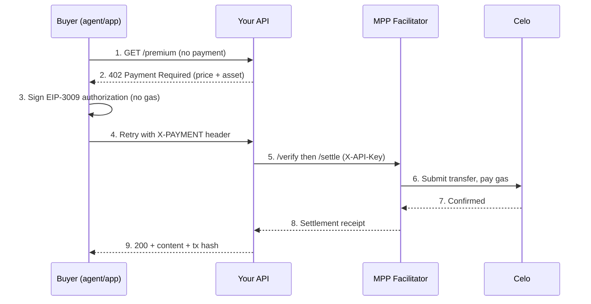

**MPP** (Machine Payments Protocol) is Celo's hosted [x402](/build-on-celo/build-with-ai/x402) payment facilitator. It lets any web service charge stablecoins per request — and any agent or app pay for them — using a single HTTP round-trip, with **no gas for the buyer** and no accounts, invoices, or API contracts.

It runs at **[x402.celo.org](https://x402.celo.org)** and settles **USDC and USDT** on Celo via EIP-3009 gasless transfers.

<Note>
  This page covers the **Celo-native hosted facilitator**. For the thirdweb-hosted alternative and a protocol-level overview of x402 itself, see [x402: Agent Payments](/build-on-celo/build-with-ai/x402).
</Note>

## What is MPP?

x402 activates the dormant HTTP `402 Payment Required` status code: a server answers a request with a machine-readable price, the client signs a stablecoin payment, and a **facilitator** verifies the signature and settles it on-chain. MPP is the facilitator, hosted for you on Celo, so you don't have to run signing infrastructure or hold gas yourself.

- **You are the seller** — return `402` from your API and get paid in USDC/USDT.
- **You are the buyer** — wrap `fetch` and pay for x402-protected endpoints automatically.

The facilitator **never custodies funds**: `transferWithAuthorization` moves tokens directly from payer to payee inside the token contract. It only pays the settlement gas.

## Why MPP on Celo

| | Traditional payments | MPP on Celo |
|---|---|---|
| Settlement | 2–7 days | Sub-second |
| Fees | 2–3% + $0.30 | ~$0.001 gas (paid by the facilitator) |
| Minimum payment | $0.50+ | Fractions of a cent |
| Buyer needs gas | — | No (facilitator sponsors it) |
| Accounts / API contracts | Required | None |
| Agent support | Not possible | Native |

## How it works



USDC moves buyer → seller directly; the buyer pays no gas.

## Prerequisites

The facilitator is metered — each on-chain settlement spends one prepaid credit. Get a key (a human does this once):

1. Open **[x402.celo.org](https://x402.celo.org)** and connect an EVM wallet.
2. Click **Create API key** and sign the message (no gas, no transaction).
3. Copy the key (shown once) — it looks like `x402_...`.
4. Set it as `X402_API_KEY` in your project.

New accounts start with free testnet + mainnet credits. Develop on **Celo Sepolia** first.

## Build with MPP

Install the official x402 **v2** packages and point the facilitator client at Celo.

```bash
npm i @x402/hono @x402/core @x402/evm @x402/fetch viem
```

### Facilitator client (attaches your API key)

```ts
// facilitator.ts
import { HTTPFacilitatorClient } from "@x402/core/server";

const FACILITATOR_URL =
  process.env.X402_NETWORK === "mainnet"
    ? "https://api.x402.celo.org"
    : "https://api.x402.sepolia.celo.org";

export const facilitator = new HTTPFacilitatorClient({
  url: FACILITATOR_URL,
  createAuthHeaders: async () => {
    const h = { "X-API-Key": process.env.X402_API_KEY! };
    return { verify: h, settle: h, supported: h };
  },
});
```

### Seller — charge for your API

```ts
// seller.ts
import { Hono } from "hono";
import { serve } from "@hono/node-server";
import { paymentMiddleware, x402ResourceServer } from "@x402/hono";
import { ExactEvmScheme } from "@x402/evm/exact/server";
import { getAddress } from "viem";
import { facilitator } from "./facilitator";

const NETWORK = "eip155:11142220"; // Celo Sepolia (mainnet: eip155:42220)
const USDC = getAddress("0x01C5C0122039549AD1493B8220cABEdD739BC44E"); // Sepolia USDC

const server = new x402ResourceServer(facilitator);
server.register("eip155:*", new ExactEvmScheme());

const routes = {
  "GET /premium": {
    accepts: [
      {
        scheme: "exact",
        network: NETWORK,
        payTo: getAddress(process.env.SELLER_PAY_TO!), // your receiving wallet
        price: {
          amount: "10000",                        // $0.01 in USDC base units (6 decimals)
          asset: USDC,
          extra: { name: "USDC", version: "2" },  // EIP-712 domain for EIP-3009
        },
      },
    ],
    description: "Premium content",
  },
};

const app = new Hono();
app.use(paymentMiddleware(routes, server));       // routes FIRST, then server
app.get("/premium", (c) => c.json({ data: "this response cost $0.01" }));

serve({ fetch: app.fetch, port: 3000 });
```

<Warning>
  On Celo, **name the asset explicitly** in the price (`{ amount, asset, extra: { name, version } }`). A bare `price: "$0.01"` type-checks but 500s at request time, because Celo is not yet in the x402 packages' default-asset table. (Tracked in [coinbase/x402#244](https://github.com/coinbase/x402/pull/244) — once merged, dollar-string pricing works on Celo too.)
</Warning>

### Buyer — pay automatically

The `@x402/fetch` client handles the whole `402 → sign → retry` loop. The buyer needs a wallet with USDC but **no** native gas and **no** API key.

```ts
// buyer.ts
import { x402Client, wrapFetchWithPayment } from "@x402/fetch";
import { ExactEvmScheme } from "@x402/evm/exact/client";
import { privateKeyToAccount } from "viem/accounts";

const account = privateKeyToAccount(process.env.BUYER_PRIVATE_KEY as `0x${string}`);

const client = new x402Client();
client.register("eip155:*", new ExactEvmScheme(account));
const payFetch = wrapFetchWithPayment(fetch, client);

const res = await payFetch("http://localhost:3000/premium");
console.log(res.status, await res.json()); // 200, your paid content
```

A successful call moves USDC on-chain and returns a `payment-response` header with the settlement tx hash.

## Example project

A complete, runnable seller + buyer you can clone and run in minutes:

<Card title="celo-org/mpp-celo-example" icon="github" href="https://github.com/celo-org/mpp-celo-example">
  Minimal end-to-end MPP example on Celo — a paid API and a client that pays it, verified on Celo Sepolia.
</Card>

```bash
git clone https://github.com/celo-org/mpp-celo-example
cd mpp-celo-example
npm install
cp .env.example .env   # add X402_API_KEY, SELLER_PAY_TO, BUYER_PRIVATE_KEY
npm run seller         # terminal 1
npm run buyer          # terminal 2 — pays and prints the settlement tx
```

## Supported tokens

| Token | Network | Address | EIP-712 domain |
|-------|---------|---------|----------------|
| USDC | Celo mainnet | `0xcebA9300f2b948710d2653dD7B07f33A8B32118C` | `name: "USDC"`, `version: "2"` |
| USDT | Celo mainnet | `0x48065fbBE25f71C9282ddf5e1cD6D6A887483D5e` | `name: "Tether USD"`, `version: "1"` |
| USDC | Celo Sepolia | `0x01C5C0122039549AD1493B8220cABEdD739BC44E` | `name: "USDC"`, `version: "2"` |

All are 6-decimal and support EIP-3009. cUSD is **not** supported (it implements EIP-2612 `permit`, not EIP-3009).

## Start building with the skill

<Card title="Use the MPP integration skill" icon="robot" href="https://x402.celo.org/skill.md">
  <strong>x402.celo.org/skill.md</strong> is an agent-ready skill that walks your AI coding assistant through adding MPP payments end-to-end — seller and buyer flows, the Celo-specific gotchas, and how to get testnet funds. Point Claude Code, Cursor, or any skill-aware agent at it and say "add x402 payments on Celo."
</Card>

## Resources

- Integration skill / guide: [x402.celo.org/skill.md](https://x402.celo.org/skill.md)
- Dashboard (API key + credits): [x402.celo.org](https://x402.celo.org)
- Example repo: [celo-org/mpp-celo-example](https://github.com/celo-org/mpp-celo-example)
- Protocol overview: [x402: Agent Payments](/build-on-celo/build-with-ai/x402)
- x402 spec & packages: [github.com/coinbase/x402](https://github.com/coinbase/x402)
