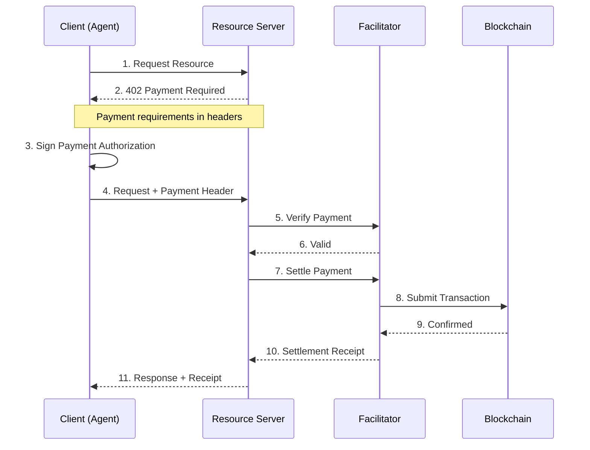

x402 is an open protocol for internet-native payments that activates the HTTP 402 "Payment Required" status code. It enables AI agents and applications to make instant, permissionless micropayments using stablecoins.

## Key Features

- 💸 **HTTP-Native**: Built into existing HTTP requests with no additional communication required
- ⚡ **Instant Settlement**: Sub-second on Celo, compared to days with traditional payments
- 🆓 **Zero Protocol Fees**: Only pay nominal blockchain gas fees
- 🤖 **Agent-First**: Designed for autonomous AI agent transactions
- 🌐 **Chain Agnostic**: Supports 170+ EVM chains including Celo

## Why x402?

Traditional payment systems don't work for AI agents and micropayments:

| Challenge | Traditional Payments | x402 |
|-----------|---------------------|------|
| Setup Time | Days to weeks | Minutes |
| Settlement | 2-7 days | Sub-second on Celo |
| Fees | 2-3% + $0.30 fixed | ~$0.001 gas |
| Minimum Payment | $0.50+ | $0.001 |
| Account Required | Yes | No |
| API Keys | Required | Not needed |
| Chargebacks | Yes (120 days) | No |
| AI Agent Support | Not possible | Native |

## How It Works



**Step-by-step:**

1. **Client requests resource** - AI agent or app sends HTTP request to API
2. **Server returns 402** - If no payment attached, server responds with `HTTP 402 Payment Required` and payment details in headers
3. **Client signs payment** - Client signs payment authorization using their wallet
4. **Client retries with payment** - Request sent again with `X-PAYMENT` header
5. **Server verifies and settles** - Payment is verified and settled on-chain
6. **Server delivers resource** - Requested content returned with payment receipt

## Using thirdweb SDK

[thirdweb](https://thirdweb.com) provides a complete x402 implementation that supports Celo and 170+ EVM chains. The SDK handles wallet connection, payment signing, and error handling automatically.

### Client Side (React)

Use the `useFetchWithPayment` hook for automatic payment handling:

```typescript
import { useFetchWithPayment } from "thirdweb/react";
import { createThirdwebClient } from "thirdweb";

const client = createThirdwebClient({ clientId: "your-client-id" });

function PaidAPIComponent() {
  const { fetchWithPayment, isPending } = useFetchWithPayment(client);

  const handleApiCall = async () => {
    // Automatically handles:
    // - Wallet connection prompts
    // - Payment signing
    // - Insufficient funds UI
    // - Retry logic
    const data = await fetchWithPayment(
      "https://api.example.com/paid-endpoint"
    );
    console.log(data);
  };

  return (
    <button onClick={handleApiCall} disabled={isPending}>
      {isPending ? "Processing..." : "Access Premium Content"}
    </button>
  );
}
```

### Client Side (TypeScript)

For non-React applications, use `wrapFetchWithPayment`:

```typescript
import { wrapFetchWithPayment } from "thirdweb/x402";
import { createThirdwebClient } from "thirdweb";
import { privateKeyToAccount } from "thirdweb/wallets";

const client = createThirdwebClient({ clientId: "your-client-id" });
const account = privateKeyToAccount({ client, privateKey: "0x..." });

const fetchWithPayment = wrapFetchWithPayment({
  client,
  account,
  paymentOptions: {
    maxValue: "1000000", // Max payment in base units
  },
});

// Use like regular fetch - payments handled automatically
const response = await fetchWithPayment("https://api.example.com/premium");
const data = await response.json();
```

### Server Side (Next.js)

Accept x402 payments in your API endpoints:

```typescript
// app/api/premium-content/route.ts
import { settlePayment, facilitator } from "thirdweb/x402";
import { createThirdwebClient } from "thirdweb";
import { celo } from "thirdweb/chains";

const client = createThirdwebClient({
  secretKey: process.env.THIRDWEB_SECRET_KEY,
});

const thirdwebFacilitator = facilitator({
  client,
  serverWalletAddress: "0xYourServerWalletAddress",
});

export async function GET(request: Request) {
  const paymentData =
    request.headers.get("PAYMENT-SIGNATURE") ||
    request.headers.get("X-PAYMENT");

  const result = await settlePayment({
    resourceUrl: "https://your-api.com/premium-content",
    method: "GET",
    paymentData,
    payTo: "0xYourWalletAddress",
    network: celo, // Use Celo chain
    price: "$0.01", // Price in USD
    facilitator: thirdwebFacilitator,
    routeConfig: {
      description: "Access to premium API content",
      mimeType: "application/json",
    },
  });

  if (result.status === 200) {
    return Response.json({ data: "premium content" });
  } else {
    return Response.json(result.responseBody, {
      status: result.status,
      headers: result.responseHeaders,
    });
  }
}
```

### Server Side (Express)

```typescript
import express from "express";
import { settlePayment, facilitator } from "thirdweb/x402";
import { createThirdwebClient } from "thirdweb";
import { celo } from "thirdweb/chains";

const app = express();

const client = createThirdwebClient({
  secretKey: process.env.THIRDWEB_SECRET_KEY,
});

const thirdwebFacilitator = facilitator({
  client,
  serverWalletAddress: "0xYourServerWalletAddress",
});

app.get("/api/premium", async (req, res) => {
  const paymentData = req.headers["payment-signature"] || req.headers["x-payment"];

  const result = await settlePayment({
    resourceUrl: `${req.protocol}://${req.get("host")}${req.originalUrl}`,
    method: "GET",
    paymentData,
    payTo: "0xYourWalletAddress",
    network: celo,
    price: "$0.05",
    facilitator: thirdwebFacilitator,
  });

  if (result.status === 200) {
    res.json({ data: "premium content" });
  } else {
    res.status(result.status).set(result.responseHeaders).json(result.responseBody);
  }
});
```

## x402 on Celo

Celo is an ideal network for x402 due to:

- **Low fees**: Gas costs under $0.001 per transaction
- **Fast finality**: ~1 second block times
- **Stablecoin support**: Native USDC, USDT, USDm for predictable pricing
- **Fee abstraction**: Users can pay gas in stablecoins

### Supported Payment Tokens on Celo

The thirdweb facilitator supports tokens with ERC-2612 permit or ERC-3009 authorization:

| Token | Address | Decimals |
|-------|---------|----------|
| USDC | `0xcebA9300f2b948710d2653dD7B07f33A8B32118C` | 6 |
| USDT | `0x48065fbbe25f71c9282ddf5e1cd6d6a887483d5e` | 6 |
| USDm | `0x765DE816845861e75A25fCA122bb6898B8B1282a` | 18 |

### Celo Configuration

```typescript
import { celo, celoSepolia } from "thirdweb/chains";

// Mainnet
const mainnetConfig = {
  network: celo,
  price: "$0.01",
};

// Testnet (Sepolia)
const testnetConfig = {
  network: celoSepolia,
  price: "$0.01",
};
```

## Use Cases

### AI Agent API Access

```typescript
// AI agent paying for API calls autonomously
const agent = {
  wallet: agentWallet,
  fetchWithPayment: wrapFetchWithPayment({ client, account: agentWallet }),
};

// Agent pays per API call - no API keys needed
const marketData = await agent.fetchWithPayment("https://api.market.com/prices");
const analysis = await agent.fetchWithPayment("https://api.ai.com/analyze");
```

### Pay-Per-Use AI Inference

```typescript
// Server: Charge based on actual token usage with "upto" scheme
const result = await settlePayment({
  resourceUrl: request.url,
  method: "POST",
  paymentData,
  payTo: "0xYourWallet",
  network: celo,
  scheme: "upto",           // Dynamic pricing
  price: "$1.00",           // Maximum amount
  minPrice: "$0.01",        // Minimum amount
  facilitator: thirdwebFacilitator,
});

// Verify first, then charge based on actual usage
const { tokens } = await runAIInference(prompt);
const actualPrice = tokens * 0.0001; // $0.0001 per token

await settlePayment({
  ...paymentArgs,
  price: actualPrice,
});
```

### Micropayments for Content

```typescript
// Pay-per-article instead of subscriptions
app.get("/articles/:id", async (req, res) => {
  const result = await settlePayment({
    resourceUrl: req.url,
    method: "GET",
    paymentData: req.headers["x-payment"],
    payTo: publisherWallet,
    network: celo,
    price: "$0.10",
    facilitator: thirdwebFacilitator,
    routeConfig: {
      description: "Premium article access",
    },
  });
  // ...
});
```


## Resources

| Resource | Link |
|----------|------|
| x402 Official Website | [x402.org](https://www.x402.org) |
| thirdweb x402 Docs | [portal.thirdweb.com/x402](https://portal.thirdweb.com/x402) |
| thirdweb Playground | [playground.thirdweb.com/x402](https://playground.thirdweb.com/x402) |
| GitHub | [github.com/coinbase/x402](https://github.com/coinbase/x402) |
| Whitepaper | [x402.org/x402-whitepaper.pdf](https://www.x402.org/x402-whitepaper.pdf) |

## Related

- [ERC-8004](/build-on-celo/build-with-ai/8004) - Trust layer for AI agents
- [Agent Skills](/build-on-celo/build-with-ai/agent-skills) - Modular agent capabilities
- [Fee Abstraction](/build-on-celo/fee-currency) - Pay gas with stablecoins on Celo
