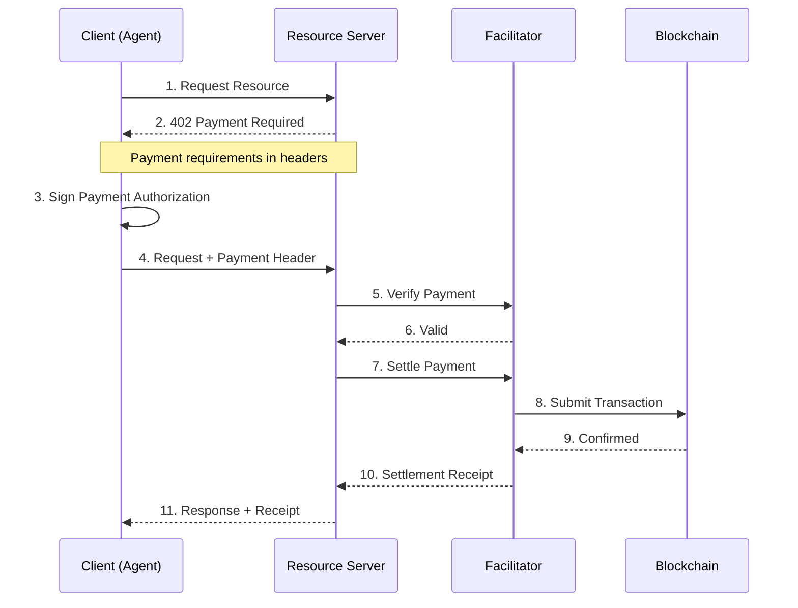

x402 is an open protocol for internet-native payments that activates the HTTP 402 "Payment Required" status code. It enables AI agents and applications to make instant, permissionless micropayments using stablecoins.

## Key Features

- **HTTP-Native**: Built into existing HTTP requests with no additional communication required
- **Instant Settlement**: Sub-second on Celo, compared to days with traditional payments
- **Zero Protocol Fees**: Only pay nominal blockchain gas fees
- **Agent-First**: Designed for autonomous AI agent transactions
- **Chain Agnostic**: Supports 170+ EVM chains including Celo

## Why x402?

Traditional payment systems don't work for AI agents and micropayments:

| Challenge | Traditional Payments | x402 |
|-----------|---------------------|------|
| Setup Time | Days to weeks | Minutes |
| Settlement | 2-7 days | Sub-second on Celo |
| Fees | 2-3% + $0.30 fixed | ~$0.001 gas |
| Minimum Payment | $0.50+ | $0.001 |
| Account Required | Yes | No |
| API Keys | Required | Not needed |
| Chargebacks | Yes (120 days) | No |
| AI Agent Support | Not possible | Native |

## How It Works


```mermaid
sequenceDiagram
    participant Client as Client (Agent)
    participant Server as Resource Server
    participant Facilitator as Facilitator
    participant Chain as Blockchain

    Client->>Server: 1. Request Resource
    Server-->>Client: 2. 402 Payment Required
    Note over Server,Client: Payment requirements in headers
    Client->>Client: 3. Sign Payment Authorization
    Client->>Server: 4. Request + Payment Header
    Server->>Facilitator: 5. Verify Payment
    Facilitator-->>Server: 6. Valid
    Server->>Facilitator: 7. Settle Payment
    Facilitator->>Chain: 8. Submit Transaction
    Chain-->>Facilitator: 9. Confirmed
    Facilitator-->>Server: 10. Settlement Receipt
    Server-->>Client: 11. Response + Receipt
```

**Step-by-step:**

1. **Client requests resource** - AI agent or app sends HTTP request to API
2. **Server returns 402** - If no payment attached, server responds with `HTTP 402 Payment Required` and payment details in headers
3. **Client signs payment** - Client signs payment authorization using their wallet
4. **Client retries with payment** - Request sent again with `X-PAYMENT` header
5. **Server verifies and settles** - Payment is verified and settled on-chain
6. **Server delivers resource** - Requested content returned with payment receipt

## Get Started with the Celo Facilitator

Celo runs its own hosted x402 facilitator at [x402.celo.org](https://x402.celo.org/), built on the open-source [`x402-rs`](https://github.com/x402-rs/x402-rs) implementation. It is the recommended default for accepting x402 payments on Celo. It accepts **USDC** and **USDT** on Celo via the gasless EIP-3009 `transferWithAuthorization` scheme — the buyer signs an authorization off-chain, and the facilitator submits it on-chain and pays the gas itself. The facilitator never custodies funds: `transferWithAuthorization` moves tokens directly payer → payee inside the token contract.

<Note>
  Source: `celo-org/x402-facilitator` (private repo). The endpoints below are live at [x402.celo.org](https://x402.celo.org/).
</Note>

### Endpoints

| Method | Path         | Purpose                                                           |
|--------|--------------|--------------------------------------------------------------------|
| `POST` | `/verify`    | Off-chain signature and simulation check of a payment payload.     |
| `POST` | `/settle`    | Submit the buyer's authorization on-chain (facilitator pays gas).  |
| `GET`  | `/supported` | List supported `(network, scheme)` pairs.                          |
| `GET`  | `/health`    | Liveness probe.                                                    |


### Pointing a Resource Server at It

Any standard x402 middleware that accepts a custom facilitator URL can use the Celo facilitator. Example with `x402-express`:

```ts
import express from "express";
import { paymentMiddleware } from "x402-express";

const app = express();

app.use(
  paymentMiddleware(
    "0xYourSellerPayoutAddress", // where buyer funds land — not the facilitator's wallet
    {
      "GET /premium": {
        price: {
          amount: "10000", // smallest unit — USDC/USDT have 6 decimals, so 10000 = 0.01
          asset: {
            address: "0xcEBA9300f2b948710d2653dD7B07f33A8B32118C", // Celo mainnet USDC
            decimals: 6,
            eip712: { name: "USDC", version: "2" }, // must match the token exactly
          },
        },
        network: "eip155:42220", // Celo mainnet
      },
    },
    { url: "https://x402.celo.org" }, // point at the Celo facilitator
  ),
);

app.get("/premium", (_req, res) => res.json({ data: "paid content" }));
app.listen(3000);
```

<Warning>
  USDT has no `version()` method on-chain — its EIP-712 domain resolves to `name: "Tether USD"`, `version: "1"`. Set those exactly in `asset.eip712` or signature verification fails.
</Warning>

## x402 on Celo

Celo is an ideal network for x402 due to:

- **Low fees**: Gas costs under $0.001 per transaction
- **Fast finality**: ~1 second block times
- **Stablecoin support**: Native USDC and USDT for predictable pricing
- **Fee abstraction**: Agents can pay gas in the same stablecoins used for x402 payments — no separate CELO balance needed. See [Fee Abstraction for Agents](/build-on-celo/build-with-ai/overview#fee-abstraction-for-agents)

### Supported Payment Tokens on Celo

The Celo facilitator settles **USDC** and **USDT** via EIP-3009 `transferWithAuthorization`:

| Token | Address | Decimals |
|-------|---------|----------|
| USDC | `0xcEBA9300f2b948710d2653dD7B07f33A8B32118C` | 6 |
| USDT | `0x48065fbbe25f71c9282ddf5e1cd6d6a887483d5e` | 6 |

### Celo Configuration

Standard x402 middleware targets Celo by its CAIP-2 network identifier:

```typescript
// Mainnet
const mainnetConfig = {
  network: "eip155:42220",
  price: "$0.01",
};

// Testnet (Celo Sepolia)
const testnetConfig = {
  network: "eip155:11142220",
  price: "$0.01",
};
```

## Use Cases

### AI Agent API Access

An AI agent uses its own wallet to pay for API calls autonomously. The agent doesn't need API keys or pre-registered accounts—it simply pays per request using the x402 protocol. Each call attaches an `X-PAYMENT` header signed by the agent's wallet, enabling truly permissionless agent commerce without accounts or onboarding.

### Pay-Per-Use AI Inference

Instead of charging a fixed price upfront, a server can price each request by actual usage: verify that the buyer's authorization covers up to a maximum amount, run the inference, measure real token consumption, and settle only for what was used. This is ideal for AI inference, where cost varies with prompt length and output tokens. Support for usage-based or "up-to" pricing depends on the x402 middleware and facilitator you use.

### Micropayments for Content

Publishers can monetize individual articles instead of requiring subscriptions. Each request is checked for a valid x402 payment—if missing, the server returns `402 Payment Required` with pricing details; if present, the payment is settled and the content is delivered. This unlocks true pay-per-article pricing at amounts too small for card-based payments.

## Alternative: thirdweb facilitator

[thirdweb](https://thirdweb.com) offers a hosted x402 facilitator and SDK supporting Celo and 170+ EVM chains. It provides React hooks (`useFetchWithPayment`), a `wrapFetchWithPayment` helper for non-React clients, and a `settlePayment` helper for servers, handling wallet connection, payment signing, and retries. See the [thirdweb x402 docs](https://portal.thirdweb.com/x402) and [playground](https://playground.thirdweb.com/x402) to get started.

## Resources

| Resource | Link |
|----------|------|
| x402 Official Website | [x402.org](https://www.x402.org) |
| Celo x402 Facilitator | [x402.celo.org](https://x402.celo.org/) |
| thirdweb x402 Docs | [portal.thirdweb.com/x402](https://portal.thirdweb.com/x402) |
| thirdweb Playground | [playground.thirdweb.com/x402](https://playground.thirdweb.com/x402) |
| GitHub | [github.com/coinbase/x402](https://github.com/coinbase/x402) |
| Whitepaper | [x402.org/x402-whitepaper.pdf](https://www.x402.org/x402-whitepaper.pdf) |

## Related

- [ERC-8004](/build-on-celo/build-with-ai/8004) - Trust layer for AI agents
- [MPP](/build-on-celo/build-with-ai/mpp) - Machine Payments Protocol: charge USDC per request over HTTP
- [Celopedia](/build-on-celo/build-with-ai/celopedia) - Celo ecosystem knowledge for coding assistants
- [Fee Abstraction](/build-on-celo/fee-abstraction/overview) - Pay gas with stablecoins on Celo
- [Attribution Tags](/build-on-celo/attribution-tags) - Credit on-chain activity back to your app
